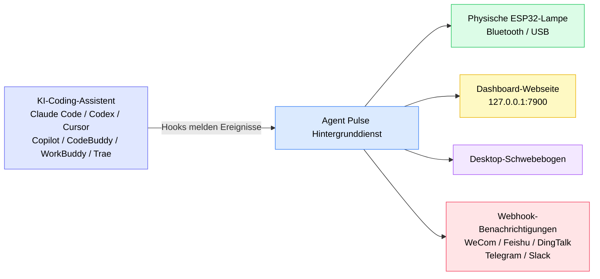
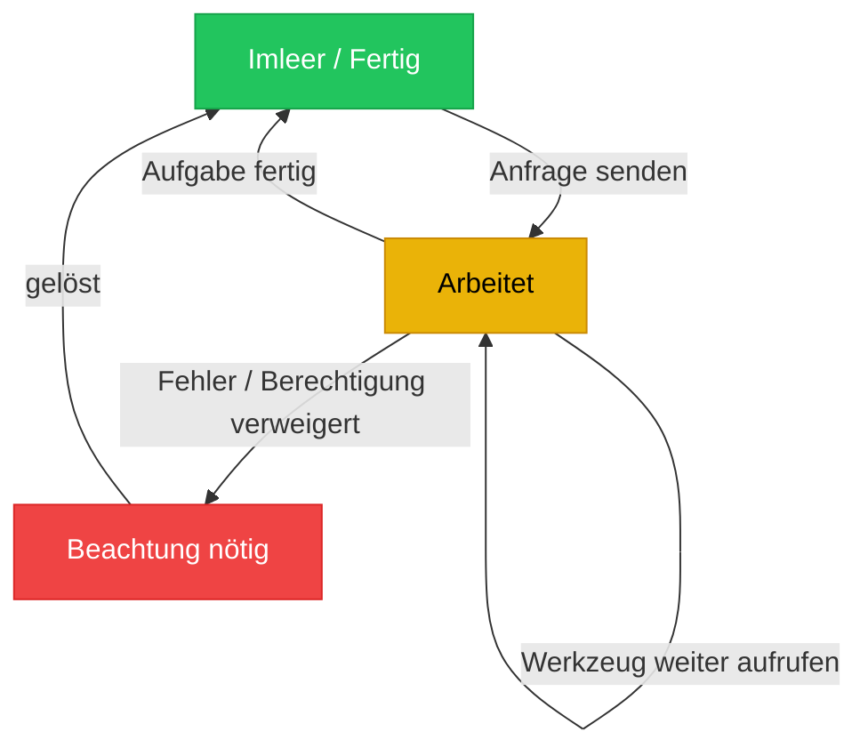
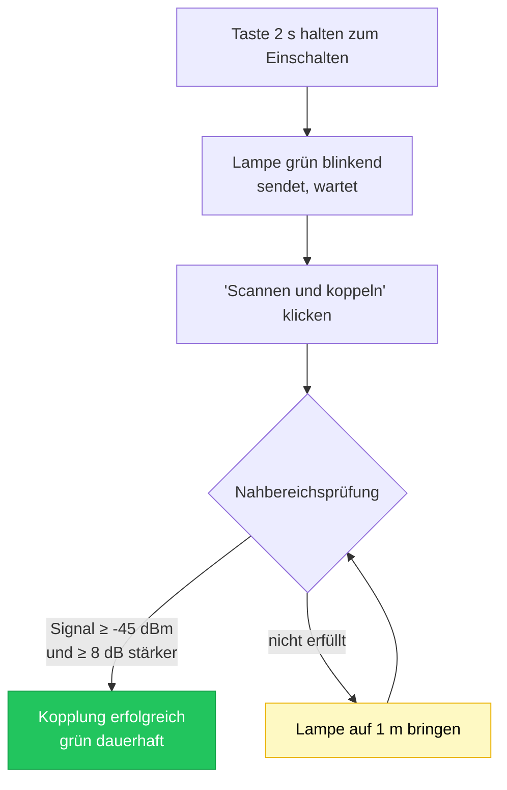
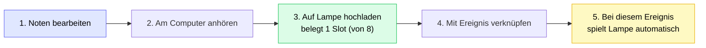
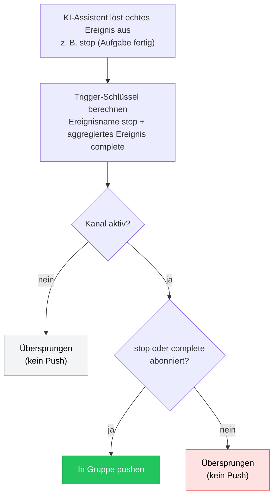

[English](README.md) | [한국어](./README.ko.md) | [日本語](./README.ja.md) | [简体中文](./README.zh-CN.md) | [繁體中文](./README.zh-TW.md) | [Español](./README.es.md) | [Français](./README.fr.md) | [Deutsch](./README.de.md)

# Agent Pulse Anleitung

**Agent Pulse** ist eine Desktop-Ambient-Lampe, die ihre Farbe je nach Status deines KI-Coding-Assistenten ändert. Du musst nicht mehr das Terminal anstarren – ein Blick auf die Lampe sagt dir, ob eine Aufgabe „läuft“, „fertig“ oder „Fehler“ ist.

- **Aktuelle Software-Version**: 0.4.7
- **Firmware-Version der eingebauten Hardware-Lampe**: `0.1.24+25`
- **Versionsverlauf**: siehe [CHANGELOG.md](CHANGELOG.md)

**Unterstützte KI-Coding-Assistenten**: Claude Code · Codex · WorkBuddy · CodeBuddy · Cursor · Copilot · Trae

### Wie funktioniert es?



In einem Satz: **Der KI-Assistent teilt seinen Status über Hooks Agent Pulse mit, und Agent Pulse verteilt diesen Status an die Lampe, die Webseite, das Schwebfenster und deine Chatgruppen.**

> ⚠️ Die **Hooks im Diagramm sind das Wichtigste**. Ohne installierte Hooks erhält Agent Pulse keine Ereignisse, und nichts danach reagiert.

---

## Inhaltsverzeichnis

- [1. Schnellstart (5 Minuten)](#1-schnellstart-5-minuten)
- [2. Statusfarben verstehen](#2-statusfarben-verstehen)
- [3. Installation und Update](#3-installation-und-update)
- [4. Deine Lampe verbinden](#4-deine-lampe-verbinden)
- [5. Hardware-Lampe verwenden](#5-hardware-lampe-verwenden)
- [6. Desktop-Oberfläche](#6-desktop-oberfläche)
- [7. Musik](#7-musik)
- [8. Webhook-Benachrichtigungen](#8-webhook-benachrichtigungen)
- [9. Mehrere Assistenten und mehrere Geräte](#9-mehrere-assistenten-und-mehrere-geräte)
- [10. Daten und Datenschutz](#10-daten-und-datenschutz)
- [11. FAQ](#11-faq)
- [12. Hinweise und Vorsichtsmaßnahmen](#12-hinweise-und-vorsichtsmaßnahmen)

---

## 1. Schnellstart (5 Minuten)

Beim ersten Mal diese 4 Schritte nacheinander ausführen, dann siehst du die Lampe je nach Aufgabe die Farbe ändern.

### Schritt 1: Software installieren (je nach System wählen)

| System | Download | Installationsmethode |
| --- | --- | --- |
| Windows 10 1809+ / 11 | **[`AgentPulseSetup-0.4.7.exe` herunterladen](https://github.com/lzty634158-oss/agent-pulse-release/releases/latest)** | Doppelklick zum Installieren; startet nach der Installation automatisch |
| macOS (Apple Silicon / Intel) | **[`AgentPulse-0.4.7.pkg` herunterladen](https://github.com/lzty634158-oss/agent-pulse-release/releases/latest)** | Doppelklick und dem Assistenten folgen |
| Ubuntu (nur Collector) | **[Collector herunterladen](https://gitee.com/lzty634158/agent-pulse-linux-collector-release)** | Siehe [Ubuntu Collector](#34-ubuntu-collector-optional) |

> **Download in China langsam?** Nutze den Gitee-Mirror (identischer Inhalt wie GitHub):
> - Windows-/macOS-Installer: <https://gitee.com/lzty634158/agent-pulse-release/releases>
> - Separates macOS-Repo: <https://gitee.com/lzty634158/agent-pulse-macos-release>

Nach der Installation läuft Agent Pulse im Hintergrund, und ein Symbol erscheint im Tray / Menüleiste.

### Schritt 2: Hooks installieren

#### Hinweis: Bei normaler Installation werden Hooks automatisch installiert. Falls es nicht funktioniert, neu installieren.

Hooks sind der „Bote“ zwischen Agent Pulse und deinem KI-Assistenten. **Ohne installierte Hooks reagiert die Lampe überhaupt nicht.**

1. Konfigurationsseite im Browser öffnen: <http://127.0.0.1:4321/?lang=de>
2. Die Karte des genutzten KI-Assistenten finden (z. B. Claude Code / Cursor / Trae)
3. Auf die Schaltfläche **„Hooks installieren“** der Karte klicken
4. Nach Erfolg zeigt die Karte „Installiert“ an


> **Codex-Nutzer**: Nach der Hooks-Installation führt Codex sie als „nicht vertrauenswürdiges Projekt“ auf. Du musst in Codex die „Hooks“-Einstellung finden und das Projekt als vertrauenswürdig markieren, damit die Hooks wirklich greifen.

> **Claude-Code-Nutzer**: Nach der Hooks-Installation kann CCSwitch beim Modellwechsel unsere Hook-Konfiguration überschreiben. Klicke in diesem Fall auf unserer Konfigurationsseite einfach erneut auf „Installieren“.

> **Tipp**: Bei der Softwareinstallation werden Hooks nur für KI-Assistenten automatisch installiert, **deren Konfigurationsdatei bereits existiert**. Wenn du später einen neuen KI-Assistenten installierst, gehe zurück zur Konfigurationsseite und installiere ihn einmal manuell.

### Schritt 3: Lampe einschalten und verbinden

| Verbindung | Szenario | Methode |
| --- | --- | --- |
| **Bluetooth** (empfohlen) | Lampe steht auf dem Schreibtisch, kein Kabel gewünscht | Taste 2 s gedrückt halten zum Einschalten → Lampe geht in grünes Blinken (wartet auf Verbindung) → auf der Konfigurationsseite „Scannen und koppeln“ klicken → **Lampe innerhalb 1 m vom Computer** zum Koppeln **[Hinweis: Nahkommunikation koppelt automatisch bei Signalstärke > -45 dBm; falls nicht auffindbar, System-Pairing-Menü nutzen]** |
| **USB** | Während der Nutzung laden oder starke Bluetooth-Störungen | Lampe mit Datenkabel mit Computer verbinden → entsprechenden Port auf der Konfigurationsseite wählen. **USB hat Vorrang vor Bluetooth: USB-Verbindung trennt Bluetooth, USB-Trennung startet Bluetooth-Verbindung neu** |

### Schritt 4: Erfolg prüfen

Neue Sitzung öffnen und dem KI-Assistenten eine Anfrage senden (z. B. „schreib mir eine Funktion“), dann die Lampe beobachten:

- [ ] Nach dem Absenden wird die Lampe **gelb** (arbeitet)
- [ ] Nach Abschluss wird die Lampe **grün** (imleer / fertig)
- [ ] Öffnen des Dashboards <http://127.0.0.1:7900> zeigt einen Live-Ereignisstream

Reagiert die Lampe nicht, springe direkt zu [FAQ - Lampe leuchtet nicht oder falsche Farbe](#lampe-leuchtet-nicht-oder-falsche-farbe).

---

## 2. Statusfarben verstehen

Agent Pulse fasst den Status des KI-Assistenten in drei **semantische Zustände** zusammen, jeweils einer Farbe zugeordnet:

| Farbe | Semantik | Typisches Szenario |
| --- | --- | --- |
| Grün | Imleer / Fertig | Aufgabe beendet, Sitzung beendet, wartet auf deinen nächsten Befehl |
| Gelb | Arbeitet | Denkt, ruft Werkzeug auf, schreibt Code |
| Rot | Beachtung nötig | Fehler, Werkzeugaufruf fehlgeschlagen, Berechtigung verweigert |

**Zustandsübergangsdiagramm:**



### Semantischer Zustand vs. Ereignisfarbe (wichtige Änderung seit 0.4.5)

Seit Version 0.4.5 verwendet Agent Pulse ein **semantisch-zustandsprioritäts-Design**:

- Agent Pulse bestimmt zuerst, „in welchem Zustand“ sich der KI-Assistent befindet (imleer / arbeitet / Fehler), und dieser Zustand entscheidet die Lampenfarbe;
- Du **kannst auch** einem einzelnen Ereignis eine eigene Farbe und einen Modus zuweisen (siehe [6.2 Konfigurationsseite](#62-konfigurationsseite)); deine Einstellung hat höchste Priorität.

**Beispiel**: Standardmäßig leuchtet `stop` (Aufgabe fertig) grün; stellst du `stop` manuell auf „rot + blinken“, leuchtet bei Aufgabenende die Lampe rot blinkend — deine Einstellung gilt.

### Lampenmodi

Neben der Farbe kannst du den **Anzeigemodus** der Lampe einstellen:

| Modus | Effekt | Geeignet für |
| --- | --- | --- |
| `solid` dauerhaft | Dauerhaft leuchtend | Die meisten Szenarien |
| `blink` blinkend | Periodisches Ein/Aus | Aufmerksamkeit (z. B. Fehler) |
| `breathe` atmend | Helligkeit steigt und fällt | Warten, Bereitschaft |
| Wechsel | Rot-Gelb / Gelb-Grün / Rot-Grün wechselnd | Zusammengesetzte Zustände unterscheiden |

---

## 3. Installation und Update

### 3.1 Windows-Installer

**[`AgentPulseSetup-0.4.7.exe` herunterladen](https://github.com/lzty634158-oss/agent-pulse-release/releases/latest)**, Doppelklick zum Ausführen und den Anweisungen folgen.

> Nutzer in China können Gitee nutzen: <https://gitee.com/lzty634158/agent-pulse-release/releases>

- Standard-Installationsort: `C:\Users\<dein Benutzername>\AppData\Local\Programs\AgentPulse\`
- Standardmäßig automatischer Start (Hintergrunddienst startet nach Installation)
- Agent Pulse ist im Startmenü zu finden

> Blockiert die Antivirensoftware die Installation, erlaube die Ausführung (unsignierte Installer lösen eine Aufforderung aus).

### 3.2 macOS-Installer

**[`AgentPulse-0.4.7.pkg` herunterladen](https://github.com/lzty634158-oss/agent-pulse-release/releases/latest)**, Doppelklick und dem Installationsassistenten folgen. Oder per KI-Prompt installieren — die KI-Prompt-Methode wird empfohlen; bei Fehlern einfach den Fehler an die KI senden.

> Nutzer in China können Gitee nutzen (Windows / macOS): <https://gitee.com/lzty634158/agent-pulse-release/releases>
> Separates macOS-Repo: <https://gitee.com/lzty634158/agent-pulse-macos-release>

Detaillierte macOS-Installation siehe [macos-install/RELEASE_INSTALL.md](macos-install/RELEASE_INSTALL.md).

- **Architekturwahl**: Apple Silicon (M) wählt `arm64`, Intel wählt `x86_64`; bei Unsicherheit das Universal-Paket wählen
- **Signierung und Notarisierung**: Das Paket ist mit einer Developer-ID signiert und von Apple notariert, wird normalerweise nicht von Gatekeeper blockiert
- **Erster Start**: Es können Aufforderungen wie „Netzwerkverbindung erlauben“ / „Bluetooth erlauben“ erscheinen — klicke auf „Erlauben“

### 3.3 Programm-Update

Agent Pulse prüft automatisch auf Updates:

1. Prüft zuerst bei **Gitee** (in China schneller)
2. Automatischer Fallback auf **GitHub**, wenn Gitee nicht verfügbar

Das Update wird automatisch heruntergeladen und angewendet, und **deine Konfiguration, Musik und Gerätebindungen bleiben erhalten**.

**Manuelles Update**: Neue Installer herunterladen und doppelklicken zum Überschreiben; Daten gehen ebenfalls nicht verloren.

### 3.4 Ubuntu Collector (optional)

Wenn du möchtest, dass der Status des KI-Assistenten auf einem Ubuntu-Server ebenfalls zum Dashboard gepusht wird, kannst du den Collector bereitstellen.

Lade zuerst das Laufzeitpaket herunter: <https://gitee.com/lzty634158/agent-pulse-linux-collector-release>

```bash
# Auf der Ubuntu-Maschine ausführen (sudo nötig)
sudo bash deploy/ubuntu/collector/install.sh
```

Details siehe `deploy/ubuntu/collector/README.md`.

> Dies ist eine **optionale Funktion**. Wenn du nur lokal auf Windows / macOS nutzt, kannst du sie komplett überspringen.

---

## 4. Deine Lampe verbinden

### 4.1 Bluetooth-Verbindung (empfohlen)

**Erstmaliger Kopplungsablauf:**

1. Taste 2 s gedrückt halten zum Einschalten
2. Lampe geht in **grünes Blinken**, was wartende Verbindung bedeutet
3. Konfigurationsseite <http://127.0.0.1:4321/?lang=de> öffnen
4. Auf „Scannen und koppeln“ klicken
5. Lampe **innerhalb 1 m vom Computer** bringen und auf Kopplungsabschluss warten

**Warum muss sie nah sein?** Um nicht die Lampe eines Kollegen daneben zu verbinden, gibt es bei der Kopplung eine „Nahbereichs“-Prüfung:

- Jedes Gerät wird 3-mal abgetastet; die Signalsärke (RSSI) muss **≥ -45 dBm** sein
- Und das nächste muss mindestens **≥ 8 dB** stärker als andere Kandidaten sein

Nach erfolgreicher Kopplung wird die Lampe gemerkt; sie verbindet bei jedem Einschalten automatisch neu, kein erneutes Koppeln nötig.

**Kopplungsablauf:**



**Bluetooth-Statussymbole in der Oberfläche** (auf Dashboard und Schwebfenster angezeigt):

| Symbol | Bedeutung |
| --- | --- |
|  | Bluetooth verbunden |
|  | Verbindet |
|  | Geräte werden gescannt |
|  | Bluetooth getrennt |
|  | Bluetooth-Fehler |

### 4.2 USB-Seriellverbindung

Verbinde die Lampe mit einem **Datenkabel** (kein reines Ladekabel) mit dem Computer.

- Im Windows-Geräte-Manager sollte **`ESP32-C3 USB JTAG/serial debug unit`** erscheinen
- Wähle einfach den entsprechenden Port in der Seriellportliste der Konfigurationsseite

> **USB hat Vorrang vor Bluetooth**: Bei Anschluss wird USB genutzt; beim Abziehen automatischer Wechsel zurück zu Bluetooth.

### 4.3 Mehrere Lampen

Wenn du mehrere Agent-Pulse-Lampen hast, kannst du festlegen, „welche Lampe welchen Projektstatus anzeigt“:

| Routing-Methode | Beschreibung |
| --- | --- |
| **Neueste folgen** | Alle Lampen zeigen den Status der zuletzt aktiven Aufgabe |
| **Projekt angeben** | Ein Projekt an eine bestimmte Lampe heften |
| **Assistent angeben** | Status eines KI-Assistenten an eine bestimmte Lampe heften |

Konfiguriere Multi-Lampen- und Routing-Regeln auf der „Geräteverwaltung“-Seite des Dashboards.

---

## 5. Hardware-Lampe verwenden

### 5.1 Tastenbedienung

| Aktion | Dauer | Effekt |
| --- | --- | --- |
| **Lang drücken** | ≥ 2 Sekunden | Ein-/Ausschalten |
| **Kurz drücken** | Drücken und loslassen | Zeigt aktuellen Akku (Lampenhinweis); falls nicht verbunden, reaktiviert auch Bluetooth-Verbindung |

### 5.2 Kurzreferenz Lampeneffekte

Jede „Aktion“ der Lampe sagt dir, was gerade passiert:

| Lampeneffekt | Bedeutung |
| --- | --- |
| 🟢 **Grün blinkend** | Bluetooth eingeschaltet, sendet, wartet auf Verbindung |
| 🟢 **Grün dauerhaft** | Bluetooth verbunden (Host verbunden) |
| 🟢 **Zurück zu grün blinkend** | Bluetooth getrennt, Gerät startet Senden neu zum Warten |
| 🔴→🟢→🟡→aus (3× Schleife) | **Identifikationsblinken**: Antwort auf den „Gerät identifizieren“-Befehl des Hosts, schnelle Rot→Grün→Gelb→Aus-Schleife 3× (je 200 ms) dann Zustand wiederhergestellt, damit du sie zwischen vielen Lampen findest |
| 🔴→🟢→🟡 (je 1 s) | **Verbindungsanimation**: Rückmeldung bei erfolgreicher Verbindung, Rot→Grün→Gelb je 1 s dann Zustand wiederhergestellt |
| 🔴 **Rot blinkend** | Bluetooth-Sende-Timeout (60 s keine Verbindung), Senden gestoppt |

> ⚠️ **Wichtiger Hinweis zur blauen Lampe**: Die aktuellen HW-v2-/ESP32-C3-next-Physikgeräte **haben nur drei unabhängige LEDs – rot, gelb, grün – und keine blaue LED**, daher **leuchten sie weder blau noch lila**.
> Das **blaue Bluetooth-Symbol** im Dashboard und Schwebfenster zeigt nur an, dass der Computer Bluetooth scannt oder verbindet – es ist eine Statusanzeige der Computeroberfläche, **nicht dass das Gerät blau leuchtet**. Ordne das blaue Symbol der Oberfläche nicht der tatsächlichen Lampenfarbe zu.

### 5.3 Akku und Ton

**Akkuanzeige** (per Kurzdruck prüfen):

Nach einem Kurzdruck zeigt die Lampe über **Anzahl der leuchtenden LEDs** den Akkustand etwa 2 Sekunden lang an, dann stellt sie den Zustand wieder her:

| Spannung | Lampeneffekt (leuchtende LEDs) | Beschreibung |
| --- | --- | --- |
| ≥ 4,00V | 🔴🟢🟡 rot+grün+gelb **alle 3 leuchten** | Ausreichend |
| 3,70V ~ 4,00V | 🔴🟡 rot+gelb **2 leuchten** | Mittel |
| < 3,70V | 🔴 **nur rot leuchtet** | Niedrig, Aufladung empfohlen |

> Da keine blaue LED vorhanden ist, wird der Akku durch „wie viele LEDs leuchten“ (3 = voll, 2 = mittel, 1 = niedrig) ausgedrückt, nicht durch verschiedene Farben.

**Automatischer Schutz**: Sinkt die Spannung unter 3,20V und bleibt 60 Sekunden, schaltet die Lampe automatisch aus, um eine Tiefentladung zu vermeiden.

**Ton-Umschalter**: in „Helligkeit und Ton“ der Konfigurationsseite eingestellt. **Standard aus**; bei Bedarf manuell einschalten.

### 5.4 Firmware-Update

Wenn eine neue Hardware-Lampen-Firmware verfügbar ist, kannst du sie auf der Konfigurationsseite aktualisieren.

**Bitte vor dem Update bestätigen (bei Nicht-Erfüllung schlägt es fehl):**

1. **Hardware-ID muss `agentpulse-esp32c3-next` sein** — andere Hardware wird nicht unterstützt
2. **Nur `.ino.bin`-Dateien hochladen** — lade nicht `.bin` / `.elf` / `.map` / `bootloader` / `partitions` usw. hoch
3. **Das Gerät muss als `ESP32-C3 USB JTAG/serial debug unit` angezeigt werden**
4. **Stromversorgung und Verbindung stabil halten** — während des Updates nicht abziehen oder ausschalten

**Lampeneffekte während des Updates:**

| Lampeneffekt | Phase |
| --- | --- |
| Gelb dauerhaft | Empfängt und verifiziert neue Firmware (bleibt während des gesamten Updates gelb dauerhaft) |
| Lampe aus | Startet neu (sowohl bei Erfolg als auch bei Fehler) |

> **Update fehlgeschlagen?** Keine Panik — das Gerät verwendet ein Zwei-Partitionen-Design; bei Fehler kehrt es automatisch zur alten Firmware zurück und stellt den ursprünglichen Lampeneffekt wieder her, nach dem Neustart wieder nutzbar.

---

## 6. Desktop-Oberfläche

Agent Pulse bietet zwei Web-Oberflächen:

| Oberfläche | Adresse | Zweck |
| --- | --- | --- |
| **Dashboard** | <http://127.0.0.1:7900> | Live-Status und Ereignisstream ansehen, Geräte verwalten |
| **Konfigurationsseite** | <http://127.0.0.1:4321/?lang=de> | Alle Einstellungen hier |

### 6.1 Dashboard

Öffne <http://127.0.0.1:7900> um zu sehen:

<!-- Screenshot-Platz: nach Ablegen von dashboard.png in docs/screenshots/ folgende Zeile auskommentieren

-->

- **Live-Ereignispanel**: jedes KI-Assistenten-Ereignis (Prompt senden, Werkzeug aufrufen, Aufgabe fertig…) scrollt chronologisch
- **Aktueller Status**: welche Farbe, welcher Modus, von welchem Projekt / Assistenten
- **Statusleistenformat**: `Lampeneffekt[Modus] + Farbe + Projektname + Assistentname + Dauer`, z. B.:
  ```
  dauerhaft grün  my-project  claude-code  läuft 00:02:15
  ```
- **Geräteverwaltung**: Mehrfachlampen-Status ansehen und Routing konfigurieren

### 6.2 Konfigurationsseite

Öffne <http://127.0.0.1:4321/?lang=de>, der Eingangspunkt aller Einstellungen.


<!-- Screenshot-Platz: nach Speichern des Abschnitts „Ereignisse und Lampenschema“ als config-events-section.png folgende Zeile auskommentieren

-->

#### Benachrichtigungen und Stillstandserkennung

| Einstellung | Standard | Beschreibung |
| --- | --- | --- |
| Desktop-Benachrichtigung | Aus | Systembenachrichtigung bei Statusänderung |
| Bei Aufgabenende benachrichtigen | Ein | Benachrichtigung bei Aufgabenende (grün) |
| Bei Fehler benachrichtigen | Ein | Benachrichtigung bei Fehler (rot) |
| Bei möglichem Stillstand benachrichtigen | Ein | Benachrichtigung, wenn Gelb länger als eingestellte Zeit |
| Stillstandserkennungszeit | 5 Minuten | Wie lange Gelb bleiben muss, um als „möglicher Stillstand“ zu gelten |

#### Ereignisse und Lampenschema

Dies ist der am häufigsten genutzte Teil — du kannst **für jedes einzelne Ereignis Farbe, Modus und Musikwiedergabe festlegen**.

**Unterstützte Ereignisse (je nach KI-Assistent leicht unterschiedlich):**

| Ereignis | Bedeutung |
| --- | --- |
| `session-start` | Sitzungsbeginn |
| `session-end` | Sitzungsende |
| `user-prompt-submit` | Benutzer-Prompt gesendet |
| `pre-tool-use` | Vor Werkzeugaufruf |
| `post-tool-use` | Nach Werkzeugaufruf |
| `post-tool-use-failure` | Werkzeugaufruf fehlgeschlagen |
| `permission-request` | Berechtigung angefordert |
| `permission-denied` | Berechtigung verweigert |
| `notification` | Benachrichtigung |
| `stop` | Aufgabe fertig |
| `stop-failure` | Aufgabe fehlgeschlagen |
| `error-occurred` | Fehler aufgetreten |
| `elicitation` | Aufforderung zur Ergänzung |

**Von jedem KI-Assistenten unterstützte Ereignisse:**

| KI-Assistent | Unterstützte Ereignisse |
| --- | --- |
| **Claude Code** | Sitzungsbeginn, Prompt senden, vor/nach Werkzeug, Berechtigung anfordern, Berechtigung verweigert, Benachrichtigung, Aufgabe fertig, Aufgabe fehlgeschlagen |
| **Codex** | Sitzungsbeginn, Prompt senden, vor/nach Werkzeug, Berechtigung anfordern, Benachrichtigung, Aufgabe fertig |
| **WorkBuddy** | Sitzungsbeginn, Prompt senden, vor/nach Werkzeug, Benachrichtigung, Aufgabe fertig |
| **CodeBuddy** | Sitzungsbeginn, Prompt senden, vor/nach Werkzeug, Werkzeug fehlgeschlagen, Berechtigung anfordern, Benachrichtigung, Aufgabe fehlgeschlagen, Aufgabe fertig, Sitzungsende |
| **Cursor** | Sitzungsbeginn, Prompt senden, vor/nach Werkzeug, Werkzeug fehlgeschlagen, Berechtigung anfordern, Benachrichtigung, Aufgabe fehlgeschlagen, Aufgabe fertig |
| **Copilot** | Sitzungsbeginn, Prompt senden, nach Werkzeug, Aufgabe fertig, Fehler aufgetreten, Sitzungsende |
| **Trae** | Sitzungsbeginn, Prompt senden, vor/nach Werkzeug, Berechtigung anfordern, Benachrichtigung, Aufgabe fertig |

> Die Konfigurationsseite zeigt nur die Ereignisse, **die dein aktueller Assistent tatsächlich auslöst**, damit du keine nie auftretenden Ereignisse konfigurierst.

**Berechtigungs-Gate (Sicherheitshinweis)**: Trae / WorkBuddy / CodeBuddy haben keinen nativen Berechtigungsdialog. Auf der Konfigurationsseite zum entsprechenden Assistenten-Tab wechseln und die Farbe der Ereigniszeile **„Berechtigung angefordert“ (permission-request)** auf etwas anderes als „Aus“ setzen, um das Berechtigungs-Gate zu aktivieren (standardmäßig Rot + Blinken). Dann wird **bei jedem Werkzeugaufruf der Benutzer um Bestätigung gebeten und die rote Leuchte eingeschaltet** – unabhängig davon, welcher Befehl ausgeführt wird; es muss keine Liste gefährlicher Befehle gepflegt werden. Auf „Aus“ gesetzt deaktiviert das Gate.

**Pro Assistent konfigurieren**: Wechsle zum entsprechenden Assistenten-Tab, um Ereignisfarben nur für ihn festzulegen; der Tab „Standard“ dient als globaler Fallback für alle Assistenten.

#### Helligkeit und Ton

| Einstellung | Standard | Beschreibung |
| --- | --- | --- |
| Grüne Helligkeit | 30 % | Drei Farben separat einstellbar |
| Gelbe Helligkeit | 30 % | |
| Rote Helligkeit | 30 % | |
| Blinkdauer | 1000 ms | Dauer eines vollen Blinkzyklus |
| Atemdauer | 2000 ms | Dauer eines Atemzugs |
| Ton aktivieren | Aus | Ob ein Signalton abgespielt wird |

#### Hooks-Verwaltung

Jede KI-Assistenten-Karte hat eine Schaltfläche **„Hooks installieren“**; nach Installation zeigt die Karte „Installiert“ an. Bei Assistentenwechsel oder Neuinstallation einfach anklicken zum erneuten Installieren.

### 6.3 Schwebfenster

Wenn aktiv, erscheint ein halbtransparentes kleines Fenster auf dem Desktop, das ohne Browseröffnung die aktuelle Statusfarbe und den Projektnamen in Echtzeit anzeigt.


---

## 7. Musik

Agent Pulse kann bei bestimmten Ereignissen Signaltöne abspielen, mit Unterstützung für **eingebaute Töne** und **benutzerdefinierte Musik**.

### 7.1 Eingebaute Töne

Die Lampe hat ab Werk 5 eingebaute Töne, sofort nutzbar ohne Speicherplatz:

| # | Name |
| --- | --- |
| 1 | Aufsteigender Cue |
| 2 | Doppelklick-Cue |
| 3 | Abschluss-Cue |
| 4 | Abfallnde Warnung |
| 5 | Echo-Cue |

### 7.2 Benutzerdefinierter Musikeditor

Im Musikbereich der Konfigurationsseite kannst du eigene Melodien komponieren.

<!-- Screenshot-Platz: nach Ablegen von music-editor.png in docs/screenshots/ folgende Zeile auskommentieren

-->

**Notenparameter-Grenzen:**

| Parameter | Bereich | Beschreibung |
| --- | --- | --- |
| Frequenz | 0 ~ 4000 Hz | **0 bedeutet Pause (Stille)** |
| Dauer | 20 ~ 2000 ms | Dauer einer einzelnen Note |
| Intervall `gapMs` | 0 ~ 500 ms (Standard 10 ms) | Stille zwischen den Noten |

**Grenzen der ganzen Melodie:**

- Maximal **64 Noten**
- Gesamtdauer unter **30 Sekunden**
- Name maximal **40 Zeichen**

> **Was ist `gapMs` (Intervall)?** Es ist die „Pause“ zwischen den Noten. Wenn du z. B. möchtest, dass zwei Noten getrennt klingen, setze ein Intervall auf die vorherige Note. Das Firmware implementiert diese Pause mit einer „stummen Note mit Frequenz 0“.

### 7.3 Hochladen auf die Lampe

**Gesamtablauf:**



Benutzerdefinierte Musik muss auf die Lampe hochgeladen werden, um abgespielt zu werden:

1. Melodie im Musikbereich der Konfigurationsseite bearbeiten
2. Auf **„Auf Gerät hochladen“** klicken
3. Warten bis Hochladen fertig

**Speicherregeln:**

| Element | Beschreibung |
| --- | --- |
| Slot-Anzahl | **8** (nummeriert 128 ~ 255) |
| Kapazität pro Slot | **512 Byte** |
| Zuweisung | Automatisch freien Slot zuweisen; wenn voll, ungenutzte Melodien löschen |
| Erneutes Hochladen | Bereits hochgeladene Melodie **nutzt ihren ursprünglichen Slot wieder**, springt nicht |

> **Slots voll?** Beim Hochladen erscheint „8 benutzerdefinierte Musik-Slots sind voll“. Lösche ungenutzte Melodien auf der Konfigurationsseite, um Platz zu schaffen.

### 7.4 Mit Ereignis verknüpfen

Nach dem Komponieren und Hochladen die Musik mit einem Ereignis verknüpfen:

1. Zu „Ereignisse und Lampenschema“ gehen
2. Ziel-Ereignis finden (z. B. `session-end` Sitzungsende)
3. Im Dropdown „Musik“ deine Melodie wählen
4. „Einmal abspielen“ oder „Wiederholen“ wählen
5. Auf Speichern klicken

Danach spielt die Lampe bei jedem Auftreten dieses Ereignisses die Melodie.

### 7.5 Anhören, Löschen und Lesen

| Aktion | Methode |
| --- | --- |
| **Anhören** | Im Musikeditor auf „Anhören“ klicken; Vorschau am Computer (nicht über die Lampe) |
| **Löschen** | In der Musikliste auf „Löschen“ klicken; entfernt sowohl vom Computer als auch vom Lampen-Slot |
| **Von Lampe lesen** | Musik auf der Lampe kann auf der Konfigurationsseite aufgelistet werden; beachte, dass **das Firmware nur Rohnotendaten speichert, nicht den Melodienamen** |

### 7.6 Musik-FAQ

| Symptom | Ursache und Lösung |
| --- | --- |
| Gar kein Ton | Prüfe, ob „Ton aktivieren“ auf der Konfigurationsseite eingeschaltet ist (**standardmäßig aus**) |
| Noten kleben zusammen, kein Intervall hörbar | Intervall `gapMs` auf Noten setzen (Standard nur 10 ms, evtl. zu kurz) |
| Hochladen fehlgeschlagen, Slot voll | Ungenutzte Melodien löschen, um Platz zu schaffen |
| Melodie nach Umzug der Lampe auf anderen Computer ohne Namen | Melodiename existiert nur auf dem Computer; das Firmware der Lampe speichert nur Notendaten — das ist normal |

---

## 8. Webhook-Benachrichtigungen

Neben der Lampenfarbe kann Agent Pulse Ereignisse auch **in deine Chatgruppen** pushen (WeCom, Feishu, DingTalk, Telegram, Slack usw.).

### 8.1 Welche Plattformen werden unterstützt

| Plattform | Beschreibung |
| --- | --- |
| **WeCom** | Gruppenbot-Webhook |
| **Feishu** | Benutzerdefinierter Bot (unterstützt Signaturprüfung) |
| **DingTalk** | Benutzerdefinierter Bot (unterstützt signierte URL) |
| **Telegram** | Bot API |
| **Slack** | Incoming Webhook |
| **Benutzerdefiniert** | Beliebiger HTTPS-Endpunkt, der JSON akzeptiert |

### 8.2 Benachrichtigungskanal hinzufügen

<!-- Screenshot-Platz: nach Ablegen von webhook-channels.png in docs/screenshots/ folgende Zeile auskommentieren

(das aktuelle config-full.png enthält bereits den vollständigen Webhook-Abschnitt; eine fokussierte Einzelaufnahme kann später ergänzt werden)
-->

1. Konfigurationsseite → Abschnitt **Webhook-Benachrichtigungen** öffnen
2. Auf „Kanal hinzufügen“ klicken
3. Ausfüllen:
   - **Name**: Notiz für dich, z. B. „Projektgruppe“
   - **Plattform**: eine aus der Tabelle oben
   - **Webhook-URL**: aus den „Gruppenbot“-Einstellungen der Plattform
   - **Secret** (Feishu/DingTalk benötigen es): das Signatur-Secret in den Bot-Sicherheitseinstellungen
   - **Aktiviert**: **muss angehakt sein**, sonst keine Push
4. Die **Ereignisse** ankreuzen, die du empfangen willst
5. Auf Speichern klicken

> **URL muss HTTPS sein**, sonst wird das Speichern abgelehnt.

### 8.3 Ereignisabonnement (wichtigster Schritt)

Jeder Kanal kann einzeln ankreuzen, welche Ereignisse er empfangen soll. Ereignisse sind zwei Arten:

**Aggregierte Ereignisse (empfohlen)** — decken eine Klasse von Szenarien ab, sorgloser:

| Aggregiertes Ereignis | Auslöser |
| --- | --- |
| `complete` | Aufgabe fertig **oder** Sitzungsende (grün) |
| `error` | Fehler aufgetreten (rot) |
| `stuck` | Gelb bleibt länger als „Stillstandserkennungszeit“ |

**Rohe Ereignisse** — exakte Übereinstimmung mit einem einzelnen Ereignis, z. B. `stop`, `session-end`, `error-occurred` usw. (siehe [Ereignistabelle](#ereignisse-und-lampenschema)).

> **Tipp**: Für „Aufgabe fertig und Sitzungsende benachrichtigen“ kreuze **`complete`** an — es deckt sowohl `stop` als auch `session-end` ab.
> Wenn du nur das rohe `session-end` angekreuzt hast, wird „Aufgabe fertig (`stop`)“ **nicht** gepusht.

**Wie werden Ereignisse abgeglichen?** (dieses Diagramm verstehen, um selbst „warum kein Push“ zu diagnostizieren):



> Beachte die zwei Schaltflächen: **„Test“** überspringt die obige Abgleichlogik und sendet direkt (funktioniert daher immer);
> **„Push simulieren“** durchläuft den vollständigen Abgleich und berichtet „welcher Kanal gematcht, welcher übersprungen und warum“. Siehe [8.4](#84-testen-und-push-simulieren).

### 8.4 Testen und „Push simulieren“

Die Konfigurationsseite bietet zwei Fehlerbehebungswerkzeuge:

| Schaltfläche | Zweck | Wann verwenden |
| --- | --- | --- |
| **Test** | Sendet eine Testnachricht direkt an den Kanal, **ohne Ereignisabonnement zu prüfen** | Prüfen, ob URL und Secret korrekt sind |
| **Push simulieren** | Durchläuft **exakt dieselbe Abgleichlogik wie ein echtes Ereignis** und berichtet „welcher Kanal gematcht, welcher übersprungen und warum“ | Prüfen, ob Ereignisabonnement korrekt gepaart ist |

**Empfohlener Fehlerbehebungsablauf:**

1. Zuerst auf „Test“ klicken → Nachricht kommt in der Gruppe an, bedeutet URL und Kanal sind in Ordnung
2. Dann auf „Push simulieren“ klicken → Rückmeldung lesen:
   - Zeigt „Match 1/1, gepusht an ‚Projektgruppe‘“ → Konfiguration korrekt, Gruppe erhält es
   - Zeigt „Übersprungen ‚Projektgruppe‘ (stop/complete nicht abonniert)“ → **Ereignisse nicht korrekt angekreuzt**, geh zurück und kreuze die entsprechenden Ereignisse an, dann speichern

### 8.5 Webhook-FAQ

| Symptom | Ursache und Lösung |
| --- | --- |
| **Test sendet, aber echte Ereignisse pushen nicht** | Fast immer einer von zwei Gründen: <br>① Der „Aktiviert“-Haken des Kanals fehlt (bei neuen Kanälen bitte setzen) <br>② Ereignisabonnement nicht korrekt angekreuzt (siehe [8.3](#83-ereignisabonnement-wichtigster-schritt)). „Push simulieren“ findet es sofort |
| **Nach Speichern und Aktualisieren springt Oberfläche auf Englisch zurück** | Behoben (0.4.6). Bei alten Versionen `?lang=de` in der Adresszeile für die Konfigurationsseite anhängen |
| **Push simulieren zeigt „Simulation fehlgeschlagen“** | Anfrage hat das neue Backend nicht erreicht. Bitte **Agent Pulse neu starten** (Tray-Symbol vollständig beenden dann starten) und sicherstellen, dass 0.4.7 läuft |
| **Test/Löschen/Simulieren-Buttons reagieren nicht** | Auf 0.4.7 aktualisieren; alte Versionen haben ein UI-Script-Problem |
| **Hinweis URL ungültig** | Webhook-Adresse muss mit `https://` beginnen |
| **Feishu/DingTalk empfangen nichts** | Prüfe, ob Secret korrekt ist; Feishu und DingTalk nutzen unterschiedliche Signaturalgorithmen, stelle sicher, dass der Plattformtyp stimmt |

---

## 9. Mehrere Assistenten und mehrere Geräte

### 9.1 Unterstützte KI-Assistenten

Agent Pulse unterstützt 6 KI-Coding-Assistenten und du kannst **mehrere gleichzeitig installieren**, ohne gegenseitige Störung:

| Assistent | Konfigurations-Tab |
| --- | --- |
| Claude Code | `claude` |
| Codex | `codex` |
| WorkBuddy | `workbuddy` |
| CodeBuddy | `codebuddy` |
| Cursor | `cursor` |
| Copilot | `copilot` |
| Trae | `trae` |

### 9.2 Unabhängige Konfiguration pro Assistent

Zum entsprechenden Assistenten-Tab wechseln, um individuell festzulegen:

- Lampenfarbe und -modus pro Ereignis
- Pro Ereignis abgespielte Musik
- Stillstandserkennung u. a. Parameter

Der Tab „Standard“ dient als globaler Fallback: Hat ein Assistent keine eigene Konfiguration, erbt er die „Standard“-Einstellungen.

### 9.3 Mehrere Lampen

Siehe [4.3 Mehrere Lampen](#43-mehrere-lampen). Konfiguriere Routing-Regeln in der „Geräteverwaltung“ des Dashboards.

---

## 10. Daten und Datenschutz

### Lokale Verzeichnisse

Die Daten von Agent Pulse werden **alle auf deinem eigenen Computer gespeichert** und auf keinen Server hochgeladen.

| System | Datenverzeichnis |
| --- | --- |
| Windows | `%LOCALAPPDATA%\AgentPulse\` |
| macOS | `~/Library/Application Support/AgentPulse/` |

**Verzeichnisinhalt:**

| Datei / Ordner | Beschreibung |
| --- | --- |
| `config.json` | Deine gesamte Konfiguration (Ereignisse, Helligkeit, Webhook-Kanäle usw.) |
| `music/` | Quelldateien deiner bearbeiteten benutzerdefinierten Musik |
| `devices.json` | Gebundene Lampengeräte-Informationen |

### Behält eine Neuinstallation / Deinstallation die Daten?

**Seit 0.4.5 behalten sowohl Neuinstallation als auch Deinstallation die Benutzerdaten.**

- **Behalten**: `config.json`, `music/`, `devices.json` und andere persönliche Daten
- **Entfernt**: Programmdateien und Hintergrunddienst

Das heißt, nach einem Update oder einer Neuinstallation sind alle von dir konfigurierten Ereignisse, Musik, Webhook-Kanäle und Gerätebindungen **weiterhin vorhanden** — keine Neukonfiguration nötig.

> Wenn du **alle Daten vollständig löschen** möchtest, musst du das obige Datenverzeichnis manuell löschen.

---

## 11. FAQ

### Dashboard öffnet nicht

1. Bestätige, dass Agent Pulse läuft (Tray- / Menüleistensymbol)
2. Agent Pulse vollständig beenden und neu starten
3. Bestätige, dass der Browser <http://127.0.0.1:7900> besucht
4. Falls Port 7900 von einem anderen Programm belegt ist, Computer neu starten und erneut versuchen

### Lampe leuchtet nicht oder falsche Farbe

In Reihenfolge fehlerbeheben:

1. **Hooks installiert?** → Konfigurationsseite <http://127.0.0.1:4321/?lang=de> öffnen, bestätigen, dass die entsprechende Assistentenkarte „Installiert“ anzeigt. **Das ist die häufigste Ursache.**
2. **Lampe verbunden?** → Lampeneffekt prüfen: grün blinkend = wartet; grün dauerhaft = verbunden
3. **Ereignisfarben geändert?** → Wenn du manuell eine Farbe für ein Ereignis gesetzt hast, gilt deine Einstellung (siehe [Semantischer Zustand vs. Ereignisfarbe](#semantischer-zustand-vs-ereignisfarbe-wichtige-änderung-seit-045))
4. **Helligkeit auf 0?** → Helligkeitseinstellung auf der Konfigurationsseite prüfen
5. **Codex-Nutzer** → Bestätigen, dass du das Projekt in Codex als „vertrauenswürdig“ markiert hast

### Musik spielt nicht

1. Prüfen, ob „Ton aktivieren“ auf der Konfigurationsseite eingeschaltet ist (**standardmäßig aus**)
2. Prüfen, ob das Ereignis mit Musik verknüpft ist (die Musiknummer darf nicht 0 sein)
3. Ist die benutzerdefinierte Musik „Auf Gerät hochgeladen“
4. Auf „Anhören“ klicken, um zu bestätigen, dass die Melodie selbst in Ordnung ist

### Webhook pusht nicht

Siehe [8.5 Webhook-FAQ](#85-webhook-faq).

### Bluetooth verbindet nicht

1. Lampe **innerhalb 1 m vom Computer** zum Koppeln bringen (Nahbereichsprüfung erfordert Signal ≥ -45 dBm und ≥ 8 dB stärker als andere Geräte)
2. Kurz die Lampentaste drücken, um Bluetooth-Verbindung neu zu aktivieren (grün blinkend)
3. In den Bluetooth-Einstellungen des Computers die alte Agent-Pulse-Kopplung löschen und neu koppeln
4. Bei vielen Bluetooth-Geräten in der Nähe mit starken Störungen **USB-Verbindung** nutzen (höhere Priorität, stabiler)

### USB findet Gerät nicht

1. Bestätigen, dass ein **Datenkabel** verwendet wird, kein reines Ladekabel
2. Im Windows-Geräte-Manager sollte **`ESP32-C3 USB JTAG/serial debug unit`** erscheinen
3. Zeigt es „Unbekanntes Gerät“, musst du evtl. einen Treiber installieren
4. Einen anderen USB-Port versuchen (manche Frontblenden haben zu wenig Strom)

### Benachrichtigungen zu häufig

1. „Stillstandserkennungszeit“ erhöhen (Standard 5 Minuten)
2. Unnötige Benachrichtigungselemente ausschalten (z. B. „bei möglichem Stillstand benachrichtigen“ ausschalten)
3. Im Webhook-Kanal nur die Ereignisse ankreuzen, die dich wirklich interessieren

---

## 12. Hinweise und Vorsichtsmaßnahmen

- **Firmware-Update mit Vorsicht**: Nur `.ino.bin`-Dateien hochladen, Hardware-ID muss `agentpulse-esp32c3-next` sein; während des Updates **nicht abziehen oder ausschalten**. Siehe [5.4 Firmware-Update](#54-firmware-update).
- **Niedriger-Akku-Schutz**: Sinkt die Spannung unter 3,20V für 60 Sekunden, schaltet die Lampe automatisch aus — das schützt den Akku, kein Fehler.
- **OTA-Upgrade erfordert ausreichend Akku**: Firmware-Upgrade wird bei Spannung unter 3,60V verweigert; bitte zuerst aufladen.
- **Hooks müssen installiert sein**: Ohne Hooks erhält Agent Pulse keine Ereignisse und die Lampe reagiert überhaupt nicht.
- **Webhook benötigt HTTPS**: Aus Sicherheitsgründen werden nur `https://` beginnende Webhook-Adressen akzeptiert.
- **Benutzerdefinierte Musik-Slots begrenzt**: Die Lampe hat nur 8 benutzerdefinierte Musik-Slots; bitte ungenutzte Melodien regelmäßig bereinigen.

---

## Weitere Ressourcen

### Download-Übersicht

| Zweck | Link |
| --- | --- |
| **Windows / macOS-Installer** (GitHub) | <https://github.com/lzty634158-oss/agent-pulse-release/releases/latest> |
| **Windows / macOS-Installer** (Gitee-China-Mirror) | <https://gitee.com/lzty634158/agent-pulse-release/releases> |
| **Separates macOS-Repo** | <https://gitee.com/lzty634158/agent-pulse-macos-release> |
| **Ubuntu Collector** | <https://gitee.com/lzty634158/agent-pulse-linux-collector-release> |

### Dokumentation

- **Versionsverlauf**: [CHANGELOG.md](CHANGELOG.md)
- **Firmware-Upgrade-Leitfaden**: [firmware/README.md](firmware/README.md)
- **macOS-Installationsleitfaden**: [macos-install/RELEASE_INSTALL.md](macos-install/RELEASE_INSTALL.md)
- **Bluetooth-Brückentool**: [ble-bridge/](ble-bridge/)
- **Ubuntu-Bereitstellungsleitfaden**: [deploy/ubuntu/README.md](deploy/ubuntu/README.md)
