[简体中文](./README.zh-CN.md) | **English** | [日本語](./README.ja.md) | [繁體中文](./README.zh-TW.md) | [한국어](./README.ko.md) | [Français](./README.fr.md) | [Deutsch](./README.de.md) | [Español](./README.es.md)

# Agent Pulse User Guide

**Agent Pulse** is a desktop ambient light that changes color based on the status of your AI coding assistant. You don't need to stare at the terminal waiting for results — a quick glance at the light tells you whether a task is "running", "done", or "errored".

- **Current software version**: 0.4.6
- **Built-in hardware light firmware version**: `0.1.24+25`
- **Changelog**: see [CHANGELOG.md](CHANGELOG.md)

**Supported AI coding assistants**: Claude Code · Codex · WorkBuddy · CodeBuddy · Cursor · Copilot

### How does it work?

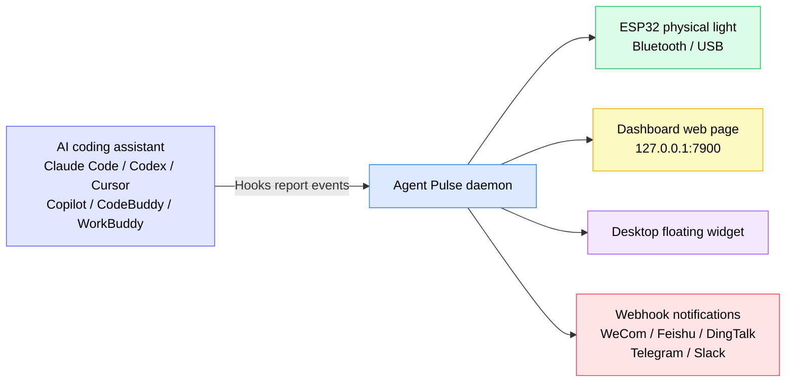

In one sentence: **The AI assistant tells Agent Pulse its status via Hooks, and Agent Pulse distributes that status to the light, web page, floating widget, and chat groups.**

> ⚠️ **Hooks are the most critical part** in the diagram. Without Hooks installed, Agent Pulse receives no events and nothing will respond afterward.

---

## Table of Contents

- [1. Quick Start (5 minutes)](#1-quick-start-5-minutes)
- [2. Understanding status colors](#2-understanding-status-colors)
- [3. Installation and updates](#3-installation-and-updates)
- [4. Connect your light](#4-connect-your-light)
- [5. Using the hardware light](#5-using-the-hardware-light)
- [6. Desktop interface](#6-desktop-interface)
- [7. Music](#7-music)
- [8. Webhook notifications](#8-webhook-notifications)
- [9. Multiple assistants and multiple devices](#9-multiple-assistants-and-multiple-devices)
- [10. Data and privacy](#10-data-and-privacy)
- [11. FAQ](#11-faq)
- [12. Notes](#12-notes)

---

## 1. Quick Start (5 minutes)

First-time use: complete these 4 steps in order to see the light change color with tasks.

### Step 1: Install the software (choose by your system)

| System | Download | Installation |
| --- | --- | --- |
| Windows 10 1809+ / 11 | **[Download `AgentPulseSetup-0.4.6.exe`](https://github.com/lzty634158-oss/agent-pulse-release/releases/latest)** | Double-click to install; auto-starts on boot after install |
| macOS (Apple Silicon / Intel) | **[Download `AgentPulse-0.4.6.pkg`](https://github.com/lzty634158-oss/agent-pulse-release/releases/latest)** | Double-click and follow the prompts |
| Ubuntu (collector only) | **[Download Collector](https://gitee.com/lzty634158/agent-pulse-linux-collector-release)** | See [Ubuntu Collector](#34-ubuntu-collector-optional) |

> **Slow download in China?** Use the Gitee mirror (identical content to GitHub):
> - Windows / macOS installers: <https://gitee.com/lzty634158/agent-pulse-release/releases>
> - macOS also has a separate repo: <https://gitee.com/lzty634158/agent-pulse-macos-release>

After installation, Agent Pulse runs in the background, and an icon appears in the tray / menu bar.

### Step 2: Install Hooks

#### Note: Hooks are installed automatically during normal installation. If they don't work, reinstall them.

Hooks are the "messenger" between Agent Pulse and your AI assistant. **Without Hooks installed, the light will not respond at all.**

1. Open the config page in your browser: <http://127.0.0.1:4321/?lang=en>
2. Find the card for the AI assistant you're using (e.g., Claude Code / Cursor)
3. Click the **"Install Hooks"** button on the card
4. After successful installation, the card shows "Installed"

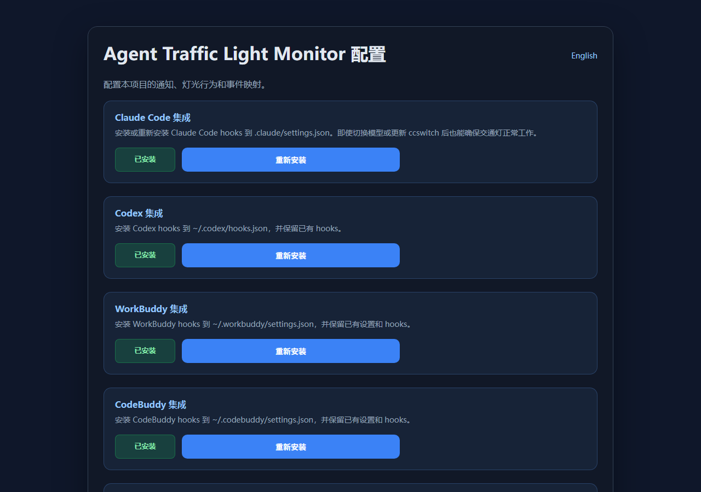

> **Codex users note**: After installing Hooks, Codex will list it as an "untrusted item". You must mark the project as trusted in Codex for the Hooks to actually take effect.

> **Tip**: During software installation, Hooks are only auto-installed for AI assistants that **already have a config file**. If you later add a new AI assistant, just go back to the config page and click install once manually.

### Step 3: Turn on the light and connect

| Connection method | Use case | How |
| --- | --- | --- |
| **Bluetooth** (recommended) | Light sits on the desk, no cable wanted | Long-press the button for 2 seconds to power on → light enters green breathing (waiting for connection) → click "Scan and bind" on the config page → **keep the light within 1 meter of the computer** to complete binding **[Note: proximity comm uses signal strength > -45dBm to auto-connect and bind the light; if it can't be found, you can complete pairing via the system pairing menu]** |
| **USB** | Want to charge while using, or heavy Bluetooth interference | Connect the light to the computer with a data cable → select the corresponding serial port on the config page. **USB takes priority over Bluetooth; connecting USB auto-disconnects Bluetooth, disconnecting USB auto-resumes advertising/connection** |

### Step 4: Verify success

Open a new session and send a request to your AI assistant (e.g., "write me a function"), and observe the light:

- [ ] After submitting the request, the light turns **yellow** (working)
- [ ] After the task completes, the light turns **green** (idle/done)
- [ ] Opening Dashboard <http://127.0.0.1:7900> shows a live event stream

If the light doesn't respond, jump straight to [FAQ - light doesn't light up or color is wrong](#light-doesnt-light-up-or-color-is-wrong).

---

## 2. Understanding status colors

Agent Pulse summarizes the AI assistant's status into three **semantic states**, each mapped to a color:

| Color | Semantic | Typical scenario |
| --- | --- | --- |
| Green | Idle / Done | Task finished, session ended, waiting for your next instruction |
| Yellow | Working | Thinking, calling tools, writing code |
| Red | Needs attention | Error, tool call failed, permission denied |

**State transition diagram:**

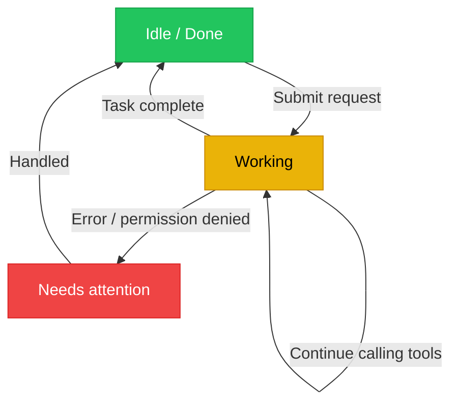

### Semantic state vs event coloring (important change since 0.4.5)

Since version 0.4.5, Agent Pulse adopts a **semantic-state-first** design:

- Agent Pulse first determines "what state the AI assistant is currently in" (idle/working/error), then decides the light color based on that state;
- You **can also** specify a color and mode for an individual event (see [6.2 Config page](#62-config-page)); your settings take the highest priority.

**Example**: By default `stop` (task complete) lights green; but if you manually set `stop` to "red + blink", then on task completion the light blinks red — your setting wins.

### Light modes

Besides color, you can set the light's **display mode**:

| Mode | Effect | Best for |
| --- | --- | --- |
| `solid` steady | Steady on | Most scenarios |
| `blink` blinking | Periodic on/off | Needs attention (e.g., error) |
| `breathe` breathing | Brightness fades in/out | Waiting, standby |
| Alternating | Red-yellow / yellow-green / red-green alternating | Distinguishing compound states |

---

## 3. Installation and updates

### 3.1 Windows installer

**[Download `AgentPulseSetup-0.4.6.exe`](https://github.com/lzty634158-oss/agent-pulse-release/releases/latest)**, double-click to run, and follow the prompts.

> Users in China can use Gitee instead: <https://gitee.com/lzty634158/agent-pulse-release/releases>

- Default install location: `C:\Users\<your username>\AppData\Local\Programs\AgentPulse\`
- Auto-starts on boot by default (starts the background service after install)
- Agent Pulse can be found in the Start menu

> If antivirus blocks the install, please allow it to run (unsigned installers trigger a prompt).

### 3.2 macOS installer

**[Download `AgentPulse-0.4.6.pkg`](https://github.com/lzty634158-oss/agent-pulse-release/releases/latest)**, double-click, and follow the install wizard. Or install via an AI prompt — AI-prompt installation is recommended; if something goes wrong, just send it to the AI to fix.

> Users in China can use Gitee (both Windows / macOS available): <https://gitee.com/lzty634158/agent-pulse-release/releases>
> macOS also has a separate repo: <https://gitee.com/lzty634158/agent-pulse-macos-release>

See [macos-install/RELEASE_INSTALL.md](macos-install/RELEASE_INSTALL.md) for detailed macOS installation.

- **Architecture choice**: Apple Silicon (M series) choose `arm64`, Intel choose `x86_64`; if unsure, choose the universal package
- **Signing and notarization**: The package is signed with Developer ID and notarized by Apple, normally won't be blocked by Gatekeeper
- **First launch**: You may see prompts like "allow network connection", "allow Bluetooth"; please click "Allow"

### 3.3 App updates

Agent Pulse checks for updates automatically:

1. Checks **Gitee** first (faster in China)
2. Falls back to **GitHub** automatically if Gitee is unavailable

The update flow downloads and upgrades automatically; **your config, music, and device bindings are preserved**.

**Manual update**: Download the new installer and double-click to overwrite-install; data is also preserved.

### 3.4 Ubuntu Collector (optional)

If you want the AI assistant status on an Ubuntu server pushed to the Dashboard too, you can deploy the collector.

Download the runtime package first: <https://gitee.com/lzty634158/agent-pulse-linux-collector-release>

```bash
# Run on the Ubuntu machine (requires sudo)
sudo bash deploy/ubuntu/collector/install.sh
```

See `deploy/ubuntu/collector/README.md` for detailed config.

> This is an **optional feature**. If you only use it locally on Windows / macOS, you can skip it entirely.

---

## 4. Connect your light

### 4.1 Bluetooth connection (recommended)

**First-time binding flow:**

1. Long-press the button for 2 seconds to power on
2. The light enters **green breathing**, meaning it's waiting for connection
3. Open the config page <http://127.0.0.1:4321/?lang=en>
4. Click "Scan and bind"
5. Bring the light **within 1 meter of the computer** and wait for binding to complete

**Why require closeness?** To avoid connecting to a colleague's light next door, binding does "proximity" checking:

- Each device is sampled 3 times; the signal strength (RSSI) must be **≥ -45 dBm**
- And the closest one must be **≥ 8 dB** stronger than other candidate devices

After successful binding, the light is remembered, and it auto-reconnects on every power-on — no need to rebind.

**Binding flow:**

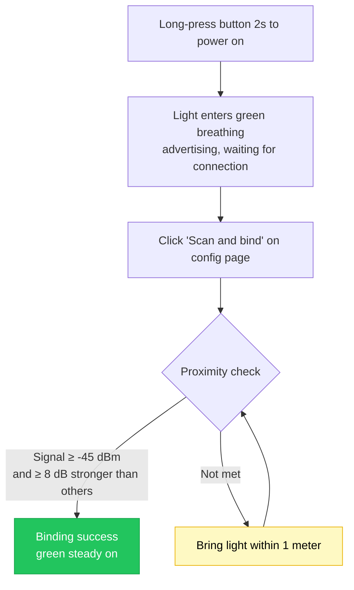

**Bluetooth status icons on the UI** (shown on Dashboard and floating widget):

| Icon | Meaning |
| --- | --- |
| 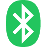 | Bluetooth connected |
| 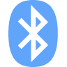 | Connecting |
|  | Scanning for devices |
| 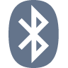 | Bluetooth disconnected |
| 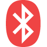 | Bluetooth error |

### 4.2 USB serial connection

Use a **data cable** (not a charge-only cable) to connect the light to the computer.

- Windows Device Manager should show **`ESP32-C3 USB JTAG/serial debug unit`**
- Select the corresponding port in the serial port list on the config page

> **USB takes priority over Bluetooth**: While plugged in, it uses USB; unplugging auto-switches back to Bluetooth.

### 4.3 Multiple lights

If you have multiple Agent Pulse lights, you can specify "which light shows which project's status":

| Routing method | Description |
| --- | --- |
| **Follow latest** | All lights show the most recently active task status |
| **Specify project** | Fix a project to a specific light |
| **Specify assistant** | Fix an AI assistant's status to a specific light |

Configure multiple lights and routing rules on the Dashboard's "Device Management" page.

---

## 5. Using the hardware light

### 5.1 Button operation

| Operation | Duration | Effect |
| --- | --- | --- |
| **Long press** | ≥ 2 seconds | Power on / off |
| **Short press** | Press and release | Show current battery (light-effect hint); if not connected, also restarts Bluetooth advertising |

### 5.2 Light-effect quick reference

Every "action" of the light tells you what's happening:

| Light effect | Meaning |
| --- | --- |
| 🟢 **Green breathing** | Bluetooth on, advertising, waiting for connection |
| 🟢 **Green steady** | Bluetooth connected (host connected) |
| 🟢 **Back to green breathing** | Bluetooth disconnected, device restarts advertising, waiting for connection |
| 🔴→🟢→🟡→off (loop 3 times) | **Identify blink**: responds to the host's "identify device" command, quickly red→green→yellow→off loops 3 times (200ms each step) then restores previous state, helping you find it among many lights |
| 🔴→🟢→🟡 (1 second each) | **Connection animation**: feedback on successful connection, red→green→yellow each on for 1 second then restore |
| 🔴 **Red blinking** | Bluetooth advertising timeout (no connection for 60 seconds) then stops advertising |

> ⚠️ **Important note about the blue light**: Current HW v2 / ESP32-C3-next physical devices **only have three independent LEDs: red, yellow, green — no blue LED**, so **it will not light up blue or purple**.
> The **blue Bluetooth icon in the Dashboard and floating widget only means the computer is scanning or connecting via Bluetooth** — it's a status display in the computer's UI, **not an indication that the device will light up blue**. Do not map the blue icon on the UI to the actual light color.

### 5.3 Battery and sound

**Battery hint** (short-press to view):

After a short press, the light uses the **number of LEDs lit** to express the battery level, for about 2 seconds, then restores:

| Voltage | Light effect (LEDs lit) | Description |
| --- | --- | --- |
| ≥ 4.00V | 🔴🟢🟡 Red+Green+Yellow **all three on** | Sufficient |
| 3.70V ~ 4.00V | 🔴🟡 Red+Yellow **two on** | Medium |
| < 3.70V | 🔴 **only red on** | Low, recommend charging |

> Since there's no blue LED, battery is shown by "how many LEDs light up" (3=full, 2=medium, 1=low), not by different colors.

**Auto protection**: If battery drops below 3.20V and stays there for 60 seconds, the light auto-powers off to avoid battery over-discharge damage.

**Sound switch**: Set in the config page's "Brightness and sound". **Off by default**; enable manually if you want audio cues.

### 5.4 Firmware update

When new hardware light firmware is available, you can update it on the config page.

**Please confirm before updating (failure if not met):**

1. **Hardware ID must be `agentpulse-esp32c3-next`** — other hardware not supported
2. **Only upload `.ino.bin` files** — do not upload `.bin` / `.elf` / `.map` / `bootloader` / `partitions` etc.
3. **Device must show as `ESP32-C3 USB JTAG/serial debug unit`**
4. **Keep power and connection stable** — do not unplug or power off during update

**Light effects during update:**

| Light effect | Stage |
| --- | --- |
| Yellow steady | Receiving and verifying new firmware (stays yellow steady throughout the upgrade) |
| Lights off | Restarting (restarts after success or failure) |

> **Update failed?** Don't panic. The device uses a dual-partition design; on failure it auto-rolls back to the old firmware and restores the previous light effect, and is usable again after restart.

---

## 6. Desktop interface

Agent Pulse provides two web interfaces:

| Interface | Address | Purpose |
| --- | --- | --- |
| **Dashboard** | <http://127.0.0.1:7900> | View real-time status and event stream, manage devices |
| **Config page** | <http://127.0.0.1:4321/?lang=en> | All settings are here |

### 6.1 Dashboard

Open <http://127.0.0.1:7900> to see:

<!-- Screenshot slot: after placing dashboard.png in docs/screenshots/, uncomment the line below

-->

- **Live event panel**: Every event of the AI assistant (submit prompt, call tool, task complete...) scrolls in chronological order
- **Current status**: What color, what mode, from which project/assistant
- **Status bar format**: `light effect[mode] + color + project name + assistant name + duration`, e.g.:
  ```
  Steady Green  my-project  claude-code  lasting 00:02:15
  ```
- **Device management**: Status view and routing config for multiple lights

### 6.2 Config page

Open <http://127.0.0.1:4321/?lang=en>, the entry point for all settings.

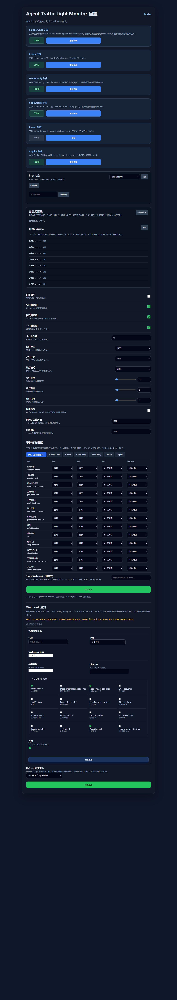

<!-- Screenshot slot: after saving the "Events and light scheme" section screenshot as config-events-section.png, uncomment the line below

-->

#### Notifications and stuck detection

| Setting | Default | Description |
| --- | --- | --- |
| Desktop notification | Off | Whether to show system notification on status change |
| Notify on task complete | On | Notify when task complete (green) |
| Notify on error | On | Notify on error (red) |
| Notify when possibly stuck | On | Notify when yellow persists beyond set time |
| Stuck detection time | 5 minutes | How long yellow must persist to count as "possibly stuck" |

#### Events and light scheme

This is the most-used part — you can **set the light color, mode, and whether to play music for each individual event**.

**Supported events (slightly varies by AI assistant):**

| Event | Meaning |
| --- | --- |
| `session-start` | Session start |
| `session-end` | Session end |
| `user-prompt-submit` | User submits prompt |
| `pre-tool-use` | Before tool call |
| `post-tool-use` | After tool call |
| `post-tool-use-failure` | Tool call failed |
| `permission-request` | Permission requested |
| `permission-denied` | Permission denied |
| `notification` | Notification |
| `stop` | Task complete |
| `stop-failure` | Task failed |
| `error-occurred` | Error occurred |
| `elicitation` | Request for more info |

**Events supported per AI assistant:**

| AI assistant | Supported events |
| --- | --- |
| **Claude Code** | session start, submit prompt, before/after tool call, permission requested, permission denied, notification, task complete, task failed |
| **Codex** | session start, submit prompt, before/after tool call, permission requested, notification, task complete |
| **WorkBuddy** | session start, submit prompt, before/after tool call, notification, task complete |
| **CodeBuddy** | session start, submit prompt, before/after tool call, tool call failed, permission requested, notification, task failed, task complete, session end |
| **Cursor** | session start, submit prompt, before/after tool call, tool call failed, permission requested, notification, task failed, task complete |
| **Copilot** | session start, submit prompt, after tool call, task complete, error occurred, session end |

> The config page only shows events that **your current assistant will actually trigger**, avoiding configuring events that never happen.

**Configure per assistant separately**: Switch to the corresponding assistant's tab to set its event colors individually; the "Default" tab's settings act as a global fallback for all assistants.

#### Brightness and sound

| Setting | Default | Description |
| --- | --- | --- |
| Green brightness | 30% | Set three-color brightness separately |
| Yellow brightness | 30% | |
| Red brightness | 30% | |
| Blink period | 1000 ms | Duration of one full blink cycle |
| Breathe period | 2000 ms | Duration of one breathe cycle |
| Enable sound | Off | Whether to play audio cues |

#### Hooks management

Each AI assistant card has an **"Install Hooks"** button; after install the card shows "Installed". If you switch or reinstall an assistant, just click to reinstall.

### 6.3 Floating widget

When enabled, a semi-transparent small window appears on the desktop, showing the current status color and project name in real time, without opening a browser.


---

## 7. Music

Agent Pulse can play audio cues when specific events occur, supporting both **built-in sounds** and **custom music**.

### 7.1 Built-in sounds

The light ships with 5 built-in sounds, ready to use, no storage needed:

| # | Name |
| --- | --- |
| 1 | Rising cue |
| 2 | Double-click cue |
| 3 | Complete cue |
| 4 | Falling warning |
| 5 | Echo cue |

### 7.2 Custom music editor

On the music section of the config page, you can compose your own tunes.

<!-- Screenshot slot: after placing music-editor.png in docs/screenshots/, uncomment the line below

-->

**Note parameter limits:**

| Parameter | Range | Description |
| --- | --- | --- |
| Frequency | 0 ~ 4000 Hz | **0 means rest (pause, no sound)** |
| Duration | 20 ~ 2000 ms | How long a single note lasts |
| Interval `gapMs` | 0 ~ 500 ms (default 10 ms) | Silent gap between notes |

**Whole-tune limits:**

- At most **64 notes**
- Total duration no more than **30 seconds**
- Name at most **40 characters**

> **What is `gapMs` (interval)?** It's the "pause" between notes. For example, if you want two notes to sound separate, set an interval on the previous note. The firmware implements this pause using a "silent note with frequency 0".

### 7.3 Upload to light

**Overall flow:**

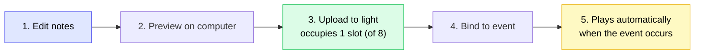

Custom music must be uploaded to the light to play:

1. Compose the tune in the music section of the config page
2. Click **"Upload to device"**
3. Wait for upload to complete

**Storage rules:**

| Item | Description |
| --- | --- |
| Slot count | **8** (numbered 128 ~ 255) |
| Single slot capacity | **512 bytes** |
| Allocation | Auto-allocate a free slot; if full, delete unused tunes first |
| Re-upload | Already-uploaded tunes **reuse the original slot**, no jumping around |

> **Slots full?** You'll be prompted "8 custom music slots are full" on upload. Delete unused tunes on the config page to free space.

### 7.4 Bind to event

After composing and uploading music, bind it to an event:

1. Go to "Events and light scheme"
2. Find the target event (e.g., `session-end` session end)
3. Select your tune in the "Music" dropdown
4. Choose "Play once" or "Repeat"
5. Click save

After that, whenever that event occurs, the light plays this tune.

### 7.5 Preview, delete, and read

| Operation | How |
| --- | --- |
| **Preview** | Click "Preview" in the music editor; previews on the computer (not through the light) |
| **Delete** | Click "Delete" in the music list; removes from both computer and the light's slot |
| **Read from light** | Music already on the light can be listed on the config page; note **the firmware only stores raw note data, not the tune name** |

### 7.6 Music FAQ

| Symptom | Cause and fix |
| --- | --- |
| No sound at all | Check if "Enable sound" is on in the config page (**off by default**) |
| Notes run together, no perceivable gap | Set `gapMs` interval on notes (default only 10 ms, may be too short) |
| Upload failed, slots full | Delete unused tunes to free slots |
| Tune has no name after moving light to another computer | Tune name only exists on the computer; the light's firmware only stores note data — this is normal |

---

## 8. Webhook notifications

Besides changing the light color, Agent Pulse can also push events **to your chat groups** (WeCom, Feishu, DingTalk, Telegram, Slack, etc.).

### 8.1 Supported platforms

| Platform | Description |
| --- | --- |
| **WeCom (Enterprise WeChat)** | Group bot Webhook |
| **Feishu (Lark)** | Custom bot (supports signature verification) |
| **DingTalk** | Custom bot (supports signed request) |
| **Telegram** | Bot API |
| **Slack** | Incoming Webhook |
| **Custom** | Any HTTPS endpoint that receives JSON |

### 8.2 Add a notification channel

<!-- Screenshot slot: after placing webhook-channels.png in docs/screenshots/, uncomment the line below

(currently config-full.png already includes the full Webhook section; a separate, more focused screenshot can be added later)
-->

1. Open config page → **Webhook notifications** section
2. Click "Add channel"
3. Fill in:
   - **Name**: a note for yourself, e.g., "Project group"
   - **Platform**: choose one from the table above
   - **Webhook URL**: obtained from the platform's "group bot" settings
   - **Secret** (required for Feishu/DingTalk): the signing secret from the bot's security settings
   - **Enabled**: **must be checked**, otherwise no push
4. Check the **events** you want to receive
5. Click save

> **URL must be HTTPS**, otherwise save is rejected.

### 8.3 Event subscription (the most important step)

Each channel can separately check which events to receive. Events are in two categories:

**Aggregated events (recommended)** — cover a class of scenarios, more worry-free:

| Aggregated event | Trigger timing |
| --- | --- |
| `complete` | Task complete **or** session end (green) |
| `error` | Error occurred (red) |
| `stuck` | Yellow persists beyond "stuck detection time" |

**Raw events** — exact match a single event, e.g., `stop`, `session-end`, `error-occurred`, etc. (see [Events table](#events-and-light-scheme)).

> **Recommendation**: Want "task complete and session end both notified"? Check **`complete`** — it covers both `stop` and `session-end`.
> If you only check raw `session-end`, then "task complete (`stop`)" will **not** be pushed.

**How do events get matched?** (Understand this diagram to troubleshoot "why no push" yourself):

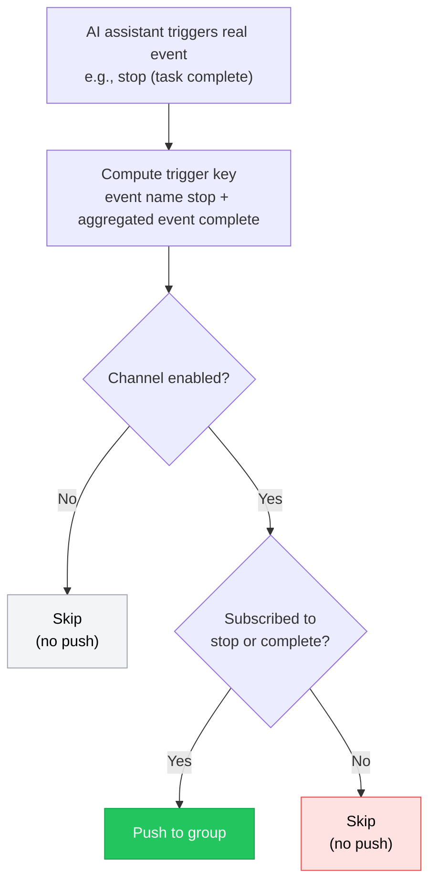

> Note the difference between two buttons: **"Test"** skips the matching logic above and sends directly (so it always sends);
> **"Simulate push"** goes through the exact same matching logic as real events and reports "which channel matched, which was skipped, and why". See [8.4](#84-test-and-simulate-push).

### 8.4 Test and "Simulate push"

The config page provides two troubleshooting tools:

| Button | Function | When to use |
| --- | --- | --- |
| **Test** | Sends a test message directly to the channel, **without checking event subscription** | Verify URL and secret are correct |
| **Simulate push** | Goes through the **exact same matching logic as real events** and reports "which channel matched, which was skipped, and why" | Verify event subscription is paired correctly |

**Recommended troubleshooting flow:**

1. Click "Test" first → message received in group means URL and channel are fine
2. Then click "Simulate push" → read the feedback text:
   - Shows "matched 1/1, pushed to 'Project group'" → config correct, group will receive
   - Shows "skipped 'Project group' (did not subscribe to stop/complete)" → means **events not checked correctly**, go back and check the corresponding events then save

### 8.5 Webhook FAQ

| Symptom | Cause and fix |
| --- | --- |
| **Test sends, but real events don't push** | Almost always one of two reasons:<br>① The channel's "Enabled" is not checked (please check it for new channels)<br>② Event subscription not checked correctly (see [8.3](#83-event-subscription-the-most-important-step)). Use "Simulate push" to locate instantly |
| **After saving and refreshing, UI reverts to English** | Fixed (0.4.6). If using an old version, access the config page with `?lang=zh` in the address bar |
| **Simulate push shows "simulation failed"** | Means the request didn't reach the new backend. Please **restart Agent Pulse** (fully quit the tray icon then start), ensure you're running 0.4.6 |
| **Test/delete/simulate buttons unresponsive** | Upgrade to 0.4.6; old versions have a UI script issue |
| **Prompt says URL invalid** | Webhook address must start with `https://` |
| **Feishu/DingTalk not receiving** | Check if the secret is filled correctly; Feishu and DingTalk use different signing algorithms, please confirm the platform type is correct |

---

## 9. Multiple assistants and multiple devices

### 9.1 Supported AI assistants

Agent Pulse supports 6 AI coding assistants, **you can install multiple at once**, without interference:

| Assistant | Config page tab |
| --- | --- |
| Claude Code | `claude` |
| Codex | `codex` |
| WorkBuddy | `workbuddy` |
| CodeBuddy | `codebuddy` |
| Cursor | `cursor` |
| Copilot | `copilot` |

### 9.2 Independent config per assistant

Switch to the corresponding assistant's tab to set individually:

- Light color and mode for each event
- Music played for each event
- Stuck detection and other parameters

The "Default" tab's settings act as a global fallback: when an assistant has no individual config, it inherits the "Default" settings.

### 9.3 Multiple lights

See [4.3 Multiple lights](#43-multiple-lights). Configure routing rules in the Dashboard's "Device Management".

---

## 10. Data and privacy

### Local directory

Agent Pulse's data is **all saved on your own computer** and is not uploaded to any server.

| System | Data directory |
| --- | --- |
| Windows | `%LOCALAPPDATA%\AgentPulse\` |
| macOS | `~/Library/Application Support/AgentPulse/` |

**Directory contents:**

| File/folder | Description |
| --- | --- |
| `config.json` | All your config (events, brightness, Webhook channels, etc.) |
| `music/` | Source files of your custom music |
| `devices.json` | Bound light device info |

### Does reinstall / uninstall keep data?

**Since 0.4.5, both reinstall and uninstall keep user data.**

- **Kept**: `config.json`, `music/`, `devices.json` and other personal data
- **Removed**: Program files and background service

In other words, after updating or reinstalling, all your previously configured events, music, Webhook channels, and device bindings **are still there** — no need to reconfigure.

> If you want to **completely clear all data**, you need to manually delete the data directory above.

---

## 11. FAQ

### Dashboard won't open

1. Confirm Agent Pulse is running (check tray/menu bar icon)
2. Fully quit Agent Pulse then restart
3. Confirm the browser accesses <http://127.0.0.1:7900>
4. If port 7900 is occupied by another program, restart the computer and retry

### Light doesn't light up or color is wrong

Troubleshoot in order:

1. **Hooks installed?** → Open config page <http://127.0.0.1:4321/?lang=en>, confirm the corresponding assistant card shows "Installed". **This is the most common cause.**
2. **Light connected?** → Check light effect: green breathing = waiting for connection; green steady = connected
3. **Event colors changed?** → If you manually set a color for an event, your setting wins (see [Semantic state vs event coloring](#semantic-state-vs-event-coloring-important-change-since-045))
4. **Brightness 0?** → Check the brightness setting on the config page
5. **Codex users** → Confirm you've marked the project as "trusted" in Codex

### Music doesn't play

1. Check if "Enable sound" is on in the config page (**off by default**)
2. Check if the event is bound to music (the music number can't be 0)
3. Custom music already "uploaded to device"
4. Click "Preview" to confirm the tune itself is fine

### Webhook not pushing

See [8.5 Webhook FAQ](#85-webhook-faq).

### Bluetooth won't connect

1. Bring the light **within 1 meter of the computer** before binding (proximity check requires signal ≥ -45 dBm and ≥ 8 dB stronger than other devices)
2. Short-press the light button to restart Bluetooth advertising (green breathing)
3. Delete the old Agent Pulse pairing in the computer's Bluetooth settings and rebind
4. If there are many Bluetooth devices around with heavy interference, switch to **USB connection** (higher priority, more stable)

### USB device not found

1. Confirm you're using a **data cable**, not a charge-only cable
2. Windows Device Manager should show **`ESP32-C3 USB JTAG/serial debug unit`**
3. If "Unknown device" shows, you may need to install a driver
4. Try another USB port (some front panels have insufficient power)

### Notifications too frequent

1. Increase "stuck detection time" (default 5 minutes)
2. Turn off unneeded notification items (e.g., turn off "notify when possibly stuck")
3. In the Webhook channel, only check events you truly care about

---

## 12. Notes

- **Firmware update with caution**: Only upload `.ino.bin` files, hardware ID must be `agentpulse-esp32c3-next`; during update **do not unplug or power off**. See [5.4 Firmware update](#54-firmware-update).
- **Low-battery protection**: If battery drops below 3.20V for 60 seconds, the light auto-powers off — this protects the battery, not a fault.
- **OTA upgrade requires sufficient battery**: If battery is below 3.60V, firmware upgrade is refused — please charge first.
- **Hooks must be installed**: Without Hooks, Agent Pulse receives no events and the light won't respond at all.
- **Webhook requires HTTPS**: For security, only `https://` Webhook addresses are accepted.
- **Custom music slots are limited**: The light has only 8 custom music slots; please clean up unused tunes regularly.

---

## More resources

### Download summary

| Purpose | Link |
| --- | --- |
| **Windows / macOS installer** (GitHub) | <https://github.com/lzty634158-oss/agent-pulse-release/releases/latest> |
| **Windows / macOS installer** (Gitee China mirror) | <https://gitee.com/lzty634158/agent-pulse-release/releases> |
| **macOS separate repo** | <https://gitee.com/lzty634158/agent-pulse-macos-release> |
| **Ubuntu Collector** | <https://gitee.com/lzty634158/agent-pulse-linux-collector-release> |

### Documentation

- **Changelog**: [CHANGELOG.md](CHANGELOG.md)
- **Firmware upgrade guide**: [firmware/README.md](firmware/README.md)
- **macOS install guide**: [macos-install/RELEASE_INSTALL.md](macos-install/RELEASE_INSTALL.md)
- **Bluetooth bridge tool**: [ble-bridge/](ble-bridge/)
- **Ubuntu deploy guide**: [deploy/ubuntu/README.md](deploy/ubuntu/README.md)
