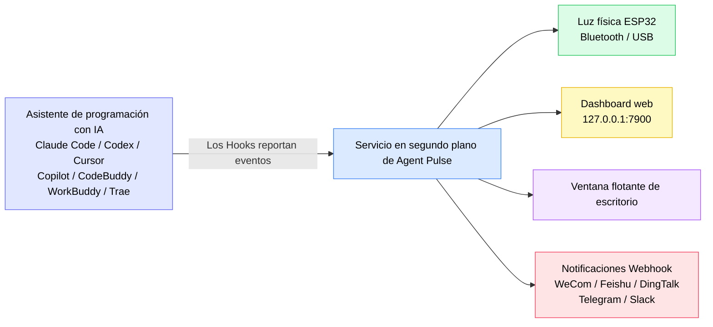
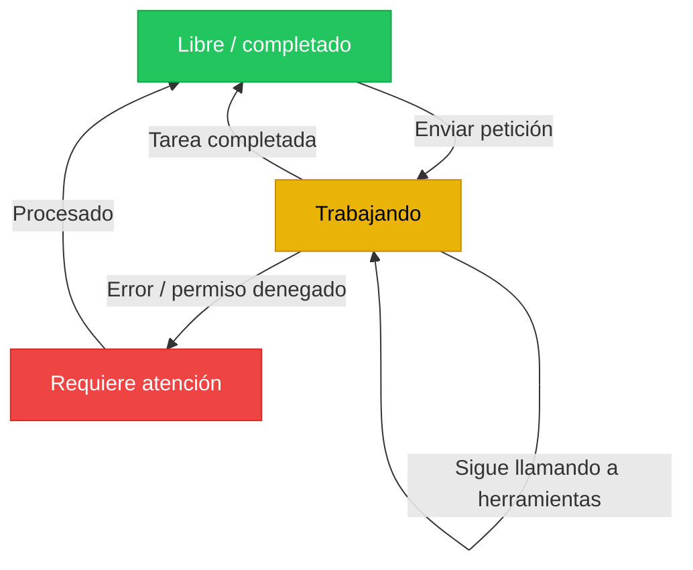
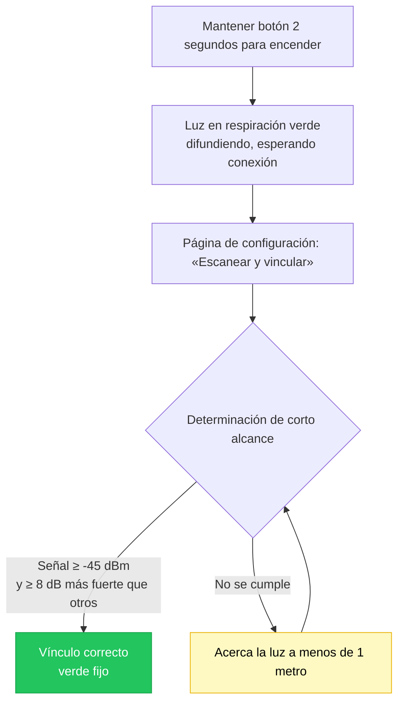
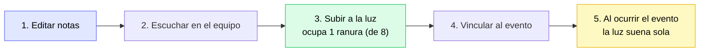
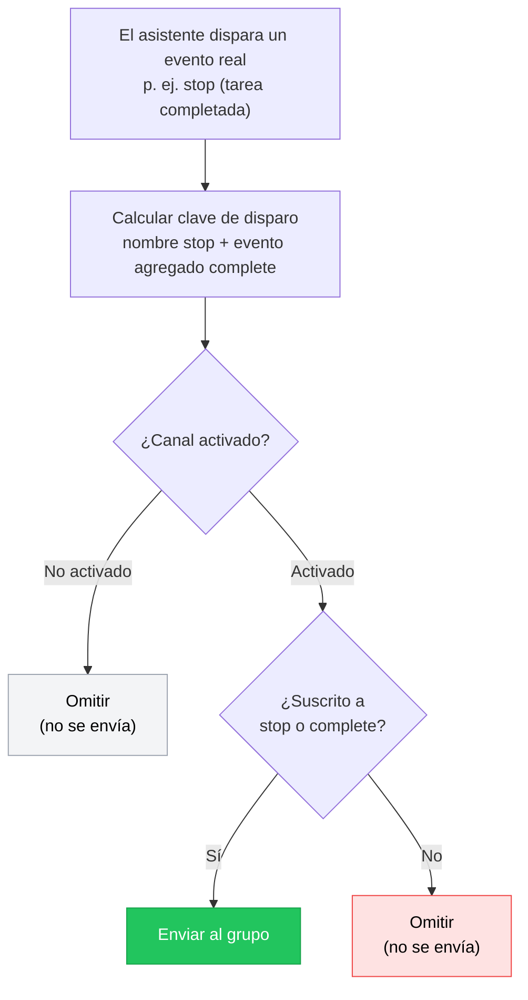

[English](README.md) | [한국어](./README.ko.md) | [日本語](./README.ja.md) | [简体中文](./README.zh-CN.md) | [繁體中文](./README.zh-TW.md) | [Español](./README.es.md) | [Français](./README.fr.md) | [Deutsch](./README.de.md)

# Tutorial de uso de Agent Pulse

**Agent Pulse** es una luz de ambiente de escritorio que cambia según el estado de tu asistente de programación con IA. No hace falta mirar la terminal para esperar un resultado: basta con levantar la vista y ver el color de la luz para saber si la tarea «está en marcha», «ya terminó» o «hubo un error».

- **Versión actual del software**: 0.4.8
- **Versión del firmware integrado de la luz hardware**: `0.1.24+25`
- **Registro de cambios**: véase [CHANGELOG.md](CHANGELOG.md)

**Asistentes de programación con IA compatibles**: Claude Code · Codex · WorkBuddy · CodeBuddy · Cursor · Copilot · Trae

### ¿Cómo funciona?



En una frase: **el asistente de IA informa su estado a Agent Pulse mediante Hooks, y Agent Pulse distribuye ese estado a la luz, la web, la ventana flotante y los grupos de chat.**

> ⚠️ En el diagrama, los **Hooks son el eslabón más importante**. Sin los Hooks instalados, Agent Pulse no recibe ningún evento y ninguna salida responderá.

---

## Índice

- [1. Primeros pasos (5 minutos)](#1-primeros-pasos-5-minutos)
- [2. Cómo interpretar los colores de estado](#2-cómo-interpretar-los-colores-de-estado)
- [3. Instalación y actualización](#3-instalación-y-actualización)
- [4. Conecta tu luz](#4-conecta-tu-luz)
- [5. Uso de la luz hardware](#5-uso-de-la-luz-hardware)
- [6. Interfaz de escritorio](#6-interfaz-de-escritorio)
- [7. Música](#7-música)
- [8. Notificaciones Webhook](#8-notificaciones-webhook)
- [9. Varios asistentes y varios dispositivos](#9-varios-asistentes-y-varios-dispositivos)
- [10. Datos y privacidad](#10-datos-y-privacidad)
- [11. Preguntas frecuentes](#11-preguntas-frecuentes)
- [12. Notas de precaución](#12-notas-de-precaución)

---

## 1. Primeros pasos (5 minutos)

La primera vez, sigue estos 4 pasos en orden y verás la luz cambiar de color con la tarea.

### Paso 1: Instala el software (elige según tu sistema)

| Sistema | Descarga | Forma de instalar |
| --- | --- | --- |
| Windows 10 1809+ / 11 | **[Descarga `AgentPulseSetup-0.4.8.exe`](https://github.com/lzty634158-oss/agent-pulse-release/releases/latest)** | Doble clic para instalar; al terminar se inicia solo con el arranque |
| macOS (Apple Silicon / Intel) | **[Descarga `AgentPulse-0.4.6.pkg`](https://github.com/lzty634158-oss/agent-pulse-release/releases/latest)** | Doble clic e instala siguiendo las indicaciones |
| Ubuntu (solo recopilador) | **[Descarga del Collector](https://gitee.com/lzty634158/agent-pulse-linux-collector-release)** | Véase [Collector para Ubuntu](#34-collector-para-ubuntu-opcional) |

> **¿Descarga lenta dentro de China?** Usa el espejo de Gitee (el contenido es idéntico al de GitHub):
> - Paquetes de instalación Windows / macOS: <https://gitee.com/lzty634158/agent-pulse-release/releases>
> - macOS tiene además un repositorio de publicación independiente: <https://gitee.com/lzty634158/agent-pulse-macos-release>

Tras la instalación, Agent Pulse queda residente en segundo plano y aparece un icono en la bandeja/barra de menú.

### Paso 2: Instala los Hooks

#### Nota: la instalación normal los instala automáticamente; si dejan de funcionar, reinstálalos.

Los Hooks son el «mensajero» entre Agent Pulse y tu asistente de IA. **Sin los Hooks instalados, la luz no reaccionará.**

1. Abre la página de configuración en el navegador: <http://127.0.0.1:4321/?lang=zh>
2. Busca la tarjeta del asistente de IA que usas (p. ej. Claude Code / Cursor / Trae)
3. Haz clic en el botón **«Instalar Hooks»** de la tarjeta
4. Tras instalarse correctamente, la tarjeta mostrará «Instalado»


> **Usuarios de Codex**: tras instalar los Hooks, Codex los marcará como «proyecto no confiable». Debes ir a la configuración de Codex, buscar el elemento de configuración de «hooks» y marcar el proyecto como confiable para que los Hooks surtan efecto realmente.

> **Usuarios de Claude Code**: tras instalar los Hooks, si usas CCSwitch para cambiar de modelo, CCSwitch sobrescribirá nuestra configuración de Hook; en ese caso, solo tienes que volver a la página de configuración y hacer clic en instalar.

> **Sugerencia**: al instalar el software, los Hooks se instalan automáticamente **solo para los asistentes de IA cuya configuración ya exista**. Si más tarde instalas un asistente nuevo, vuelve a la página de configuración y haz clic una vez para instalarlo manualmente.

### Paso 3: Enciende la luz y conéctala

| Forma de conexión | Escenario | Cómo |
| --- | --- | --- |
| **Bluetooth** (recomendado) | La luz está sobre el escritorio y prefieres no usar cable | Mantén pulsado el botón 2 segundos para encender → la luz entra en respiración verde (esperando conexión) → en la página de configuración haz clic en «Escanear y vincular» → **la luz debe estar a 1 metro del equipo** para completar el vínculo **[Nota: la comunicación de corto alcance conecta y vincula automáticamente la luz según la intensidad de señal mayor a -45 dB; si no se encuentra, puedes completar el emparejamiento desde el menú de emparejamiento del sistema]** |
| **USB** | Quieres usarla y cargarla a la vez, o hay mucha interferencia Bluetooth | Conecta la luz al equipo con un cable de datos → en la página de configuración elige el puerto serie correspondiente; **la conexión USB tiene prioridad sobre Bluetooth: al conectar USB, Bluetooth se desconecta automáticamente; al desconectar USB, la conexión Bluetooth por difusión se recupera automáticamente** |

### Paso 4: Verifica que funciona

Abre una sesión nueva, haz una petición a tu asistente de IA (por ejemplo «ayúdame a escribir una función») y observa la luz:

- [ ] Tras enviar la petición, la luz se pone **amarilla** (trabajando)
- [ ] Al terminar la tarea, la luz se pone **verde** (libre/completado)
- [ ] Abres el Dashboard <http://127.0.0.1:7900> y ves el flujo de eventos en tiempo real

Si la luz no reacciona, salta directamente a [Preguntas frecuentes - La luz no se enciende o el color es incorrecto](#la-luz-no-se-enciende-o-el-color-es-incorrecto).

---

## 2. Cómo interpretar los colores de estado

Agent Pulse resume el estado del asistente de IA en tres **estados semánticos**, cada uno con un color:

| Color | Significado | Escenario típico |
| --- | --- | --- |
| Verde | Libre / completado | Tarea terminada, sesión finalizada, esperando tu siguiente instrucción |
| Amarillo | Trabajando | Pensando, llamando a una herramienta, escribiendo código |
| Rojo | Requiere atención | Hubo un error, falló una llamada a herramienta, se denegó un permiso |

**Diagrama de transición de estados:**



### Estados semánticos vs. colores de evento (cambio importante desde 0.4.5)

Desde la versión 0.4.5, Agent Pulse adopta un diseño de **estado semántico primero**:

- Agent Pulse primero determina «en qué estado está» el asistente de IA (libre/trabajando/error) y ese estado decide el color de la luz;
- **También puedes** especificar un color y un modo individuales para un evento concreto (véase [6.2 Página de configuración](#62-página-de-configuración)); tu configuración tiene la máxima prioridad.

**Ejemplo**: por defecto `stop` (tarea completada) enciende la luz verde; pero si configuras manualmente `stop` como «rojo + parpadeo», entonces al completar la tarea la luz parpadea en rojo — se respeta tu configuración.

### Modos de la luz

Además del color, puedes configurar el **modo de visualización** de la luz:

| Modo | Efecto | Apropiado para |
| --- | --- | --- |
| `solid` fijo | Brilla de forma estable | La mayoría de escenarios |
| `blink` parpadeo | Encendido/apagado periódico | Requiere atención (p. ej. error) |
| `breathe` respiración | Brillo que sube y baja | En espera, en reposo |
| Modo alterno | Rojo-amarillo / amarillo-verde / rojo-verde alternos | Diferenciar estados compuestos |

---

## 3. Instalación y actualización

### 3.1 Paquete de instalación para Windows

**[Descarga `AgentPulseSetup-0.4.8.exe`](https://github.com/lzty634158-oss/agent-pulse-release/releases/latest)**, ejecuta con doble clic y completa la instalación siguiendo las indicaciones.

> Los usuarios de China pueden usar Gitee: <https://gitee.com/lzty634158/agent-pulse-release/releases>

- Ubicación de instalación predeterminada: `C:\Users\<tu_usuario>\AppData\Local\Programs\AgentPulse\`
- Autoinicio predeterminado (tras instalar, el servicio en segundo plano se inicia solo)
- Agent Pulse se encuentra en el menú Inicio

> Si el antivirus bloquea la instalación, permite su ejecución (el paquete sin firmar dispara un aviso).

### 3.2 Paquete de instalación para macOS

**[Descarga `AgentPulse-0.4.8.pkg`](https://github.com/lzty634158-oss/agent-pulse-release/releases/latest)**, doble clic y completa según el asistente de instalación. O bien instala mediante un mensaje de IA; se recomienda instalar por mensaje de IA: si hay un error, lo envías directamente a la IA para resolverlo.

> Los usuarios de China pueden usar Gitee (tanto Windows como macOS): <https://gitee.com/lzty634158/agent-pulse-release/releases>
> macOS tiene además un repositorio de publicación independiente: <https://gitee.com/lzty634158/agent-pulse-macos-release>

La guía detallada de instalación para macOS está en [macos-install/RELEASE_INSTALL.md](macos-install/RELEASE_INSTALL.md).

- **Elección de arquitectura**: Apple Silicon (serie M) elige `arm64`, Intel elige `x86_64`; si no estás seguro, elige el paquete universal
- **Firma y notarización**: el paquete está firmado con Developer ID y notarizado por Apple, por lo que normalmente no lo bloquea Gatekeeper
- **Primer arranque**: puede aparecer «Permitir conexión de red», «Permitir Bluetooth», etc.; haz clic en «Permitir»

### 3.3 Actualización del programa

Agent Pulse comprueba las actualizaciones automáticamente:

1. Primero comprueba en **Gitee** (rápido dentro de China)
2. Si Gitee no está disponible, vuelve automáticamente a **GitHub**

El proceso de actualización descarga y actualiza automáticamente; **se conservan tu configuración, tu música y el vínculo de dispositivos**.

**Actualización manual**: descarga el nuevo paquete de instalación y simplemente ejecuta la instalación por encima; tampoco se pierden datos.

### 3.4 Collector para Ubuntu (opcional)

Si quieres que el estado del asistente de IA en tu servidor Ubuntu también se envíe al Dashboard, puedes desplegar el recopilador.

Descarga primero el paquete de ejecución: <https://gitee.com/lzty634158/agent-pulse-linux-collector-release>

```bash
# Ejecuta en la máquina Ubuntu (requiere sudo)
sudo bash deploy/ubuntu/collector/install.sh
```

La configuración detallada está en `deploy/ubuntu/collector/README.md`.

> Es una **función opcional**. Si solo usas el equipo local Windows / macOS, puedes omitirla por completo.

---

## 4. Conecta tu luz

### 4.1 Conexión Bluetooth (recomendada)

**Flujo de primer vínculo:**

1. Mantén pulsado el botón 2 segundos para encender
2. La luz entra en estado de **respiración verde**, indicando que espera conexión
3. Abre la página de configuración <http://127.0.0.1:4321/?lang=zh>
4. Haz clic en «Escanear y vincular»
5. Acerca la luz **a menos de 1 metro del equipo** y espera a que se complete el vínculo

**¿Por qué hay que acercarla?** Para evitar conectar con la luz de un compañero de al lado, en el vínculo se hace una determinación de «corto alcance»:

- Cada dispositivo se muestrea 3 veces; la intensidad de señal obtenida (RSSI) debe ser **≥ -45 dBm**
- Y el más cercano debe tener una señal **≥ 8 dB** más fuerte que los demás candidatos

Tras un vínculo correcto, la luz se recuerda y se reconecta sola en cada arranque, sin repetir el vínculo.

**Flujo de vínculo:**



**Iconos de estado Bluetooth en la interfaz** (los muestra el Dashboard y la ventana flotante):

| Icono | Significado |
| --- | --- |
|  | Bluetooth conectado |
|  | Conectando |
|  | Escaneando dispositivos |
|  | Bluetooth desconectado |
|  | Bluetooth con error |

### 4.2 Conexión por puerto serie USB

Usa un **cable de datos** (no un cable solo de carga) para conectar la luz al equipo.

- En el Administrador de dispositivos de Windows debe aparecer **`ESP32-C3 USB JTAG/serial debug unit`**
- En la lista de puertos de la página de configuración elige el puerto correspondiente

> **USB tiene prioridad sobre Bluetooth**: con el cable puesto se usa USB; al quitarlo se vuelve automáticamente a Bluetooth.

### 4.3 Varias luces

Si tienes varias luces Agent Pulse, puedes indicar «qué luz muestra el estado de qué proyecto»:

| Forma de enrutamiento | Explicación |
| --- | --- |
| **Seguir el más reciente** | Todas las luces muestran el estado de la tarea activa más reciente |
| **Proyecto especificado** | Asigna fijamente un proyecto a una luz concreta |
| **Asistente especificado** | Asigna fijamente el estado de un asistente de IA a una luz concreta |

Configura las luces múltiples y las reglas de enrutamiento en la página «Gestión de dispositivos» del Dashboard.

---

## 5. Uso de la luz hardware

### 5.1 Operación con el botón

| Operación | Duración | Efecto |
| --- | --- | --- |
| **Mantener pulsado** | ≥ 2 segundos | Encender / apagar |
| **Pulsación corta** | Soltar al instante | Muestra la batería actual (indicador de luz); si no está conectada, también reinicia la difusión Bluetooth |

### 5.2 Tabla rápida de retroalimentación de la luz

Cada «acción» de la luz te indica lo que ocurre:

| Efecto de luz | Significado |
| --- | --- |
| 🟢 **Respiración verde** | Bluetooth activado, difundiendo y esperando conexión |
| 🟢 **Verde fijo** | Bluetooth conectado (el equipo superior se conectó) |
| 🟢 **Vuelve a respiración verde** | Bluetooth desconectado, el dispositivo reinicia la difusión esperando conexión |
| 🔴→🟢→🟡→apagado (3 ciclos) | **Parpadeo de identificación**: responde al comando «identificar dispositivo» del equipo superior, ciclo rápido rojo→verde→amarillo→apagado 3 veces (200 ms cada paso) y luego vuelve a su estado; útil para encontrarla entre varias luces |
| 🔴→🟢→🟡 (1 segundo cada paso) | **Animación de conexión**: retroalimentación al conectar correctamente, rojo→verde→amarillo 1 segundo cada uno y luego vuelve a su estado |
| 🔴 **Parpadeo rojo** | La difusión Bluetooth agotó el tiempo (60 segundos sin conexión) y se detiene |

> ⚠️ **Nota importante sobre la luz azul**: el dispositivo físico actual HW v2 / ESP32-C3-next **solo tiene tres LED independientes rojo, amarillo y verde, no tiene LED azul**, por lo que **no se enciende azul ni violeta**.
> El **icono azul de Bluetooth en el Dashboard y la ventana flotante solo indica que el equipo está escaneando o conectando Bluetooth**, es un estado de la interfaz del equipo, **no significa que el dispositivo se encienda azul**. No asocies el icono azul de la interfaz con el color real de la luz.

### 5.3 Batería y sonido

**Indicador de batería** (ver con pulsación corta del botón):

Tras la pulsación corta, la luz usa **la cantidad de LED encendidos** para expresar el nivel de batería, durante unos 2 segundos, y luego vuelve a su estado:

| Voltaje | Efecto de luz (LED encendidos) | Explicación |
| --- | --- | --- |
| ≥ 4,00 V | 🔴🟢🟡 rojo+verde+amarillo **tres luces encendidas** | Batería llena |
| 3,70 V ~ 4,00 V | 🔴🟡 rojo+amarillo **dos luces encendidas** | Batería media |
| < 3,70 V | 🔴 **solo rojo encendido** | Batería baja, se recomienda cargar |

> Al no haber LED azul, el nivel de batería se expresa con «cuántas luces se encienden» (3 = llena, 2 = media, 1 = baja), no con colores distintos.

**Protección automática**: si la batería baja de 3,20 V durante 60 segundos, la luz se apaga sola para evitar dañar la batería por descarga profunda.

**Interruptor de sonido**: se configura en «Brillo y sonido» de la página de configuración. **Desactivado por defecto**; actívalo manualmente si quieres tonos.

### 5.4 Actualización de firmware

Cuando hay una nueva versión del firmware de la luz hardware, puedes actualizarla en la página de configuración.

**Antes de actualizar, confirma (si no se cumple, fallará):**

1. **El identificador hardware debe ser `agentpulse-esp32c3-next`** — los demás hardwares no son compatibles
2. **Solo sube el archivo `.ino.bin`** — no subas `.bin` / `.elf` / `.map` / `bootloader` / `partitions`, etc.
3. **El dispositivo debe mostrarse como `ESP32-C3 USB JTAG/serial debug unit`**
4. **Mantén alimentación y conexión estables** — durante la actualización no desconectes el cable ni cortes la alimentación

**Efectos de luz durante la actualización:**

| Efecto de luz | Etapa |
| --- | --- |
| Amarillo fijo | Recibiendo y verificando el nuevo firmware (mantiene amarillo fijo durante toda la actualización) |
| Luz apagada | Reiniciando (reinicia tanto si tiene éxito como si falla) |

> **¿Falló la actualización?** No te preocupes: el dispositivo usa un diseño de doble partición; si falla, revierte automáticamente al firmware anterior y restaura el efecto de luz; tras reiniciar vuelve a funcionar.

---

## 6. Interfaz de escritorio

Agent Pulse ofrece dos interfaces web:

| Interfaz | Dirección | Uso |
| --- | --- | --- |
| **Dashboard** | <http://127.0.0.1:7900> | Ver estado y flujo de eventos en tiempo real, gestionar dispositivos |
| **Página de configuración** | <http://127.0.0.1:4321/?lang=zh> | Aquí están todos los ajustes |

### 6.1 Dashboard

Abriendo <http://127.0.0.1:7900> verás:

<!-- Posición de captura: tras colocar dashboard.png en docs/screenshots/, quita el comentario de la línea de abajo

-->

- **Panel de eventos en tiempo real**: cada evento del asistente de IA (enviar petición, llamar a herramienta, tarea completada…) se muestra en orden cronológico
- **Estado actual**: qué color y modo hay, de qué proyecto/asistente proviene
- **Formato de la barra de estado**: `efecto[modo] + color + nombre del proyecto + nombre del asistente + duración`, por ejemplo:
  ```
  Fijo  Verde  mi-proyecto  claude-code  lleva 00:02:15
  ```
- **Gestión de dispositivos**: ver el estado de varias luces y configurar el enrutamiento

### 6.2 Página de configuración

Abriendo <http://127.0.0.1:4321/?lang=zh>, aquí está la entrada a todos los ajustes.


<!-- Posición de captura: tras guardar la captura de la sección «Eventos y esquema de luces» como config-events-section.png, quita el comentario de la línea de abajo

-->

#### Notificaciones y detección de bloqueo

| Ajuste | Valor predeterminado | Explicación |
| --- | --- | --- |
| Notificación de escritorio | Desactivada | Si se muestra notificación del sistema al cambiar de estado |
| Notificar al completar tarea | Activada | Notifica al completar la tarea (verde) |
| Notificar al error | Activada | Notifica al error (rojo) |
| Notificar si puede estar bloqueado | Activada | Notifica si el amarillo dura más del tiempo configurado |
| Tiempo de bloqueo | 5 minutos | Cuánto debe durar el amarillo para considerarse «posiblemente bloqueado» |

#### Eventos y esquema de luces

Esta es la parte más usada — puedes **configurar individualmente el color, el modo y si se reproduce música para cada evento**.

**Eventos compatibles (varían ligeramente según el asistente de IA):**

| Evento | Significado |
| --- | --- |
| `session-start` | Inicio de sesión |
| `session-end` | Fin de sesión |
| `user-prompt-submit` | El usuario envía una petición |
| `pre-tool-use` | Antes de llamar a una herramienta |
| `post-tool-use` | Después de llamar a una herramienta |
| `post-tool-use-failure` | Fallo al llamar a la herramienta |
| `permission-request` | Solicitud de permiso |
| `permission-denied` | Permiso denegado |
| `notification` | Notificación |
| `stop` | Tarea completada |
| `stop-failure` | Tarea fallida |
| `error-occurred` | Ocurrió un error |
| `elicitation` | Solicita información adicional |

**Alcance de eventos compatibles por asistente de IA:**

| Asistente de IA | Eventos compatibles |
| --- | --- |
| **Claude Code** | Inicio de sesión, envío de petición, antes/después de herramienta, solicitud de permiso, permiso denegado, notificación, tarea completada, tarea fallida |
| **Codex** | Inicio de sesión, envío de petición, antes/después de herramienta, solicitud de permiso, notificación, tarea completada |
| **WorkBuddy** | Inicio de sesión, envío de petición, antes/después de herramienta, notificación, tarea completada |
| **CodeBuddy** | Inicio de sesión, envío de petición, antes/después de herramienta, fallo de herramienta, solicitud de permiso, notificación, tarea fallida, tarea completada, fin de sesión |
| **Cursor** | Inicio de sesión, envío de petición, antes/después de herramienta, fallo de herramienta, solicitud de permiso, notificación, tarea fallida, tarea completada |
| **Copilot** | Inicio de sesión, envío de petición, después de herramienta, tarea completada, ocurrió error, fin de sesión |
| **Trae** | Inicio de sesión, envío de petición, antes/después de herramienta, solicitud de permiso, notificación, tarea completada |

> La página de configuración solo muestra los eventos **que realmente dispara tu asistente actual**, para que no configures eventos que nunca ocurrirán.

**Puerta de seguridad (aviso)**: los asistentes Trae / WorkBuddy / CodeBuddy no tienen una ventana de permisos nativa. En la página de configuración cambia a la pestaña del asistente correspondiente y pon el color de la fila del evento «Solicitud de permiso (permission-request)» en un valor distinto de «Desactivado» para activar la puerta de seguridad (por defecto rojo + parpadeo); entonces **cada llamada a herramienta pedirá confirmación al usuario y encenderá la luz roja**, independientemente del comando ejecutado, sin necesidad de mantener reglas de comandos peligrosos; ponlo en «Desactivado» para desactivar la puerta.

**Configuración por asistente**: cambia a la pestaña del asistente correspondiente para configurar sus colores de eventos por separado; la pestaña «Predeterminado» sirve como respaldo global para todos los asistentes.

#### Brillo y sonido

| Ajuste | Valor predeterminado | Explicación |
| --- | --- | --- |
| Brillo verde | 30% | Se puede configurar el brillo de cada color por separado |
| Brillo amarillo | 30% | |
| Brillo rojo | 30% | |
| Periodo de parpadeo | 1000 ms | Tiempo de un ciclo completo en modo parpadeo |
| Periodo de respiración | 2000 ms | Tiempo de una respiración en modo respiración |
| Activar sonido | Desactivado | Si se reproduce el tono |

#### Gestión de Hooks

Cada tarjeta de asistente de IA tiene el botón **«Instalar Hooks»**; tras instalarlo, la tarjeta muestra «Instalado». Si cambias de asistente o lo reinstalas, haz clic una vez para reinstalar.

### 6.3 Ventana flotante

Al activarse, aparece en el escritorio una pequeña ventana semitransparente que muestra en tiempo real el color de estado actual y el nombre del proyecto, sin necesidad de abrir el navegador.


---

## 7. Música

Agent Pulse puede reproducir un tono en eventos concretos, con **efectos integrados** y **música personalizada**.

### 7.1 Efectos integrados

La luz trae de fábrica 5 efectos, listos para usar, sin ocupar almacenamiento:

| N.º | Nombre |
| --- | --- |
| 1 | Tono ascendente |
| 2 | Doble clic |
| 3 | Completado |
| 4 | Advertencia descendente |
| 5 | Eco |

### 7.2 Editor de música personalizada

En la sección de música de la página de configuración puedes componer tu propia melodía.

<!-- Posición de captura: tras colocar music-editor.png en docs/screenshots/, quita el comentario de la línea de abajo

-->

**Límites de parámetros de las notas:**

| Parámetro | Rango | Explicación |
| --- | --- | --- |
| Frecuencia | 0 ~ 4000 Hz | **0 significa silencio (pausa, no suena)** |
| Duración | 20 ~ 2000 ms | Cuánto dura una nota |
| Intervalo `gapMs` | 0 ~ 500 ms (predeterminado 10 ms) | Silencio entre notas |

**Límites de la melodía completa:**

- Máximo **64 notas**
- Duración total no superior a **30 segundos**
- Nombre de máximo **40 caracteres**

> **¿Qué es `gapMs` (intervalo)?** Es la «pausa» entre notas. Por ejemplo, si quieres que dos notas suenen separadas, pon un intervalo a la nota anterior. El firmware implementa esta pausa con «notas silenciosas de frecuencia 0».

### 7.3 Subir a la luz

**Flujo general:**



La música personalizada debe subirse a la luz para poder reproducirse:

1. Compón la melodía en la sección de música de la página de configuración
2. Haz clic en **«Subir al dispositivo»**
3. Espera a que termine la subida

**Reglas de almacenamiento:**

| Elemento | Explicación |
| --- | --- |
| N.º de ranuras | **8** (numeradas 128 ~ 255) |
| Capacidad por ranura | **512 bytes** |
| Asignación | Asigna automáticamente una ranura libre; si se llenan, borra primero las melodías que no uses |
| Volver a subir | Una melodía ya subida **reutiliza la ranura original**, no salta a otra |

> **¿Se llenaron las ranuras?** Al subir aparecerá «Las 8 ranuras de música personalizada están llenas». En la página de configuración borra las melodías que ya no uses para liberar espacio.

### 7.4 Vincular al evento

Tras editar y subir la música, vincúlala a un evento:

1. Entra en «Eventos y esquema de luces»
2. Busca el evento objetivo (p. ej. `session-end` fin de sesión)
3. En el desplegable «Música» elige tu melodía
4. Elige «Reproducir una vez» o «Repetir»
5. Haz clic en guardar

Desde entonces, cada vez que ocurra ese evento, la luz reproducirá esa melodía.

### 7.5 Escuchar, borrar y leer

| Operación | Cómo |
| --- | --- |
| **Escuchar** | En el editor de música haz clic en «Escuchar»; previsualiza en el equipo (sin pasar por la luz) |
| **Borrar** | En la lista de música haz clic en «Borrar»; se elimina tanto del equipo como de la ranura de la luz |
| **Leer de la luz** | La música ya existente en la luz se puede listar en la página de configuración; ojo: **el firmware solo guarda los datos de notas originales, no el nombre de la melodía** |

### 7.6 Preguntas frecuentes sobre música

| Síntoma | Causa y solución |
| --- | --- |
| Sin sonido alguno | Revisa si «Activar sonido» está activado en la página de configuración (**desactivado por defecto**) |
| Notas pegadas, no se distingue el intervalo | Pon un intervalo `gapMs` a las notas (el predeterminado es solo 10 ms, puede ser demasiado corto) |
| Falla la subida indicando ranura llena | Borra melodías que no uses para liberar ranura |
| Al mover la luz a otro equipo, la melodía no tiene nombre | El nombre de la melodía solo existe en el equipo; el firmware de la luz solo guarda datos de notas, es normal |

---

## 8. Notificaciones Webhook

Además de cambiar el color de la luz, Agent Pulse puede enviar eventos **a tu grupo de chat** (WeCom, Feishu, DingTalk, Telegram, Slack, etc.).

### 8.1 Plataformas compatibles

| Plataforma | Explicación |
| --- | --- |
| **WeCom (Empresa)** | Webhook de robot de grupo |
| **Feishu** | Robot personalizado (admite verificación de firma) |
| **DingTalk** | Robot personalizado (admite firma) |
| **Telegram** | Bot API |
| **Slack** | Incoming Webhook |
| **Personalizado** | Cualquier dirección HTTPS que reciba JSON |

### 8.2 Añadir un canal de notificación

<!-- Posición de captura: tras colocar webhook-channels.png en docs/screenshots/, quita el comentario de la línea de abajo

(actualmente config-full.png ya incluye la sección Webhook completa; una captura independiente puede añadirse después con una versión más enfocada)
-->

1. Abre la página de configuración → sección **Webhook**
2. Haz clic en «Añadir canal»
3. Rellena:
   - **Nombre**: una nota para ti, p. ej. «Grupo del proyecto»
   - **Plataforma**: elige una de la tabla superior
   - **URL de Webhook**: obténla de la configuración de «robot de grupo» de la plataforma correspondiente
   - **Clave** (necesaria para Feishu/DingTalk): la clave de firma de la configuración de seguridad del robot
   - **Activar**: **marca la casilla obligatoriamente**; sin marcarla no se enviará
4. Marca los **eventos** que quieres recibir
5. Haz clic en guardar

> **La URL debe ser HTTPS**, o se rechazará al guardar.

### 8.3 Suscripción a eventos (el paso más importante)

Cada canal puede marcar por separado qué eventos recibe. Los eventos se dividen en dos tipos:

**Eventos agregados (recomendado)** — cubren una categoría, más cómodo:

| Evento agregado | Cuándo se dispara |
| --- | --- |
| `complete` | Tarea completada **o** fin de sesión (verde) |
| `error` | Ocurrió un error (rojo) |
| `stuck` | El amarillo dura más del «tiempo de bloqueo» |

**Eventos originales** — coincidencia exacta con un evento, p. ej. `stop`, `session-end`, `error-occurred`, etc. (véase [tabla de eventos](#eventos-y-esquema-de-luces)).

> **Sugerencia**: si quieres «notificar al completar tarea y al finalizar sesión», marca **`complete`**, que cubre a la vez `stop` y `session-end`.
> Si solo marcas el original `session-end`, entonces «tarea completada (`stop`)» **no** se enviará.

**¿Cómo se produce la coincidencia?** (entendiendo este diagrama, puedes diagnosticar tú mismo «por qué no se envía»):



> Diferencia dos botones: **«Prueba»** omite el juicio de coincidencia de arriba y envía directamente (por eso siempre llega);
> **«Simular envío»** sigue el flujo completo de coincidencia y te dice en qué paso se bloquea. Véase [8.4](#84-prueba-y-envío-simulado).

### 8.4 Prueba y «envío simulado»

La página de configuración ofrece dos herramientas de diagnóstico:

| Botón | Función | Cuándo usar |
| --- | --- | --- |
| **Prueba** | Envía directamente un mensaje de prueba a ese canal, **sin comprobar la suscripción de eventos** | Verificar que la URL y la clave son correctas |
| **Envío simulado** | Sigue **la misma lógica de coincidencia que un evento real** y reporta «qué canal coincide, cuál se omite y por qué» | Verificar que la suscripción de eventos está bien emparejada |

**Flujo de diagnóstico recomendado:**

1. Primero haz clic en «Prueba» → el grupo recibe el mensaje, indica que la URL y el canal en sí están bien
2. Luego haz clic en «Envío simulado» → mira el texto de retroalimentación:
   - Muestra «Coincide 1/1, enviado a «Grupo del proyecto»» → configuración correcta, el grupo lo recibirá
   - Muestra «Omitir «Grupo del proyecto» (no suscrito a stop/complete)» → indica que **los eventos no están bien marcados**; vuelve a marcar los eventos correspondientes y guarda

### 8.5 Preguntas frecuentes sobre Webhook

| Síntoma | Causa y solución |
| --- | --- |
| **La prueba llega, pero el evento real no** | Casi siempre por una de dos razones:<br>① La casilla «Activar» del canal no está marcada (marca siempre al crear canal)<br>② La suscripción de eventos no está bien marcada (véase [8.3](#83-suscripción-a-eventos-el-paso-más-importante)). Con «Envío simulado» se localiza al instante |
| **Al guardar y recargar, la interfaz vuelve al inglés** | Ya corregido (0.4.6). Si usas una versión antigua, accede a la página de configuración añadiendo `?lang=zh` a la barra de direcciones |
| **El envío simulado indica «fallo de simulación»** | Indica que la petición no llegó al servicio en segundo plano nuevo. **Reinicia Agent Pulse** (cierra del todo el icono de la bandeja y vuelve a iniciar), asegúrate de usar la 0.4.8 |
| **Los botones de prueba/borrar/simular no responden** | Actualiza a 0.4.8; la versión antigua tiene un problema de script de interfaz |
| **Avisa que la URL no es válida** | La dirección Webhook debe empezar por `https://` |
| **Feishu/DingTalk no reciben** | Comprueba que la clave esté bien escrita; los algoritmos de firma de Feishu y DingTalk son distintos, confirma que elegiste el tipo de plataforma correcto |

---

## 9. Varios asistentes y varios dispositivos

### 9.1 Asistentes de IA compatibles

Agent Pulse es compatible con 6 asistentes de programación con IA, **puedes instalar varios a la vez**, sin interferencia:

| Asistente | Pestaña en configuración |
| --- | --- |
| Claude Code | `claude` |
| Codex | `codex` |
| WorkBuddy | `workbuddy` |
| CodeBuddy | `codebuddy` |
| Cursor | `cursor` |
| Copilot | `copilot` |
| Trae | `trae` |

### 9.2 Configuración independiente por asistente

Cambia a la pestaña del asistente correspondiente para configurar por separado:

- El color y modo de luz de cada evento
- La música reproducida en cada evento
- Parámetros como el tiempo de bloqueo

La pestaña «Predeterminado» sirve como respaldo global: si un asistente no tiene configuración propia, usa la de «Predeterminado».

### 9.3 Varias luces

Véase [4.3 Varias luces](#43-varias-luces). Configura las reglas de enrutamiento en «Gestión de dispositivos» del Dashboard.

---

## 10. Datos y privacidad

### Directorio local

Los datos de Agent Pulse **se guardan íntegramente en tu propio equipo** y no se suben a ningún servidor.

| Sistema | Directorio de datos |
| --- | --- |
| Windows | `%LOCALAPPDATA%\AgentPulse\` |
| macOS | `~/Library/Application Support/AgentPulse/` |

**Contenido del directorio:**

| Archivo/carpeta | Explicación |
| --- | --- |
| `config.json` | Toda tu configuración (eventos, brillo, canales Webhook, etc.) |
| `music/` | Los archivos fuente de tu música personalizada |
| `devices.json` | Información de las luces ya vinculadas |

### ¿Se conservan los datos al reinstalar / desinstalar?

**Desde 0.4.5, tanto la reinstalación como la desinstalación conservan los datos del usuario.**

- **Se conserva**: `config.json`, `music/`, `devices.json` y demás datos personales
- **Se elimina**: los archivos del programa y el servicio en segundo plano

Es decir, tras actualizar o reinstalar, todas las configuraciones de eventos, música, canales Webhook y vínculos de dispositivos **siguen ahí**, sin necesidad de reconfigurar.

> Si quieres **eliminar todos los datos por completo**, debes borrar manualmente el directorio de datos anterior.

---

## 11. Preguntas frecuentes

### No se abre el Dashboard

1. Confirma que Agent Pulse se está ejecutando (mira el icono de la bandeja/barra de menú)
2. Ciérralo del todo y vuelve a iniciarlo
3. Confirma que el navegador accede a <http://127.0.0.1:7900>
4. Si el puerto 7900 está ocupado por otro programa, reinicia el equipo e inténtalo de nuevo

### La luz no se enciende o el color es incorrecto

Comprueba en orden:

1. **¿Están instalados los Hooks?** → Abre la página de configuración <http://127.0.0.1:4321/?lang=zh> y confirma que la tarjeta del asistente correspondiente muestra «Instalado». **Esta es la causa más frecuente.**
2. **¿Está conectada la luz?** → Mira el efecto: respiración verde = esperando conexión; verde fijo = conectada
3. **¿Cambiaste los colores de algún evento?** → Si configuraste manualmente el color de un evento, se respeta tu configuración (véase [Estados semánticos vs. colores de evento](#estados-semánticos-vs-colores-de-evento-cambio-importante-desde-045))
4. **¿El brillo es 0?** → Revisa el ajuste de brillo en la página de configuración
5. **Usuarios de Codex** → Confirma haber marcado el proyecto como «confiable» en Codex

### La música no suena

1. Revisa si «Activar sonido» está activado en la página de configuración (**desactivado por defecto**)
2. Comprueba si el evento tiene música vinculada (el número de música no puede ser 0)
3. Si la música personalizada ya se «subió al dispositivo»
4. Haz clic en «Escuchar» para confirmar que la melodía en sí está bien

### Webhook no envía

Véase [8.5 Preguntas frecuentes sobre Webhook](#85-preguntas-frecuentes-sobre-webhook).

### No se conecta el Bluetooth

1. Acerca la luz **a menos de 1 metro del equipo** para vincular (la determinación de corto alcance exige señal ≥ -45 dBm y ≥ 8 dB más fuerte que otros dispositivos)
2. Pulsa cortamente el botón de la luz para reiniciar la difusión Bluetooth (respiración verde)
3. En los ajustes de Bluetooth del equipo, borra el emparejamiento antiguo de Agent Pulse y vincula de nuevo
4. Si hay muchos dispositivos Bluetooth cerca con interferencia, usa **conexión USB** (mayor prioridad, más estable)

### No se encuentra el dispositivo USB

1. Confirma que usas un **cable de datos**, no uno solo de carga
2. En el Administrador de dispositivos de Windows debe aparecer **`ESP32-C3 USB JTAG/serial debug unit`**
3. Si muestra «Dispositivo desconocido», puede que falte instalar el controlador
4. Prueba otro puerto USB (algunos paneles frontales dan poca corriente)

### Las notificaciones son demasiado frecuentes

1. Sube el «Tiempo de bloqueo» (predeterminado 5 minutos)
2. Desactiva las notificaciones que no necesites (p. ej. desactiva «Notificar si puede estar bloqueado»)
3. En el canal Webhook marca solo los eventos que realmente te interesan

---

## 12. Notas de precaución

- **Ten cuidado con la actualización de firmware**: solo sube el archivo `.ino.bin` y el identificador hardware debe ser `agentpulse-esp32c3-next`; durante la actualización **no desconectes el cable ni cortes la alimentación**. Véase [5.4 Actualización de firmware](#54-actualización-de-firmware).
- **Protección de batería baja**: si la batería baja de 3,20 V durante 60 segundos, la luz se apaga sola; es para proteger la batería, no es un fallo.
- **La actualización OTA exige batería suficiente**: si la batería está por debajo de 3,60 V se rechaza la actualización de firmware; cárgala primero.
- **Los Hooks deben instalarse**: sin Hooks, Agent Pulse no recibe ningún evento y la luz no reacciona.
- **Webhook requiere HTTPS**: por seguridad, solo se aceptan direcciones Webhook que empiecen por `https://`.
- **Las ranuras de música personalizada son limitadas**: la luz solo tiene 8 ranuras de música personalizada; limpia periódicamente las melodías que no uses.

---

## Más recursos

### Resumen de direcciones de descarga

| Uso | Enlace |
| --- | --- |
| **Paquetes Windows / macOS** (GitHub) | <https://github.com/lzty634158-oss/agent-pulse-release/releases/latest> |
| **Paquetes Windows / macOS** (espejo Gitee en China) | <https://gitee.com/lzty634158/agent-pulse-release/releases> |
| **Repositorio de publicación independiente para macOS** | <https://gitee.com/lzty634158/agent-pulse-macos-release> |
| **Collector para Ubuntu** | <https://gitee.com/lzty634158/agent-pulse-linux-collector-release> |

### Documentación

- **Registro de cambios**: [CHANGELOG.md](CHANGELOG.md)
- **Guía de actualización de firmware**: [firmware/README.md](firmware/README.md)
- **Guía de instalación en macOS**: [macos-install/RELEASE_INSTALL.md](macos-install/RELEASE_INSTALL.md)
- **Herramienta de puente Bluetooth**: [ble-bridge/](ble-bridge/)
- **Guía de despliegue en Ubuntu**: [deploy/ubuntu/README.md](deploy/ubuntu/README.md)
