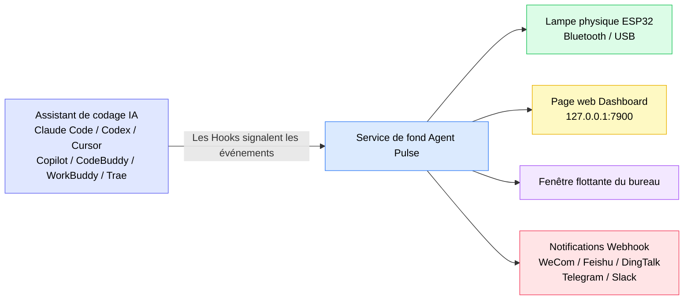
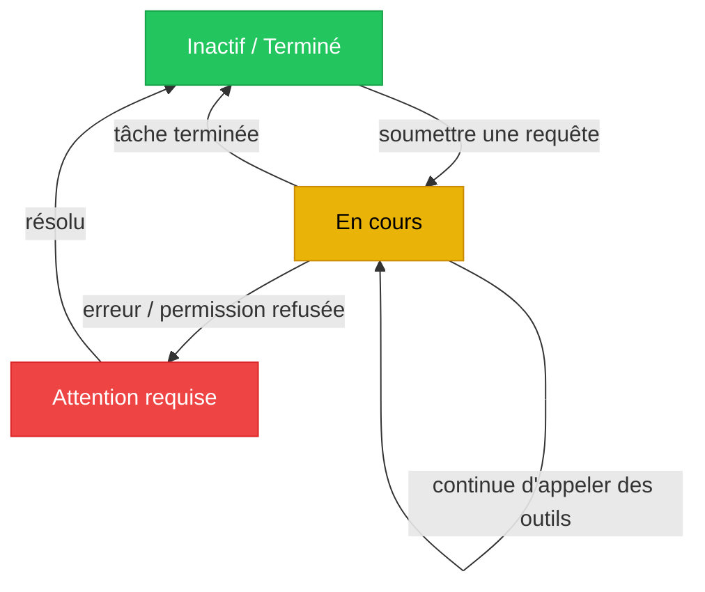
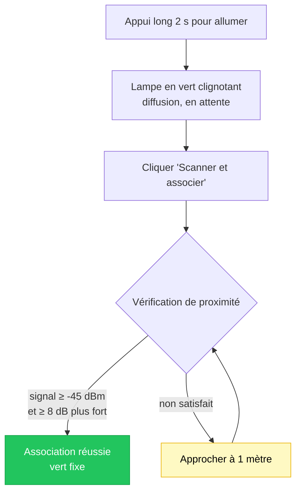
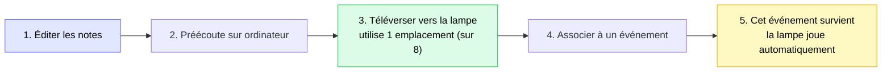
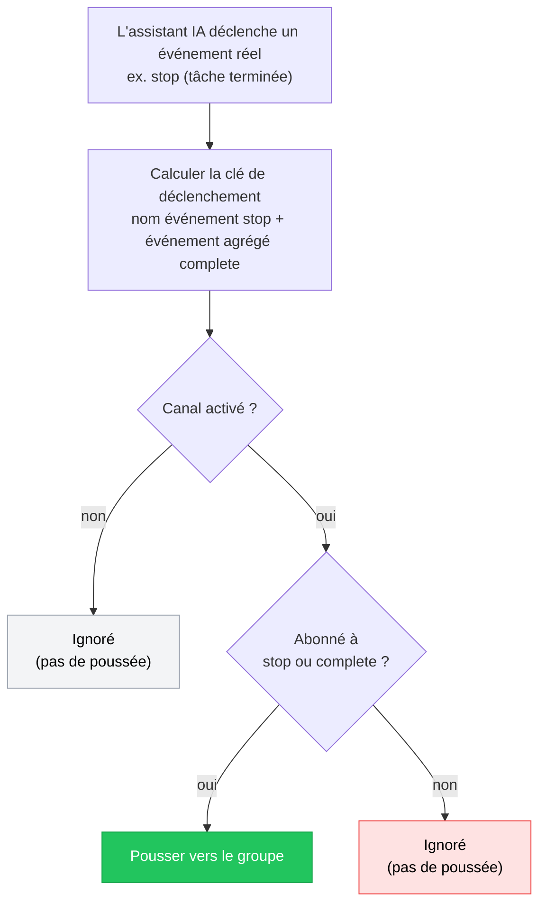

[English](README.md) | [한국어](./README.ko.md) | [日本語](./README.ja.md) | [简体中文](./README.zh-CN.md) | [繁體中文](./README.zh-TW.md) | [Español](./README.es.md) | [Français](./README.fr.md) | [Deutsch](./README.de.md)

# Tutoriel Agent Pulse

**Agent Pulse** est une lampe d'ambiance de bureau qui change de couleur en fonction de l'état de votre assistant de codage IA. Plus besoin de guetter le terminal : un coup d'œil à la lampe suffit pour savoir si une tâche est « en cours », « terminée » ou « en erreur ».

- **Version logicielle actuelle** : 0.4.8
- **Version du firmware de la lampe intégrée** : `0.1.24+25`
- **Historique des versions** : voir [CHANGELOG.md](CHANGELOG.md)

**Assistants de codage IA pris en charge** : Claude Code · Codex · WorkBuddy · CodeBuddy · Cursor · Copilot · Trae

### Comment ça marche ?



En une phrase : **l'assistant IA indique son état à Agent Pulse via les Hooks, et Agent Pulse distribue cet état à la lampe, à la page web, à la fenêtre flottante et à vos groupes de discussion.**

> ⚠️ Les **Hooks dans le schéma sont l'élément le plus critique**. Sans Hooks installés, Agent Pulse ne reçoit aucun événement et rien en aval ne réagit.

---

## Sommaire

- [1. Démarrage rapide (5 minutes)](#1-démarrage-rapide-5-minutes)
- [2. Comprendre les couleurs d'état](#2-comprendre-les-couleurs-détat)
- [3. Installation et mise à jour](#3-installation-et-mise-à-jour)
- [4. Connecter votre lampe](#4-connecter-votre-lampe)
- [5. Utilisation de la lampe matérielle](#5-utilisation-de-la-lampe-matérielle)
- [6. Interface de bureau](#6-interface-de-bureau)
- [7. Musique](#7-musique)
- [8. Notifications Webhook](#8-notifications-webhook)
- [9. Plusieurs assistants et plusieurs appareils](#9-plusieurs-assistants-et-plusieurs-appareils)
- [10. Données et confidentialité](#10-données-et-confidentialité)
- [11. FAQ](#11-faq)
- [12. Remarques et précautions](#12-remarques-et-précautions)

---

## 1. Démarrage rapide (5 minutes)

La première fois, suivez ces 4 étapes dans l'ordre et vous verrez la lampe changer de couleur selon vos tâches.

### Étape 1 : Installer le logiciel (selon votre système)

| Système | Téléchargement | Méthode d'installation |
| --- | --- | --- |
| Windows 10 1809+ / 11 | **[Télécharger `AgentPulseSetup-0.4.8.exe`](https://github.com/lzty634158-oss/agent-pulse-release/releases/latest)** | Double-cliquer pour installer ; démarre automatiquement à l'ouverture de session |
| macOS (Apple Silicon / Intel) | **[Télécharger `AgentPulse-0.4.8.pkg`](https://github.com/lzty634158-oss/agent-pulse-release/releases/latest)** | Double-cliquer et suivre l'assistant |
| Ubuntu (collecteur uniquement) | **[Télécharger le Collector](https://gitee.com/lzty634158/agent-pulse-linux-collector-release)** | Voir [Ubuntu Collector](#34-ubuntu-collector-optionnel) |

> **Téléchargement lent en Chine ?** Utilisez le miroir Gitee (contenu identique à GitHub) :
> - Installateurs Windows / macOS : <https://gitee.com/lzty634158/agent-pulse-release/releases>
> - Dépôt macOS séparé : <https://gitee.com/lzty634158/agent-pulse-macos-release>

Après l'installation, Agent Pulse tourne en arrière-plan et une icône apparaît dans la barre d'état / de menu.

### Étape 2 : Installer les Hooks

#### Note : une installation normale installe automatiquement les Hooks. S'ils ne fonctionnent pas, réinstallez-les.

Les Hooks sont le « messager » entre Agent Pulse et votre assistant IA. **Sans Hooks installés, la lampe ne réagira pas du tout.**

1. Ouvrez la page de configuration dans le navigateur : <http://127.0.0.1:4321/?lang=fr>
2. Repérez la carte de l'assistant IA utilisé (ex. Claude Code / Cursor / Trae)
3. Cliquez sur le bouton **« Installer les Hooks »** de la carte
4. Après le succès, la carte affiche « Installé »


> **Utilisateurs Codex** : après l'installation des Hooks, Codex les liste comme « projet non approuvé ». Vous devez trouver le paramètre « hooks » dans Codex et marquer le projet comme approuvé pour que les Hooks prennent réellement effet.

> **Utilisateurs Claude Code** : après l'installation des Hooks, si vous utilisez CCSwitch pour changer de modèle, CCSwitch peut écraser notre configuration Hook. Dans ce cas, cliquez simplement à nouveau sur « Installer » dans notre page de configuration.

> **Astuce** : lors de l'installation du logiciel, les Hooks ne sont installés automatiquement que pour les assistants IA **dont le fichier de configuration existe déjà**. Si vous installez un nouvel assistant plus tard, revenez à la page de configuration et installez manuellement une fois.

### Étape 3 : Allumer la lampe et la connecter

| Connexion | Scénario | Méthode |
| --- | --- | --- |
| **Bluetooth** (recommandé) | La lampe est sur le bureau, pas de fil voulu | Appui long 2 s sur le bouton pour allumer → la lampe passe en vert clignotant (en attente) → cliquez « Scanner et associer » sur la page de config → **approchez la lampe à 1 mètre de l'ordinateur** pour finaliser l'association **[Note : la communication de proximité associe automatiquement selon la force du signal > -45 dBm ; si introuvable, utilisez le menu d'appairage système]** |
| **USB** | Vouloir charger en l'utilisant, ou interférences Bluetooth fortes | Connectez la lampe à l'ordinateur avec un câble de données → sélectionnez le port série correspondant sur la page de config. **L'USB prime sur le Bluetooth : connecter l'USB coupe le Bluetooth, débrancher l'USB relance la diffusion Bluetooth** |

### Étape 4 : Vérifier le succès

Démarrez une nouvelle session et envoyez une requête à votre assistant IA (ex. « écris-moi une fonction »), puis observez la lampe :

- [ ] Après envoi, la lampe passe au **jaune** (travail en cours)
- [ ] Après achèvement, la lampe passe au **vert** (inactif / terminé)
- [ ] L'ouverture du Dashboard <http://127.0.0.1:7900> affiche un flux d'événements en direct

Si la lampe ne réagit pas, allez directement à [FAQ - La lampe ne s'allume pas ou couleur incorrecte](#la-lampe-ne-sallume-pas-ou-couleur-incorrecte).

---

## 2. Comprendre les couleurs d'état

Agent Pulse résume l'état de l'assistant IA en trois **états sémantiques**, chacun associé à une couleur :

| Couleur | Sémantique | Scénario typique |
| --- | --- | --- |
| Vert | Inactif / Terminé | Tâche finie, session terminée, en attente de votre prochaine commande |
| Jaune | En cours | Réflexion, appel d'outil, écriture de code |
| Rouge | Attention requise | Erreur, échec d'appel d'outil, permission refusée |

**Diagramme de transition d'état :**



### État sémantique vs couleur d'événement (changement important depuis 0.4.5)

Depuis la version 0.4.5, Agent Pulse adopte une conception **priorité à l'état sémantique** :

- Agent Pulse détermine d'abord « dans quel état » se trouve l'assistant IA (inactif / en cours / erreur), puis cet état décide de la couleur de la lampe ;
- Vous **pouvez aussi** assigner une couleur et un mode spécifiques à un seul événement (voir [6.2 Page de configuration](#62-page-de-configuration)) ; votre réglage a la priorité la plus haute.

**Exemple** : par défaut `stop` (tâche terminée) allume en vert ; mais si vous réglez `stop` manuellement sur « rouge + clignotant », alors à la fin de la tâche la lampe clignote en rouge — votre réglage l'emporte.

### Modes de la lampe

Outre la couleur, vous pouvez régler le **mode d'affichage** de la lampe :

| Mode | Effet | Idéal pour |
| --- | --- | --- |
| `solid` fixe | Allumé en continu | La plupart des scénarios |
| `blink` clignotant | Allumage/extinction périodique | Attirer l'attention (ex. erreur) |
| `breathe` respiration | Luminosité qui monte et descend | En attente, veille |
| Alterné | Rouge-jaune / jaune-vert / rouge-vert alternés | Distinguer des états composés |

---

## 3. Installation et mise à jour

### 3.1 Installateur Windows

**[Télécharger `AgentPulseSetup-0.4.8.exe`](https://github.com/lzty634158-oss/agent-pulse-release/releases/latest)**, double-cliquez pour exécuter et suivez les invites.

> Les utilisateurs en Chine peuvent utiliser Gitee : <https://gitee.com/lzty634158/agent-pulse-release/releases>

- Emplacement d'installation par défaut : `C:\Users\<votre nom>\AppData\Local\Programs\AgentPulse\`
- Démarrage automatique par défaut (le service de fond démarre après l'installation)
- Agent Pulse se trouve dans le menu Démarrer

> Si l'antivirus bloque l'installation, autorisez l'exécution (un installateur non signé déclenche une invite).

### 3.2 Installateur macOS

**[Télécharger `AgentPulse-0.4.8.pkg`](https://github.com/lzty634158-oss/agent-pulse-release/releases/latest)**, double-cliquez et suivez l'assistant. Ou installez via un prompt IA — la méthode par prompt IA est recommandée ; en cas d'échec, envoyez simplement l'erreur à l'IA pour la corriger.

> Les utilisateurs en Chine peuvent utiliser Gitee (Windows / macOS) : <https://gitee.com/lzty634158/agent-pulse-release/releases>
> Dépôt macOS séparé : <https://gitee.com/lzty634158/agent-pulse-macos-release>

Voir [macos-install/RELEASE_INSTALL.md](macos-install/RELEASE_INSTALL.md) pour l'installation détaillée macOS.

- **Choix d'architecture** : Apple Silicon (M) choisit `arm64`, Intel choisit `x86_64` ; en cas de doute, choisissez le paquet universel
- **Signature et notarisation** : le paquet est signé avec un Developer ID et notarié par Apple, il n'est normalement pas bloqué par Gatekeeper
- **Premier lancement** : des invites telles que « autoriser la connexion réseau » / « autoriser Bluetooth » peuvent apparaître — cliquez sur « Autoriser »

### 3.3 Mise à jour du programme

Agent Pulse vérifie automatiquement les mises à jour :

1. Vérifie d'abord sur **Gitee** (plus rapide en Chine)
2. Repli automatique sur **GitHub** si Gitee indisponible

La mise à jour se télécharge et s'applique automatiquement, et **votre configuration, votre musique et vos associations d'appareils sont conservées**.

**Mise à jour manuelle** : téléchargez le nouvel installateur et double-cliquez pour réinstaller par-dessus ; les données ne sont pas perdues non plus.

### 3.4 Ubuntu Collector (optionnel)

Si vous voulez que l'état de l'assistant IA sur un serveur Ubuntu soit aussi poussé vers le Dashboard, vous pouvez déployer le collecteur.

Téléchargez d'abord le paquet d'exécution : <https://gitee.com/lzty634158/agent-pulse-linux-collector-release>

```bash
# Exécuter sur la machine Ubuntu (sudo requis)
sudo bash deploy/ubuntu/collector/install.sh
```

Voir `deploy/ubuntu/collector/README.md` pour la configuration détaillée.

> C'est une **fonctionnalité optionnelle**. Si vous l'utilisez uniquement localement sur Windows / macOS, vous pouvez l'ignorer complètement.

---

## 4. Connecter votre lampe

### 4.1 Connexion Bluetooth (recommandée)

**Flux d'association initial :**

1. Appui long 2 s sur le bouton pour allumer
2. La lampe passe en **vert clignotant**, signifiant qu'elle attend une connexion
3. Ouvrez la page de configuration <http://127.0.0.1:4321/?lang=fr>
4. Cliquez sur « Scanner et associer »
5. Approchez la lampe à **1 mètre de l'ordinateur** et attendez la fin de l'association

**Pourquoi doit-elle être proche ?** Pour éviter de vous connecter à la lampe d'un collègue à côté, l'association applique une vérification « de proximité » :

- Chaque appareil est échantillonné 3 fois ; la force du signal (RSSI) doit être **≥ -45 dBm**
- Et le plus proche doit être au moins **≥ 8 dB** plus fort que les autres candidats

Après une association réussie, la lampe est mémorisée ; elle se reconnecte automatiquement à chaque allumage, pas besoin de réassocier.

**Flux d'association :**



**Icônes d'état Bluetooth dans l'interface** (affichées sur le Dashboard et la fenêtre flottante) :

| Icône | Signification |
| --- | --- |
|  | Bluetooth connecté |
|  | Connexion en cours |
|  | Recherche d'appareils |
|  | Bluetooth déconnecté |
|  | Erreur Bluetooth |

### 4.2 Connexion série USB

Utilisez un **câble de données** (pas un câble de charge simple) pour connecter la lampe à l'ordinateur.

- Le gestionnaire de périphériques Windows doit afficher **`ESP32-C3 USB JTAG/serial debug unit`**
- Sélectionnez simplement le port correspondant dans la liste des ports série de la page de configuration

> **L'USB prime sur le Bluetooth** : branché, il utilise l'USB ; débranché, il repasse automatiquement au Bluetooth.

### 4.3 Plusieurs lampes

Si vous avez plusieurs lampes Agent Pulse, vous pouvez spécifier « quelle lampe affiche l'état de quel projet » :

| Méthode de routage | Description |
| --- | --- |
| **Suivre le dernier** | Toutes les lampes affichent l'état de la tâche la plus récente |
| **Projet spécifié** | Épingler un projet à une lampe spécifique |
| **Assistant spécifié** | Épingler l'état d'un assistant IA à une lampe spécifique |

Configurez le routage multi-lampe sur la page « Gestion des appareils » du Dashboard.

---

## 5. Utilisation de la lampe matérielle

### 5.1 Opérations du bouton

| Opération | Durée | Effet |
| --- | --- | --- |
| **Appui long** | ≥ 2 secondes | Allumer / éteindre |
| **Appui court** | Appuyer et relâcher | Affiche la batterie actuelle (indice visuel) ; si non connecté, réactive aussi la diffusion Bluetooth |

### 5.2 Aide-mémoire des effets lumineux

Chaque « action » de la lampe vous indique ce qui se passe :

| Effet lumineux | Signification |
| --- | --- |
| 🟢 **Vert clignotant** | Bluetooth activé, en diffusion, en attente de connexion |
| 🟢 **Vert fixe** | Bluetooth connecté (hôte connecté) |
| 🟢 **Retour au vert clignotant** | Bluetooth déconnecté, l'appareil relance la diffusion en attente |
| 🔴→🟢→🟡→éteint (boucle 3 fois) | **Clignotement d'identification** : répond à la commande « identifier l'appareil » de l'hôte, boucle rapide rouge→vert→jaune→éteint 3 fois (200 ms chacun) puis restaure l'état, pour vous aider à la retrouver parmi plusieurs lampes |
| 🔴→🟢→🟡 (1 seconde chacun) | **Animation de connexion** : retour à la connexion réussie, rouge→vert→jaune allumés 1 seconde chacun puis restauration |
| 🔴 **Rouge clignotant** | Expiration de la diffusion Bluetooth (pas de connexion en 60 s), arrêt de la diffusion |

> ⚠️ **Note importante sur la lumière bleue** : les appareils physiques actuels HW v2 / ESP32-C3-next **n'ont que trois LED indépendantes — rouge, jaune, vert — et pas de LED bleue**, donc **ils ne s'allument ni en bleu ni en violet**.
> L'**icône Bluetooth bleue** dans le Dashboard et la fenêtre flottante indique uniquement que l'ordinateur scanne ou se connecte en Bluetooth — c'est un affichage d'état de l'interface côté ordinateur, **pas que l'appareil s'allumera en bleu**. Ne mappez pas l'icône bleue de l'interface à la couleur réelle de la lampe.

### 5.3 Batterie et son

**Indicateur de batterie** (vérifiez via un appui court) :

Après un appui court, la lampe utilise le **nombre de LED allumées** pour indiquer le niveau, pendant environ 2 secondes, puis restaure son état :

| Tension | Effet lumineux (LED allumées) | Description |
| --- | --- | --- |
| ≥ 4,00V | 🔴🟢🟡 rouge+vert+jaune **les 3 allumées** | Suffisant |
| 3,70V ~ 4,00V | 🔴🟡 rouge+jaune **2 allumées** | Moyen |
| < 3,70V | 🔴 **seule la rouge allumée** | Faible, recharge recommandée |

> Comme il n'y a pas de LED bleue, la batterie est indiquée par « combien de LED sont allumées » (3 = plein, 2 = moyen, 1 = faible), pas par différentes couleurs.

**Protection automatique** : si la tension descend sous 3,20V et reste là 60 secondes, la lampe s'éteint automatiquement pour éviter la décharge profonde de la batterie.

**Bascule son** : réglée dans « Luminosité et son » de la page de configuration. **Désactivée par défaut** ; activez manuellement si vous voulez un signal sonore.

### 5.4 Mise à jour du firmware

Quand un nouveau firmware de lampe est disponible, vous pouvez le mettre à jour sur la page de configuration.

**Veuillez confirmer avant la mise à jour (ne pas respecter ces points provoque l'échec) :**

1. **L'ID matériel doit être `agentpulse-esp32c3-next`** — les autres matériels ne sont pas pris en charge
2. **Ne téléversez que des fichiers `.ino.bin`** — n'téléversez pas `.bin` / `.elf` / `.map` / `bootloader` / `partitions` etc.
3. **L'appareil doit apparaître comme `ESP32-C3 USB JTAG/serial debug unit`**
4. **Gardez l'alimentation et la connexion stables** — ne débranchez pas ni n'éteignez pendant la mise à jour

**Effets lumineux pendant la mise à jour :**

| Effet lumineux | Étape |
| --- | --- |
| Jaune fixe | Réception et vérification du nouveau firmware (reste jaune fixe pendant toute la mise à jour) |
| Lampe éteinte | Redémarrage (que ce soit en succès ou en échec) |

> **Échec de la mise à jour ?** Pas de panique — l'appareil utilise une conception à double partition ; en cas d'échec, il revient automatiquement au firmware précédent et restaure l'effet lumineux d'origine, et fonctionne à nouveau après redémarrage.

---

## 6. Interface de bureau

Agent Pulse fournit deux interfaces web :

| Interface | Adresse | Usage |
| --- | --- | --- |
| **Dashboard** | <http://127.0.0.1:7900> | Voir l'état en direct et le flux d'événements, gérer les appareils |
| **Page de configuration** | <http://127.0.0.1:4321/?lang=fr> | Tous les réglages sont ici |

### 6.1 Dashboard

Ouvrez <http://127.0.0.1:7900> pour voir :

<!-- Emplacement capture : après avoir placé dashboard.png dans docs/screenshots/, décommentez la ligne ci-dessous

-->

- **Panneau d'événements en direct** : chaque événement de l'assistant IA (soumission de prompt, appel d'outil, tâche terminée…) défile par ordre chronologique
- **État actuel** : quelle couleur, quel mode, de quel projet / assistant
- **Format de la barre d'état** : `effet lumineux[mode] + couleur + nom du projet + nom de l'assistant + durée`, ex. :
  ```
  fixe vert  my-project  claude-code  en cours 00:02:15
  ```
- **Gestion des appareils** : voir l'état des multi-lampe et configurer le routage

### 6.2 Page de configuration

Ouvrez <http://127.0.0.1:4321/?lang=fr>, le point d'entrée de tous les réglages.


<!-- Emplacement capture : après avoir enregistré la capture de la section « Événements et schéma lumineux » sous config-events-section.png, décommentez la ligne ci-dessous

-->

#### Notifications et détection de blocage

| Réglage | Défaut | Description |
| --- | --- | --- |
| Notification bureau | Désactivée | Afficher une notification système au changement d'état |
| Notifier à la fin de tâche | Activée | Notifier à la fin de tâche (vert) |
| Notifier en cas d'erreur | Activée | Notifier en cas d'erreur (rouge) |
| Notifier si possible bloqué | Activée | Notifier si le jaune persiste au-delà du temps défini |
| Temps de détection de blocage | 5 minutes | Durée de persistance du jaune pour compter comme « possiblement bloqué » |

#### Événements et schéma lumineux

C'est la partie la plus utilisée — vous pouvez **régler la couleur, le mode et la lecture de musique de chaque événement individuellement**.

**Événements pris en charge (légèrement variables selon l'assistant IA) :**

| Événement | Signification |
| --- | --- |
| `session-start` | Début de session |
| `session-end` | Fin de session |
| `user-prompt-submit` | Soumission du prompt utilisateur |
| `pre-tool-use` | Avant l'appel d'outil |
| `post-tool-use` | Après l'appel d'outil |
| `post-tool-use-failure` | Échec d'appel d'outil |
| `permission-request` | Demande de permission |
| `permission-denied` | Permission refusée |
| `notification` | Notification |
| `stop` | Tâche terminée |
| `stop-failure` | Tâche échouée |
| `error-occurred` | Erreur survenue |
| `elicitation` | Demande d'informations complémentaires |

**Événements pris en charge par chaque assistant IA :**

| Assistant IA | Événements pris en charge |
| --- | --- |
| **Claude Code** | début session, soumission prompt, avant/après outil, demande permission, permission refusée, notification, tâche terminée, tâche échouée |
| **Codex** | début session, soumission prompt, avant/après outil, demande permission, notification, tâche terminée |
| **WorkBuddy** | début session, soumission prompt, avant/après outil, notification, tâche terminée |
| **CodeBuddy** | début session, soumission prompt, avant/après outil, échec outil, demande permission, notification, tâche échouée, tâche terminée, fin session |
| **Cursor** | début session, soumission prompt, avant/après outil, échec outil, demande permission, notification, tâche échouée, tâche terminée |
| **Copilot** | début session, soumission prompt, après outil, tâche terminée, erreur survenue, fin session |
| **Trae** | début session, soumission prompt, avant/après outil, demande permission, notification, tâche terminée |

> La page de configuration n'affiche que les événements **réellement déclenchés par votre assistant actuel**, évitant de configurer des événements qui n'arriveront jamais.

**Porte de sécurité (rappel)** : Trae, WorkBuddy, CodeBuddy n'ont pas de fenêtre de permission native. Sur la page de configuration, passez à l'onglet de l'assistant correspondant et réglez la couleur de la ligne d'événement **« Demande de permission » (permission-request)** sur autre chose que « Désactivé » pour activer la porte de sécurité (rouge + clignotant par défaut). Alors **chaque appel d'outil demandera confirmation à l'utilisateur et allumera la lumière rouge**, quel que soit le commandement exécuté ; aucune liste de commandes dangereuses à maintenir. Régler sur « Désactivé » désactive la porte.

**Configurer par assistant** : passez à l'onglet de l'assistant correspondant pour régler les couleurs d'événements pour lui seul ; l'onglet « Défaut » sert de repli global pour tous les assistants.

#### Luminosité et son

| Réglage | Défaut | Description |
| --- | --- | --- |
| Luminosité verte | 30 % | Les trois couleurs peuvent être réglées séparément |
| Luminosité jaune | 30 % | |
| Luminosité rouge | 30 % | |
| Période de clignotement | 1000 ms | Durée d'un cycle de clignotement complet |
| Période de respiration | 2000 ms | Durée d'une respiration |
| Activer le son | Désactivé | Lire un signal sonore ou non |

#### Gestion des Hooks

Chaque carte d'assistant IA a un bouton **« Installer les Hooks »** ; après installation la carte affiche « Installé ». Si vous changez d'assistant ou le réinstallez, cliquez simplement pour réinstaller.

### 6.3 Fenêtre flottante

Lorsqu'elle est activée, une petite fenêtre semi-transparente apparaît sur le bureau, affichant en direct la couleur d'état actuelle et le nom du projet, sans ouvrir de navigateur.


---

## 7. Musique

Agent Pulse peut jouer des signaux sonores lors de certains événements, prenant en charge à la fois les **sons intégrés** et la **musique personnalisée**.

### 7.1 Sons intégrés

La lampe intègre 5 sons intégrés, prêts à l'emploi sans occuper de stockage :

| # | Nom |
| --- | --- |
| 1 | Cue ascendant |
| 2 | Cue double-clic |
| 3 | Cue de fin |
| 4 | Avertissement descendant |
| 5 | Cue d'écho |

### 7.2 Éditeur de musique personnalisée

Dans la section musique de la page de configuration, vous pouvez composer vos propres mélodies.

<!-- Emplacement capture : après avoir placé music-editor.png dans docs/screenshots/, décommentez la ligne ci-dessous

-->

**Limites des paramètres de note :**

| Paramètre | Plage | Description |
| --- | --- | --- |
| Fréquence | 0 ~ 4000 Hz | **0 signifie une pause (silence)** |
| Durée | 20 ~ 2000 ms | Durée d'une seule note |
| Intervalle `gapMs` | 0 ~ 500 ms (défaut 10 ms) | Silence entre les notes |

**Limites de la mélodie entière :**

- Au plus **64 notes**
- Durée totale inférieure à **30 secondes**
- Nom au plus **40 caractères**

> **Qu'est-ce que `gapMs` (intervalle) ?** C'est la « pause » entre les notes. Par exemple, si vous voulez que deux notes sonnent séparées, définissez un intervalle sur la note précédente. Le firmware implémente cette pause avec une « note silencieuse à fréquence 0 ».

### 7.3 Téléversement vers la lampe

**Flux global :**



La musique personnalisée doit être téléversée vers la lampe pour jouer :

1. Composez la mélodie dans la section musique de la page de configuration
2. Cliquez **« Téléverser vers l'appareil »**
3. Attendez la fin du téléversement

**Règles de stockage :**

| Élément | Description |
| --- | --- |
| Nombre d'emplacements | **8** (numérotés 128 ~ 255) |
| Capacité par emplacement | **512 octets** |
| Allocation | Alloue automatiquement un emplacement libre ; quand plein, supprimez les mélodies inutilisées |
| Retéléversement | Une mélodie déjà téléversée **réutilise son emplacement d'origine**, ne saute pas |

> **Emplacements pleins ?** Vous verrez « 8 emplacements de musique personnalisée pleins » au téléversement. Supprimez les mélodies inutilisées sur la page de configuration pour libérer de l'espace.

### 7.4 Associer à un événement

Après avoir composé et téléversé la musique, associez-la à un événement :

1. Allez dans « Événements et schéma lumineux »
2. Trouvez l'événement cible (ex. `session-end` fin de session)
3. Sélectionnez votre mélodie dans le menu déroulant « Musique »
4. Choisissez « Jouer une fois » ou « Répéter »
5. Cliquez sur Enregistrer

Ensuite, à chaque fois que cet événement se produit, la lampe joue la mélodie.

### 7.5 Préécoute, suppression et lecture

| Opération | Méthode |
| --- | --- |
| **Préécoute** | Cliquez « Préécoute » dans l'éditeur de musique ; préécoute sur l'ordinateur (pas via la lampe) |
| **Supprimer** | Cliquez « Supprimer » dans la liste de musique ; supprime à la fois de l'ordinateur et de l'emplacement de la lampe |
| **Lire depuis la lampe** | La musique déjà sur la lampe peut être listée sur la page de configuration ; notez que **le firmware ne stocke que les données de notes brutes, pas le nom de la mélodie** |

### 7.6 FAQ Musique

| Symptôme | Cause et solution |
| --- | --- |
| Aucun son du tout | Vérifiez si « Activer le son » sur la page de configuration est activé (**désactivé par défaut**) |
| Les notes se chevauchent, pas d'intervalle audible | Définissez un intervalle `gapMs` sur les notes (10 ms par défaut peut être trop court) |
| Échec de téléversement, emplacement plein | Supprimez les mélodies inutilisées pour libérer un emplacement |
| La mélodie n'a pas de nom après avoir déplacé la lampe sur un autre ordinateur | Le nom de la mélodie n'existe que sur l'ordinateur ; le firmware de la lampe ne stocke que les données de notes — c'est normal |

---

## 8. Notifications Webhook

En plus de changer la couleur de la lampe, Agent Pulse peut aussi pousser des événements **vers vos groupes de discussion** (WeCom, Feishu, DingTalk, Telegram, Slack, etc.).

### 8.1 Quelles plateformes sont prises en charge

| Plateforme | Description |
| --- | --- |
| **WeCom** | Webhook de bot de groupe |
| **Feishu** | Bot personnalisé (prise en charge de la vérification de signature) |
| **DingTalk** | Bot personnalisé (prise en charge de l'URL signée) |
| **Telegram** | Bot API |
| **Slack** | Incoming Webhook |
| **Personnalisé** | Tout point de terminaison HTTPS acceptant du JSON |

### 8.2 Ajouter un canal de notification

<!-- Emplacement capture : après avoir placé webhook-channels.png dans docs/screenshots/, décommentez la ligne ci-dessous

(le config-full.png actuel contient déjà la section Webhook complète ; une capture dédiée plus ciblée peut être ajoutée plus tard)
-->

1. Ouvrez page de configuration → section **Notifications Webhook**
2. Cliquez sur « Ajouter un canal »
3. Remplissez :
   - **Nom** : une note pour vous, ex. « Groupe projet »
   - **Plateforme** : l'une du tableau ci-dessus
   - **URL Webhook** : obtenue depuis les paramètres « bot de groupe » de la plateforme
   - **Secret** (Feishu/DingTalk en ont besoin) : le secret de signature dans les paramètres de sécurité du bot
   - **Activé** : **doit être coché**, sinon aucune poussée
4. Cochez les **événements** que vous voulez recevoir
5. Cliquez sur Enregistrer

> **L'URL doit être en HTTPS**, sinon l'enregistrement est refusé.

### 8.3 Abonnement aux événements (l'étape la plus importante)

Chaque canal peut cocher individuellement les événements à recevoir. Les événements sont de deux types :

**Événements agrégés (recommandés)** — couvrent une classe de scénarios, plus sereins :

| Événement agrégé | Déclencheur |
| --- | --- |
| `complete` | Tâche terminée **ou** fin de session (vert) |
| `error` | Erreur survenue (rouge) |
| `stuck` | Le jaune persiste au-delà du « temps de détection de blocage » |

**Événements bruts** — correspondance exacte à un seul événement, ex. `stop`, `session-end`, `error-occurred`, etc. (voir [tableau des événements](#événements-et-schéma-lumineux)).

> **Astuce** : pour recevoir « tâche terminée et fin de session », cochez **`complete`** — il couvre à la fois `stop` et `session-end`.
> Si vous n'avez coché que le brut `session-end`, alors « tâche terminée (`stop`) » **ne sera pas** poussée.

**Comment les événements sont-ils mis en correspondance ?** (comprendre ce diagramme permet de diagnostiquer soi-même « pourquoi pas de poussée ») :



> Notez les deux boutons : **« Tester »** ignore la logique de correspondance ci-dessus et envoie directement (donc cela fonctionne toujours) ;
> **« Simuler la poussée »** suit le flux de correspondance complet et rapporte « quel canal a correspondance, lequel a été ignoré et pourquoi ». Voir [8.4](#84-tester-et-simuler-la-poussée).

### 8.4 Tester et « Simuler la poussée »

La page de configuration fournit deux outils de dépannage :

| Bouton | Usage | Quand l'utiliser |
| --- | --- | --- |
| **Tester** | Envoie un message de test directement au canal, **sans vérifier l'abonnement aux événements** | Vérifier que l'URL et le secret sont corrects |
| **Simuler la poussée** | Suit **exactement la même logique de correspondance qu'un événement réel**, et rapporte « quel canal a correspondance, lequel a été ignoré et pourquoi » | Vérifier que l'abonnement aux événements est correctement apparié |

**Flux de dépannage recommandé :**

1. Cliquez d'abord sur « Tester » → le message arrive dans le groupe, ce qui signifie que l'URL et le canal sont corrects
2. Cliquez ensuite sur « Simuler la poussée » → lisez le retour :
   - Affiche « correspondance 1/1, poussée vers "Groupe projet" » → la configuration est correcte, le groupe recevra
   - Affiche « ignoré "Groupe projet" (non abonné à stop/complete) » → les **événements ne sont pas correctement cochés**, retournez cocher les événements correspondants puis enregistrez

### 8.5 FAQ Webhook

| Symptôme | Cause et solution |
| --- | --- |
| **Le test envoie, mais les événements réels ne poussent pas** | Presque toujours l'une de ces deux raisons : <br>① Le « Activé » du canal n'est pas coché (cochez-le pour les nouveaux canaux) <br>② L'abonnement aux événements n'est pas correctement coché (voir [8.3](#83-abonnement-aux-événements-létape-la-plus-importante)). « Simuler la poussée » localise instantanément |
| **Après enregistrement et rafraîchissement, l'interface revient en anglais** | Corrigé (0.4.6). Sur les anciennes versions, ajoutez `?lang=fr` dans la barre d'adresse pour ouvrir la page de configuration |
| **Simuler la poussée affiche « échec de la simulation »** | La requête n'a pas atteint le nouveau backend. Veuillez **redémarrer Agent Pulse** (quittez complètement l'icône de la barre d'état puis démarrez), et assurez-vous que vous utilisez 0.4.8 |
| **Les boutons test/supprimer/simuler ne réagissent pas** | Mettez à niveau vers 0.4.8 ; les anciennes versions ont un problème de script d'interface |
| **L'invite indique URL invalide** | L'adresse Webhook doit commencer par `https://` |
| **Feishu/DingTalk ne reçoivent pas** | Vérifiez que le secret est correct ; Feishu et DingTalk utilisent des algorithmes de signature différents, assurez-vous du bon type de plateforme |

---

## 9. Plusieurs assistants et plusieurs appareils

### 9.1 Assistants IA pris en charge

Agent Pulse prend en charge 6 assistants de codage IA et vous pouvez **en installer plusieurs simultanément**, sans interférence :

| Assistant | Onglet de configuration |
| --- | --- |
| Claude Code | `claude` |
| Codex | `codex` |
| WorkBuddy | `workbuddy` |
| CodeBuddy | `codebuddy` |
| Cursor | `cursor` |
| Copilot | `copilot` |
| Trae | `trae` |

### 9.2 Configuration indépendante par assistant

Passez à l'onglet de l'assistant correspondant pour configurer individuellement :

- Couleur et mode de la lampe par événement
- Musique jouée par événement
- Paramètres de détection de blocage, etc.

L'onglet « Défaut » sert de repli global : quand un assistant n'a pas de configuration individuelle, il hérite des réglages « Défaut ».

### 9.3 Plusieurs lampes

Voir [4.3 Plusieurs lampes](#43-plusieurs-lampes). Configurez les règles de routage dans la « Gestion des appareils » du Dashboard.

---

## 10. Données et confidentialité

### Répertoires locaux

Les données d'Agent Pulse sont **toutes enregistrées sur votre propre ordinateur** et ne sont téléversées sur aucun serveur.

| Système | Répertoire de données |
| --- | --- |
| Windows | `%LOCALAPPDATA%\AgentPulse\` |
| macOS | `~/Library/Application Support/AgentPulse/` |

**Contenu du répertoire :**

| Fichier / dossier | Description |
| --- | --- |
| `config.json` | Toute votre configuration (événements, luminosité, canaux Webhook, etc.) |
| `music/` | Fichiers source de votre musique personnalisée |
| `devices.json` | Informations sur les lampes associées |

### La réinstallation / désinstallation conserve-t-elle les données ?

**Depuis 0.4.5, la réinstallation et la désinstallation conservent les données utilisateur.**

- **Conservé** : `config.json`, `music/`, `devices.json` et autres données personnelles
- **Supprimé** : fichiers programmes et service de fond

C'est-à-dire qu'après une mise à jour ou une réinstallation, tous les événements, la musique, les canaux Webhook et les associations d'appareils **que vous aviez configurés sont toujours là** — pas besoin de reconfigurer.

> Si vous voulez **effacer complètement toutes les données**, vous devez supprimer manuellement le répertoire de données ci-dessus.

---

## 11. FAQ

### Dashboard ne s'ouvre pas

1. Confirmez qu'Agent Pulse est en cours d'exécution (icône de la barre d'état / de menu)
2. Quittez complètement Agent Pulse puis redémarrez
3. Confirmez que le navigateur visite <http://127.0.0.1:7900>
4. Si le port 7900 est occupé par un autre programme, redémarrez l'ordinateur et réessayez

### La lampe ne s'allume pas ou couleur incorrecte

Dépannage dans l'ordre :

1. **Les Hooks sont-ils installés ?** → Ouvrez la page de configuration <http://127.0.0.1:4321/?lang=fr>, confirmez que la carte de l'assistant correspondant affiche « Installé ». **C'est la cause la plus courante.**
2. **La lampe est-elle connectée ?** → Vérifiez l'effet lumineux : vert clignotant = en attente ; vert fixe = connecté
3. **Avez-vous modifié les couleurs d'événement ?** → Si vous avez défini manuellement une couleur pour un événement, votre réglage l'emporte (voir [État sémantique vs couleur d'événement](#état-sémantique-vs-couleur-dévénement-changement-important-depuis-045))
4. **La luminosité est-elle à 0 ?** → Vérifiez le réglage de luminosité sur la page de configuration
5. **Utilisateurs Codex** → Confirmez que vous avez marqué le projet comme « approuvé » dans Codex

### La musique ne joue pas

1. Vérifiez si « Activer le son » sur la page de configuration est activé (**désactivé par défaut**)
2. Vérifiez si l'événement est associé à une musique (le numéro de musique ne peut pas être 0)
3. La musique personnalisée est-elle « Téléversée vers l'appareil »
4. Cliquez sur « Préécoute » pour confirmer que la mélodie elle-même est correcte

### Webhook ne pousse pas

Voir [8.5 FAQ Webhook](#85-faq-webhook).

### Bluetooth ne se connecte pas

1. Approchez la lampe à **1 mètre de l'ordinateur** pour associer (la vérification de proximité exige un signal ≥ -45 dBm et ≥ 8 dB plus fort que les autres appareils)
2. Appui court sur le bouton de la lampe pour réactiver la diffusion Bluetooth (vert clignotant)
3. Dans les paramètres Bluetooth de l'ordinateur, supprimez l'ancienne association Agent Pulse et réassociez
4. Si de nombreux appareils Bluetooth environnants causent des interférences, utilisez la **connexion USB** (priorité plus élevée, plus stable)

### USB ne trouve pas l'appareil

1. Confirmez que vous utilisez un **câble de données**, pas un câble de charge simple
2. Le gestionnaire de périphériques Windows doit afficher **`ESP32-C3 USB JTAG/serial debug unit`**
3. S'il affiche « Périphérique inconnu », vous devrez peut-être installer un pilote
4. Essayez un autre port USB (certains panneaux avant manquent de puissance)

### Notifications trop fréquentes

1. Augmentez le « temps de détection de blocage » (5 minutes par défaut)
2. Désactivez les éléments de notification inutiles (ex. désactivez « notifier si possible bloqué »)
3. Dans le canal Webhook, ne cochez que les événements qui vous intéressent vraiment

---

## 12. Remarques et précautions

- **Mise à jour du firmware avec prudence** : ne téléversez que des fichiers `.ino.bin`, l'ID matériel doit être `agentpulse-esp32c3-next` ; pendant la mise à jour **ne débranchez pas ni n'éteignez pas**. Voir [5.4 Mise à jour du firmware](#54-mise-à-jour-du-firmware).
- **Protection batterie faible** : si la tension descend sous 3,20V pendant 60 secondes, la lampe s'éteint automatiquement — c'est pour protéger la batterie, pas une panne.
- **La mise à niveau OTA exige une batterie suffisante** : la mise à niveau du firmware est refusée quand la tension est inférieure à 3,60V ; veuillez recharger d'abord.
- **Les Hooks doivent être installés** : sans Hooks, Agent Pulse ne reçoit aucun événement et la lampe ne réagira pas du tout.
- **Webhook nécessite HTTPS** : pour la sécurité, seules les adresses Webhook commençant par `https://` sont acceptées.
- **Les emplacements de musique personnalisée sont limités** : la lampe n'a que 8 emplacements de musique personnalisée ; veuillez nettoyer régulièrement les mélodies inutilisées.

---

## Plus de ressources

### Récapitulatif des téléchargements

| Usage | Lien |
| --- | --- |
| **Installateur Windows / macOS** (GitHub) | <https://github.com/lzty634158-oss/agent-pulse-release/releases/latest> |
| **Installateur Windows / macOS** (miroir Gitee Chine) | <https://gitee.com/lzty634158/agent-pulse-release/releases> |
| **Dépôt macOS séparé** | <https://gitee.com/lzty634158/agent-pulse-macos-release> |
| **Ubuntu Collector** | <https://gitee.com/lzty634158/agent-pulse-linux-collector-release> |

### Documentation

- **Historique des versions** : [CHANGELOG.md](CHANGELOG.md)
- **Guide de mise à niveau du firmware** : [firmware/README.md](firmware/README.md)
- **Guide d'installation macOS** : [macos-install/RELEASE_INSTALL.md](macos-install/RELEASE_INSTALL.md)
- **Outil de pont Bluetooth** : [ble-bridge/](ble-bridge/)
- **Guide de déploiement Ubuntu** : [deploy/ubuntu/README.md](deploy/ubuntu/README.md)
