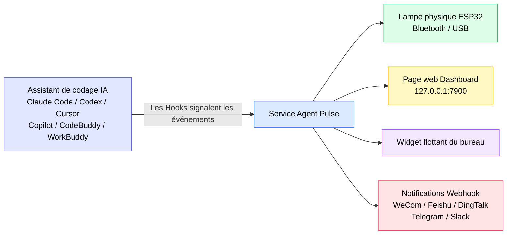
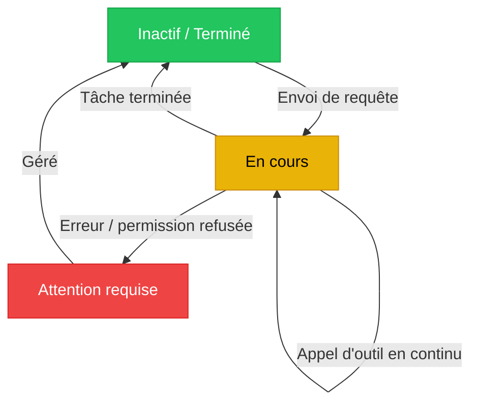
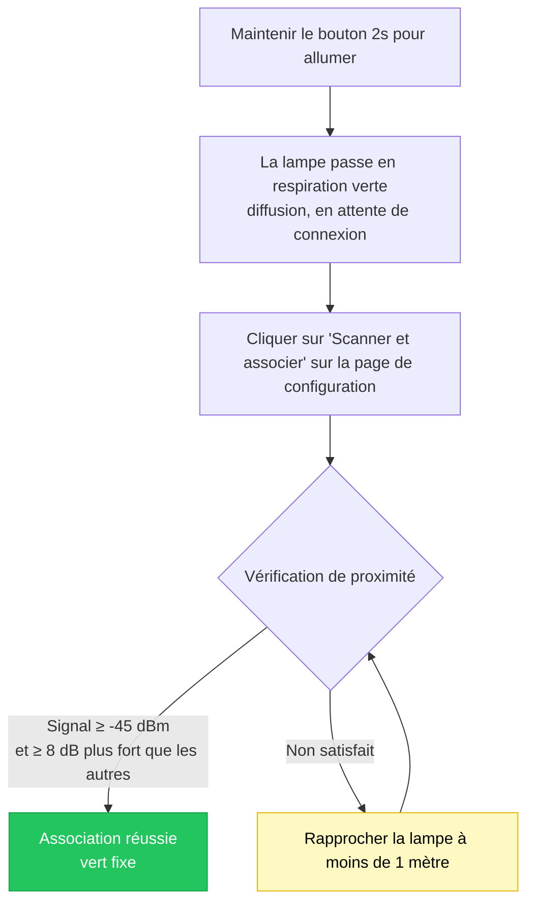
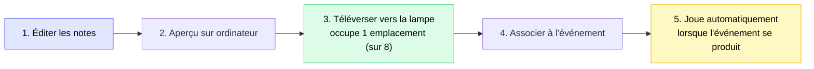
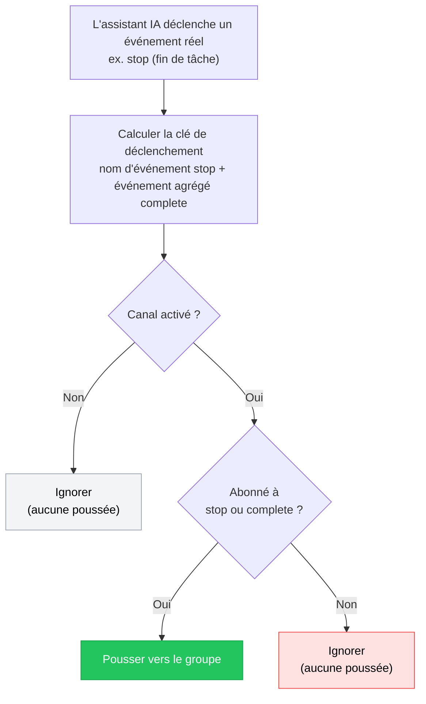

[简体中文](./README.zh-CN.md) | [English](./README.md) | [日本語](./README.ja.md) | [繁體中文](./README.zh-TW.md) | [한국어](./README.ko.md) | **Français** | [Deutsch](./README.de.md) | [Español](./README.es.md)

# Guide de l'utilisateur Agent Pulse

**Agent Pulse** est une lampe d'ambiance de bureau qui change de couleur selon l'état de votre assistant de codage IA. Inutile de fixer le terminal en attendant le résultat — un coup d'œil à la lampe suffit pour savoir si une tâche est « en cours », « terminée » ou en « erreur ».

- **Version logicielle actuelle** : 0.4.6
- **Version du micrologiciel de la lampe matérielle intégrée** : `0.1.24+25`
- **Journal des modifications** : voir [CHANGELOG.md](CHANGELOG.md)

**Assistants de codage IA pris en charge** : Claude Code · Codex · WorkBuddy · CodeBuddy · Cursor · Copilot

### Comment ça marche ?



En une phrase : **l'assistant IA indique son état à Agent Pulse via les Hooks, et Agent Pulse distribue cet état à la lampe, à la page web, au widget flottant et aux groupes de discussion.**

> ⚠️ **Les Hooks sont la partie la plus critique** du schéma. Sans Hooks installés, Agent Pulse ne reçoit aucun événement et rien ne réagira ensuite.

---

## Table des matières

- [1. Prise en main rapide (5 minutes)](#1-prise-en-main-rapide-5-minutes)
- [2. Signification des couleurs d'état](#2-signification-des-couleurs-détat)
- [3. Installation et mise à jour](#3-installation-et-mise-à-jour)
- [4. Connecter votre lampe](#4-connecter-votre-lampe)
- [5. Utilisation de la lampe matérielle](#5-utilisation-de-la-lampe-matérielle)
- [6. Interface de bureau](#6-interface-de-bureau)
- [7. Musique](#7-musique)
- [8. Notifications Webhook](#8-notifications-webhook)
- [9. Plusieurs assistants et plusieurs appareils](#9-plusieurs-assistants-et-plusieurs-appareils)
- [10. Données et confidentialité](#10-données-et-confidentialité)
- [11. FAQ](#11-faq)
- [12. Remarques](#12-remarques)

---

## 1. Prise en main rapide (5 minutes)

Première utilisation : effectuez ces 4 étapes dans l'ordre pour voir la lampe changer de couleur selon les tâches.

### Étape 1 : Installer le logiciel (selon votre système)

| Système | Téléchargement | Installation |
| --- | --- | --- |
| Windows 10 1809+ / 11 | **[Télécharger `AgentPulseSetup-0.4.6.exe`](https://github.com/lzty634158-oss/agent-pulse-release/releases/latest)** | Double-cliquer pour installer ; démarre automatiquement au boot après l'installation |
| macOS (Apple Silicon / Intel) | **[Télécharger `AgentPulse-0.4.6.pkg`](https://github.com/lzty634158-oss/agent-pulse-release/releases/latest)** | Double-cliquer et suivre les instructions |
| Ubuntu (collecteur uniquement) | **[Télécharger le collecteur](https://gitee.com/lzty634158/agent-pulse-linux-collector-release)** | Voir [Collecteur Ubuntu](#34-collecteur-ubuntu-optionnel) |

> **Téléchargement lent en Chine ?** Utilisez le miroir Gitee (contenu identique à GitHub) :
> - Installateurs Windows / macOS : <https://gitee.com/lzty634158/agent-pulse-release/releases>
> - macOS dispose également d'un dépôt séparé : <https://gitee.com/lzty634158/agent-pulse-macos-release>

Après l'installation, Agent Pulse s'exécute en arrière-plan et une icône apparaît dans la zone de notification / la barre de menu.

### Étape 2 : Installer les Hooks

#### Remarque : les Hooks sont installés automatiquement lors d'une installation normale. S'ils ne fonctionnent pas, réinstallez-les.

Les Hooks sont le « messager » entre Agent Pulse et votre assistant IA. **Sans Hooks installés, la lampe ne réagira pas du tout.**

1. Ouvrez la page de configuration dans votre navigateur : <http://127.0.0.1:4321/?lang=fr>
2. Repérez la carte de l'assistant IA que vous utilisez (par ex. Claude Code / Cursor)
3. Cliquez sur le bouton **« Installer les Hooks »** de la carte
4. Après une installation réussie, la carte affiche « Installé »


> **Note pour les utilisateurs de Codex** : après l'installation des Hooks, Codex les liste comme « élément non fiable ». Vous devez marquer le projet comme fiable dans Codex pour que les Hooks prennent réellement effet.

> **Astuce** : lors de l'installation du logiciel, les Hooks ne sont installés automatiquement que pour les assistants IA qui **disposent déjà d'un fichier de configuration**. Si vous ajoutez ultérieurement un nouvel assistant IA, retournez simplement sur la page de configuration et installez manuellement une fois.

### Étape 3 : Allumer la lampe et se connecter

| Méthode de connexion | Cas d'usage | Procédure |
| --- | --- | --- |
| **Bluetooth** (recommandé) | La lampe est posée sur le bureau, sans câble | Maintenir le bouton 2 secondes pour l'allumer → la lampe passe en respiration verte (en attente de connexion) → cliquez sur « Scanner et associer » sur la page de configuration → **gardez la lampe à moins de 1 mètre de l'ordinateur** pour terminer l'association **[Remarque : la communication de proximité utilise une force de signal > -45dBm pour se connecter et associer automatiquement la lampe ; si elle est introuvable, vous pouvez effectuer l'appairage via le menu d'appairage système]** |
| **USB** | Vous voulez charger en l'utilisant, ou interférences Bluetooth importantes | Connectez la lampe à l'ordinateur avec un câble de données → sélectionnez le port série correspondant sur la page de configuration. **L'USB est prioritaire sur le Bluetooth ; connecter l'USB déconnecte automatiquement le Bluetooth, déconnecter l'USB reprend automatiquement la diffusion/connexion Bluetooth** |

### Étape 4 : Vérifier le succès

Ouvrez une nouvelle session et envoyez une requête à votre assistant IA (par ex. « écris-moi une fonction »), puis observez la lampe :

- [ ] Après l'envoi de la requête, la lampe passe au **jaune** (en cours)
- [ ] Après la fin de la tâche, la lampe passe au **vert** (inactif/terminé)
- [ ] L'ouverture du Dashboard <http://127.0.0.1:7900> affiche un flux d'événements en direct

Si la lampe ne réagit pas, passez directement à la [FAQ - la lampe ne s'allume pas ou la couleur est incorrecte](#la-lampe-ne-sallume-pas-ou-la-couleur-est-incorrecte).

---

## 2. Signification des couleurs d'état

Agent Pulse résume l'état de l'assistant IA en trois **états sémantiques**, chacun associé à une couleur :

| Couleur | Sémantique | Scénario type |
| --- | --- | --- |
| Vert | Inactif / Terminé | Tâche terminée, session finie, en attente de votre prochaine instruction |
| Jaune | En cours | Réflexion, appel d'outil, écriture de code |
| Rouge | Attention requise | Erreur, échec d'appel d'outil, permission refusée |

**Diagramme de transition d'état :**



### État sémantique vs colorisation par événement (changement important depuis 0.4.5)

Depuis la version 0.4.5, Agent Pulse adopte une conception **priorisant l'état sémantique** :

- Agent Pulse détermine d'abord « dans quel état se trouve l'assistant IA » (inactif/en cours/erreur), puis décide la couleur de la lampe en fonction de cet état ;
- Vous **pouvez également** spécifier une couleur et un mode pour un événement individuel (voir [6.2 Page de configuration](#62-page-de-configuration)) ; vos réglages ont la priorité la plus haute.

**Exemple** : par défaut `stop` (tâche terminée) s'allume en vert ; mais si vous définissez manuellement `stop` sur « rouge + clignotant », alors à la fin de la tâche la lampe clignote en rouge — votre réglage l'emporte.

### Modes de la lampe

Outre la couleur, vous pouvez régler le **mode d'affichage** de la lampe :

| Mode | Effet | Idéal pour |
| --- | --- | --- |
| `solid` fixe | Allumé en continu | La plupart des scénarios |
| `blink` clignotant | Allumé/éteint périodique | Attention requise (ex. erreur) |
| `breathe` respiration | La luminosité monte/descend | En attente, veille |
| Alterné | Rouge-jaune / jaune-vert / rouge-vert alternés | Distinguer des états composés |

---

## 3. Installation et mise à jour

### 3.1 Installateur Windows

**[Télécharger `AgentPulseSetup-0.4.6.exe`](https://github.com/lzty634158-oss/agent-pulse-release/releases/latest)**, double-cliquez pour lancer et suivez les instructions.

> Les utilisateurs en Chine peuvent utiliser Gitee à la place : <https://gitee.com/lzty634158/agent-pulse-release/releases>

- Emplacement d'installation par défaut : `C:\Users\<votre nom d'utilisateur>\AppData\Local\Programs\AgentPulse\`
- Démarrage automatique au boot par défaut (démarre le service d'arrière-plan après l'installation)
- Agent Pulse est accessible depuis le menu Démarrer

> Si l'antivirus bloque l'installation, autorisez son exécution (un installateur non signé déclenche une invite).

### 3.2 Installateur macOS

**[Télécharger `AgentPulse-0.4.6.pkg`](https://github.com/lzty634158-oss/agent-pulse-release/releases/latest)**, double-cliquez et suivez l'assistant d'installation. Ou installez via une invite IA — l'installation par invite IA est recommandée ; en cas de problème, envoyez-le simplement à l'IA pour le corriger.

> Les utilisateurs en Chine peuvent utiliser Gitee (Windows / macOS disponibles) : <https://gitee.com/lzty634158/agent-pulse-release/releases>
> macOS dispose également d'un dépôt séparé : <https://gitee.com/lzty634158/agent-pulse-macos-release>

Voir [macos-install/RELEASE_INSTALL.md](macos-install/RELEASE_INSTALL.md) pour l'installation détaillée sur macOS.

- **Choix d'architecture** : Apple Silicon (série M) choisir `arm64`, Intel choisir `x86_64` ; en cas de doute, choisir le paquet universel
- **Signature et notarisation** : le paquet est signé avec Developer ID et notarié par Apple, ne sera normalement pas bloqué par Gatekeeper
- **Premier lancement** : des invites telles que « autoriser la connexion réseau », « autoriser Bluetooth » peuvent apparaître ; veuillez cliquer sur « Autoriser »

### 3.3 Mise à jour du logiciel

Agent Pulse vérifie automatiquement les mises à jour :

1. Vérifie d'abord **Gitee** (plus rapide en Chine)
2. Repli automatique sur **GitHub** si Gitee est indisponible

Le flux de mise à jour télécharge et met à niveau automatiquement ; **votre configuration, votre musique et vos associations d'appareils sont conservées**.

**Mise à jour manuelle** : téléchargez le nouvel installateur et double-cliquez pour écraser l'installation ; les données sont également conservées.

### 3.4 Collecteur Ubuntu (optionnel)

Si vous souhaitez également pousser l'état de l'assistant IA sur un serveur Ubuntu vers le Dashboard, vous pouvez déployer le collecteur.

Téléchargez d'abord le paquet d'exécution : <https://gitee.com/lzty634158/agent-pulse-linux-collector-release>

```bash
# Exécuter sur la machine Ubuntu (nécessite sudo)
sudo bash deploy/ubuntu/collector/install.sh
```

Voir `deploy/ubuntu/collector/README.md` pour la configuration détaillée.

> Il s'agit d'une **fonctionnalité optionnelle**. Si vous l'utilisez uniquement localement sur Windows / macOS, vous pouvez l'ignorer complètement.

---

## 4. Connecter votre lampe

### 4.1 Connexion Bluetooth (recommandée)

**Flux d'association initial :**

1. Maintenez le bouton 2 secondes pour allumer
2. La lampe passe en **respiration verte**, ce qui signifie qu'elle attend une connexion
3. Ouvrez la page de configuration <http://127.0.0.1:4321/?lang=fr>
4. Cliquez sur « Scanner et associer »
5. Gardez la lampe **à moins de 1 mètre de l'ordinateur** et attendez la fin de l'association

**Pourquoi exiger la proximité ?** Pour éviter de vous connecter à la lampe d'un collègue d'à côté, l'association effectue une vérification de « proximité » :

- Chaque appareil est échantillonné 3 fois ; la force du signal (RSSI) doit être **≥ -45 dBm**
- Et le plus proche doit être **≥ 8 dB** plus fort que les autres appareils candidats

Après une association réussie, la lampe est mémorisée et se reconnecte automatiquement à chaque allumage — pas besoin de réassocier.

**Flux d'association :**



**Icônes d'état Bluetooth dans l'interface** (affichées sur le Dashboard et le widget flottant) :

| Icône | Signification |
| --- | --- |
|  | Bluetooth connecté |
|  | Connexion en cours |
|  | Analyse des appareils |
|  | Bluetooth déconnecté |
|  | Erreur Bluetooth |

### 4.2 Connexion série USB

Utilisez un **câble de données** (et non un câble de charge uniquement) pour connecter la lampe à l'ordinateur.

- Le gestionnaire de périphériques Windows doit afficher **`ESP32-C3 USB JTAG/serial debug unit`**
- Sélectionnez le port correspondant dans la liste des ports série de la page de configuration

> **L'USB est prioritaire sur le Bluetooth** : pendant la connexion, il utilise l'USB ; le débranchement repasse automatiquement au Bluetooth.

### 4.3 Plusieurs lampes

Si vous disposez de plusieurs lampes Agent Pulse, vous pouvez spécifier « quelle lampe affiche l'état de quel projet » :

| Méthode de routage | Description |
| --- | --- |
| **Suivre le plus récent** | Toutes les lampes affichent l'état de la tâche la plus récemment active |
| **Spécifier le projet** | Fixer un projet à une lampe spécifique |
| **Spécifier l'assistant** | Fixer l'état d'un assistant IA à une lampe spécifique |

Configurez plusieurs lampes et les règles de routage sur la page « Gestion des appareils » du Dashboard.

---

## 5. Utilisation de la lampe matérielle

### 5.1 Fonctionnement des boutons

| Action | Durée | Effet |
| --- | --- | --- |
| **Appui long** | ≥ 2 secondes | Allumer / éteindre |
| **Appui court** | Appuyer et relâcher | Affiche la batterie actuelle (indice par effet lumineux) ; si non connecté, redémarre également la diffusion Bluetooth |

### 5.2 Aperçu rapide des effets lumineux

Chaque « action » de la lampe vous indique ce qui se passe :

| Effet lumineux | Signification |
| --- | --- |
| 🟢 **Respiration verte** | Bluetooth activé, diffusion, en attente de connexion |
| 🟢 **Vert fixe** | Bluetooth connecté (hôte connecté) |
| 🟢 **Retour à la respiration verte** | Bluetooth déconnecté, l'appareil redémarre la diffusion, en attente de connexion |
| 🔴→🟢→🟡→éteint (boucle 3 fois) | **Clignotement d'identification** : répond à la commande « identifier l'appareil » de l'hôte, rouge→vert→jaune→éteint en boucle rapide 3 fois (200 ms par étape) puis restaure l'état précédent, aidant à le retrouver parmi plusieurs lampes |
| 🔴→🟢→🟡 (1 seconde chacun) | **Animation de connexion** : retour visuel d'une connexion réussie, rouge→vert→jaune allumés 1 seconde chacun puis restauration |
| 🔴 **Rouge clignotant** | Expiration de la diffusion Bluetooth (aucune connexion pendant 60 secondes) puis arrêt de la diffusion |

> ⚠️ **Remarque importante sur la lumière bleue** : les appareils matériels actuels HW v2 / ESP32-C3-next **ne possèdent que trois LEDs indépendantes : rouge, jaune, vert — pas de LED bleue**, donc **elle ne s'allumera pas en bleu ni en violet**.
> L'**icône Bluetooth bleue dans le Dashboard et le widget flottant signifie uniquement que l'ordinateur analyse ou se connecte en Bluetooth** — c'est un affichage d'état dans l'interface de l'ordinateur, **et non une indication que l'appareil s'allumera en bleu**. Ne faites pas correspondre l'icône bleue de l'interface avec la couleur réelle de la lampe.

### 5.3 Batterie et son

**Indice de batterie** (visualisation par appui court) :

Après un appui court, la lampe utilise le **nombre de LEDs allumées** pour exprimer le niveau de batterie, pendant environ 2 secondes, puis restaure :

| Tension | Effet lumineux (LEDs allumées) | Description |
| --- | --- | --- |
| ≥ 4,00V | 🔴🟢🟡 Rouge+Vert+Jaune **les trois allumées** | Suffisant |
| 3,70V ~ 4,00V | 🔴🟡 Rouge+Jaune **deux allumées** | Moyen |
| < 3,70V | 🔴 **seulement rouge allumée** | Faible, recharge recommandée |

> Comme il n'y a pas de LED bleue, la batterie est indiquée par « le nombre de LEDs allumées » (3=plein, 2=moyen, 1=faible), et non par différentes couleurs.

**Protection automatique** : si la batterie descend sous 3,20 V et reste à ce niveau pendant 60 secondes, la lampe s'éteint automatiquement pour éviter d'endommager la batterie par surdécharge.

**Interrupteur son** : réglé dans « Luminosité et son » de la page de configuration. **Désactivé par défaut** ; activez manuellement si vous le souhaitez.

### 5.4 Mise à jour du micrologiciel

Lorsqu'un nouveau micrologiciel de la lampe matérielle est disponible, vous pouvez le mettre à jour sur la page de configuration.

**Veuillez confirmer avant la mise à jour (échec si non respecté) :**

1. **L'ID matériel doit être `agentpulse-esp32c3-next`** — autre matériel non pris en charge
2. **Téléversez uniquement les fichiers `.ino.bin`** — n'uploadez pas `.bin` / `.elf` / `.map` / `bootloader` / `partitions` etc.
3. **L'appareil doit apparaître comme `ESP32-C3 USB JTAG/serial debug unit`**
4. **Maintenez l'alimentation et la connexion stables** — ne débranchez pas ni n'éteignez pendant la mise à jour

**Effets lumineux pendant la mise à jour :**

| Effet lumineux | Étape |
| --- | --- |
| Jaune fixe | Réception et vérification du nouveau micrologiciel (reste jaune fixe pendant toute la mise à niveau) |
| Éteint | Redémarrage (redémarre après succès ou échec) |

> **Échec de la mise à jour ?** Ne paniquez pas. L'appareil utilise une conception à double partition ; en cas d'échec, il revient automatiquement au micrologiciel précédent et restaure l'effet lumineux précédent, et est à nouveau utilisable après redémarrage.

---

## 6. Interface de bureau

Agent Pulse fournit deux interfaces web :

| Interface | Adresse | Objectif |
| --- | --- | --- |
| **Dashboard** | <http://127.0.0.1:7900> | Voir l'état en temps réel et le flux d'événements, gérer les appareils |
| **Page de configuration** | <http://127.0.0.1:4321/?lang=fr> | Tous les réglages sont ici |

### 6.1 Dashboard

Ouvrez <http://127.0.0.1:7900> pour voir :

<!-- Emplacement capture : après avoir placé dashboard.png dans docs/screenshots/, décommentez la ligne ci-dessous

-->

- **Panneau d'événements en direct** : chaque événement de l'assistant IA (envoi d'invite, appel d'outil, fin de tâche...) défile dans l'ordre chronologique
- **État actuel** : quelle couleur, quel mode, de quel projet/assistant
- **Format de la barre d'état** : `effet lumineux[mode] + couleur + nom du projet + nom de l'assistant + durée`, ex. :
  ```
  Fixe Vert  my-project  claude-code  durée 00:02:15
  ```
- **Gestion des appareils** : vue d'état et configuration de routage pour plusieurs lampes

### 6.2 Page de configuration

Ouvrez <http://127.0.0.1:4321/?lang=fr>, le point d'entrée de tous les réglages.


<!-- Emplacement capture : après avoir enregistré la capture de la section « Événements et schéma lumineux » sous config-events-section.png, décommentez la ligne ci-dessous

-->

#### Notifications et détection de blocage

| Réglage | Défaut | Description |
| --- | --- | --- |
| Notification bureau | Désactivée | Afficher une notification système lors d'un changement d'état |
| Notifier à la fin de tâche | Activée | Notifier lors de la fin de tâche (vert) |
| Notifier en cas d'erreur | Activée | Notifier en cas d'erreur (rouge) |
| Notifier en cas de blocage possible | Activée | Notifier lorsque le jaune persiste au-delà du temps défini |
| Temps de détection de blocage | 5 minutes | Durée de persistance du jaune pour compter comme « blocage possible » |

#### Événements et schéma lumineux

C'est la partie la plus utilisée — vous pouvez **définir la couleur, le mode et la lecture de musique pour chaque événement individuel**.

**Événements pris en charge (varie légèrement selon l'assistant IA) :**

| Événement | Signification |
| --- | --- |
| `session-start` | Début de session |
| `session-end` | Fin de session |
| `user-prompt-submit` | Envoi d'invite utilisateur |
| `pre-tool-use` | Avant l'appel d'outil |
| `post-tool-use` | Après l'appel d'outil |
| `post-tool-use-failure` | Échec d'appel d'outil |
| `permission-request` | Demande de permission |
| `permission-denied` | Permission refusée |
| `notification` | Notification |
| `stop` | Fin de tâche |
| `stop-failure` | Échec de tâche |
| `error-occurred` | Erreur survenue |
| `elicitation` | Demande d'informations complémentaires |

**Événements pris en charge par assistant IA :**

| Assistant IA | Événements pris en charge |
| --- | --- |
| **Claude Code** | début de session, envoi d'invite, avant/après appel d'outil, demande de permission, permission refusée, notification, fin de tâche, échec de tâche |
| **Codex** | début de session, envoi d'invite, avant/après appel d'outil, demande de permission, notification, fin de tâche |
| **WorkBuddy** | début de session, envoi d'invite, avant/après appel d'outil, notification, fin de tâche |
| **CodeBuddy** | début de session, envoi d'invite, avant/après appel d'outil, échec d'appel d'outil, demande de permission, notification, échec de tâche, fin de tâche, fin de session |
| **Cursor** | début de session, envoi d'invite, avant/après appel d'outil, échec d'appel d'outil, demande de permission, notification, échec de tâche, fin de tâche |
| **Copilot** | début de session, envoi d'invite, après appel d'outil, fin de tâche, erreur survenue, fin de session |

> La page de configuration n'affiche que les événements que **votre assistant actuel déclenchera réellement**, évitant de configurer des événements qui n'arrivent jamais.

**Configurez séparément par assistant** : basculez vers l'onglet de l'assistant correspondant pour définir individuellement ses couleurs d'événement ; les réglages de l'onglet « Défaut » servent de repli global pour tous les assistants.

#### Luminosité et son

| Réglage | Défaut | Description |
| --- | --- | --- |
| Luminosité verte | 30% | Réglez la luminosité des trois couleurs séparément |
| Luminosité jaune | 30% | |
| Luminosité rouge | 30% | |
| Période de clignotement | 1000 ms | Durée d'un cycle de clignotement complet |
| Période de respiration | 2000 ms | Durée d'un cycle de respiration complet |
| Activer le son | Désactivé | Jouer des cues audio |

#### Gestion des Hooks

Chaque carte d'assistant IA comporte un bouton **« Installer les Hooks »** ; après l'installation, la carte affiche « Installé ». Si vous changez ou réinstallez un assistant, cliquez simplement pour réinstaller.

### 6.3 Widget flottant

Lorsqu'il est activé, une petite fenêtre semi-transparente apparaît sur le bureau, affichant en temps réel la couleur d'état actuelle et le nom du projet, sans ouvrir de navigateur.


---

## 7. Musique

Agent Pulse peut jouer des cues audio lorsque des événements spécifiques se produisent, prenant en charge à la fois les **sons intégrés** et la **musique personnalisée**.

### 7.1 Sons intégrés

La lampe est livrée avec 5 sons intégrés, prêts à l'emploi, sans stockage nécessaire :

| # | Nom |
| --- | --- |
| 1 | Cue ascendant |
| 2 | Cue double-clic |
| 3 | Cue de fin |
| 4 | Avertissement descendant |
| 5 | Cue écho |

### 7.2 Éditeur de musique personnalisée

Dans la section musique de la page de configuration, vous pouvez composer vos propres mélodies.

<!-- Emplacement capture : après avoir placé music-editor.png dans docs/screenshots/, décommentez la ligne ci-dessous

-->

**Limites des paramètres de note :**

| Paramètre | Plage | Description |
| --- | --- | --- |
| Fréquence | 0 ~ 4000 Hz | **0 signifie un silence (pause, aucun son)** |
| Durée | 20 ~ 2000 ms | Durée d'une seule note |
| Intervalle `gapMs` | 0 ~ 500 ms (défaut 10 ms) | Silence entre les notes |

**Limites de la mélodie entière :**

- Au plus **64 notes**
- Durée totale inférieure à **30 secondes**
- Nom de moins de **40 caractères**

> **Qu'est-ce que `gapMs` (intervalle) ?** C'est la « pause » entre les notes. Par exemple, si vous voulez que deux notes sonnent séparément, définissez un intervalle sur la note précédente. Le micrologiciel implémente cette pause à l'aide d'une « note silencieuse de fréquence 0 ».

### 7.3 Téléversement vers la lampe

**Flux global :**



La musique personnalisée doit être téléversée vers la lampe pour être jouée :

1. Composez la mélodie dans la section musique de la page de configuration
2. Cliquez sur **« Téléverser vers l'appareil »**
3. Attendez la fin du téléversement

**Règles de stockage :**

| Élément | Description |
| --- | --- |
| Nombre d'emplacements | **8** (numérotés 128 ~ 255) |
| Capacité d'un emplacement | **512 octets** |
| Allocation | Alloue automatiquement un emplacement libre ; si plein, supprimez d'abord les mélodies inutilisées |
| Re-téléversement | Les mélodies déjà téléversées **réutilisent l'emplacement d'origine**, sans saut |

> **Emplacements pleins ?** Un message « 8 emplacements de musique personnalisée pleins » s'affiche lors du téléversement. Supprimez les mélodies inutilisées sur la page de configuration pour libérer de l'espace.

### 7.4 Associer à un événement

Après avoir composé et téléversé la musique, associez-la à un événement :

1. Allez à « Événements et schéma lumineux »
2. Repérez l'événement cible (ex. `session-end` fin de session)
3. Sélectionnez votre mélodie dans le menu déroulant « Musique »
4. Choisissez « Jouer une fois » ou « Répéter »
5. Cliquez sur enregistrer

Ensuite, chaque fois que cet événement se produit, la lampe joue cette mélodie.

### 7.5 Aperçu, suppression et lecture

| Action | Procédure |
| --- | --- |
| **Aperçu** | Cliquez sur « Aperçu » dans l'éditeur de musique ; aperçu sur l'ordinateur (pas via la lampe) |
| **Supprimer** | Cliquez sur « Supprimer » dans la liste de musique ; supprime à la fois de l'ordinateur et de l'emplacement de la lampe |
| **Lire depuis la lampe** | La musique déjà sur la lampe peut être listée sur la page de configuration ; notez que **le micrologiciel ne stocke que les données de notes brutes, pas le nom de la mélodie** |

### 7.6 FAQ musique

| Symptôme | Cause et correction |
| --- | --- |
| Aucun son du tout | Vérifiez si « Activer le son » est activé dans la page de configuration (**désactivé par défaut**) |
| Les notes se chevauchent, aucun intervalle perceptible | Définissez un intervalle `gapMs` sur les notes (défaut seulement 10 ms, peut être trop court) |
| Échec de téléversement, emplacements pleins | Supprimez les mélodies inutilisées pour libérer des emplacements |
| La mélodie n'a plus de nom après avoir déplacé la lampe sur un autre ordinateur | Le nom de la mélodie existe uniquement sur l'ordinateur ; le micrologiciel de la lampe ne stocke que les données de notes — c'est normal |

---

## 8. Notifications Webhook

Outre le changement de couleur de la lampe, Agent Pulse peut également pousser des événements **vers vos groupes de discussion** (WeCom, Feishu, DingTalk, Telegram, Slack, etc.).

### 8.1 Plateformes prises en charge

| Plateforme | Description |
| --- | --- |
| **WeCom (WeChat Entreprise)** | Webhook de bot de groupe |
| **Feishu (Lark)** | Bot personnalisé (prend en charge la vérification de signature) |
| **DingTalk** | Bot personnalisé (prend en charge la requête signée) |
| **Telegram** | Bot API |
| **Slack** | Webhook entrant |
| **Personnalisé** | Tout point de terminaison HTTPS recevant du JSON |

### 8.2 Ajouter un canal de notification

<!-- Emplacement capture : après avoir placé webhook-channels.png dans docs/screenshots/, décommentez la ligne ci-dessous

(la capture config-full.png inclut déjà la section Webhook complète ; une capture séparée plus ciblée peut être ajoutée ultérieurement)
-->

1. Ouvrez la page de configuration → section **Notifications Webhook**
2. Cliquez sur « Ajouter un canal »
3. Remplissez :
   - **Nom** : une note pour vous, ex. « Groupe projet »
   - **Plateforme** : choisissez l'une du tableau ci-dessus
   - **URL Webhook** : obtenue depuis les paramètres « bot de groupe » de la plateforme
   - **Secret** (requis pour Feishu/DingTalk) : le secret de signature des paramètres de sécurité du bot
   - **Activé** : **doit être coché**, sinon aucune poussée
4. Cochez les **événements** que vous souhaitez recevoir
5. Cliquez sur enregistrer

> **L'URL doit être en HTTPS**, sinon l'enregistrement est rejeté.

### 8.3 Abonnement aux événements (l'étape la plus importante)

Chaque canal peut cocher séparément les événements à recevoir. Les événements sont de deux catégories :

**Événements agrégés (recommandés)** — couvrent une classe de scénarios, plus sereins :

| Événement agrégé | Moment de déclenchement |
| --- | --- |
| `complete` | Fin de tâche **ou** fin de session (vert) |
| `error` | Erreur survenue (rouge) |
| `stuck` | Le jaune persiste au-delà du « temps de détection de blocage » |

**Événements bruts** — correspondance exacte d'un seul événement, ex. `stop`, `session-end`, `error-occurred`, etc. (voir [tableau des événements](#événements-et-schéma-lumineux)).

> **Recommandation** : voulez-vous « être notifié à la fois de la fin de tâche et de la fin de session » ? Cochez **`complete`** — cela couvre à la fois `stop` et `session-end`.
> Si vous ne cochez que l'événement brut `session-end`, alors « fin de tâche (`stop`) » **ne sera pas** poussée.

**Comment les événements sont-ils mis en correspondance ?** (Comprenez ce schéma pour résoudre vous-même « pourquoi aucune poussée ») :



> Notez la différence entre deux boutons : **« Test »** ignore la logique de correspondance ci-dessus et envoie directement (il envoie donc toujours) ;
> **« Simuler la poussée »** passe par la même logique de correspondance que les événements réels et rapporte « quel canal a correspondu, lequel a été ignoré, et pourquoi ». Voir [8.4](#84-test-et-simulation-de-poussée).

### 8.4 Test et « Simulation de poussée »

La page de configuration fournit deux outils de dépannage :

| Bouton | Fonction | Quand l'utiliser |
| --- | --- | --- |
| **Test** | Envoie un message de test directement au canal, **sans vérifier l'abonnement aux événements** | Vérifier que l'URL et le secret sont corrects |
| **Simuler la poussée** | Passe par la **même logique de correspondance que les événements réels** et rapporte « quel canal a correspondu, lequel a été ignoré, et pourquoi » | Vérifier que l'abonnement aux événements est correctement apparié |

**Flux de dépannage recommandé :**

1. Cliquez d'abord sur « Test » → si le message est reçu dans le groupe, l'URL et le canal sont bons
2. Cliquez ensuite sur « Simuler la poussée » → lisez le texte de retour :
   - Affiche « 1/1 correspondance, poussée vers 'Groupe projet' » → configuration correcte, le groupe recevra
   - Affiche « 'Groupe projet' ignoré (non abonné à stop/complete) » → signifie que **les événements ne sont pas correctement cochés**, retournez cocher les événements correspondants puis enregistrez

### 8.5 FAQ Webhook

| Symptôme | Cause et correction |
| --- | --- |
| **Le test envoie, mais les événements réels ne poussent pas** | Presque toujours l'une de ces deux raisons :<br>① Le « Activé » du canal n'est pas coché (veuillez le cocher pour les nouveaux canaux)<br>② L'abonnement aux événements n'est pas correctement coché (voir [8.3](#83-abonnement-aux-événements-létape-la-plus-importante)). Utilisez « Simuler la poussée » pour localiser instantanément |
| **Après enregistrement et actualisation, l'interface revient en anglais** | Corrigé (0.4.6). Si vous utilisez une ancienne version, accédez à la page de configuration avec `?lang=zh` dans la barre d'adresse |
| **La simulation de poussée affiche « échec de simulation »** | Signifie que la requête n'a pas atteint le nouveau backend. Veuillez **redémarrer Agent Pulse** (quittez complètement l'icône de la zone de notification puis démarrez), assurez-vous d'exécuter la 0.4.6 |
| **Les boutons test/supprimer/simuler ne répondent pas** | Mettez à niveau vers la 0.4.6 ; les anciennes versions ont un problème de script d'interface |
| **L'invite indique une URL invalide** | L'adresse Webhook doit commencer par `https://` |
| **Feishu/DingTalk ne reçoivent pas** | Vérifiez si le secret est correctement renseigné ; Feishu et DingTalk utilisent des algorithmes de signature différents, veuillez confirmer que le type de plateforme est correct |

---

## 9. Plusieurs assistants et plusieurs appareils

### 9.1 Assistants IA pris en charge

Agent Pulse prend en charge 6 assistants de codage IA, **vous pouvez en installer plusieurs simultanément**, sans interférence :

| Assistant | Onglet de la page de configuration |
| --- | --- |
| Claude Code | `claude` |
| Codex | `codex` |
| WorkBuddy | `workbuddy` |
| CodeBuddy | `codebuddy` |
| Cursor | `cursor` |
| Copilot | `copilot` |

### 9.2 Configuration indépendante par assistant

Basculez vers l'onglet de l'assistant correspondant pour définir individuellement :

- Couleur et mode de la lampe pour chaque événement
- Musique jouée pour chaque événement
- Détection de blocage et autres paramètres

Les réglages de l'onglet « Défaut » servent de repli global : lorsqu'un assistant n'a pas de configuration individuelle, il hérite des réglages « Défaut ».

### 9.3 Plusieurs lampes

Voir [4.3 Plusieurs lampes](#43-plusieurs-lampes). Configurez les règles de routage dans la « Gestion des appareils » du Dashboard.

---

## 10. Données et confidentialité

### Répertoire local

Les données d'Agent Pulse sont **toutes enregistrées sur votre propre ordinateur** et ne sont téléversées vers aucun serveur.

| Système | Répertoire de données |
| --- | --- |
| Windows | `%LOCALAPPDATA%\AgentPulse\` |
| macOS | `~/Library/Application Support/AgentPulse/` |

**Contenu du répertoire :**

| Fichier/dossier | Description |
| --- | --- |
| `config.json` | Toute votre configuration (événements, luminosité, canaux Webhook, etc.) |
| `music/` | Fichiers source de votre musique personnalisée |
| `devices.json` | Informations sur les appareils lampe associés |

### La réinstallation / désinstallation conserve-t-elle les données ?

**Depuis la 0.4.5, la réinstallation comme la désinstallation conservent les données utilisateur.**

- **Conservé** : `config.json`, `music/`, `devices.json` et autres données personnelles
- **Supprimé** : fichiers programme et service d'arrière-plan

En d'autres termes, après une mise à jour ou une réinstallation, tous vos événements, musique, canaux Webhook et associations d'appareils précédemment configurés **sont toujours là** — aucune reconfiguration nécessaire.

> Si vous souhaitez **effacer complètement toutes les données**, vous devez supprimer manuellement le répertoire de données ci-dessus.

---

## 11. FAQ

### Le Dashboard ne s'ouvre pas

1. Confirmez qu'Agent Pulse est en cours d'exécution (vérifiez l'icône de la zone de notification / barre de menu)
2. Quittez complètement Agent Pulse puis redémarrez
3. Confirmez que le navigateur accède à <http://127.0.0.1:7900>
4. Si le port 7900 est occupé par un autre programme, redémarrez l'ordinateur et réessayez

### La lampe ne s'allume pas ou la couleur est incorrecte

Dépannage dans l'ordre :

1. **Hooks installés ?** → Ouvrez la page de configuration <http://127.0.0.1:4321/?lang=fr>, confirmez que la carte de l'assistant correspondant affiche « Installé ». **C'est la cause la plus courante.**
2. **Lampe connectée ?** → Vérifiez l'effet lumineux : respiration verte = en attente de connexion ; vert fixe = connecté
3. **Couleurs d'événement modifiées ?** → Si vous avez défini manuellement une couleur pour un événement, votre réglage l'emporte (voir [État sémantique vs colorisation par événement](#état-sémantique-vs-colorisation-par-événement-changement-important-depuis-045))
4. **Luminosité à 0 ?** → Vérifiez le réglage de luminosité dans la page de configuration
5. **Utilisateurs de Codex** → Confirmez que vous avez marqué le projet comme « fiable » dans Codex

### La musique ne joue pas

1. Vérifiez si « Activer le son » est activé dans la page de configuration (**désactivé par défaut**)
2. Vérifiez si l'événement est associé à de la musique (le numéro de musique ne peut pas être 0)
3. Musique personnalisée déjà « téléversée vers l'appareil »
4. Cliquez sur « Aperçu » pour confirmer que la mélodie elle-même est correcte

### Webhook ne pousse pas

Voir [8.5 FAQ Webhook](#85-faq-webhook).

### Bluetooth ne se connecte pas

1. Rapprochez la lampe à **moins de 1 mètre de l'ordinateur** avant l'association (la vérification de proximité exige un signal ≥ -45 dBm et ≥ 8 dB plus fort que les autres appareils)
2. Appuyez brièvement sur le bouton de la lampe pour redémarrer la diffusion Bluetooth (respiration verte)
3. Supprimez l'ancienne association Agent Pulse dans les paramètres Bluetooth de l'ordinateur et réassociez
4. Si de nombreux appareils Bluetooth environnants causent des interférences, passez à la **connexion USB** (prioritaire, plus stable)

### Périphérique USB introuvable

1. Confirmez que vous utilisez un **câble de données** et non un câble de charge uniquement
2. Le gestionnaire de périphériques Windows doit afficher **`ESP32-C3 USB JTAG/serial debug unit`**
3. Si « Périphérique inconnu » s'affiche, vous devrez peut-être installer un pilote
4. Essayez un autre port USB (certains panneaux avant manquent de puissance)

### Notifications trop fréquentes

1. Augmentez le « temps de détection de blocage » (défaut 5 minutes)
2. Désactivez les éléments de notification inutiles (ex. désactivez « notifier en cas de blocage possible »)
3. Dans le canal Webhook, ne cochez que les événements qui vous intéressent vraiment

---

## 12. Remarques

- **Mise à jour du micrologiciel avec prudence** : téléversez uniquement des fichiers `.ino.bin`, l'ID matériel doit être `agentpulse-esp32c3-next` ; pendant la mise à jour **ne débranchez pas ni n'éteignez pas**. Voir [5.4 Mise à jour du micrologiciel](#54-mise-à-jour-du-micrologiciel).
- **Protection contre la batterie faible** : si la batterie descend sous 3,20 V pendant 60 secondes, la lampe s'éteint automatiquement — cela protège la batterie, ce n'est pas un défaut.
- **La mise à niveau OTA nécessite une batterie suffisante** : si la batterie est inférieure à 3,60 V, la mise à niveau du micrologiciel est refusée — veuillez recharger d'abord.
- **Les Hooks doivent être installés** : sans Hooks, Agent Pulse ne reçoit aucun événement et la lampe ne réagira pas du tout.
- **Webhook nécessite HTTPS** : pour la sécurité, seules les adresses Webhook `https://` sont acceptées.
- **Les emplacements de musique personnalisée sont limités** : la lampe ne dispose que de 8 emplacements de musique personnalisée ; veuillez nettoyer régulièrement les mélodies inutilisées.

---

## Plus de ressources

### Résumé des téléchargements

| Objectif | Lien |
| --- | --- |
| **Installateur Windows / macOS** (GitHub) | <https://github.com/lzty634158-oss/agent-pulse-release/releases/latest> |
| **Installateur Windows / macOS** (miroir Gitee Chine) | <https://gitee.com/lzty634158/agent-pulse-release/releases> |
| **Dépôt macOS séparé** | <https://gitee.com/lzty634158/agent-pulse-macos-release> |
| **Collecteur Ubuntu** | <https://gitee.com/lzty634158/agent-pulse-linux-collector-release> |

### Documentation

- **Journal des modifications** : [CHANGELOG.md](CHANGELOG.md)
- **Guide de mise à niveau du micrologiciel** : [firmware/README.md](firmware/README.md)
- **Guide d'installation macOS** : [macos-install/RELEASE_INSTALL.md](macos-install/RELEASE_INSTALL.md)
- **Outil de pont Bluetooth** : [ble-bridge/](ble-bridge/)
- **Guide de déploiement Ubuntu** : [deploy/ubuntu/README.md](deploy/ubuntu/README.md)
