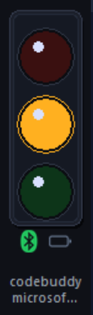

# Agent Pulse

Agent Pulse は、Claude Code と Codex の作業状態を Windows ローカルの Dashboard、フローティングウィンドウ、および ESP32 物理トラフィックライトに同期します。ターミナルを常に見ていなくても、AI コーディングセッションの進行状況を把握できます。

言語：[English](README.md) | [简体中文](README.zh-CN.md) | [繁體中文](README.zh-TW.md) | 日本語 | [한국어](README.ko.md) | [Français](README.fr.md) | [Deutsch](README.de.md) | [Español](README.es.md)

## ステータスの意味

| 色 | 一般的な意味 |
|---|---|
| 緑 | セッションがアイドル状態、タスク完了、または結果を確認可能 |
| 黄 | 応答中、ツール呼び出し中、ツール完了後の処理継続中、または追加情報が必要 |
| 赤 | 権限リクエスト、ツールの失敗、ブロック、または人による介入が必要 |

ステータスはプロジェクトディレクトリごとに保存・表示されます。同じコンピューター上の複数のプロジェクトを Dashboard に同時表示できます。

## インストール

### 推奨：Windows インストーラー

`AgentPulseSetup-<版本>.exe` をダウンロードして実行します。通常のユーザーは、Node.js、npm、Python、BLE Bridge、PyInstaller、Arduino ツールを個別にインストールする必要はありません。

公式ダウンロードリンク：

- [GitHub Releases](https://github.com/lzty634158-oss/agent-pulse-release/releases)
- [Gitee Releases](https://gitee.com/lzty634158/agent-pulse-release/releases)

インストーラーは現在の Windows ユーザーに対して次を実行します：

- Agent Pulse daemon、組み込み Node runtime、BLE Bridge、フローティングウィンドウをインストールします。
- Claude Code hooks と Codex hooks を安全にマージし、既存の他の hooks を上書きしません。
- ログイン後の自動起動を設定します。
- 完了後に Agent Pulse を起動し、Dashboard を開きます。

通常の既定のインストール先：

```text
%LOCALAPPDATA%\AgentPulse
```

インストール後、hooks を再読み込みするために Claude Code/Codex を再起動するか、新しいセッションを開始してください。

### ソース/コマンドラインからのインストール

これは開発者向けの方法であり、Windows インストーラーの利用者には必須ではありません。文末の[開発者付録](#開発者付録)を参照してください。

## 日常的な使用方法

### Dashboard

開く：

```text
http://127.0.0.1:7900
```

スタートメニューの **Open Dashboard** からも開けます。Dashboard は日常操作の入口であり、次を確認できます：

- 現在のプロジェクト、ライトの色、リアルタイムイベント
- BLE 接続状態、デバイスのバッテリー残量（対応デバイスの場合）
- フローティングウィンドウの表示/非表示
- プログラムおよびファームウェアの更新
- 設定への入口

Dashboard はローカルのループバックアドレスだけをリッスンし、LAN には公開されません。

### 設定ページ

Dashboard の「設定」をクリックして設定ページを開きます。設定ページの既定のアドレスは：

```text
http://127.0.0.1:4321/?lang=zh
```

通知、停止判定時間、各種イベントの色/点滅/呼吸エフェクト、明るさ、サウンドなどを調整できます。`7900` は Dashboard、`4321` は独立した設定ページであり、用途が異なります。

### Claude Code と Codex の統合

インストーラーは Agent Pulse のグローバル hooks を次へマージします：

```text
%USERPROFILE%\.claude\settings.json
%USERPROFILE%\.codex\hooks.json
```

セッション開始、ユーザー送信、ツール呼び出しの前後、権限リクエスト、停止、失敗などのイベントを検知し、Dashboard、フローティングウィンドウ、ハードウェアライトを更新します。ほかの hooks と設定は保持されます。

確認方法：新しい Claude Code または Codex セッションを開始し、リクエストを送信してツール呼び出しまたは権限リクエストを発生させ、Dashboard のリアルタイムイベントとステータス色を確認します。

> Codex Offline Sandbox はローカルの loopback ネットワークをブロックすることがあります。Agent Pulse はローカル状態ファイルの監視を通じて状態の同期を継続するため、このネットワーク経路には依存しません。

#### Codex hooks の信頼と設定

Agent Pulse が Codex イベントを受信するには、Codex で外部 command hooks の実行を許可する必要があります。初回インストール時、または Codex が hook のセキュリティ確認を表示したときは、**Agent Pulse hooks を信頼/許可**を選択してください。拒否するか信頼しない場合、Codex はこれらのコマンドを実行しないため、Dashboard と物理ライトは Codex のステータス変化に追従しません。

設定手順：

1. Agent Pulse Dashboard を開き、「設定」をクリックします。
2. 設定ページで「Codex Hooks をインストール」をクリックします。
3. `%USERPROFILE%\.codex\hooks.json` に Agent Pulse hooks が含まれていることを確認します。インストール時に、既存のほかの hooks は保持されます。
4. Codex を再起動するか、新しいセッションを開始します。
5. Codex に hook の信頼/実行確認が表示されたら、信頼または許可を選択します。
6. リクエストを送信してツール呼び出しを発生させ、Dashboard のリアルタイムイベントに Codex のステータスが表示されることを確認します。

ステータスが更新されない場合は、まず Codex の hook 信頼状態を確認し、設定ページで該当する hooks を再インストールしてから、Codex を再起動するか新しいセッションを開始してください。繰り返しインストールしても Agent Pulse hooks が蓄積されることはありません。旧バージョンを使用していて明らかな遅延が発生する場合は、hooks を一度再インストールしてクリーンアップ移行を完了できます。

## ハードウェアステータスライト

現在の HW v2 / ESP32-C3-next 物理デバイスは、**赤、黄、緑の独立した 3 個の LED**を使用し、青色 LED はありません。物理ライトの状態は次のとおりです：

- **緑**：タスク完了、セッションがアイドル状態、または結果を確認可能。
- **黄**：応答中、ツール呼び出し中、または処理中。
- **赤**：権限リクエスト、ツールの失敗、ブロック、または人による介入が必要。

点灯、点滅、呼吸エフェクトは設定ページで自由に調整できます。

> Dashboard の BLE アイコンが青色で表示される場合がありますが、これはコンピューター側で Bluetooth をスキャン中または接続中であることを示すだけで、**デバイスが青く点灯することを意味しません**。

### 電源オン、電源オフ、ボタン

- **電源オン**：電源オフの状態でボタンを約 2 秒長押しすると、デバイスが電源をラッチして起動します。
- **電源オン時のフィードバック**：デバイスは赤 → 黄 → 緑の順に表示し、その後、既定の緑点滅および BLE アドバタイズ状態に入ります。サウンドを有効にしている場合は、起動通知音が再生されます。
- **電源オフ**：電源オン後に再度約 2 秒長押しすると、デバイスは消灯して電源保持を解除します。サウンドを有効にしている場合は、電源オフ通知音が再生されます。
- **短押し**：約 2 秒間バッテリー残量を表示します。BLE が未接続の場合は、同時にアドバタイズを再開/ウェイクアップします。
- **アップグレード中**：誤ってアップグレードを中断しないよう、OTA 転送中のボタン操作は無視されます。

### 物理ライトと識別フィードバック

- **アドバタイズ中、接続待機中**：緑が呼吸点灯します。
- **BLE 接続済み**：緑が点灯し、その後に現在の Agent ステータスを復元/受信します。
- **接続切断**：デバイスは再びアドバタイズし、緑の呼吸点灯に戻ります。
- **約 60 秒間未接続**：アドバタイズを停止して赤が点滅します。短押しで再度アドバタイズを開始できます。
- **デバイスの識別**：Dashboard から識別を実行すると、デバイスは赤 → 黄 → 緑 → 消灯を高速で表示し、数回繰り返した後に元の状態へ戻ります。
- **接続アニメーション**：デバイスは赤、黄、緑の順に接続過程をフィードバックします。接続完了後、ホストが現在の作業状態を送信します。

### バッテリー、充電、サウンド

デバイスを短押しすると、約 2 秒間バッテリー残量を表示します：

| 電圧の推定値 | ライト効果 |
|---|---|
| 約 ≥ 4.0 V | 赤、黄、緑がすべて点灯 |
| 約 3.7–4.0 V | 赤、黄が点灯 |
| 約 < 3.7 V | 赤が点灯 |

接続済みでデバイスが対応している場合、Dashboard とフローティングウィンドウに推定電圧、パーセント、および充電状態が表示されます。これらの値は日常的な判断のためのものであり、精密なバッテリー計として使用すべきではありません。

設定ページの「サウンド」スイッチはブザーの通知音を制御します。既定ではオフです。三色の明るさとサウンド設定はデバイスに保存され、電源を切っても保持されます。

### 接続方法

#### BLE 接続（推奨）

1. デバイスに給電します。長時間接続されない場合は、短押しして再びアドバタイズさせます。
2. Dashboard を開き、BLE 状態がスキャン/接続中から接続済みに変わるまで待ちます。
3. 接続に成功すると、Agent Pulse は現在の状態を物理ライトへ自動的に同期します。

Dashboard の BLE アイコンは通常、青がスキャン/接続中、緑が最近有効なデバイス操作を受信、灰が未接続、赤が接続エラーを示します。青はソフトウェアアイコンの状態であり、物理 LED ではありません。

デバイスが見つからない場合は、デバイスが給電されてアドバタイズしていること、Windows Bluetooth が利用可能であること、デバイスが十分近いことを確認し、複数の Agent Pulse/BLE Bridge インスタンスを同時に実行しないでください。

#### USB 接続、診断、復旧

USB は、有線ライト制御、デバイス情報/バッテリー残量の読み取り、診断、復旧、および対応デバイスのファームウェア更新に使用できます。充電専用ケーブルではなくデータケーブルを使用し、デバイスマネージャーで COM ポートが表示されていることを確認してください。

現在のバージョンは、USB シリアルポートのベンダー識別子で候補デバイスを絞り込みます。複数の ESP32 または一般的な USB シリアルデバイスを接続している場合は、次のようにコマンドラインで対象ポートを明示的に指定してください：

```powershell
agent-traffic-light-monitor device list
agent-traffic-light-monitor device push --port COM3
```

無関係なシリアルデバイスを Agent Pulse のライト制御対象にしないでください。今後のバージョンでは、まず候補シリアルポートへ `deviceInfo` リクエストを送信し、有効なデバイス応答を受信した場合にのみ自動接続するよう変更されます。

デバイスにシリアルポートがまったくない場合は、ケーブル、ドライバー、およびファームウェアで USB CDC が有効かどうかを確認してください。USB は初回書き込み、パーティションレイアウト移行、または OTA 失敗後の優先的な復旧方法です。

## フローティングウィンドウ

Dashboard の「フローティングライトを開く」または「フローティングライトを閉じる」をクリックします。フローティングウィンドウには、現在のステータス色、プロジェクト名、BLE 状態、および利用可能な場合はデバイスのバッテリー残量が表示されます。



これはインストール版の daemon によって管理されます。フローティングウィンドウの起動に失敗しても、Dashboard とステータス同期は引き続き動作します。

## プログラムの更新

Dashboard の **AgentPulse プログラム更新** セクションで：

1. 「プログラム更新を確認」をクリックします。
2. 新しいバージョンが見つかったら、「インストールを確認」をクリックします。
3. Agent Pulse は署名済み更新マニフェスト、インストーラー名、サイズ、および SHA-256 をダウンロードして検証します。
4. 検証が成功すると、Windows エクスプローラーが開き、検証済みインストーラーが選択されます。
5. この EXE を手動でダブルクリックし、表示される Inno Setup ウィザードでインストールを完了してください。

Agent Pulse はインストーラーをサイレント実行せず、インストールウィザードを代行することもありません。上書きインストール時、Inno ウィザードは使用中のファイルを解放するため、現在のインストールディレクトリにある Agent Pulse daemon、フローティングウィンドウ、BLE Bridge を終了します。無関係なプログラムを広範囲に終了することはありません。

ダウンロード済みインストーラーは既定で次にキャッシュされます：

```text
%LOCALAPPDATA%\AgentPulse\updates\desktop\
```

## ファームウェアの更新

ハードウェア機能：

- **ESP32-C3-next 更新可能ファームウェア**：Dashboard の BLE/USB OTA を利用するには、デバイス情報が次のハードウェア識別子と OTA 機能を報告する必要があります：

  ```text
  agentpulse-esp32c3-next
  ```

更新前にデバイス情報と対象ファームウェアを確認してください。OTA が受け付けるのは Arduino **アプリケーションイメージ** `.ino.bin` のみです。bootloader、パーティションテーブル、`merged.bin`、またはその他の完全な初回書き込みファイルをアップロードしないでください。

### 重要な制限

現在、OTA は実験的な機能です。ファームウェア側では、イメージ署名検証、Secure Boot、Flash Encryption、健全性確認、自動ロールバックはまだ実装されていません。更新中は電源を切ったり、ケーブルを抜いたり、Bluetooth を無効にしたり、daemon を終了したりしないでください。失敗した場合は、まず USB での復旧を試してください。

***更新中に突然電源が切れて失敗し、利用に影響することを防ぐため、更新時は電源に接続することを推奨します。***

古いデバイスの OTA パーティションレイアウトは、通常の BLE/USB application OTA では移行できません。パーティションレイアウトの移行または初回書き込みが必要な場合は、USB download/bootloader モードで bootloader、パーティションテーブル、OTA boot selector、factory app を完全に書き込む必要があります。

## データとプライバシー

既定の実行データはローカルに保存されます：

```text
%LOCALAPPDATA%\AgentPulse\
  config.json
  projects\<projectId>\status.json
  projects\<projectId>\events.jsonl
  daemon\
  updates\
```

Agent Pulse は既定では、コード、プロンプト、ターミナル出力、プロジェクトファイルをアップロードしません。プロジェクトルートの古い `.agent-pulse` は互換性/移行のためだけに使用されます。新しいバージョンでは、プロジェクトディレクトリに新しいランタイムデータを書き込むことはありません。

## よくある質問

### Dashboard を開けない

設定ページのポート `4321` ではなく、`http://127.0.0.1:7900` にアクセスしていることを確認してください。インストール版では、スタートメニューから Agent Pulse を再起動してみてください。開発者はコマンドラインで次を確認できます：

```powershell
agent-traffic-light-monitor daemon status
agent-traffic-light-monitor daemon logs
```

ソース版 daemon とインストール版を同時に実行しないでください。これらは `7900`、`47801`、`7950` と BLE デバイスを競合して使用します。

### Claude Code/Codex のステータスが変化しない

1. 新しい Claude Code/Codex セッションを開始します。
2. 設定ページで該当する hooks を再インストールします。
3. `%USERPROFILE%\.claude\settings.json` または `%USERPROFILE%\.codex\hooks.json` に Agent Pulse の設定がまだ含まれていることを確認します。
4. Claude Code ユーザーは次を実行できます：

   ```powershell
   agent-traffic-light-monitor doctor
   ```

### BLE に接続できない

デバイスの給電、Windows Bluetooth、距離、および Dashboard の状態を確認してください。`47801` を占有しないよう、追加の BLE Bridge を手動で起動しないでください。

### USB デバイスが見つからない

データケーブルを使用し、デバイスマネージャーの「ポート（COM と LPT）」を確認し、必要に応じて明示的な COM ポートを選択してください。COM ポートがない場合は、USB CDC ファームウェアとドライバーを確認してください。

### 通知が多すぎる

設定ページで完了/エラー/停止の通知を無効にするか、「停止」の判定時間を調整してください。

## 注意事項

- 本書は Windows インストーラーの利用者を対象としています。本番利用前に、対象コンピューターとハードウェアで Claude/Codex hooks、BLE、フローティングウィンドウ、更新フローを検証してください。
- 現在、複数の Agent Pulse デバイスを同一の BLE 名だけで自動的に区別すべきではありません。将来の複数デバイスのシナリオでは、一意の `deviceId` バインディングを使用する必要があります。RSSI は初回検出時の並べ替えの根拠としてのみ適しています。
- プログラム更新とファームウェア OTA は異なるフローです。プログラム更新は Windows EXE をインストールし、ファームウェア OTA は対応デバイスのアプリケーションイメージのみを書き込みます。
