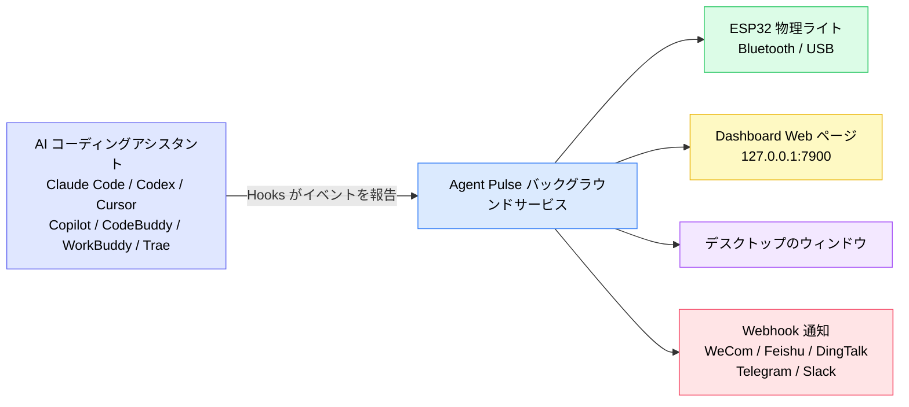
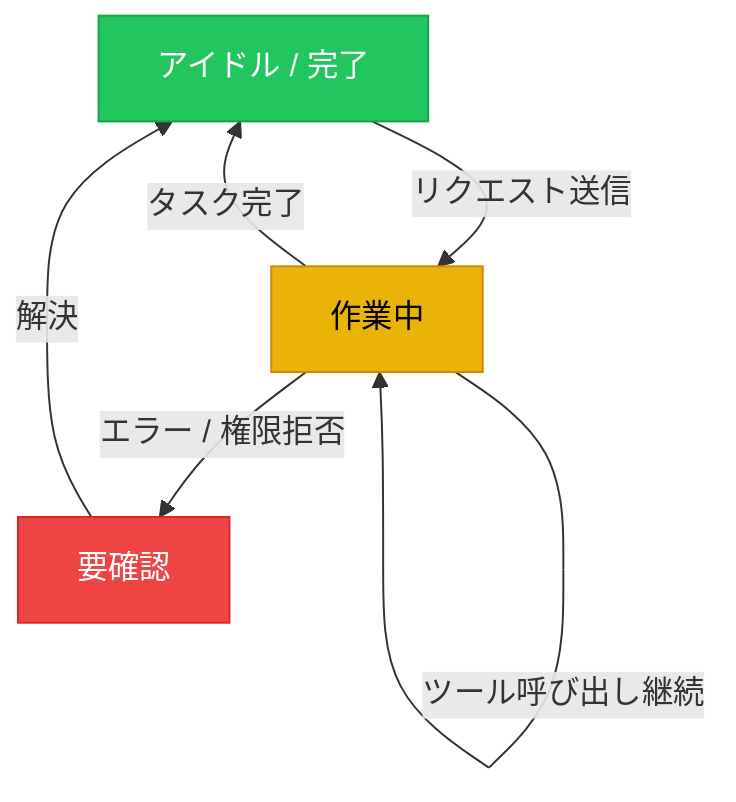
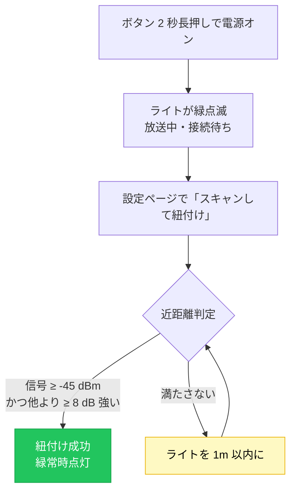
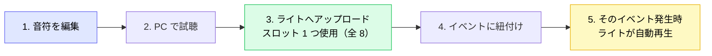
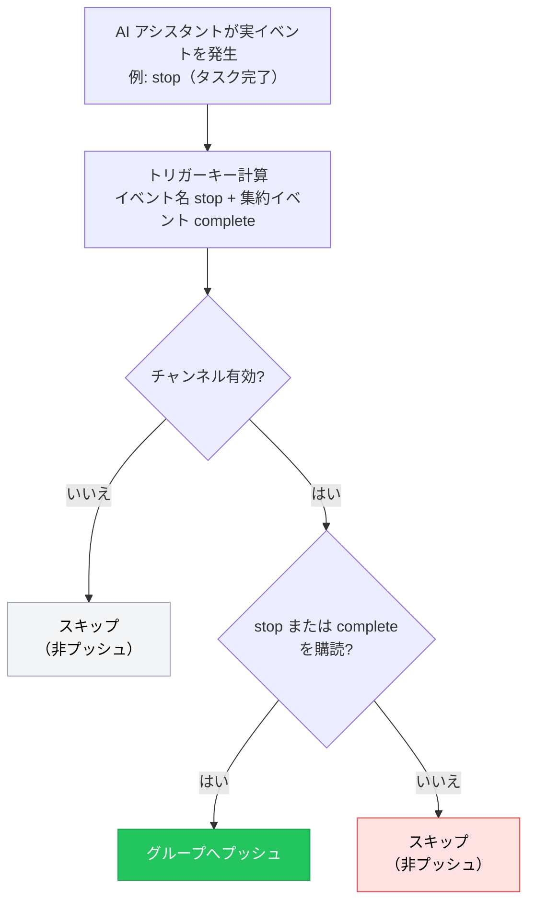

[English](README.md) | [한국어](./README.ko.md) | [日本語](./README.ja.md) | [简体中文](./README.zh-CN.md) | [繁體中文](./README.zh-TW.md) | [Español](./README.es.md) | [Français](./README.fr.md) | [Deutsch](./README.de.md)

# Agent Pulse チュートリアル

**Agent Pulse** は、AI コーディングアシスタントの状態に合わせて色が変化するデスクトップのアンビエントライトです。ターミナルを眺め続けなくても、ライトの色を見るだけでタスクが「実行中」「完了」「エラー」かがわかります。

- **現在のソフトウェアバージョン**: 0.4.7
- **内蔵ハードウェアライトのファームウェアバージョン**: `0.1.24+25`
- **バージョン履歴**: [CHANGELOG.md](CHANGELOG.md) を参照

**対応 AI コーディングアシスタント**: Claude Code · Codex · WorkBuddy · CodeBuddy · Cursor · Copilot · Trae

### 仕組み



一言で言えば：**AI アシスタントが Hooks で状態を Agent Pulse に伝え、Agent Pulse がその状態をライト・Web ページ・ウィンドウ・チャットグループに配信します。**

> ⚠️ 図中の **Hooks が最も重要です**。Hooks が未インストールだと Agent Pulse はイベントを受け取れず、後段は何も反応しません。

---

## 目次

- [1. クイックスタート（5 分）](#1-クイックスタート5-分)
- [2. ステータスカラーの見方](#2-ステータスカラーの見方)
- [3. インストールとアップデート](#3-インストールとアップデート)
- [4. ライトの接続](#4-ライトの接続)
- [5. ハードウェアライトの使い方](#5-ハードウェアライトの使い方)
- [6. デスクトップインターフェース](#6-デスクトップインターフェース)
- [7. 音楽](#7-音楽)
- [8. Webhook 通知](#8-webhook-通知)
- [9. 複数アシスタントと複数デバイス](#9-複数アシスタントと複数デバイス)
- [10. データとプライバシー](#10-データとプライバシー)
- [11. よくある質問](#11-よくある質問)
- [12. 注意事項](#12-注意事項)

---

## 1. クイックスタート（5 分）

初めての場合は、以下の 4 ステップを順に行うと、ライトがタスクに合わせて色付き変化します。

### ステップ 1: ソフトウェアのインストール（OS に合わせて選択）

| システム | ダウンロード | インストール方法 |
| --- | --- | --- |
| Windows 10 1809+ / 11 | **[`AgentPulseSetup-0.4.7.exe` をダウンロード](https://github.com/lzty634158-oss/agent-pulse-release/releases/latest)** | ダブルクリックでインストール、完了後自動起動 |
| macOS（Apple Silicon / Intel） | **[`AgentPulse-0.4.7.pkg` をダウンロード](https://github.com/lzty634158-oss/agent-pulse-release/releases/latest)** | ダブルクリックでウィザードに従う |
| Ubuntu（コレクターのみ） | **[Collector をダウンロード](https://gitee.com/lzty634158/agent-pulse-linux-collector-release)** | [Ubuntu Collector](#34-ubuntu-collector任意) を参照 |

> **中国国内でダウンロードが遅い場合**: Gitee ミラーを利用（GitHub と同一内容）:
> - Windows / macOS インストーラ: <https://gitee.com/lzty634158/agent-pulse-release/releases>
> - macOS 専用リポジトリ: <https://gitee.com/lzty634158/agent-pulse-macos-release>

インストール後、Agent Pulse はバックグラウンドで動作し、トレイ / メニューバーにアイコンが表示されます。

### ステップ 2: Hooks のインストール

#### 注意: 通常のインストールでは Hooks が自動インストールされます。動作しない場合は再インストールしてください。

Hooks は、Agent Pulse と AI アシスタントをつなぐ「伝令」です。**Hooks をインストールしないと、ライトは一切反応しません。**

1. ブラウザで設定ページを開く: <http://127.0.0.1:4321/?lang=ja>
2. 使用している AI アシスタントのカード（Claude Code / Cursor / Trae など）を見つける
3. カード上の **「Hooks をインストール」** ボタンをクリック
4. 成功するとカードに「インストール済み」と表示されます


> **Codex ユーザーへ**: Hooks インストール後、Codex はそれを「信頼されていないプロジェクト」として表示します。Codex の設定で「フック」項目を見つけ、そのプロジェクトを信頼済みとしてマークしてください。Hooks が実際に有効になります。

> **Claude Code ユーザーへ**: Hooks インストール後、CCSwitch でモデルを切り替えると、CCSwitch が当社の Hook 設定を上書きすることがあります。その場合は設定ページでもう一度「インストール」をクリックしてください。

> **ヒント**: ソフトウェアインストール時、Hooks が自動インストールされるのは**設定ファイルが既に存在する** AI アシスタントのみです。後から新しい AI アシスタントを入れた場合は、設定ページへ戻り手動で一度インストールしてください。

### ステップ 3: ライトの電源を入れて接続

| 接続方法 | シナリオ | 方法 |
| --- | --- | --- |
| **Bluetooth**（推奨） | ライトを机に置き、配線したくない | ボタンを 2 秒長押しで電源オン → ライトが緑点滅（接続待ち）に → 設定ページで「スキャンして紐付け」をクリック → **ライトを PC から 1m 以内**にして紐付け完了 **【補足: 近距離通信は信号強度が -45dB 超の場合に自動接続・紐付けされ、それ以外は検出されません。システムのペアリングメニューから接続することも可能です】** |
| **USB** | 使用しながら充電したい、または Bluetooth 干渉が強い | ライトをデータケーブルで PC に接続 → 設定ページで対応ポートを選択。**USB は Bluetooth より優先され、USB 接続で Bluetooth は自動切断、USB 切断で Bluetooth 放送が再開されます** |

### ステップ 4: 成功の確認

新しいセッションを開き、AI アシスタントにリクエスト（例: 「関数を書いて」）を送り、ライトを観察:

- [ ] 送信後、ライトが**黄色**（作業中）になる
- [ ] 完了後、ライトが**緑色**（アイドル / 完了）になる
- [ ] Dashboard <http://127.0.0.1:7900> を開くとリアルタイムイベントストリームが表示される

ライトが反応しない場合は、[よくある質問 - ライトが点灯しない・色がおかしい](#ライトが点灯しない色がおかしい) へ。

---

## 2. ステータスカラーの見方

Agent Pulse は AI アシスタントの状態を 3 つの**意味的状態**にまとめ、それぞれに色を割り当てます:

| 色 | 意味 | 典型的な場面 |
| --- | --- | --- |
| 緑 | アイドル / 完了 | タスク終了、セッション終了、次の指示待ち |
| 黄 | 作業中 | 思考中、ツール呼び出し中、コード記述中 |
| 赤 | 要確認 | エラー、ツール呼び出し失敗、権限拒否 |

**状態遷移図:**



### 意味的状態とイベントの色付け（0.4.5 以降の重要な変更）

0.4.5 以降、Agent Pulse は**意味的状態優先**の設計になりました:

- Agent Pulse はまず AI アシスタントが「どの状態か」（アイドル / 作業中 / エラー）を判定し、その状態でライトの色を決定します。
- 単一イベントに色とモードを**個別に**指定することもできます（[6.2 設定ページ](#62-設定ページ) 参照）。あなたの設定が最優先です。

**例**: デフォルトでは `stop`（タスク完了）は緑になりますが、`stop` を手動で「赤 + 点滅」にすると、タスク完了時に赤点滅します。あなたの設定が優先されます。

### ライトのモード

色に加え、ライトの**表示モード**を設定できます:

| モード | 効果 | 向いている場面 |
| --- | --- | --- |
| `solid` 常時点灯 | 安定して点灯 | ほとんどの場面 |
| `blink` 点滅 | 周期的なオン/オフ | 注意を引く（エラー等） |
| `breathe` 呼吸 | 明るさが緩やかな起伏 | 待機中 |
| 交互 | 赤黄 / 黄緑 / 赤緑 の交互 | 複合状態の区別 |

---

## 3. インストールとアップデート

### 3.1 Windows インストーラ

**[`AgentPulseSetup-0.4.7.exe` をダウンロード](https://github.com/lzty634158-oss/agent-pulse-release/releases/latest)**、ダブルクリックで実行し、案内に従ってインストール。

> 中国国内ユーザーは Gitee も利用可: <https://gitee.com/lzty634158/agent-pulse-release/releases>

- デフォルトインストール先: `C:\Users\<ユーザー名>\AppData\Local\Programs\AgentPulse\`
- デフォルトで自動起動（インストール後バックグラウンドサービスが自動開始）
- スタートメニューから Agent Pulse を確認可能

> ウイルス対策がインストールをブロックした場合は許可してください（未署名インストーラは警告が出ます）。

### 3.2 macOS インストーラ

**[`AgentPulse-0.4.7.pkg` をダウンロード](https://github.com/lzty634158-oss/agent-pulse-release/releases/latest)**、ダブルクリックでインストールウィザードに従う。または AI プロンプト経由でのインストールも可（推奨。失敗したら AI にエラーを投げて解決）。

> 中国国内ユーザーは Gitee も利用可（Windows / macOS 両対応）: <https://gitee.com/lzty634158/agent-pulse-release/releases>
> macOS 専用リポジトリ: <https://gitee.com/lzty634158/agent-pulse-macos-release>

macOS の詳細は [macos-install/RELEASE_INSTALL.md](macos-install/RELEASE_INSTALL.md) を参照。

- **アーキテクチャ選択**: Apple Silicon（M 系）は `arm64`、Intel は `x86_64`、不明ならユニバーサルパッケージ
- **署名と公証**: Developer ID で署名され Apple により公証済み。通常 Gatekeeper に阻まれません
- **初回起動**: 「ネットワーク接続を許可」「Bluetooth を許可」等の権限ダイアログが出ます。「許可」をクリック

### 3.3 プログラムのアップデート

Agent Pulse は自動でアップデートを確認します:

1. 優先して **Gitee** を確認（国内で高速）
2. Gitee が利用不可の場合は自動で **GitHub** にフォールバック

アップデートは自動でダウンロード・適用され、**設定・音楽・デバイス紐付けはすべて維持**されます。

**手動アップデート**: 新しいインストーラをダウンロードしダブルクリックで上書きインストール。データも失われません。

### 3.4 Ubuntu Collector（任意）

Ubuntu サーバー上の AI アシスタント状態も Dashboard へプッシュしたい場合はコレクターを導入できます。

実行パッケージを先にダウンロード: <https://gitee.com/lzty634158/agent-pulse-linux-collector-release>

```bash
# Ubuntu マシンで実行（sudo 必要）
sudo bash deploy/ubuntu/collector/install.sh
```

詳細は `deploy/ubuntu/collector/README.md` を参照。

> これは**任意機能**です。Windows / macOS ローカルのみ利用なら完全にスキップ可。

---

## 4. ライトの接続

### 4.1 Bluetooth 接続（推奨）

**初回紐付けフロー:**

1. ボタンを 2 秒長押しで電源オン
2. ライトが**緑点滅**状態になり、接続待ちであることを示す
3. 設定ページ <http://127.0.0.1:4321/?lang=ja> を開く
4. 「スキャンして紐付け」をクリック
5. ライトを**PC から 1m 以内**に持っていき、紐付け完了を待つ

**なぜ近づける必要があるのか?** 隣の同僚のライトに繋がらないよう、紐付け時に「近距離」判定を行います:

- 各デバイスを 3 回サンプリングし、信号強度（RSSI）が **≥ -45 dBm** であること
- かつ最も近いデバイスが他の候補より **≥ 8 dB** 強いこと

紐付け成功後はライトが記憶され、以降の電源オンで自動再接続され、再紐付けは不要です。

**紐付けフロー:**



**UI 上の Bluetooth 状態アイコン**（Dashboard とウィンドウに表示）:

| アイコン | 意味 |
| --- | --- |
|  | Bluetooth 接続済 |
|  | 接続中 |
|  | デバイス検索中 |
|  | Bluetooth 切断 |
|  | Bluetooth エラー |

### 4.2 USB シリアル接続

**データケーブル**（充電専用ではない）でライトと PC を接続。

- Windows デバイスマネージャーに **`ESP32-C3 USB JTAG/serial debug unit`** が表示されるはず
- 設定ページのシリアルポート一覧から該当ポートを選択するだけ

> **USB は Bluetooth より優先**: 接続中は USB を使用、抜くと自動で Bluetooth に戻ります。

### 4.3 複数ライト

複数の Agent Pulse ライトがある場合、「どのライトにどのプロジェクトの状態を表示するか」を指定できます:

| ルーティング方法 | 説明 |
| --- | --- |
| **最新に追従** | すべてのライトが直近で活発なタスクの状態を表示 |
| **プロジェクト指定** | 特定プロジェクトを特定ライトに固定 |
| **アシスタント指定** | 特定 AI アシスタントの状態を特定ライトに固定 |

Dashboard の「デバイス管理」ページで複数ライトとルーティングルールを設定。

---

## 5. ハードウェアライトの使い方

### 5.1 ボタン操作

| 操作 | 長さ | 効果 |
| --- | --- | --- |
| **長押し** | ≥ 2 秒 | 電源オン / オフ |
| **短押し** | 押して離す | 現在のバッテリーを表示（ライト効果のヒント）。未接続時は Bluetooth 放送も再有効化 |

### 5.2 ライト効果クイックリファレンス

ライトのすべての「動作」は、何が起きているかを示します:

| ライト効果 | 意味 |
| --- | --- |
| 🟢 **緑点滅** | Bluetooth オン、放送中、接続待ち |
| 🟢 **緑常時点灯** | Bluetooth 接続済（ホスト接続） |
| 🟢 **緑点滅へ戻る** | Bluetooth 切断、デバイスが放送を再開して接続待ち |
| 🔴→🟢→🟡→消灯（3 回ループ） | **識別点滅**: ホストの「デバイス識別」コマンドに応答。赤→緑→黄→消灯を 3 回高速ループ（各 200ms）して元の状態に戻る。複数ライトの中から見つけやすくするため |
| 🔴→🟢→🟡（各 1 秒） | **接続アニメーション**: 接続成功時のフィードバック。赤→緑→黄を各 1 秒点灯して元の状態に戻る |
| 🔴 **赤点滅** | Bluetooth 放送タイムアウト（60 秒未接続）で放送停止 |

> ⚠️ **青色ライトについての重要説明**: 現在の HW v2 / ESP32-C3-next 物理デバイスは**赤・黄・緑の 3 つの独立 LED のみで、青色 LED はありません**。したがって**青や紫には点灯しません**。
> Dashboard とウィンドウの**青色 Bluetooth アイコンは、PC 側が Bluetooth をスキャンまたは接続中であることを示す UI 上のステータス表示**であり、**デバイスが青く点灯するわけではありません**。UI の青アイコンをライトの実際の色に対応させないでください。

### 5.3 バッテリーとサウンド

**バッテリー表示**（短押しで確認）:

短押し後、ライトは**点灯する LED の数**でバッテリー残量を示し、約 2 秒後に元の状態へ戻ります:

| 電圧 | ライト効果（点灯 LED） | 説明 |
| --- | --- | --- |
| ≥ 4.00V | 🔴🟢🟡 赤+緑+黄 **3 つ全点灯** | 十分 |
| 3.70V ~ 4.00V | 🔴🟡 赤+黄 **2 つ点灯** | 中程度 |
| < 3.70V | 🔴 **赤のみ点灯** | 低い、充電推奨 |

> 青 LED がないため、バッテリーは「点灯数」（3=満、2=中、1=低）で表現され、色違いではありません。

**自動保護**: 電圧が 3.20V を下回り 60 秒継続すると、バッテリー過放電防止のため自動電源オフ。

**サウンド切替**: 設定ページの「明るさとサウンド」で設定。**デフォルトオフ**。必要なら手動でオン。

### 5.4 ファームウェアアップデート

新しいハードウェアライトのファームウェアが利用可能な場合、設定ページで更新できます。

**更新前に必ず確認（満たさないと失敗します）:**

1. **ハードウェア ID は `agentpulse-esp32c3-next` であること** —— 他のハードウェアは非対応
2. **`.ino.bin` ファイルのみアップロード** —— `.bin` / `.elf` / `.map` / `bootloader` / `partitions` 等はアップロードしない
3. **デバイスが `ESP32-C3 USB JTAG/serial debug unit` と表示されること**
4. **電源と接続を安定させたまま** —— 更新中は抜かない・電源を切らない

**更新中のライト効果:**

| ライト効果 | 段階 |
| --- | --- |
| 黄常時点灯 | 新ファームウェアを受信・検証中（更新全体で黄常時点灯を維持） |
| 消灯 | 再起動中（成功・失敗ともに再起動） |

> **更新失敗?** 慌てないで。デバイスは二重パーティション設計で、失敗時は旧ファームウェアへ自動ロールバックし元のライト効果を復元。再起動で再利用可能。

---

## 6. デスクトップインターフェース

Agent Pulse は 2 つの Web インターフェースを提供します:

| インターフェース | アドレス | 用途 |
| --- | --- | --- |
| **Dashboard** | <http://127.0.0.1:7900> | リアルタイム状態・イベントストリーム表示、デバイス管理 |
| **設定ページ** | <http://127.0.0.1:4321/?lang=ja> | すべての設定はここ |

### 6.1 Dashboard

<http://127.0.0.1:7900> を開くと:

<!-- スクショ枠: dashboard.png を docs/screenshots/ に入れたら下の行のコメントを外す

-->

- **リアルタイムイベントパネル**: 各 AI アシスタントのイベント（プロンプト送信、ツール呼び出し、タスク完了…）が時系列でスクロール
- **現在の状態**: どの色・モード・プロジェクト / アシスタントからか
- **ステータスバー形式**: `ライト効果[モード] + 色 + プロジェクト名 + アシスタント名 + 経過時間`、例:
  ```
  常時点灯 緑  my-project  claude-code  経過 00:02:15
  ```
- **デバイス管理**: 複数ライトの状態確認とルーティング設定

### 6.2 設定ページ

<http://127.0.0.1:4321/?lang=ja> を開く。すべての設定の入口です。


<!-- スクショ枠: 「イベントとライトスキーム」セクションを config-events-section.png として保存後、下の行のコメントを外す

-->

#### 通知とストール検知

| 設定 | デフォルト | 説明 |
| --- | --- | --- |
| デスクトップ通知 | オフ | 状態変化時にシステム通知を出すか |
| タスク完了時通知 | オン | タスク完了（緑）時に通知 |
| エラー時通知 | オン | エラー（赤）時に通知 |
| ストール（停滞）の可能性通知 | オン | 黄が設定時間を超えて継続したら通知 |
| ストール判定時間 | 5 分 | 黄がどれだけ継続すると「停滞の可能性」とするか |

#### イベントとライトスキーム

これが最もよく使う箇所——**各イベントごとにライトの色・モード・音楽再生の有無を設定**できます。

**対応イベント（AI アシスタントにより多少異なる）:**

| イベント | 意味 |
| --- | --- |
| `session-start` | セッション開始 |
| `session-end` | セッション終了 |
| `user-prompt-submit` | ユーザープロンプト送信 |
| `pre-tool-use` | ツール呼び出し前 |
| `post-tool-use` | ツール呼び出し後 |
| `post-tool-use-failure` | ツール呼び出し失敗 |
| `permission-request` | 権限リクエスト |
| `permission-denied` | 権限拒否 |
| `notification` | 通知 |
| `stop` | タスク完了 |
| `stop-failure` | タスク失敗 |
| `error-occurred` | エラー発生 |
| `elicitation` | 補足情報の要求 |

**各 AI アシスタントが対応するイベント:**

| AI アシスタント | 対応イベント |
| --- | --- |
| **Claude Code** | セッション開始、プロンプト送信、ツール前/後、権限リクエスト、権限拒否、通知、タスク完了、タスク失敗 |
| **Codex** | セッション開始、プロンプト送信、ツール前/後、権限リクエスト、通知、タスク完了 |
| **WorkBuddy** | セッション開始、プロンプト送信、ツール前/後、通知、タスク完了 |
| **CodeBuddy** | セッション開始、プロンプト送信、ツール前/後、ツール失敗、権限リクエスト、通知、タスク失敗、タスク完了、セッション終了 |
| **Cursor** | セッション開始、プロンプト送信、ツール前/後、ツール失敗、権限リクエスト、通知、タスク失敗、タスク完了 |
| **Copilot** | セッション開始、プロンプト送信、ツール後、タスク完了、エラー発生、セッション終了 |
| **Trae** | セッション開始、プロンプト送信、ツール前/後、権限リクエスト、通知、タスク完了 |

> 設定ページには**現在のアシスタントが実際に発生させる**イベントのみが表示され、発生し得ないイベントを設定することを防ぎます。

**権限ゲート（セキュリティ注意）**: Trae / WorkBuddy / CodeBuddy にはネイティブな権限ダイアログがありません。設定ページで該当アシスタントのタブに切り替え、イベント行 **「権限リクエスト (permission-request)」** の色を「オフ」以外に設定するとセキュリティゲートが有効になります（既定は赤＋点滅）。有効時は**どのツール呼び出しでもユーザーに確認を求め、赤ランプが点灯**します。実行するコマンドに関係なく、危険コマンドのリストを管理する必要はありません。「オフ」にするとゲートが無効になります。

**アシスタントごとの設定**: 該当アシスタントのタブに切り替えると個別にイベントの色を設定可能。「デフォルト」タブは全アシスタントのグローバル fallback として機能。

#### 明るさとサウンド

| 設定 | デフォルト | 説明 |
| --- | --- | --- |
| 緑の明るさ | 30% | 3 色を別々に設定可 |
| 黄の明るさ | 30% | |
| 赤の明るさ | 30% | |
| 点滅周期 | 1000 ms | 1 点滅サイクルの時間 |
| 呼吸周期 | 2000 ms | 1 呼吸の時間 |
| サウンド有効 | オフ | 通知音を再生するか |

#### Hooks 管理

各 AI アシスタントカードに **「Hooks をインストール」** ボタンがあり、インストール後は「インストール済み」と表示。アシスタントを切り替えや再インストールしたら、もう一度クリックして再インストール。

### 6.3 ウィンドウ

有効にすると、デスクトップに半透明の小窓が表示され、ブラウザを開かずに現在の状態色とプロジェクト名をリアルタイム表示。


---

## 7. 音楽

Agent Pulse は特定イベント発生時に効果音を再生でき、**内蔵音**と**カスタム音楽**の両方に対応。

### 7.1 内蔵音

ライト出荷時に 5 つの内蔵音が入っており、ストレージを消費せずそのまま利用可能:

| # | 名前 |
| --- | --- |
| 1 | 上昇キュー |
| 2 | ダブルクリックキュー |
| 3 | 完了キュー |
| 4 | 下降警告 |
| 5 | エコーキュー |

### 7.2 カスタム音楽エディター

設定ページの音楽セクションで自分で作曲できます。

<!-- スクショ枠: music-editor.png を docs/screenshots/ に入れたら下の行のコメントを外す

-->

**音符のパラメータ制限:**

| パラメータ | 範囲 | 説明 |
| --- | --- | --- |
| 周波数 | 0 ~ 4000 Hz | **0 は休符（無音）** |
| 長さ | 20 ~ 2000 ms | 1 音符の長さ |
| 間隔 `gapMs` | 0 ~ 500 ms（既定 10 ms） | 音符間の無音間隔 |

**曲全体の制限:**

- 最大 **64 音符**
- 総時間 30 秒以下
- 名前 最大 **40 文字**

> **`gapMs`（間隔）とは?** 音符間の「休み」です。2 つの音符を分離して聞こえさせたい場合、前の音符に間隔を設定します。ファームウェアは周波数 0 の無音音符でこの休みを実現します。

### 7.3 ライトへのアップロード

**全体フロー:**



カスタム音楽はライトへアップロードして再生:

1. 設定ページの音楽セクションで曲を編集
2. **「デバイスへアップロード」** をクリック
3. アップロード完了を待つ

**保存ルール:**

| 項目 | 説明 |
| --- | --- |
| スロット数 | **8**（番号 128 ~ 255） |
| 1 スロット容量 | **512 バイト** |
| 割り当て | 空きスロットを自動割り当て。満杯なら未使用曲を削除 |
| 再アップロード | 一度アップロードした曲は**元スロットを再利用**、ばらつかない |

> **スロット満杯?** アップロード時に「カスタム音楽スロット 8 個が満杯」と警告されます。未使用曲を削除して空きを作ってください。

### 7.4 イベントへの紐付け

曲を編集・アップロード後、それをイベントに紐付け:

1. 「イベントとライトスキーム」へ
2. 対象イベント（例: `session-end` セッション終了）を見つける
3. 「音楽」ドロップダウンで曲を選択
4. 「1 回再生」または「繰り返し」を選択
5. 保存をクリック

以降、そのイベント発生時にライトが曲を再生。

### 7.5 試聴・削除・読み取り

| 操作 | 方法 |
| --- | --- |
| **試聴** | 音楽エディターで「試聴」をクリック。PC 上でプレビュー（ライト経由ではない） |
| **削除** | 音楽リストで「削除」をクリック。PC とライトのスロットの両方から削除 |
| **ライトから読取** | ライト内の音楽は設定ページに一覧可能。ただし**ファームウェアは生音符データのみ保存し曲名は保存しない** |

### 7.6 音楽 FAQ

| 症状 | 原因と解決 |
| --- | --- |
| 一切音が出ない | 設定ページの「サウンド有効」がオンか確認（**既定はオフ**） |
| 音符がつながり間隔が聞こえない | 音符に `gapMs` 間隔を設定（既定 10ms は短すぎる可能性） |
| アップロード失敗、スロット満杯 | 未使用曲を削除して空きを作る |
| ライトを別 PC に移したら曲名がない | 曲名は PC 上のみ。ライトのファームウェアは音符データのみ保存、これは正常 |

---

## 8. Webhook 通知

ライトの色変化に加え、Agent Pulse はイベントを**チャットグループ**（WeCom、Feishu、DingTalk、Telegram、Slack 等）へプッシュできます。

### 8.1 対応プラットフォーム

| プラットフォーム | 説明 |
| --- | --- |
| **WeCom** | グループボット Webhook |
| **Feishu** | カスタムボット（署名検証対応） |
| **DingTalk** | カスタムボット（署名 URL 対応） |
| **Telegram** | Bot API |
| **Slack** | Incoming Webhook |
| **カスタム** | JSON を受け取る任意の HTTPS エンドポイント |

### 8.2 通知チャンネルの追加

<!-- スクショ枠: webhook-channels.png を docs/screenshots/ に入れたら下の行のコメントを外す

（現在 config-full.png に Webhook セクション全体が含まれています。後でより焦点を絞った単体スクショを追加可）
-->

1. 設定ページ → **Webhook 通知** セクションを開く
2. 「チャンネルを追加」をクリック
3. 入力:
   - **名前**: 自分用メモ（例「プロジェクトグループ」）
   - **プラットフォーム**: 上表のいずれか
   - **Webhook URL**: プラットフォームの「グループボット」設定から取得
   - **シークレット**（Feishu / DingTalk は必要）: ボットのセキュリティ設定内の署名シークレット
   - **有効**: **必ずチェック**、未チェックだとプッシュされない
4. 受け取りたい**イベント**をチェック
5. 保存をクリック

> **URL は HTTPS であること**、そうでなければ保存が拒否されます。

### 8.3 イベント購読（最も重要なステップ）

各チャンネルは受け取るイベントを個別にチェック可能。イベントは 2 種類:

**集約イベント（推奨）** —— 一連の場面をカバーし、お任せで楽:

| 集約イベント | トリガー |
| --- | --- |
| `complete` | タスク完了 **または** セッション終了（緑） |
| `error` | エラー発生（赤） |
| `stuck` | 黄が「ストール判定時間」を超えて継続 |

**生イベント** —— 単一イベントへの厳密一致。例: `stop`、`session-end`、`error-occurred` 等（[イベント表](#イベントとライトスキーム) 参照）。

> **ヒント**: 「タスク完了とセッション終了の両方を通知」なら **`complete`** をチェック。これは `stop` と `session-end` の両方をカバーします。
> 生イベント `session-end` だけをチェックすると、「タスク完了（`stop`）」は**プッシュされません**。

**イベントはどうマッチするか?**（この図を理解すれば「なぜ届かないか」を自分で診断できます）:



> 2 つのボタンの違いに注意: **「テスト」** は上図のマッチング判定をスキップして直接送信（だから常に届く）;
> **「シミュレーション送信」** は完全なマッチングフローを通り、どのチャンネルがマッチしどれがスキップされたか理由とともに報告します。[8.4](#84-テストとシミュレーション送信) 参照。

### 8.4 テストと「シミュレーション送信」

設定ページには 2 つのトラブルシューティングツールがあります:

| ボタン | 役割 | 使う場面 |
| --- | --- | --- |
| **テスト** | そのチャンネルへテストメッセージを直接送信、**イベント購読はチェックしない** | URL とシークレットが正しいか検証 |
| **シミュレーション送信** | 実イベント**と全く同じマッチングロジック**を通り、「どのチャンネルがマッチし、どれがスキップされたか・理由」を報告 | イベント購読のペアリングが正しいか検証 |

**推奨トラブルシューティングフロー:**

1. まず「テスト」をクリック → グループに届けば、URL とチャンネル自体は問題なし
2. 次に「シミュレーション送信」をクリック → フィードバックを読む:
   - 「マッチ 1/1、『プロジェクトグループ』へプッシュ」と表示 → 設定正解、グループに届く
   - 「『プロジェクトグループ』をスキップ（stop/complete 未購読）」と表示 → **イベントが正しくチェックされていない**。該当イベントをチェックして保存

### 8.5 Webhook FAQ

| 症状 | 原因と解決 |
| --- | --- |
| **テストは届くが、実イベントは届かない** | ほぼ常に以下のいずれか: <br>① チャンネルの「有効」が未チェック（新規チャンネルは必ずチェック） <br>② イベント購読が正しくチェックされていない（[8.3](#83-イベント購読最も重要なステップ) 参照）。「シミュレーション送信」ですぐ特定 |
| **保存後にリロードすると UI が英語に戻る** | 修正済（0.4.6）。旧バージョンならアドレスバーに `?lang=ja` を付けて設定ページを開く |
| **シミュレーション送信で「シミュレーション失敗」** | リクエストが新バックエンドに届いていない。Agent Pulse を**再起動**（トレイアイコンを完全終了してから起動）し、0.4.7 であることを確認 |
| **テスト/削除/シミュレーションのボタンが反応しない** | 0.4.7 へアップデートを。旧バージョンには UI スクリプトの問題あり |
| **URL が無効と表示** | Webhook アドレスは `https://` で始まる必要あり |
| **Feishu / DingTalk が届かない** | シークレットが正しいか確認。Feishu と DingTalk は署名アルゴリズムが異なり、プラットフォーム種別が正しいか確認 |

---

## 9. 複数アシスタントと複数デバイス

### 9.1 対応 AI アシスタント

Agent Pulse は 6 つの AI コーディングアシスタントに対応し、**複数を同時インストール**可能、互いに干渉しません:

| アシスタント | 設定ページタブ |
| --- | --- |
| Claude Code | `claude` |
| Codex | `codex` |
| WorkBuddy | `workbuddy` |
| CodeBuddy | `codebuddy` |
| Cursor | `cursor` |
| Copilot | `copilot` |
| Trae | `trae` |

### 9.2 アシスタントごとの独立設定

該当アシスタントのタブに切り替えると個別に設定可能:

- 各イベントのライト色・モード
- 各イベントで再生する音楽
- ストール判定などのパラメータ

「デフォルト」タブの設定はグローバル fallback として機能。アシスタントに個別設定がない場合は「デフォルト」を継承。

### 9.3 複数ライト

[4.3 複数ライト](#43-複数ライト) を参照。Dashboard の「デバイス管理」でルーティングルールを設定。

---

## 10. データとプライバシー

### ローカルディレクトリ

Agent Pulse のデータは**すべて自分の PC に保存**され、いかなるサーバーにもアップロードされません。

| システム | データディレクトリ |
| --- | --- |
| Windows | `%LOCALAPPDATA%\AgentPulse\` |
| macOS | `~/Library/Application Support/AgentPulse/` |

**ディレクトリ内容:**

| ファイル / フォルダ | 説明 |
| --- | --- |
| `config.json` | すべての設定（イベント、明るさ、Webhook チャンネル等） |
| `music/` | 編集したカスタム音楽のソース |
| `devices.json` | 紐付け済ライトデバイス情報 |

### 再インストール / アンインストールでデータは残るか?

**0.4.5 以降、再インストールもアンインストールもユーザーデータを保持します。**

- **保持**: `config.json`、`music/`、`devices.json` などの個人データ
- **削除**: プログラムファイルとバックグラウンドサービス

つまり、ソフトウェア更新や再インストール後も、以前設定したすべてのイベント・音楽・Webhook チャンネル・デバイス紐付け**はそのまま残り**、再設定不要。

> **すべてのデータを完全に消去**したい場合は、上記データディレクトリを手動で削除する必要があります。

---

## 11. よくある質問

### Dashboard が開かない

1. Agent Pulse が動作中か確認（トレイ / メニューバーアイコン）
2. Agent Pulse を完全終了して再起動
3. ブラウザが <http://127.0.0.1:7900> を開いているか確認
4. 7900 ポートが他プログラムに占有されている場合は PC を再起動して再試行

### ライトが点灯しない・色がおかしい

順に確認:

1. **Hooks は入ったか?** → 設定ページ <http://127.0.0.1:4321/?lang=ja> を開き、該当アシスタントカードが「インストール済み」か確認。**これが最も多い原因。**
2. **ライトは接続したか?** → ライト効果: 緑点滅 = 接続待ち; 緑常時点灯 = 接続済
3. **イベントの色を変えたか?** → イベントに手動で色を設定した場合はそれが優先（[意味的状態とイベントの色付け](#意味的状態とイベントの色付け045-以降の重要な変更) 参照）
4. **明るさが 0 では?** → 設定ページの明るさ設定を確認
5. **Codex ユーザー** → Codex でプロジェクトが「信頼済み」とマークされているか確認

### 音楽が鳴らない

1. 設定ページの「サウンド有効」がオンか確認（**既定オフ**）
2. そのイベントに音楽が紐付いているか（音楽番号が 0 以外）
3. カスタム音楽が「デバイスへアップロード」済か
4. 「試聴」で曲自体に問題がないか確認

### Webhook が届かない

[8.5 Webhook FAQ](#85-webhook-faq) を参照。

### Bluetooth が接続しない

1. ライトを**PC から 1m 以内**に持ってきて紐付け（近距離判定は信号 ≥ -45 dBm かつ他より ≥ 8 dB 強いこと）
2. ライトのボタンを短押しすると Bluetooth 放送が再有効化（緑点滅）
3. PC の Bluetooth 設定で古い Agent Pulse ペアリングを削除し再紐付け
4. 周囲の Bluetooth デバイスが多く干渉が強い場合は **USB 接続** へ（優先度 higher、より安定）

### USB でデバイスが見つからない

1. **データケーブル**を使っているか確認（充電専用ではない）
2. Windows デバイスマネージャーに **`ESP32-C3 USB JTAG/serial debug unit`** が表示されるはず
3. 「不明なデバイス」と表示される場合はドライバー導入が必要
4. 別の USB ポートを試す（前面パネルによっては給電不足）

### 通知が頻繁すぎる

1. 「ストール判定時間」を大きく（既定 5 分）
2. 不要な通知項目をオフ（例「ストールの可能性通知」をオフ）
3. Webhook チャンネルで本当に気にするイベントのみチェック

---

## 12. 注意事項

- **ファームウェア更新は慎重に**: `.ino.bin` のみアップロード、ハードウェア ID は `agentpulse-esp32c3-next` であること。更新中は**抜かない・電源を切らない**。詳細は [5.4 ファームウェア更新](#54-ファームウェア更新)。
- **低バッテリー保護**: 電圧が 3.20V を下回り 60 秒継続すると自動電源オフ。これはバッテリー保護のためで故障ではない。
- **OTA 昇級には十分なバッテリーが必要**: 電圧が 3.60V 未満の場合ファームウェア昇級は拒否。先に充電を。
- **Hooks は必須**: Hooks がないと Agent Pulse はイベントを受け取れず、ライトは反応しない。
- **Webhook は HTTPS 必須**: セキュリティ上、`https://` で始まる Webhook アドレスのみ受け付け。
- **カスタム音楽スロットは限られている**: ライトのカスタム音楽スロットは 8 個のみ。未使用曲を定期的に整理を。

---

## その他のリソース

### ダウンロード集

| 用途 | リンク |
| --- | --- |
| **Windows / macOS インストーラ**（GitHub） | <https://github.com/lzty634158-oss/agent-pulse-release/releases/latest> |
| **Windows / macOS インストーラ**（Gitee 国内ミラー） | <https://gitee.com/lzty634158/agent-pulse-release/releases> |
| **macOS 専用リポジトリ** | <https://gitee.com/lzty634158/agent-pulse-macos-release> |
| **Ubuntu Collector** | <https://gitee.com/lzty634158/agent-pulse-linux-collector-release> |

### ドキュメント

- **バージョン履歴**: [CHANGELOG.md](CHANGELOG.md)
- **ファームウェア昇級ガイド**: [firmware/README.md](firmware/README.md)
- **macOS インストールガイド**: [macos-install/RELEASE_INSTALL.md](macos-install/RELEASE_INSTALL.md)
- **Bluetooth ブリッジツール**: [ble-bridge/](ble-bridge/)
- **Ubuntu デプロイガイド**: [deploy/ubuntu/README.md](deploy/ubuntu/README.md)
