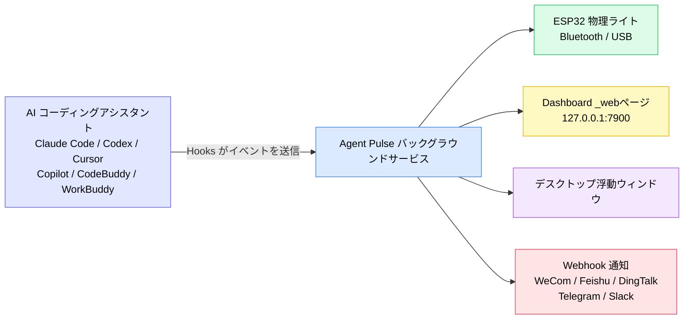
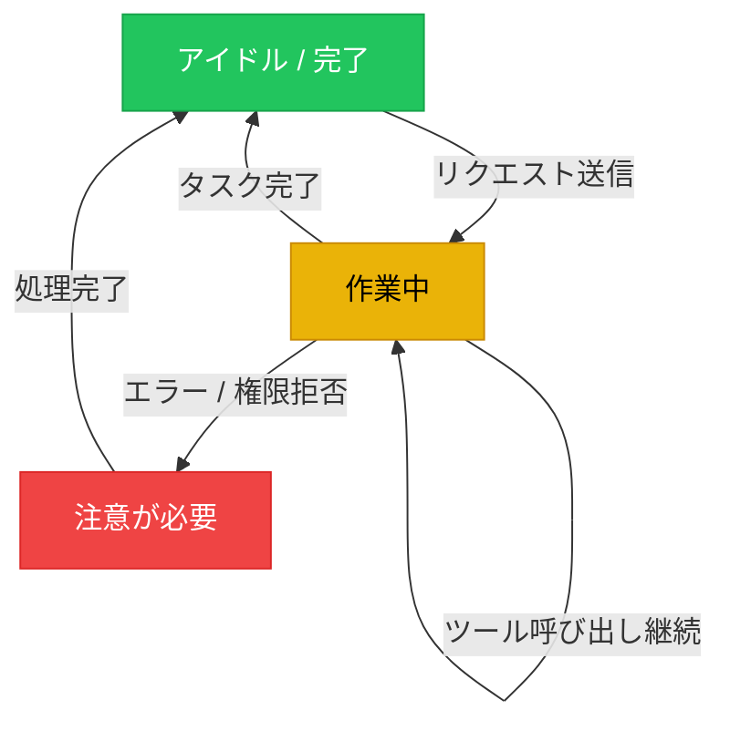
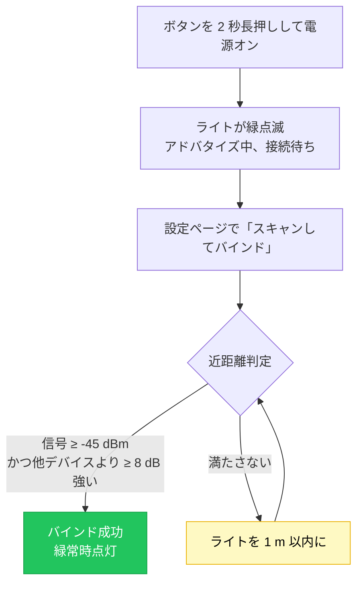
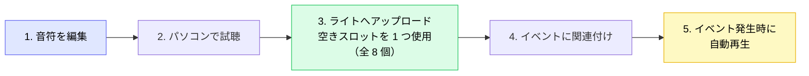
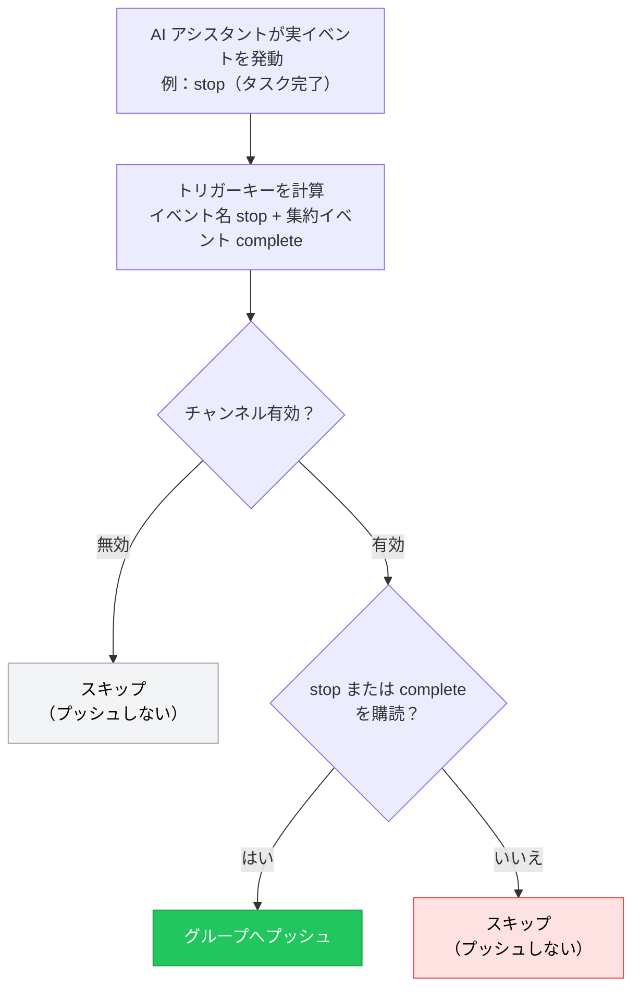

[简体中文](./README.zh-CN.md) | [English](./README.md) | **日本語** | [繁體中文](./README.zh-TW.md) | [한국어](./README.ko.md) | [Français](./README.fr.md) | [Deutsch](./README.de.md) | [Español](./README.es.md)

# Agent Pulse ユーザーガイド

**Agent Pulse** は、AI コーディングアシスタントの状態に合わせて色が変わるデスクトップの照明ライトです。ターミナルをずっと見て結果を待つ必要はありません。ライトの色をちらりと見るだけで、タスクが「実行中」「完了」「エラー」のどれかがわかります。

- **現在のソフトウェアバージョン**: 0.4.6
- **内蔵ハードウェアライトのファームウェアバージョン**: `0.1.24+25`
- **更新履歴**: [CHANGELOG.md](CHANGELOG.md) を参照

**対応 AI コーディングアシスタント**: Claude Code · Codex · WorkBuddy · CodeBuddy · Cursor · Copilot

### 仕組み



一言で言えば：**AI アシスタントが Hooks を通じて状態を Agent Pulse に伝え、Agent Pulse がその状態をライト・Web ページ・浮動ウィンドウ・チャットグループに配信します。**

> ⚠️ 図の中で **Hooks が最も重要な部分**です。Hooks をインストールしないと、Agent Pulse はいかなるイベントも受信できず、その後の出力にも一切反応しません。

---

## 目次

- [1. クイックスタート（5 分）](#1-クイックスタート5-分)
- [2. ステータス色の見方](#2-ステータス色の見方)
- [3. インストールとアップデート](#3-インストールとアップデート)
- [4. ライトの接続](#4-ライトの接続)
- [5. ハードウェアライトの使い方](#5-ハードウェアライトの使い方)
- [6. デスクトップ画面](#6-デスクトップ画面)
- [7. 音楽](#7-音楽)
- [8. Webhook 通知](#8-webhook-通知)
- [9. 複数アシスタントと複数デバイス](#9-複数アシスタントと複数デバイス)
- [10. データとプライバシー](#10-データとプライバシー)
- [11. よくある質問](#11-よくある質問)
- [12. 注意事項](#12-注意事項)

---

## 1. クイックスタート（5 分）

初めて使う場合は、以下の 4 ステップを順に行うと、ライトがタスクに合わせて色を変えるのを確認できます。

### ステップ 1：ソフトウェアのインストール（お使いのシステムを選択）

| システム | ダウンロード | インストール方法 |
| --- | --- | --- |
| Windows 10 1809+ / 11 | **[`AgentPulseSetup-0.4.6.exe` をダウンロード](https://github.com/lzty634158-oss/agent-pulse-release/releases/latest)** | ダブルクリックでインストール。完了後、起動時に自動起動 |
| macOS（Apple Silicon / Intel） | **[`AgentPulse-0.4.6.pkg` をダウンロード](https://github.com/lzty634158-oss/agent-pulse-release/releases/latest)** | ダブルクリックで案内に従ってインストール |
| Ubuntu（コレクターのみ） | **[コレクターをダウンロード](https://gitee.com/lzty634158/agent-pulse-linux-collector-release)** | [Ubuntu コレクター](#34-ubuntu-コレクター任意) を参照 |

> **中国国内でダウンロードが遅い場合？** Gitee ミラー（GitHub と同一内容）をご利用ください：
> - Windows / macOS インストーラー：<https://gitee.com/lzty634158/agent-pulse-release/releases>
> - macOS 専用リポジトリ：<https://gitee.com/lzty634158/agent-pulse-macos-release>

インストール完了後、Agent Pulse はバックグラウンドで常駐し、トレイ／メニューバーにアイコンが表示されます。

### ステップ 2：Hooks のインストール

#### 注意：通常のインストールで自動的にインストールされます。動作しない場合は再インストールしてください。

Hooks は Agent Pulse と AI アシスタントをつなぐ「メッセンジャー」です。**Hooks をインストールしないと、ライトは一切反応しません。**

1. ブラウザで設定ページを開きます：<http://127.0.0.1:4321/?lang=ja>
2. お使いの AI アシスタントのカード（Claude Code / Cursor など）を見つけます
3. カード上の **「Hooks をインストール」** ボタンをクリックします
4. インストール成功すると、カードに「インストール済み」と表示されます


> **Codex ユーザーへ**：Hooks をインストールすると、Codex はそれを「信頼されていない項目」として扱います。Hooks を実際に有効にするには、Codex でそのプロジェクトを信頼済みとしてマークする必要があります。

> **ヒント**：ソフトウェアのインストール時、Hooks が自動でインストールされるのは **設定ファイルがすでに存在する** AI アシスタントのみです。後から新しい AI アシスタントを追加した場合は、設定ページに戻って手動で一度インストールしてください。

### ステップ 3：ライトの電源を入れて接続

| 接続方法 | 用途 | 方法 |
| --- | --- | --- |
| **Bluetooth**（推奨） | ライトを机に置き、配線したくない場合 | ライトのボタンを 2 秒長押しして電源オン → ライトが緑点滅（接続待ち）に → 設定ページで「スキャンしてバインド」をクリック → **ライトをパソコンから 1 m 以内**にしてバインド完了 **【補足：近距離通信は信号強度が -45dBm 以上の場合にライトを自動接続・バインドします。見つからない場合はシステムのペアリングメニューからペアリングできます】** |
| **USB** | 充電しながら使いたい、または Bluetooth 干渉が激しい場合 | データケーブルでライトとパソコンを接続 → 設定ページで該当シリアルポートを選択。**USB 接続は Bluetooth より優先され、USB 接続中は Bluetooth が自動切断、USB 切断で Bluetooth のアドバタイズ接続が自動再開されます** |

### ステップ 4：成功の確認

新しいセッションを開き、AI アシスタントにリクエスト（例：「関数を書いて」）を送り、ライトを観察します：

- [ ] リクエスト送信後、ライトが**黄色**（作業中）になる
- [ ] タスク完了後、ライトが**緑色**（アイドル／完了）になる
- [ ] Dashboard <http://127.0.0.1:7900> を開くとリアルタイムのイベントストリームが表示される

ライトが反応しない場合は、[よくある質問 - ライトが点かない・色がおかしい](#ライトが点かない色がおかしい) へ直接お進みください。

---

## 2. ステータス色の見方

Agent Pulse は AI アシスタントの状態を 3 つの**意味的ステータス**にまとめ、それぞれを色に対応させます：

| 色 | 意味 | 典型的なシナリオ |
| --- | --- | --- |
| 緑 | アイドル／完了 | タスク終了、セッション終了、次の指示待ち |
| 黄 | 作業中 | 考え中、ツール呼び出し中、コード記述中 |
| 赤 | 注意が必要 | エラー、ツール呼び出し失敗、権限拒否 |

**ステータス遷移図：**



### 意味的ステータスとイベントの配色（0.4.5 からの重要な変更）

バージョン 0.4.5 以降、Agent Pulse は**意味的ステータス優先**の設計を採用しています：

- Agent Pulse はまず AI アシスタントが「現在どの状態か」（アイドル／作業中／エラー）を判断し、その状態からライトの色を決定します；
- 個別のイベントに対して色とモードを**自分で指定することもできます**（[6.2 設定ページ](#62-設定ページ) 参照）。あなたの設定が最優先されます。

**例**：デフォルトでは `stop`（タスク完了）は緑になりますが、`stop` を手動で「赤＋点滅」に設定すると、タスク完了時に赤点滅します——あなたの設定が優先されます。

### ライトのモード

色に加えて、ライトの**表示モード**も設定できます：

| モード | 効果 | 向いている場面 |
| --- | --- | --- |
| `solid` 常時点灯 | 安定して点灯 | ほとんどの場面 |
| `blink` 点滅 | 周期的な点滅 | 注意が必要な場合（エラーなど） |
| `breathe` 呼吸 | 明るさがゆっくり変化 | 待機中、スタンバイ |
| 交互モード | 赤黄／黄緑／赤緑の交互 | 複合状態の区別 |

---

## 3. インストールとアップデート

### 3.1 Windows インストーラー

**[`AgentPulseSetup-0.4.6.exe` をダウンロード](https://github.com/lzty634158-oss/agent-pulse-release/releases/latest)** し、ダブルクリックで実行し、案内に従ってインストールを完了します。

> 中国国内のユーザーは Gitee をご利用ください：<https://gitee.com/lzty634158/agent-pulse-release/releases>

- デフォルトのインストール先：`C:\Users\<ユーザー名>\AppData\Local\Programs\AgentPulse\`
- デフォルトで起動時に自動起動（インストール後にバックグラウンドサービスが起動）
- スタートメニューから Agent Pulse を探せます

> インストール時にウイルス対策ソフトがブロックする場合は、実行を許可してください（未署名のインストーラーでは通知が出ます）。

### 3.2 macOS インストーラー

**[`AgentPulse-0.4.6.pkg` をダウンロード](https://github.com/lzty634158-oss/agent-pulse-release/releases/latest)** し、ダブルクリックでインストールウィザードの案内に従います。または AI プロンプト経由でのインストールも可。AI プロンプトでのインストールを推奨します。失敗したらそのまま AI に送って解決できます。

> 中国国内のユーザーは Gitee をご利用ください（Windows / macOS 両方あり）：<https://gitee.com/lzty634158/agent-pulse-release/releases>
> macOS 専用リポジトリ：<https://gitee.com/lzty634158/agent-pulse-macos-release>

macOS の詳しいインストール手順は [macos-install/RELEASE_INSTALL.md](macos-install/RELEASE_INSTALL.md) を参照してください。

- **アーキテクチャの選択**：Apple Silicon（M 系）は `arm64`、Intel は `x86_64` を選択。不明な場合はユニバーサルパッケージを選択
- **署名と公証**：パッケージは Developer ID で署名され Apple の公証を経ているため、通常 Gatekeeper にブロックされません
- **初回起動**：「ネットワーク接続を許可」「Bluetooth を許可」などの権限リクエストが表示される場合があります。「許可」をクリックしてください

### 3.3 アプリのアップデート

Agent Pulse は自動的にアップデートを確認します：

1. まず **Gitee** を確認（中国国内は高速）
2. Gitee が利用できない場合は自動的に **GitHub** にフォールバック

アップデート処理は自動的にダウンロード・適用され、**設定・音楽・デバイスバインドは保持されます**。

**手動アップデート**：新しいインストーラーをダウンロードし、ダブルクリックで上書きインストールするだけで、データも失われません。

### 3.4 Ubuntu コレクター（任意）

Ubuntu サーバー上の AI アシスタントの状態も Dashboard に送信したい場合は、コレクターを導入できます。

まずランタイムパッケージをダウンロード：<https://gitee.com/lzty634158/agent-pulse-linux-collector-release>

```bash
# Ubuntu マシンで実行（sudo が必要）
sudo bash deploy/ubuntu/collector/install.sh
```

詳細な設定は `deploy/ubuntu/collector/README.md` を参照してください。

> これは**任意の機能**です。Windows / macOS のローカルでのみ利用する場合は完全にスキップできます。

---

## 4. ライトの接続

### 4.1 Bluetooth 接続（推奨）

**初回バインドの流れ：**

1. ライトのボタンを 2 秒長押しして電源オン
2. ライトが**緑点滅**になり、接続待ちであることを示します
3. 設定ページ <http://127.0.0.1:4321/?lang=ja> を開きます
4. 「スキャンしてバインド」をクリックします
5. ライトを**パソコンから 1 m 以内**に持ってきて、バインド完了を待ちます

**なぜ近づける必要があるのか？** 隣の同僚のライトに接続してしまわないよう、バインド時に「近距離」判定を行っています：

- 各デバイスを 3 回サンプリングし、取得した信号強度（RSSI）が **≥ -45 dBm** であること
- かつ最も近いデバイスが、他の候補デバイスより **≥ 8 dB** 信号が強いこと

バインド成功後はこのライトが記憶され、以降の電源オン時に自動的に再接続され、再バインドは不要です。

**バインドの流れ：**



**画面の Bluetooth ステータスアイコン**（Dashboard と浮動ウィンドウに表示）：

| アイコン | 意味 |
| --- | --- |
|  | Bluetooth 接続済み |
|  | 接続中 |
|  | デバイスをスキャン中 |
|  | Bluetooth 切断 |
|  | Bluetooth 異常 |

### 4.2 USB シリアル接続

**データケーブル**（充電専用ではない）でライトとパソコンを接続します。

- Windows のデバイスマネージャーに **`ESP32-C3 USB JTAG/serial debug unit`** が表示されるはずです
- 設定ページのシリアルポート一覧で該当ポートを選択します

> **USB は Bluetooth より優先**：ケーブル接続中は USB を使用し、抜くと自動的に Bluetooth に戻ります。

### 4.3 複数のライト

複数の Agent Pulse ライトがある場合、「どのライトにどのプロジェクトの状態を表示するか」を指定できます：

| ルーティング方法 | 説明 |
| --- | --- |
| **最新を追跡** | すべてのライトが、最も最近アクティブなタスクの状態を表示 |
| **プロジェクト指定** | 特定のプロジェクトを特定のライトに固定 |
| **アシスタント指定** | 特定の AI アシスタントの状態を特定のライトに固定 |

Dashboard の「デバイス管理」ページで複数ライトとルーティングルールを設定します。

---

## 5. ハードウェアライトの使い方

### 5.1 ボタン操作

| 操作 | 長さ | 効果 |
| --- | --- | --- |
| **長押し** | ≥ 2 秒 | 電源オン／オフ |
| **短押し** | 押して離す | 現在のバッテリーを表示（ライト効果のヒント）。未接続の場合は Bluetooth アドバタイズも再開 |

### 5.2 ライト効果クイックリファレンス

ライトのすべての「動作」は、今何が起きているかを教えてくれます：

| ライト効果 | 意味 |
| --- | --- |
| 🟢 **緑点滅** | Bluetooth オン、アドバタイズ中、接続待ち |
| 🟢 **緑常時点灯** | Bluetooth 接続済み（ホスト接続） |
| 🟢 **緑点滅に戻る** | Bluetooth 切断、デバイスが再びアドバタイズを開始し接続待ち |
| 🔴→🟢→🟡→消灯（3 回ループ） | **識別点滅**：ホストの「デバイスを識別」コマンドに応答。素早く赤→緑→黄→消灯を 3 回（各 200ms）繰り返した後、元の状態に戻り、複数のライトの中から見つけやすくします |
| 🔴→🟢→🟡（各 1 秒） | **接続アニメーション**：接続成功時のフィードバック。赤→緑→黄を各 1 秒点灯した後、元の状態に戻ります |
| 🔴 **赤点滅** | Bluetooth アドバタイズがタイムアウト（60 秒接続なし）するとアドバタイズを停止 |

> ⚠️ **青色ライトについての重要な説明**：現在の HW v2 / ESP32-C3-next 実機には**赤・黄・緑の 3 つの独立した LED しかなく、青色 LED はありません**。そのため**青や紫には点灯しません**。
> Dashboard と浮動ウィンドウの**青い Bluetooth アイコンは、パソコン側が Bluetooth をスキャンまたは接続中であることを意味するだけ**です。これはパソコン側 UI の状態表示であり、**デバイスが青く点灯することを意味しません**。画面の青いアイコンとライトの実際の色を対応させないでください。

### 5.3 バッテリーと音

**バッテリー表示**（短押しで確認）：

短押し後、ライトは**点灯する LED の数**でバッテリー残量の段階を約 2 秒間示し、その後元の状態に戻ります：

| 電圧 | ライト効果（点灯 LED） | 説明 |
| --- | --- | --- |
| ≥ 4.00V | 🔴🟢🟡 赤+緑+黄 **3 つ全点灯** | 十分 |
| 3.70V ~ 4.00V | 🔴🟡 赤+黄 **2 つ点灯** | 中程度 |
| < 3.70V | 🔴 **赤のみ点灯** | 低下、充電推奨 |

> 青色 LED がないため、バッテリーは「何個点灯するか」（3=満、2=中、1=低）で表現され、色の違いではありません。

**自動保護**：バッテリーが 3.20V を下回り 60 秒継続すると、バッテリーの過放電を防ぐためライトは自動的に電源オフになります。

**音のスイッチ**：設定ページの「輝度と音」で設定します。**デフォルトはオフ**で、必要な場合は手動でオンにしてください。

### 5.4 ファームウェアアップデート

ハードウェアライトのファームウェアに新バージョンがある場合、設定ページからアップデートできます。

**アップデート前に必ず確認してください（満たさないと失敗します）：**

1. **ハードウェア ID が `agentpulse-esp32c3-next` であること** —— それ以外のハードウェアは非対応
2. **`.ino.bin` ファイルのみアップロード** —— `.bin` / `.elf` / `.map` / `bootloader` / `partitions` などのファイルはアップロードしないでください
3. **デバイスが `ESP32-C3 USB JTAG/serial debug unit` として表示されていること**
4. **給電と接続を安定させること** —— アップデート中はケーブルを抜いたり電源を切ったりしないでください

**アップデート中のライト効果：**

| ライト効果 | 段階 |
| --- | --- |
| 黄色常時点灯 | 新ファームウェアを受信・検証中（アップグレード全体を通して黄色常時点灯） |
| ライト消灯 | 再起動中（成功・失敗にかかわらず再起動） |

> **アップデートに失敗したら？** 慌てないでください。デバイスはデュアルパーティション設計で、失敗時は自動的に旧ファームウェアにロールバックし、元のライト効果を復元します。再起動すればそのまま使用できます。

---

## 6. デスクトップ画面

Agent Pulse は 2 つの Web インターフェースを提供します：

| 画面 | アドレス | 用途 |
| --- | --- | --- |
| **Dashboard** | <http://127.0.0.1:7900> | リアルタイムの状態とイベントストリームの表示、デバイス管理 |
| **設定ページ** | <http://127.0.0.1:4321/?lang=ja> | すべての設定はここにあります |

### 6.1 Dashboard

<http://127.0.0.1:7900> を開くと以下が表示されます：

<!-- スクリーンショット枠：docs/screenshots/ に dashboard.png を配置後、以下の行のコメントを外してください

-->

- **リアルタイムイベントパネル**：AI アシスタントの各イベント（プロンプト送信、ツール呼び出し、タスク完了……）が時系列でスクロール表示
- **現在の状態**：どの色・どのモード・どのプロジェクト／アシスタントからか
- **ステータスバー形式**：`ライト効果[モード] + 色 + プロジェクト名 + アシスタント名 + 経過時間`、例：
  ```
  常時点灯 緑  my-project  claude-code  経過 00:02:15
  ```
- **デバイス管理**：複数ライトの状態確認とルーティング設定

### 6.2 設定ページ

<http://127.0.0.1:4321/?lang=ja> を開きます。すべての設定の入り口です。


<!-- スクリーンショット枠：「イベントとライト方案」セクションのスクリーンショットを config-events-section.png として保存後、以下の行のコメントを外してください

-->

#### 通知と停滞判定

| 設定項目 | デフォルト | 説明 |
| --- | --- | --- |
| デスクトップ通知 | オフ | 状態変化時にシステム通知を出すか |
| タスク完了時に通知 | オン | タスク完了（緑）時に通知 |
| エラー時に通知 | オン | エラー（赤）時に通知 |
| 停滞の可能性時に通知 | オン | 黄が設定時間を超えて続いた時に通知 |
| 停滞判定時間 | 5 分 | 黄がどれくらい続けば「停滞の可能性」とするか |

#### イベントとライト方案

これが最もよく使う部分です——**各イベントごとにライトの色・モード・音楽を再生するかを設定できます**。

**対応イベント（AI アシスタントにより多少異なります）：**

| イベント | 意味 |
| --- | --- |
| `session-start` | セッション開始 |
| `session-end` | セッション終了 |
| `user-prompt-submit` | ユーザープロンプト送信 |
| `pre-tool-use` | ツール呼び出し前 |
| `post-tool-use` | ツール呼び出し後 |
| `post-tool-use-failure` | ツール呼び出し失敗 |
| `permission-request` | 権限リクエスト |
| `permission-denied` | 権限拒否 |
| `notification` | 通知 |
| `stop` | タスク完了 |
| `stop-failure` | タスク失敗 |
| `error-occurred` | エラー発生 |
| `elicitation` | 補足情報のリクエスト |

**AI アシスタントごとの対応イベント：**

| AI アシスタント | 対応イベント |
| --- | --- |
| **Claude Code** | セッション開始、プロンプト送信、ツール呼び出し前／後、権限リクエスト、権限拒否、通知、タスク完了、タスク失敗 |
| **Codex** | セッション開始、プロンプト送信、ツール呼び出し前／後、権限リクエスト、通知、タスク完了 |
| **WorkBuddy** | セッション開始、プロンプト送信、ツール呼び出し前／後、通知、タスク完了 |
| **CodeBuddy** | セッション開始、プロンプト送信、ツール呼び出し前／後、ツール呼び出し失敗、権限リクエスト、通知、タスク失敗、タスク完了、セッション終了 |
| **Cursor** | セッション開始、プロンプト送信、ツール呼び出し前／後、ツール呼び出し失敗、権限リクエスト、通知、タスク失敗、タスク完了 |
| **Copilot** | セッション開始、プロンプト送信、ツール呼び出し後、タスク完了、エラー発生、セッション終了 |

> 設定ページには、**現在のアシスタントが実際に発生させるイベントのみ**が表示され、発生しないイベントを設定してしまうことを防ぎます。

**アシスタントごとに個別設定**：該当アシスタントのタブに切り替えると、そのイベント配色を個別に設定できます。「デフォルト」タブの設定はすべてのアシスタントのグローバルなフォールバックとして機能します。

#### 輝度と音

| 設定項目 | デフォルト | 説明 |
| --- | --- | --- |
| 緑の輝度 | 30% | 3 色の輝度を別々に設定 |
| 黄の輝度 | 30% | |
| 赤の輝度 | 30% | |
| 点滅周期 | 1000 ms | 点滅モードの 1 周期の時間 |
| 呼吸周期 | 2000 ms | 呼吸モードの 1 回の呼吸の時間 |
| 音を有効化 | オフ | 効果音を再生するか |

#### Hooks 管理

各 AI アシスタントのカードには **「Hooks をインストール」** ボタンがあり、インストールするとカードに「インストール済み」と表示されます。アシスタントを変更・再インストールした場合は、クリックして再インストールしてください。

### 6.3 浮動ウィンドウ

有効にすると、デスクトップに半透明の小さなウィンドウが表示され、ブラウザを開かなくても現在の状態色とプロジェクト名がリアルタイムで表示されます。


---

## 7. 音楽

Agent Pulse は、特定のイベント発生時に効果音を再生でき、**[組み込み音](#71-組み込み音)** と **[カスタム音楽](#72-カスタム音楽エディター)** の両方に対応しています。

### 7.1 組み込み音

ライトには出荷時に 5 つの音が内蔵されており、ストレージを消費せずにそのまま使えます：

| 番号 | 名称 |
| --- | --- |
| 1 | 上昇通知 |
| 2 | ダブルクリック通知 |
| 3 | 完了通知 |
| 4 | 下降警告 |
| 5 | エコー通知 |

### 7.2 カスタム音楽エディター

設定ページの音楽セクションで、自分で曲を作れます。

<!-- スクリーンショット枠：docs/screenshots/ に music-editor.png を配置後、以下の行のコメントを外してください

-->

**音符パラメーターの制限：**

| パラメーター | 範囲 | 説明 |
| --- | --- | --- |
| 周波数 | 0 ~ 4000 Hz | **0 は休符（無音）** |
| 長さ | 20 ~ 2000 ms | 1 音符の長さ |
| 間隔 `gapMs` | 0 ~ 500 ms（デフォルト 10 ms） | 音符間の無音間隔 |

**曲全体の制限：**

- 最大 **64 音符**
- 合計長は **30 秒** 以内
- 名称は最大 **40 文字**

> **`gapMs`（間隔）とは？** 音符間の「休符」です。例えば 2 つの音符を別々に聞こえさせたい場合、前の音符に間隔を設定します。ファームウェアは「周波数 0 の無音音符」でこの休符を実現します。

### 7.3 ライトへのアップロード

**全体の流れ：**



カスタム音楽は、ライトにアップロードして初めて再生されます：

1. 設定ページの音楽セクションで曲を編集
2. **「デバイスにアップロード」** をクリック
3. アップロード完了を待ちます

**保存ルール：**

| 項目 | 説明 |
| --- | --- |
| スロット数 | **8 個**（番号 128 ~ 255） |
| 1 スロット容量 | **512 バイト** |
| 割り当て | 空きスロットを自動割り当て。満杯の場合は使っていない曲を先に削除 |
| 再アップロード | アップロード済みの曲は**元のスロットを再利用**し、バラバラにならない |

> **スロットが満杯の場合？** アップロード時に「カスタム音楽スロット 8 個が満杯です」と表示されます。設定ページで使わない曲を削除して空きを作ってください。

### 7.4 イベントへの関連付け

曲を編集・アップロードした後、それをイベントに関連付けます：

1. 「イベントとライト方案」へ進みます
2. 対象のイベント（例：`session-end` セッション終了）を見つけます
3. 「音楽」ドロップダウンで該当の曲を選択
4. 「1 回再生」または「繰り返し再生」を選択
5. 保存をクリック

以降、そのイベントが発生するたびに、ライトがこの曲を再生します。

### 7.5 試聴・削除・読み取り

| 操作 | 方法 |
| --- | --- |
| **試聴** | 音楽エディターで「試聴」をクリック。パソコン上でプレビュー（ライトは経由しない） |
| **削除** | 音楽リストで「削除」をクリック。パソコンとライトのスロット両方から削除 |
| **ライトから読み取り** | ライトにある音楽は設定ページで一覧表示可能。注意：**ファームウェアは元の音符データのみ保存し、曲名は保存しません** |

### 7.6 音楽のよくある質問

| 現象 | 原因と解決 |
| --- | --- |
| まったく音が出ない | 設定ページの「音を有効化」がオンになっているか確認（**デフォルトはオフ**） |
| 音符がつながって間隔がわからない | 音符に `gapMs` 間隔を設定（デフォルトは 10 ms のみで短すぎる可能性） |
| アップロード失敗でスロット満杯と表示 | 使っていない曲を削除してスロットを空ける |
| ライトを別のパソコンに移すと曲名が消える | 曲名はパソコン上にのみ存在。ライトのファームウェアは音符データのみ保存するため正常な動作 |

---

## 8. Webhook 通知

ライトの色を変えるだけでなく、Agent Pulse はイベントを **チャットグループ**（WeCom、Feishu、DingTalk、Telegram、Slack など）にもプッシュできます。

### 8.1 対応プラットフォーム

| プラットフォーム | 説明 |
| --- | --- |
| **WeCom（企業微信）** | グループボット Webhook |
| **Feishu（Lark）** | カスタムボット（署名検証対応） |
| **DingTalk** | カスタムボット（署名付きリクエスト対応） |
| **Telegram** | Bot API |
| **Slack** | Incoming Webhook |
| **カスタム** | JSON を受け取る任意の HTTPS アドレス |

### 8.2 通知チャンネルの追加

<!-- スクリーンショット枠：docs/screenshots/ に webhook-channels.png を配置後、以下の行のコメントを外してください

（現在 config-full.png に Webhook セクション全体が含まれています。後でより絞った個別スクリーンショットを追加可能）
-->

1. 設定ページ → **Webhook 通知** セクションを開きます
2. 「チャンネルを追加」をクリックします
3. 以下を入力：
   - **名称**：自分向けのメモ（例：「プロジェクトグループ」）
   - **プラットフォーム**：上の表から 1 つ選択
   - **Webhook URL**：該当プラットフォームの「グループボット」設定から取得
   - **シークレット**（Feishu／DingTalk で必要）：ボットのセキュリティ設定の署名シークレット
   - **有効**：**必ずチェック**。チェックしないとプッシュされません
4. 受信したい**イベント**をチェックします
5. 保存をクリックします

> **URL は HTTPS である必要があります**。そうでない場合は保存が拒否されます。

### 8.3 イベント購読（最も重要なステップ）

各チャンネルは受信するイベントを個別にチェックできます。イベントは 2 種類あります：

**集約イベント（推奨）** —— 一連のシナリオをカバーし、より安心：

| 集約イベント | 発動タイミング |
| --- | --- |
| `complete` | タスク完了 **または** セッション終了（緑） |
| `error` | エラー発生（赤） |
| `stuck` | 黄が「停滞判定時間」を超えて継続 |

**元のイベント** —— 単一イベントへの正確な一致。例：`stop`、`session-end`、`error-occurred` など（[イベント表](#イベントとライト方案) 参照）。

> **推奨**：「タスク完了とセッション終了の両方に通知」したい場合は **`complete`** をチェックしてください。`stop` と `session-end` の両方をカバーします。
> 元の `session-end` だけをチェックすると、「タスク完了（`stop`）」は**プッシュされません**。

**イベントはどうマッチングされるか？**（この図を理解すれば「なぜプッシュされないか」を自分で調査できます）：



> 2 つのボタンの違いに注意：**「テスト」** は上のマッチング判定をスキップして直接送信するため（常に送信される）；
> **「シミュレーション送信」** は実イベントとまったく同じマッチングロジックを通り、「どのチャンネルがマッチし、どれがスキップされたか、理由は何か」を報告します。[8.4](#84-テストとシミュレーション送信) を参照。

### 8.4 テストと「シミュレーション送信」

設定ページには 2 つのトラブルシューティングツールがあります：

| ボタン | 機能 | 使うタイミング |
| --- | --- | --- |
| **テスト** | チャンネルにテストメッセージを直接送信。**イベント購読はチェックしない** | URL とシークレットが正しいか検証 |
| **シミュレーション送信** | 実イベントと**まったく同じマッチングロジック**を通り、「どのチャンネルがマッチし、どれがスキップされたか、理由は何か」を報告 | イベント購読が正しくペアになっているか検証 |

**推奨トラブルシューティングの流れ：**

1. まず「テスト」をクリック → グループにメッセージが届けば、URL とチャンネル本体に問題なし
2. 次に「シミュレーション送信」をクリック → フィードバックテキストを確認：
   - 「マッチ 1/1、『プロジェクトグループ』へプッシュ済み」と表示 → 設定は正しく、グループに届きます
   - 「『プロジェクトグループ』をスキップ（stop/complete を購読していない）」と表示 → **イベントのチェックが正しくない**ため、該当イベントをチェックして再度保存

### 8.5 Webhook のよくある質問

| 現象 | 原因と解決 |
| --- | --- |
| **テストは送信されるが、実イベントはプッシュされない** | ほぼ必ず以下のいずれか：<br>① チャンネルの「有効」がチェックされていない（新規チャンネルは必ずチェック）<br>② イベント購読が正しくチェックされていない（[8.3](#83-イベント購読最も重要なステップ) 参照）。「シミュレーション送信」で即座に特定可能 |
| **保存後リロードすると画面が英語に戻る** | 修正済み（0.4.6）。旧バージョンを使っている場合は、アドレスバーに `?lang=ja` を付けて設定ページを開く |
| **シミュレーション送信で「シミュレーション失敗」と表示** | リクエストが新しいバックエンドに届いていないことを意味します。Agent Pulse を**再起動**（トレイアイコンを完全に終了してから起動）し、0.4.6 が動いていることを確認 |
| **テスト／削除／シミュレーションのボタンが反応しない** | 0.4.6 にアップグレードしてください。旧バージョンには画面スクリプトの問題があります |
| **URL が不正と表示される** | Webhook アドレスは `https://` で始まる必要があります |
| **Feishu／DingTalk が届かない** | シークレットが正しく入力されているか確認。Feishu と DingTalk は署名アルゴリズムが異なるため、プラットフォーム種別が正しいか確認 |

---

## 9. 複数アシスタントと複数デバイス

### 9.1 対応 AI アシスタント

Agent Pulse は 6 種類の AI コーディングアシスタントに対応し、**複数を同時にインストール可能**で、互いに干渉しません：

| アシスタント | 設定ページタブ |
| --- | --- |
| Claude Code | `claude` |
| Codex | `codex` |
| WorkBuddy | `workbuddy` |
| CodeBuddy | `codebuddy` |
| Cursor | `cursor` |
| Copilot | `copilot` |

### 9.2 アシスタントごとの独立設定

該当アシスタントのタブに切り替えると、以下を個別に設定できます：

- 各イベントのライト色とモード
- 各イベントで再生する音楽
- 停滞判定などのパラメーター

「デフォルト」タブの設定はグローバルなフォールバックとして機能し、個別設定のないアシスタントは「デフォルト」の設定を引き継ぎます。

### 9.3 複数のライト

[4.3 複数のライト](#43-複数のライト) を参照。Dashboard の「デバイス管理」でルーティングルールを設定します。

---

## 10. データとプライバシー

### ローカルディレクトリ

Agent Pulse のデータは**すべて自分のパソコンに保存**され、いかなるサーバーにもアップロードされません。

| システム | データディレクトリ |
| --- | --- |
| Windows | `%LOCALAPPDATA%\AgentPulse\` |
| macOS | `~/Library/Application Support/AgentPulse/` |

**ディレクトリの内容：**

| ファイル／フォルダー | 説明 |
| --- | --- |
| `config.json` | すべての設定（イベント、輝度、Webhook チャンネルなど） |
| `music/` | 編集したカスタム音楽のソースファイル |
| `devices.json` | バインド済みライトデバイスの情報 |

### 再インストール／アンインストールでデータは保持される？

**0.4.5 以降、再インストールもアンインストールもユーザーデータを保持します。**

- **保持**：`config.json`、`music/`、`devices.json` などの個人データ
- **削除**：プログラムファイルとバックグラウンドサービス

つまり、ソフトウェアの更新や再インストール後も、これまでに設定したすべてのイベント・音楽・Webhook チャンネル・デバイスバインド**はそのまま残り**、再設定は不要です。

> すべてのデータを**完全に消去**したい場合は、上記のデータディレクトリを手動で削除する必要があります。

---

## 11. よくある質問

### Dashboard が開かない

1. Agent Pulse が起動しているか確認（トレイ／メニューバーアイコンを確認）
2. Agent Pulse を完全に終了してから再起動
3. ブラウザで <http://127.0.0.1:7900> にアクセスしているか確認
4. 7900 ポートが他のプログラムに占有されている場合は、パソコンを再起動して再試行

### ライトが点かない・色がおかしい

順に調査します：

1. **Hooks はインストール済み？** → 設定ページ <http://127.0.0.1:4321/?lang=ja> を開き、該当アシスタントのカードに「インストール済み」と表示されているか確認。**これが最も一般的な原因です。**
2. **ライトは接続されている？** → ライト効果を確認：緑点滅＝接続待ち、緑常時点灯＝接続済み
3. **イベントの配色を変更した？** → 特定のイベントの色を手動設定した場合、その設定が優先されます（[意味的ステータスとイベントの配色](#意味的ステータスとイベントの配色045-からの重要な変更) 参照）
4. **輝度が 0 では？** → 設定ページの輝度設定を確認
5. **Codex ユーザー** → Codex でプロジェクトが「信頼済み」としてマークされているか確認

### 音楽が鳴らない

1. 設定ページの「音を有効化」がオンになっているか確認（**デフォルトはオフ**）
2. 該当イベントに音楽が関連付けられているか確認（音楽番号が 0 ではないこと）
3. カスタム音楽が「デバイスにアップロード」済みか
4. 「試聴」をクリックし、曲自体に問題がないか確認

### Webhook がプッシュされない

[8.5 Webhook のよくある質問](#85-webhook-のよくある質問) を参照。

### Bluetooth が接続できない

1. バインド前にライトを**パソコンから 1 m 以内**に持ってくる（近距離判定は信号 ≥ -45 dBm かつ他デバイスより ≥ 8 dB 強いことが必要）
2. ライトのボタンを短押しすると Bluetooth アドバタイズが再開（緑点滅）
3. パソコンの Bluetooth 設定で古い Agent Pulse のペアリングを削除し、再バインド
4. 周囲の Bluetooth デバイスが多く干渉が激しい場合は、**USB 接続**（優先度が高く安定）に切り替え

### USB デバイスが見つからない

1. **データケーブル**を使っているか確認（充電専用ではない）
2. Windows のデバイスマネージャーに **`ESP32-C3 USB JTAG/serial debug unit`** が表示されるはず
3. 「不明なデバイス」と表示される場合はドライバーのインストールが必要な可能性
4. 別の USB ポートを試す（前面パネルによっては給電不足の場合あり）

### 通知が頻繁すぎる

1. 「停滞判定時間」を大きくする（デフォルト 5 分）
2. 不要な通知項目をオフにする（例：「停滞の可能性時に通知」をオフ）
3. Webhook チャンネルで、本当に気になるイベントだけをチェック

---

## 12. 注意事項

- **ファームウェアアップデートは慎重に**：`.ino.bin` ファイルのみアップロードし、ハードウェア ID は `agentpulse-esp32c3-next` であること。アップデート中は**ケーブルを抜いたり電源を切ったりしないでください**。詳細は [5.4 ファームウェアアップデート](#54-ファームウェアアップデート)。
- **低バッテリー保護**：バッテリーが 3.20V を下回り 60 秒継続すると自動的に電源オフになります。これはバッテリーを保護するためで、故障ではありません。
- **OTA アップグレードには十分なバッテリーが必要**：バッテリーが 3.60V 未満の場合はファームウェアアップグレードが拒否されます。先に充電してください。
- **Hooks は必ずインストール**：Hooks がないと Agent Pulse はいかなるイベントも受信できず、ライトは一切反応しません。
- **Webhook は HTTPS が必要**：セキュリティ上、`https://` で始まる Webhook アドレスのみ受け付けます。
- **カスタム音楽のスロットは限られている**：ライトのカスタム音楽スロットは 8 個のみ。使っていない曲は定期的に削除してください。

---

## その他のリソース

### ダウンロード一覧

| 用途 | リンク |
| --- | --- |
| **Windows / macOS インストーラー**（GitHub） | <https://github.com/lzty634158-oss/agent-pulse-release/releases/latest> |
| **Windows / macOS インストーラー**（Gitee 中国ミラー） | <https://gitee.com/lzty634158/agent-pulse-release/releases> |
| **macOS 専用リポジトリ** | <https://gitee.com/lzty634158/agent-pulse-macos-release> |
| **Ubuntu コレクター** | <https://gitee.com/lzty634158/agent-pulse-linux-collector-release> |

### ドキュメント

- **更新履歴**: [CHANGELOG.md](CHANGELOG.md)
- **ファームウェアアップグレード説明**: [firmware/README.md](firmware/README.md)
- **macOS インストール説明**: [macos-install/RELEASE_INSTALL.md](macos-install/RELEASE_INSTALL.md)
- **Bluetooth ブリッジツール**: [ble-bridge/](ble-bridge/)
- **Ubuntu 導入説明**: [deploy/ubuntu/README.md](deploy/ubuntu/README.md)
