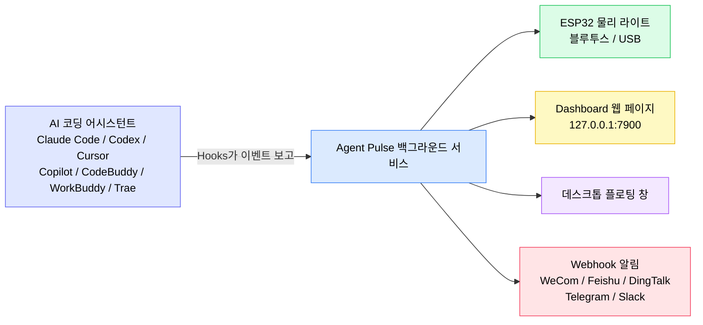
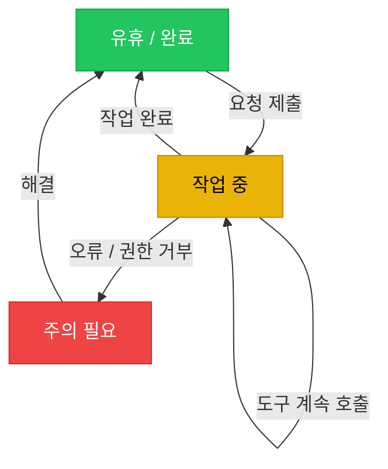
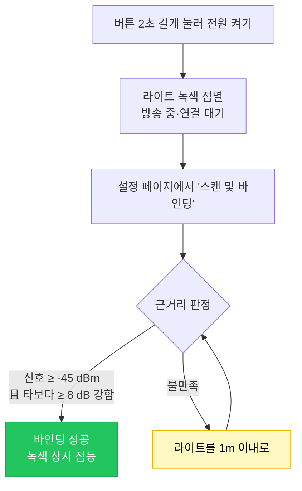
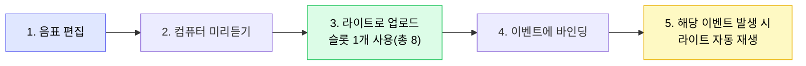
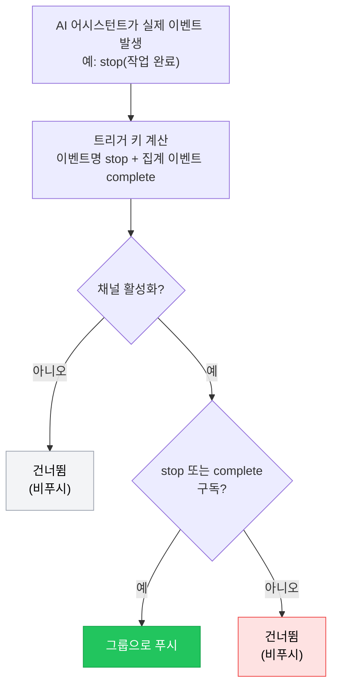

[English](README.md) | [한국어](./README.ko.md) | [日本語](./README.ja.md) | [简体中文](./README.zh-CN.md) | [繁體中文](./README.zh-TW.md) | [Español](./README.es.md) | [Français](./README.fr.md) | [Deutsch](./README.de.md)

# Agent Pulse 튜토리얼

**Agent Pulse**는 AI 코딩 어시스턴트의 상태에 맞춰 색이 변하는 데스크톱 앰비언트 라이트입니다. 터미널을 지켜보지 않아도 라이트 색만 봐도 작업이 "진행 중", "완료", "오류"인지 알 수 있습니다.

- **현재 소프트웨어 버전**: 0.4.7
- **내장 하드웨어 라이트 펌웨어 버전**: `0.1.24+25`
- **버전 기록**: [CHANGELOG.md](CHANGELOG.md) 참조

**지원 AI 코딩 어시스턴트**: Claude Code · Codex · WorkBuddy · CodeBuddy · Cursor · Copilot · Trae

### 작동 방식



한 줄 요약: **AI 어시스턴트가 Hooks로 상태를 Agent Pulse에 알리고, Agent Pulse가 그 상태를 라이트·웹 페이지·플로팅 창·채팅 그룹으로 배포합니다.**

> ⚠️ 그림에서 **Hooks가 가장 중요합니다**. Hooks가 설치되지 않으면 Agent Pulse는 이벤트를 받지 못하고 이후 단계는 모두 반응하지 않습니다.

---

## 목차

- [1. 빠른 시작 (5분)](#1-빠른-시작-5분)
- [2. 상태 색상 이해](#2-상태-색상-이해)
- [3. 설치 및 업데이트](#3-설치-및-업데이트)
- [4. 라이트 연결](#4-라이트-연결)
- [5. 하드웨어 라이트 사용](#5-하드웨어-라이트-사용)
- [6. 데스크톱 인터페이스](#6-데스크톱-인터페이스)
- [7. 음악](#7-음악)
- [8. Webhook 알림](#8-webhook-알림)
- [9. 여러 어시스턴트와 여러 장치](#9-여러-어시스턴트와-여러-장치)
- [10. 데이터 및 개인정보](#10-데이터-및-개인정보)
- [11. 자주 묻는 질문](#11-자주-묻는-질문)
- [12. 주의 사항](#12-주의-사항)

---

## 1. 빠른 시작 (5분)

처음 사용한다면 다음 4단계를 순서대로 하면 라이트가 작업에 맞춰 색이 변하는 것을 볼 수 있습니다.

### 1단계: 소프트웨어 설치 (OS에 맞게 선택)

| 시스템 | 다운로드 | 설치 방법 |
| --- | --- | --- |
| Windows 10 1809+ / 11 | **[`AgentPulseSetup-0.4.7.exe` 다운로드](https://github.com/lzty634158-oss/agent-pulse-release/releases/latest)** | 더블클릭 설치, 완료 후 자동 시작 |
| macOS (Apple Silicon / Intel) | **[`AgentPulse-0.4.7.pkg` 다운로드](https://github.com/lzty634158-oss/agent-pulse-release/releases/latest)** | 더블클릭 후 안내 따르기 |
| Ubuntu (수집기만) | **[Collector 다운로드](https://gitee.com/lzty634158/agent-pulse-linux-collector-release)** | [Ubuntu Collector](#34-ubuntu-collector-선택) 참조 |

> **중국 내 다운로드가 느린 경우**: Gitee 미러 사용 (GitHub과 동일 내용):
> - Windows / macOS 설치 파일: <https://gitee.com/lzty634158/agent-pulse-release/releases>
> - macOS 전용 저장소: <https://gitee.com/lzty634158/agent-pulse-macos-release>

설치 후 Agent Pulse는 백그라운드에서 실행되며 트레이 / 메뉴 막대에 아이콘이 표시됩니다.

### 2단계: Hooks 설치

#### 참고: 일반 설치 시 Hooks가 자동 설치됩니다. 작동하지 않으면 재설치하세요.

Hooks는 Agent Pulse와 AI 어시스턴트 사이의 "전달자"입니다. **Hooks가 설치되지 않으면 라이트는 전혀 반응하지 않습니다.**

1. 브라우저에서 설정 페이지 열기: <http://127.0.0.1:4321/?lang=ko>
2. 사용 중인 AI 어시스턴트 카드 찾기 (Claude Code / Cursor / Trae 등)
3. 카드의 **"Hooks 설치"** 버튼 클릭
4. 성공하면 카드에 "설치됨" 표시


> **Codex 사용자**: Hooks 설치 후 Codex는 이를 "신뢰되지 않은 프로젝트"로 표시합니다. Codex 설정에서 "훅" 항목을 찾아 해당 프로젝트를 신뢰됨으로 표시해야 Hooks가 실제로 적용됩니다.

> **Claude Code 사용자**: Hooks 설치 후 CCSwitch로 모델을 전환하면 CCSwitch가 당사의 Hook 설정을 덮어쓸 수 있습니다. 이 경우 설정 페이지에서 다시 "설치"를 클릭하세요.

> **팁**: 소프트웨어 설치 시 Hooks가 자동 설치되는 것은**설정 파일이 이미 존재하는** AI 어시스턴트뿐입니다. 나중에 새 AI 어시스턴트를 설치했다면 설정 페이지로 돌아가 수동으로 한 번 설치하세요.

### 3단계: 라이트 켜고 연결

| 연결 방식 | 상황 | 방법 |
| --- | --- | --- |
| **블루투스** (추천) | 라이트를 책상에 두고 선 없이 사용 | 버튼 2초 길게 눌러 전원 켜기 → 라이트가 녹색 점멸(연결 대기) → 설정 페이지에서 "스캔 및 바인딩" 클릭 → **라이트를 컴퓨터 1m 이내**로 두고 바인딩 완료 **[참고: 근거리 통신은 신호 강도가 -45dB 초과 시 자동 연결·바인딩되며, 그렇지 않으면 검색되지 않습니다. 시스템 페어링 메뉴에서 연결할 수도 있습니다]** |
| **USB** | 사용하며 충전하고 싶거나 블루투스 간섭이 심할 때 | 데이터 케이블로 라이트와 컴퓨터 연결 → 설정 페이지에서 해당 포트 선택. **USB는 블루투스보다 우선순위가 높으며, USB 연결 시 블루투스 자동 해제, USB 해제 시 블루투스 방송 재개** |

### 4단계: 성공 확인

새 세션을 열고 AI 어시스턴트에 요청(예: "함수 하나 작성해줘")을 보낸 뒤 라이트 관찰:

- [ ] 제출 후 라이트가 **노란색**(작업 중)으로 변함
- [ ] 완료 후 라이트가 **녹색**(유휴 / 완료)으로 변함
- [ ] Dashboard <http://127.0.0.1:7900>를 열면 실시간 이벤트 스트림 표시

라이트가 반응하지 않으면 [자주 묻는 질문 - 라이트가 켜지 않거나 색이 이상함](#라이트가-켜지지-않거나-색이-이상함)으로.

---

## 2. 상태 색상 이해

Agent Pulse는 AI 어시스턴트의 상태를 3가지 **의미 상태**로 요약하고 각각에 색을 할당합니다:

| 색 | 의미 | 전형적 상황 |
| --- | --- | --- |
| 녹색 | 유휴 / 완료 | 작업 종료, 세션 종료, 다음 명령 대기 |
| 노란색 | 작업 중 | 생각 중, 도구 호출 중, 코드 작성 중 |
| 빨간색 | 주의 필요 | 오류, 도구 호출 실패, 권한 거부 |

**상태 전이도:**



### 의미 상태 vs 이벤트 색상 (0.4.5 이후 중요 변경)

0.4.5부터 Agent Pulse는 **의미 상태 우선** 설계를 사용합니다:

- Agent Pulse는 먼저 AI 어시스턴트가 "어떤 상태인지"(유휴 / 작업 중 / 오류)를 판단하고, 그 상태로 라이트 색을 결정합니다.
- 단일 이벤트에 색과 모드를 **개별 지정**할 수도 있습니다([6.2 설정 페이지](#62-설정-페이지) 참조). 사용자 설정이 최우선입니다.

**예**: 기본적으로 `stop`(작업 완료)은 녹색이지만, `stop`을 "빨강 + 점멸"로 수동 설정하면 작업 완료 시 빨강 점멸합니다. 사용자 설정이 적용됩니다.

### 라이트 모드

색 외에도 라이트의 **표시 모드**를 설정할 수 있습니다:

| 모드 | 효과 | 적합한 상황 |
| --- | --- | --- |
| `solid` 상시 점등 | 안정적으로 켜짐 | 대부분 상황 |
| `blink` 점멸 | 주기적 켜짐/꺼짐 | 주의 환기(오류 등) |
| `breathe` 호흡 | 밝기가 서서히 출렁임 | 대기 중 |
| 교대 | 빨강-노랑 / 노랑-녹색 / 빨강-녹색 교대 | 복합 상태 구분 |

---

## 3. 설치 및 업데이트

### 3.1 Windows 설치 파일

**[`AgentPulseSetup-0.4.7.exe` 다운로드](https://github.com/lzty634158-oss/agent-pulse-release/releases/latest)**, 더블클릭 실행 후 안내에 따라 설치.

> 중국 사용자는 Gitee도 가능: <https://gitee.com/lzty634158/agent-pulse-release/releases>

- 기본 설치 위치: `C:\Users\<사용자명>\AppData\Local\Programs\AgentPulse\`
- 기본 자동 시작(설치 후 백그라운드 서비스 자동 시작)
- 시작 메뉴에서 Agent Pulse 확인 가능

> 백신이 설치를 차단하면 실행을 허용하세요(서명되지 않은 설치 파일은 경고가 뜰 수 있음).

### 3.2 macOS 설치 파일

**[`AgentPulse-0.4.7.pkg` 다운로드](https://github.com/lzty634158-oss/agent-pulse-release/releases/latest)**, 더블클릭 후 설치 마법사 따르기. 또는 AI 프롬프트로 설치 가능(추천. 실패 시 AI에 오류를 보내 해결).

> 중국 사용자는 Gitee도 가능(Windows / macOS 모두): <https://gitee.com/lzty634158/agent-pulse-release/releases>
> macOS 전용 저장소: <https://gitee.com/lzty634158/agent-pulse-macos-release>

macOS 상세는 [macos-install/RELEASE_INSTALL.md](macos-install/RELEASE_INSTALL.md) 참조.

- **아키텍처 선택**: Apple Silicon(M 계열)은 `arm64`, Intel은 `x86_64`, 모르면 유니버설 패키지
- **서명 및 공증**: Developer ID로 서명되고 Apple 공증 완료. 보통 Gatekeeper에 막히지 않음
- **첫 실행**: "네트워크 연결 허용", "블루투스 허용" 등 권한 대화상자가 뜸. "허용" 클릭

### 3.3 프로그램 업데이트

Agent Pulse는 자동으로 업데이트를 확인합니다:

1. 우선 **Gitee** 확인(국내 빠름)
2. Gitee 사용 불가 시 자동으로 **GitHub**로 폴백

업데이트는 자동 다운로드·적용되며, **설정·음악·장치 바인딩은 모두 유지**됩니다.

**수동 업데이트**: 새 설치 파일 다운로드 후 더블클릭으로 덮어쓰기 설치. 데이터도 유실되지 않음.

### 3.4 Ubuntu Collector (선택)

Ubuntu 서버의 AI 어시스턴트 상태도 Dashboard로 푸시하고 싶다면 수집기를 배포할 수 있습니다.

실행 패키지 먼저 다운로드: <https://gitee.com/lzty634158/agent-pulse-linux-collector-release>

```bash
# Ubuntu 머신에서 실행(sudo 필요)
sudo bash deploy/ubuntu/collector/install.sh
```

상세는 `deploy/ubuntu/collector/README.md` 참조.

> 이는 **선택 기능**입니다. Windows / macOS 로컬만 사용한다면 완전히 건너뛰어도 됩니다.

---

## 4. 라이트 연결

### 4.1 블루투스 연결 (추천)

**최초 바인딩 흐름:**

1. 버튼 2초 길게 눌러 전원 켜기
2. 라이트가 **녹색 점멸** 상태가 되어 연결 대기 중임을 표시
3. 설정 페이지 <http://127.0.0.1:4321/?lang=ko> 열기
4. "스캔 및 바인딩" 클릭
5. 라이트를 **컴퓨터 1m 이내**로 가져가 바인딩 완료 대기

**왜 가까이 있어야 하나요?** 옆 동료의 라이트에 연결되지 않도록 바인딩 시 "근거리" 판정을 합니다:

- 각 장치를 3회 샘플링하여 신호 강도(RSSI)가 **≥ -45 dBm**여야 함
- 그리고 가장 가까운 장치가 다른 후보보다 **≥ 8 dB** 강해야 함

바인딩 성공 시 라이트가 기억되며, 이후 전원 켜질 때마다 자동 재연결되어 재바인딩 불필요.

**바인딩 흐름:**



**UI의 블루투스 상태 아이콘**(Dashboard와 플로팅 창에 표시):

| 아이콘 | 의미 |
| --- | --- |
|  | 블루투스 연결됨 |
|  | 연결 중 |
|  | 장치 검색 중 |
|  | 블루투스 연결 끊김 |
|  | 블루투스 오류 |

### 4.2 USB 시리얼 연결

**데이터 케이블**(충전 전용 아님)로 라이트와 컴퓨터 연결.

- Windows 장치 관리자에 **`ESP32-C3 USB JTAG/serial debug unit`** 표시되어야 함
- 설정 페이지 시리얼 포트 목록에서 해당 포트 선택만 하면 됨

> **USB는 블루투스보다 우선**: 연결 중에는 USB 사용, 뽑으면 자동으로 블루투스로 복귀.

### 4.3 여러 라이트

여러 Agent Pulse 라이트가 있다면 "어떤 라이트에 어떤 프로젝트 상태를 표시할지" 지정 가능:

| 라우팅 방식 | 설명 |
| --- | --- |
| **최신 추적** | 모든 라이트가 가장 최근 활성 작업 상태 표시 |
| **프로젝트 지정** | 특정 프로젝트를 특정 라이트에 고정 |
| **어시스턴트 지정** | 특정 AI 어시스턴트 상태를 특정 라이트에 고정 |

Dashboard의 "장치 관리" 페이지에서 여러 라이트와 라우팅 규칙 설정.

---

## 5. 하드웨어 라이트 사용

### 5.1 버튼 조작

| 조작 | 길이 | 효과 |
| --- | --- | --- |
| **길게 누르기** | ≥ 2초 | 전원 켜기 / 끄기 |
| **짧게 누르기** | 누르고 바로 뗌 | 현재 배터리 표시(라이트 효과 힌트). 미연결 시 블루투스 방송도 재활성화 |

### 5.2 라이트 효과 빠른 참조

라이트의 모든 "동작"은 무슨 일이 일어났는지 알려줍니다:

| 라이트 효과 | 의미 |
| --- | --- |
| 🟢 **녹색 점멸** | 블루투스 켜짐, 방송 중, 연결 대기 |
| 🟢 **녹색 상시 점등** | 블루투스 연결됨(호스트 연결) |
| 🟢 **녹색 점멸로 복귀** | 블루투스 끊김, 장치가 방송 재개하여 연결 대기 |
| 🔴→🟢→🟡→소등(3회 루프) | **식별 점멸**: 호스트의 "장치 식별" 명령에 응답. 빨강→녹색→노랑→소등을 3회 빠르게 루프(각 200ms) 후 원래 상태 복귀. 여러 라이트 중 찾기 쉽게 |
| 🔴→🟢→🟡(각 1초) | **연결 애니메이션**: 연결 성공 시 피드백. 빨강→녹색→노랑을 각 1초 점등 후 원래 상태 복귀 |
| 🔴 **빨강 점멸** | 블루투스 방송 타임아웃(60초 미연결)으로 방송 중지 |

> ⚠️ **파란색 라이트에 대한 중요 설명**: 현재 HW v2 / ESP32-C3-next 물리 장치는**빨강·노랑·녹색 3개 LED만 있고 파란색 LED는 없습니다**. 따라서**파랑이나 보라색으로 켜지지 않습니다**.
> Dashboard와 플로팅 창의**파란색 블루투스 아이콘은 컴퓨터가 블루투스를 스캔하거나 연결 중임을 나타내는 UI 상태 표시**일 뿐,**장치가 파랗게 켜지는 것이 아닙니다**. UI의 파란 아이콘을 라이트의 실제 색에 대응시키지 마세요.

### 5.3 배터리와 사운드

**배터리 표시**(짧게 누르기로 확인):

짧게 누르면 라이트는 **켜진 LED 개수**로 배터리 수준을 약 2초간 표시한 후 원래 상태로 복귀:

| 전압 | 라이트 효과(켜진 LED) | 설명 |
| --- | --- | --- |
| ≥ 4.00V | 🔴🟢🟡 빨+녹+노 **3개 전부 점등** | 충분 |
| 3.70V ~ 4.00V | 🔴🟡 빨+노 **2개 점등** | 중간 |
| < 3.70V | 🔴 **빨강만 점등** | 낮음, 충전 권장 |

> 파란 LED가 없으므로 배터리는 "켜진 개수"(3=만땅, 2=중간, 1=낮음)로 표현, 색으로 구분하지 않음.

**자동 보호**: 전압이 3.20V 미만으로 60초 지속되면 배터리 과방전 방지를 위해 자동 전원 꺼짐.

**사운드 토글**: 설정 페이지 "밝기 및 사운드"에서 설정.**기본 끄기**. 필요 시 수동 켜기.

### 5.4 펌웨어 업데이트

새 하드웨어 라이트 펌웨어가 있으면 설정 페이지에서 업데이트 가능.

**업데이트 전 반드시 확인(충족하지 않으면 실패):**

1. **하드웨어 ID는 `agentpulse-esp32c3-next`여야 함** —— 다른 하드웨어는 미지원
2. **`.ino.bin` 파일만 업로드** —— `.bin` / `.elf` / `.map` / `bootloader` / `partitions` 등은 업로드하지 않음
3. **장치가 `ESP32-C3 USB JTAG/serial debug unit`으로 표시되어야 함**
4. **전원과 연결 안정적으로 유지** —— 업데이트 중 뽑거나 끄지 말 것

**업데이트 중 라이트 효과:**

| 라이트 효과 | 단계 |
| --- | --- |
| 노랑 상시 점등 | 새 펌웨어 수신 및 검증 중(전체 업데이트 동안 노랑 상시 점등 유지) |
| 소등 | 재시작 중(성공·실패 모두 재시작) |

> **업데이트 실패?** 당황하지 마세요. 장치는 이중 파티션 설계라 실패 시 이전 펌웨어로 자동 롤백하고 원래 라이트 효과 복원. 재시작 후 재사용 가능.

---

## 6. 데스크톱 인터페이스

Agent Pulse는 두 가지 웹 인터페이스를 제공합니다:

| 인터페이스 | 주소 | 용도 |
| --- | --- | --- |
| **Dashboard** | <http://127.0.0.1:7900> | 실시간 상태·이벤트 스트림 보기, 장치 관리 |
| **설정 페이지** | <http://127.0.0.1:4321/?lang=ko> | 모든 설정은 여기 |

### 6.1 Dashboard

<http://127.0.0.1:7900> 열기:

<!-- 스크린샷 자리: dashboard.png를 docs/screenshots/에 넣으면 아래 줄 주석 해제

-->

- **실시간 이벤트 패널**: 각 AI 어시스턴트 이벤트(프롬프트 제출, 도구 호출, 작업 완료…)가 시간순 스크롤
- **현재 상태**: 어떤 색·모드·프로젝트 / 어시스턴트인지
- **상태 표시줄 형식**: `라이트 효과[모드] + 색 + 프로젝트명 + 어시스턴트명 + 경과시간`, 예:
  ```
  상시점등 녹색  my-project  claude-code  경과 00:02:15
  ```
- **장치 관리**: 여러 라이트 상태 확인 및 라우팅 설정

### 6.2 설정 페이지

<http://127.0.0.1:4321/?lang=ko> 열기. 모든 설정의 입구.


<!-- 스크린샷 자리: "이벤트와 라이트 스키마" 섹션을 config-events-section.png로 저장 후 아래 줄 주석 해제

-->

#### 알림 및 멈춤 감지

| 설정 | 기본값 | 설명 |
| --- | --- | --- |
| 데스크톱 알림 | 끄기 | 상태 변경 시 시스템 알림 표시 여부 |
| 작업 완료 시 알림 | 켜기 | 작업 완료(녹색) 시 알림 |
| 오류 시 알림 | 켜기 | 오류(빨강) 시 알림 |
| 멈춤 가능성 알림 | 켜기 | 노란색이 설정 시간 초과 지속 시 알림 |
| 멈춤 판정 시간 | 5분 | 노란색이 얼마나 지속되면 "멈춤 가능성"으로 볼지 |

#### 이벤트와 라이트 스키마

가장 많이 쓰는 부분——**각 이벤트마다 라이트 색·모드·음악 재생 여부를 설정**할 수 있습니다.

**지원 이벤트(AI 어시스턴트마다 약간 다름):**

| 이벤트 | 의미 |
| --- | --- |
| `session-start` | 세션 시작 |
| `session-end` | 세션 종료 |
| `user-prompt-submit` | 사용자 프롬프트 제출 |
| `pre-tool-use` | 도구 호출 전 |
| `post-tool-use` | 도구 호출 후 |
| `post-tool-use-failure` | 도구 호출 실패 |
| `permission-request` | 권한 요청 |
| `permission-denied` | 권한 거부 |
| `notification` | 알림 |
| `stop` | 작업 완료 |
| `stop-failure` | 작업 실패 |
| `error-occurred` | 오류 발생 |
| `elicitation` | 추가 정보 요청 |

**각 AI 어시스턴트 지원 이벤트:**

| AI 어시스턴트 | 지원 이벤트 |
| --- | --- |
| **Claude Code** | 세션 시작, 프롬프트 제출, 도구 전/후, 권한 요청, 권한 거부, 알림, 작업 완료, 작업 실패 |
| **Codex** | 세션 시작, 프롬프트 제출, 도구 전/후, 권한 요청, 알림, 작업 완료 |
| **WorkBuddy** | 세션 시작, 프롬프트 제출, 도구 전/후, 알림, 작업 완료 |
| **CodeBuddy** | 세션 시작, 프롬프트 제출, 도구 전/후, 도구 실패, 권한 요청, 알림, 작업 실패, 작업 완료, 세션 종료 |
| **Cursor** | 세션 시작, 프롬프트 제출, 도구 전/후, 도구 실패, 권한 요청, 알림, 작업 실패, 작업 완료 |
| **Copilot** | 세션 시작, 프롬프트 제출, 도구 후, 작업 완료, 오류 발생, 세션 종료 |
| **Trae** | 세션 시작, 프롬프트 제출, 도구 전/후, 권한 요청, 알림, 작업 완료 |

> 설정 페이지에는 **현재 어시스턴트가 실제로 발생시키는** 이벤트만 표시되어, 발생하지 않을 이벤트를 설정하는 것을 방지합니다.

**권한 게이트(보안 주의)**: Trae / WorkBuddy / CodeBuddy는 네이티브 권한 대화상자가 없습니다. 설정 페이지에서 해당 어시스턴트 탭으로 전환해 이벤트 행 **"권한 요청 (permission-request)"**의 색을 "끄기" 이외로 설정하면 보안 게이트가 활성화됩니다(기본은 빨강+점멸). 활성화 시 **모든 도구 호출마다 사용자 확인을 요청하고 빨간 라이트가 켜집니다**. 실행하는 명령과 무관하게 위험 명령 목록을 관리할 필요가 없습니다. "끄기"로 하면 게이트 비활성화.

**어시스턴트별 설정**: 해당 어시스턴트 탭으로 전환하면 개별 이벤트 색 설정 가능. "기본" 탭은 모든 어시스턴트의 전역 fallback.

#### 밝기 및 사운드

| 설정 | 기본값 | 설명 |
| --- | --- | --- |
| 녹색 밝기 | 30% | 3색을 따로 설정 가능 |
| 노란색 밝기 | 30% | |
| 빨간색 밝기 | 30% | |
| 점멸 주기 | 1000 ms | 1 점멸 사이클 시간 |
| 호흡 주기 | 2000 ms | 1 호흡 시간 |
| 사운드 사용 | 끄기 | 알림음 재생 여부 |

#### Hooks 관리

각 AI 어시스턴트 카드에 **"Hooks 설치"** 버튼이 있고, 설치 후 "설치됨" 표시. 어시스턴트 전환이나 재설치 시 클릭해 재설치.

### 6.3 플로팅 창

활성화하면 데스크톱에 반투명 작은 창이 나타나 브라우저를 열지 않아도 현재 상태 색과 프로젝트명을 실시간 표시.


---

## 7. 음악

Agent Pulse는 특정 이벤트 발생 시 효과음을 재생할 수 있으며 **내장 음향**과 **사용자 정의 음악**을 모두 지원합니다.

### 7.1 내장 음향

라이트 출고 시 5개 내장 음향이 들어 있어 저장 공간을 차지하지 않고 바로 사용 가능:

| # | 이름 |
| --- | --- |
| 1 | 상승 큐 |
| 2 | 더블클릭 큐 |
| 3 | 완료 큐 |
| 4 | 하강 경고 |
| 5 | 에코 큐 |

### 7.2 사용자 정의 음악 편집기

설정 페이지 음악 섹션에서 직접 작곡 가능.

<!-- 스크린샷 자리: music-editor.png를 docs/screenshots/에 넣으면 아래 줄 주석 해제

-->

**음표 매개변수 제한:**

| 매개변수 | 범위 | 설명 |
| --- | --- | --- |
| 주파수 | 0 ~ 4000 Hz | **0은 쉼표(무음)** |
| 길이 | 20 ~ 2000 ms | 1 음표 지속 시간 |
| 간격 `gapMs` | 0 ~ 500 ms(기본 10 ms) | 음표间 무음 간격 |

**곡 전체 제한:**

- 최대 **64 음표**
- 총 시간 30초 이하
- 이름 최대 **40자**

> **`gapMs`(간격)란?** 음표 사이의 "쉼"입니다. 두 음표를 분리해 들리고 싶으면 앞 음표에 간격 설정. 펌웨어는 주파수 0 무음 음표로 이 쉼을 구현합니다.

### 7.3 라이트로 업로드

**전체 흐름:**



사용자 정의 음악은 재생하려면 라이트로 업로드:

1. 설정 페이지 음악 섹션에서 곡 편집
2. **"장치로 업로드"** 클릭
3. 업로드 완료 대기

**저장 규칙:**

| 항목 | 설명 |
| --- | --- |
| 슬롯 수 | **8개**(번호 128 ~ 255) |
| 슬롯당 용량 | **512 바이트** |
| 할당 | 빈 슬롯 자동 할당. 꽉 차면 안 쓰는 곡 삭제 |
| 재업로드 | 한번 업로드한 곡은 **원래 슬롯 재사용**, 뒤죽박죽 안 됨 |

> **슬롯 꽉 참?** 업로드 시 "사용자 정의 음악 슬롯 8개 꽉 참" 경고. 안 쓰는 곡 삭제해 공간 확보.

### 7.4 이벤트에 바인딩

곡 편집·업로드 후 이벤트에 바인딩:

1. "이벤트와 라이트 스키마"로
2. 대상 이벤트(예: `session-end` 세션 종료) 찾기
3. "음악" 드롭다운에서 곡 선택
4. "한 번 재생" 또는 "반복" 선택
5. 저장 클릭

이후 해당 이벤트 발생 시 라이트가 곡 재생.

### 7.5 미리듣기·삭제·읽기

| 조작 | 방법 |
| --- | --- |
| **미리듣기** | 음악 편집기에서 "미리듣기" 클릭. 컴퓨터에서 미리보기(라이트 경유 아님) |
| **삭제** | 음악 목록에서 "삭제" 클릭. 컴퓨터와 라이트 슬롯 모두에서 제거 |
| **라이트에서 읽기** | 라이트 내 음악은 설정 페이지에 나열 가능. 단**펌웨어는 원시 음표 데이터만 저장, 곡명은 저장 안 함** |

### 7.6 음악 FAQ

| 증상 | 원인과 해결 |
| --- | --- |
| 전혀 소리 없음 | 설정 페이지 "사운드 사용" 켜짐 확인(**기본 끄기**) |
| 음표가 붙어 들리고 간격 안 남 | 음표에 `gapMs` 간격 설정(기본 10ms는 너무 짧을 수 있음) |
| 업로드 실패, 슬롯 꽉 참 | 안 쓰는 곡 삭제해 공간 확보 |
| 라이트를 다른 컴퓨터로 옮기니 곡명 없음 | 곡명은 컴퓨터에만 있음. 라이트 펌웨어는 음표 데이터만 저장, 정상 |

---

## 8. Webhook 알림

라이트 색 변화 외에 Agent Pulse는 이벤트를 **채팅 그룹**(WeCom, Feishu, DingTalk, Telegram, Slack 등)으로 푸시할 수 있습니다.

### 8.1 지원 플랫폼

| 플랫폼 | 설명 |
| --- | --- |
| **WeCom** | 그룹 봇 Webhook |
| **Feishu** | 사용자 정의 봇(서명 검증 지원) |
| **DingTalk** | 사용자 정의 봇(서명 URL 지원) |
| **Telegram** | Bot API |
| **Slack** | Incoming Webhook |
| **사용자 정의** | JSON을 받는 모든 HTTPS 엔드포인트 |

### 8.2 알림 채널 추가

<!-- 스크린샷 자리: webhook-channels.png를 docs/screenshots/에 넣으면 아래 줄 주석 해제

(현재 config-full.png에 Webhook 섹션 전체 포함. 나중에 더 집중된 단독 스크린샷 추가 가능)
-->

1. 설정 페이지 → **Webhook 알림** 섹션 열기
2. "채널 추가" 클릭
3. 입력:
   - **이름**: 메모(예 "프로젝트 그룹")
   - **플랫폼**: 위 표 중 하나
   - **Webhook URL**: 플랫폼 "그룹 봇" 설정에서 획득
   - **시크릿**(Feishu / DingTalk 필요): 봇 보안 설정 내 서명 시크릿
   - **활성화**: **반드시 체크**, 미체크 시 푸시 안 됨
4. 받을 **이벤트** 체크
5. 저장 클릭

> **URL은 HTTPS여야 함**, 그렇지 않으면 저장 거부.

### 8.3 이벤트 구독(가장 중요한 단계)

각 채널은 받을 이벤트를 개별 체크 가능. 이벤트는 두 종류:

**집계 이벤트(추천)** —— 한 부류 상황을 포괄, 걱정 없음:

| 집계 이벤트 | 트리거 |
| --- | --- |
| `complete` | 작업 완료 **또는** 세션 종료(녹색) |
| `error` | 오류 발생(빨강) |
| `stuck` | 노란색이 "멈춤 판정 시간" 초과 지속 |

**원시 이벤트** —— 단일 이벤트 정확 일치. 예: `stop`, `session-end`, `error-occurred` 등([이벤트 표](#이벤트와-라이트-스키마) 참조).

> **팁**: "작업 완료와 세션 종료 모두 알림" 원한다면 **`complete`** 체크. 이는 `stop`과 `session-end`를 모두 포괄.
> 원시 `session-end`만 체크하면 "작업 완료(`stop`)"는**푸시되지 않습니다**.

**이벤트는 어떻게 매칭되나?**(이 그림을 이해하면 "왜 안 오나"를 스스로 진단 가능):



> 두 버튼 차이 주의: **"테스트"**는 위 그림 매칭 판단을 건너뛰고 바로 전송(그래서 항상 도착);
> **"시뮬레이션 전송"**은 완전한 매칭 흐름을 거치며 어느 채널이 매칭되고 어느 것이 건너뛰었는지 이유와 함께 보고. [8.4](#84-테스트와-시뮬레이션-전송) 참조.

### 8.4 테스트와 "시뮬레이션 전송"

설정 페이지에는 두 가지 문제 해결 도구가 있습니다:

| 버튼 | 역할 | 사용 상황 |
| --- | --- | --- |
| **테스트** | 해당 채널로 테스트 메시지 직접 전송, **이벤트 구독은 검사 안 함** | URL과 시크릿이 맞는지 검증 |
| **시뮬레이션 전송** | 실제 이벤트**와 완전히 같은 매칭 로직**을 거치며 "어느 채널 매칭, 어느 것 건너뜀·이유" 보고 | 이벤트 구독 페어링이 맞는지 검증 |

**추천 문제 해결 흐름:**

1. 먼저 "테스트" 클릭 → 그룹에 도착하면 URL과 채널 자체는 문제 없음
2. 다음 "시뮬레이션 전송" 클릭 → 피드백 읽기:
   - "매칭 1/1, '프로젝트 그룹'으로 푸시" 표시 → 설정 정확, 그룹에 도착
   - "'프로젝트 그룹' 건너뜀(stop/complete 미구독)" 표시 → **이벤트가 제대로 체크 안 됨**. 해당 이벤트 체크 후 저장

### 8.5 Webhook FAQ

| 증상 | 원인과 해결 |
| --- | --- |
| **테스트는 오지만 실제 이벤트는 안 옴** | 거의 항상 다음 중 하나: <br>① 채널 "활성화" 미체크(새 채널은 반드시 체크) <br>② 이벤트 구독이 제대로 안 됨([8.3](#83-이벤트-구독가장-중요한-단계) 참조). "시뮬레이션 전송"으로 즉시 특정 |
| **저장 후 새로고침하면 UI가 영어로 되돌아감** | 수정됨(0.4.6). 구버전이라면 주소창에 `?lang=ko` 붙여 설정 페이지 열기 |
| **시뮬레이션 전송에서 "시뮬레이션 실패"** | 요청이 새 백엔드에 도달하지 않음. Agent Pulse **재시작**(트레이 아이콘 완전 종료 후 시작), 0.4.7 실행 확인 |
| **테스트/삭제/시뮬레이션 버튼 무반응** | 0.4.7로 업데이트. 구버전은 UI 스크립트 문제 있음 |
| **URL이 유효하지 않다고 표시** | Webhook 주소는 `https://`로 시작해야 함 |
| **Feishu / DingTalk 안 옴** | 시크릿이 정확한지 확인. Feishu와 DingTalk는 서명 알고리즘이 다르니 플랫폼 종류가 맞는지 확인 |

---

## 9. 여러 어시스턴트와 여러 장치

### 9.1 지원 AI 어시스턴트

Agent Pulse는 6개 AI 코딩 어시스턴트를 지원하며 **여러 개를 동시 설치** 가능, 상호 간섭 없음:

| 어시스턴트 | 설정 페이지 탭 |
| --- | --- |
| Claude Code | `claude` |
| Codex | `codex` |
| WorkBuddy | `workbuddy` |
| CodeBuddy | `codebuddy` |
| Cursor | `cursor` |
| Copilot | `copilot` |
| Trae | `trae` |

### 9.2 어시스턴트별 독립 설정

해당 어시스턴트 탭으로 전환하면 개별 설정 가능:

- 각 이벤트 라이트 색·모드
- 각 이벤트 재생 음악
- 멈춤 판정 등 매개변수

"기본" 탭 설정은 전역 fallback. 어시스턴트에 개별 설정이 없으면 "기본" 상속.

### 9.3 여러 라이트

[4.3 여러 라이트](#43-여러-라이트) 참조. Dashboard "장치 관리"에서 라우팅 규칙 설정.

---

## 10. 데이터 및 개인정보

### 로컬 디렉터리

Agent Pulse 데이터는 **모두 자신의 컴퓨터에 저장**되며 어떤 서버에도 업로드되지 않습니다.

| 시스템 | 데이터 디렉터리 |
| --- | --- |
| Windows | `%LOCALAPPDATA%\AgentPulse\` |
| macOS | `~/Library/Application Support/AgentPulse/` |

**디렉터리 내용:**

| 파일 / 폴더 | 설명 |
| --- | --- |
| `config.json` | 모든 설정(이벤트, 밝기, Webhook 채널 등) |
| `music/` | 편집한 사용자 정의 음악 소스 |
| `devices.json` | 바인딩된 라이트 장치 정보 |

### 재설치 / 제거 시 데이터 유지?

**0.4.5부터 재설치도 제거도 사용자 데이터를 유지합니다.**

- **유지**: `config.json`, `music/`, `devices.json` 등 개인 데이터
- **제거**: 프로그램 파일과 백그라운드 서비스

즉, 소프트웨어 업데이트나 재설치 후에도 이전에 설정한 모든 이벤트·음악·Webhook 채널·장치 바인딩**이 그대로 남아** 재설정 불필요.

> **모든 데이터를 완전히 지우려면** 위 데이터 디렉터리를 수동 삭제해야 합니다.

---

## 11. 자주 묻는 질문

### Dashboard가 안 열림

1. Agent Pulse 실행 중인지 확인(트레이 / 메뉴 막대 아이콘)
2. Agent Pulse 완전 종료 후 재시작
3. 브라우저가 <http://127.0.0.1:7900> 여는지 확인
4. 7900 포트를 다른 프로그램이 점유 중이면 컴퓨터 재시작 후 재시도

### 라이트가 켜지지 않거나 색이 이상함

순서대로 확인:

1. **Hooks 설치됐나?** → 설정 페이지 <http://127.0.0.1:4321/?lang=ko> 열어 해당 어시스턴트 카드 "설치됨" 확인.**가장 흔한 원인.**
2. **라이트 연결됐나?** → 라이트 효과: 녹색 점멸 = 연결 대기; 녹색 상시 = 연결됨
3. **이벤트 색 바꿨나?** → 이벤트에 수동 색 설정 시 그것이 우선([의미 상태 vs 이벤트 색상](#의미-상태-vs-이벤트-색상-045-이후-중요-변경) 참조)
4. **밝기가 0 아닌가?** → 설정 페이지 밝기 설정 확인
5. **Codex 사용자** → Codex에서 프로젝트가 "신뢰됨"으로 표시됐는지 확인

### 음악 안 나옴

1. 설정 페이지 "사운드 사용" 켜짐 확인(**기본 끄기**)
2. 해당 이벤트에 음악 바인딩됐는지(음악 번호가 0 아닌지)
3. 사용자 정의 음악이 "장치로 업로드"됐는지
4. "미리듣기"로 곡 자체 문제 없는지 확인

### Webhook 안 옴

[8.5 Webhook FAQ](#85-webhook-faq) 참조.

### 블루투스 연결 안 됨

1. 라이트를 **컴퓨터 1m 이내**로 가져가 바인딩(근거리 판정은 신호 ≥ -45 dBm且 타보다 ≥ 8 dB 강함)
2. 라이트 버튼 짧게 누르면 블루투스 방송 재활성화(녹색 점멸)
3. 컴퓨터 블루투스 설정에서 기존 Agent Pulse 페어링 삭제 후 재바인딩
4. 주변 블루투스 장치 많고 간섭 심하면 **USB 연결**로(우선순위 높음, 더 안정적)

### USB에서 장치 못 찾음

1. **데이터 케이블** 사용 중인지(충전 전용 아님)
2. Windows 장치 관리자에 **`ESP32-C3 USB JTAG/serial debug unit`** 표시되어야 함
3. "알 수 없는 장치"면 드라이버 설치 필요
4. 다른 USB 포트 시도(전면 패널은 급전 부족 가능)

### 알림 너무 잦음

1. "멈춤 판정 시간" 키우기(기본 5분)
2. 불필요한 알림 항목 끄기(예 "멈춤 가능성 알림" 끄기)
3. Webhook 채널에서 정말 관심 있는 이벤트만 체크

---

## 12. 주의 사항

- **펌웨어 업데이트는 신중히**: `.ino.bin`만 업로드, 하드웨어 ID는 `agentpulse-esp32c3-next`. 업데이트 중**뽑지 말고 끄지 말 것**. 상세는 [5.4 펌웨어 업데이트](#54-펌웨어-업데이트).
- **저배터리 보호**: 전압이 3.20V 미만으로 60초 지속 시 자동 전원 꺼짐. 배터리 보호为目的, 고장 아님.
- **OTA 업그레이드에는 충분한 배터리 필요**: 전압 3.60V 미만이면 펌웨어 업그레이드 거부. 먼저 충전.
- **Hooks 필수**: Hooks 없으면 Agent Pulse는 이벤트 받지 못하고 라이트 반응 없음.
- **Webhook은 HTTPS 필수**: 보안상 `https://`로 시작하는 Webhook 주소만 받음.
- **사용자 정의 음악 슬롯 제한**: 라이트 사용자 정의 음악 슬롯은 8개뿐. 안 쓰는 곡 정기 정리.

---

## 추가 리소스

### 다운로드 모음

| 용도 | 링크 |
| --- | --- |
| **Windows / macOS 설치 파일**(GitHub) | <https://github.com/lzty634158-oss/agent-pulse-release/releases/latest> |
| **Windows / macOS 설치 파일**(Gitee 국내 미러) | <https://gitee.com/lzty634158/agent-pulse-release/releases> |
| **macOS 전용 저장소** | <https://gitee.com/lzty634158/agent-pulse-macos-release> |
| **Ubuntu Collector** | <https://gitee.com/lzty634158/agent-pulse-linux-collector-release> |

### 문서

- **버전 기록**: [CHANGELOG.md](CHANGELOG.md)
- **펌웨어 업그레이드 가이드**: [firmware/README.md](firmware/README.md)
- **macOS 설치 가이드**: [macos-install/RELEASE_INSTALL.md](macos-install/RELEASE_INSTALL.md)
- **블루투스 브리지 도구**: [ble-bridge/](ble-bridge/)
- **Ubuntu 배포 가이드**: [deploy/ubuntu/README.md](deploy/ubuntu/README.md)
