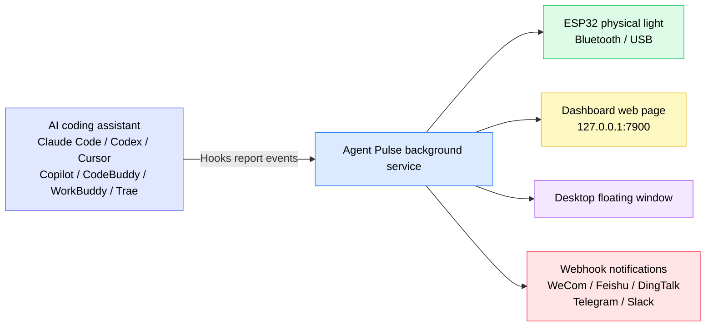
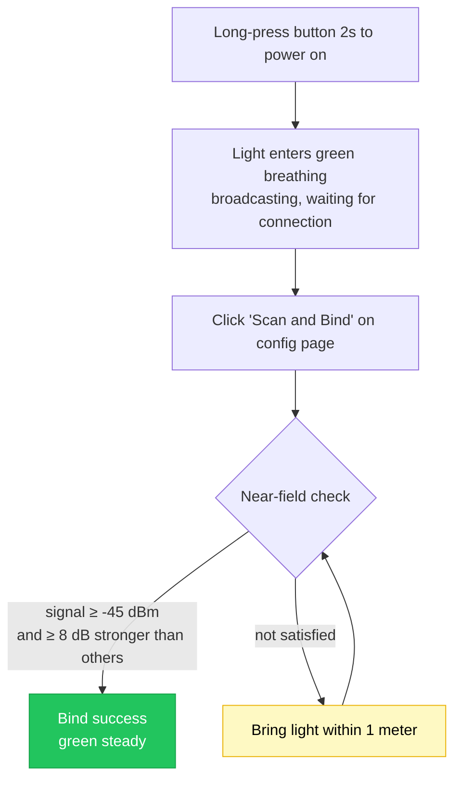
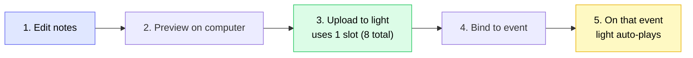
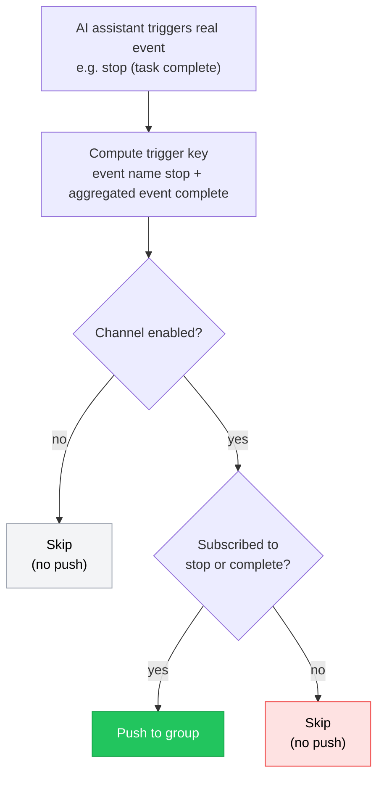

[English](README.md) | [한국어](./README.ko.md) | [日本語](./README.ja.md) | [简体中文](./README.zh-CN.md) | [繁體中文](./README.zh-TW.md) | [Español](./README.es.md) | [Français](./README.fr.md) | [Deutsch](./README.de.md)

# Agent Pulse Tutorial

**Agent Pulse** is a desktop ambient light that changes color with the status of your AI coding assistant. You no longer need to stare at the terminal waiting for results — a glance at the light tells you whether a task is "running", "done", or "errored".

- **Current software version**: 0.4.7
- **Built-in hardware light firmware version**: `0.1.24+25`
- **Version history**: see [CHANGELOG.md](CHANGELOG.md)

**Supported AI coding assistants**: Claude Code · Codex · WorkBuddy · CodeBuddy · Cursor · Copilot · Trae

### How does it work?



In one sentence: **the AI assistant tells Agent Pulse its status via Hooks, and Agent Pulse distributes that status to the light, the web page, the floating window, and your chat groups.**

> ⚠️ The **Hooks in the diagram are the most critical piece**. Without Hooks installed, Agent Pulse receives no events and nothing downstream will react.

---

## Table of Contents

- [1. Quick Start (5 minutes)](#1-quick-start-5-minutes)
- [2. Reading the Status Colors](#2-reading-the-status-colors)
- [3. Installation & Update](#3-installation--update)
- [4. Connecting Your Light](#4-connecting-your-light)
- [5. Using the Hardware Light](#5-using-the-hardware-light)
- [6. Desktop Interface](#6-desktop-interface)
- [7. Music](#7-music)
- [8. Webhook Notifications](#8-webhook-notifications)
- [9. Multiple Assistants & Multiple Devices](#9-multiple-assistants--multiple-devices)
- [10. Data & Privacy](#10-data--privacy)
- [11. FAQ](#11-faq)
- [12. Notes & Cautions](#12-notes--cautions)

---

## 1. Quick Start (5 minutes)

Follow these 4 steps in order the first time, and you'll see the light change color with your tasks.

### Step 1: Install the software (choose by your OS)

| System | Download | Install method |
| --- | --- | --- |
| Windows 10 1809+ / 11 | **[Download `AgentPulseSetup-0.4.7.exe`](https://github.com/lzty634158-oss/agent-pulse-release/releases/latest)** | Double-click to install; runs on startup when done |
| macOS (Apple Silicon / Intel) | **[Download `AgentPulse-0.4.7.pkg`](https://github.com/lzty634158-oss/agent-pulse-release/releases/latest)** | Double-click and follow the prompts |
| Ubuntu (collector only) | **[Download Collector](https://gitee.com/lzty634158/agent-pulse-linux-collector-release)** | See [Ubuntu Collector](#34-ubuntu-collector-optional) |

> **Slow download in China?** Use the Gitee mirror (identical content to GitHub):
> - Windows / macOS installer: <https://gitee.com/lzty634158/agent-pulse-release/releases>
> - macOS also has a separate repo: <https://gitee.com/lzty634158/agent-pulse-macos-release>

After installation, Agent Pulse runs in the background and an icon appears in the tray / menu bar.

### Step 2: Install Hooks

#### Note: a normal install will install Hooks automatically. If something isn't working, reinstall them.

Hooks are the "messenger" between Agent Pulse and your AI assistant. **Without Hooks installed, the light will not react at all.**

1. Open the configuration page in your browser: <http://127.0.0.1:4321/?lang=en>
2. Find the card for the AI assistant you use (e.g. Claude Code / Cursor / Trae)
3. Click the **"Install Hooks"** button on the card
4. After success, the card shows "Installed"


> **Codex users**: after installing Hooks, Codex will list it as an "untrusted project". You need to find the "hooks" setting in Codex and mark the project as trusted for the Hooks to actually take effect.

> **Claude Code users**: after installing Hooks, if you use CCSwitch to switch models, CCSwitch may overwrite our Hook configuration. In that case, just click "Install" again on our configuration page.

> **Tip**: during software installation, Hooks are only auto-installed for AI assistants that **already have a config file**. If you later install a new AI assistant, go back to the configuration page and click install once manually.

### Step 3: Turn on the light and connect

| Connection | Scenario | How-to |
| --- | --- | --- |
| **Bluetooth** (recommended) | Light sits on your desk, no cable wanted | Long-press the button for 2s to power on → light enters green breathing (waiting for connection) → click "Scan and Bind" on the config page → keep the light **within 1 meter of the computer** to complete binding **[Note: near-field communication auto-connects and binds based on signal strength > -45dBm; if it can't be found, use the system pairing menu to complete pairing]** |
| **USB** | Want to charge while using, or heavy Bluetooth interference | Connect the light to the computer with a data cable → select the corresponding serial port on the config page. **USB takes priority over Bluetooth: connecting USB auto-disconnects Bluetooth, and disconnecting USB auto-resumes Bluetooth broadcast** |

### Step 4: Verify success

Start a new session and send a request to your AI assistant (e.g. "write me a function"), then watch the light:

- [ ] After submitting, the light turns **yellow** (working)
- [ ] After completion, the light turns **green** (idle / done)
- [ ] Opening Dashboard <http://127.0.0.1:7900> shows a live event stream

If the light doesn't react, jump straight to [FAQ - Light doesn't light up or wrong color](#light-doesnt-light-up-or-wrong-color).

---

## 2. Reading the Status Colors

Agent Pulse summarizes the AI assistant's status into three **semantic states**, each mapped to a color:

| Color | Semantic | Typical scenario |
| --- | --- | --- |
| Green | Idle / Done | Task finished, session ended, waiting for your next command |
| Yellow | Working | Thinking, calling a tool, writing code |
| Red | Needs attention | Error, tool call failed, permission denied |

**State transition diagram:**

```mermaid
flowchart TD
    A["Idle / Done"] -->|"submit request"| B["Working"]
    B -->|"continue calling tools"| B
    B -->|"task complete"| A
    B -->|"error / permission denied"| C["Needs attention"]
    C -->|"resolved"| A

    style A fill:#22c55e,stroke:#16a34a,color:#fff
    style B fill:#eab308,stroke:#ca8a04,color:#000
    style C fill:#ef4444,stroke:#dc2626,color:#fff
```



### Semantic state vs. event coloring (important change since 0.4.5)

Since version 0.4.5, Agent Pulse uses a **semantic-state-first** design:

- Agent Pulse first determines what "state" the AI assistant is in (idle / working / error), then that state decides the light's color;
- You **can also** assign a specific color and mode to a single event (see [6.2 Configuration Page](#62-configuration-page)); your setting has the highest priority.

**Example**: by default `stop` (task complete) lights green; but if you manually set `stop` to "red + blink", then on task completion the light blinks red — your setting wins.

### Light modes

Besides color, you can set the light's **display mode**:

| Mode | Effect | Best for |
| --- | --- | --- |
| `solid` steady | Stays steadily lit | Most scenarios |
| `blink` blinking | Periodic on/off | Drawing attention (e.g. error) |
| `breathe` breathing | Brightness fades in and out | Waiting, standby |
| Alternating | Red-yellow / yellow-green / red-green alternation | Distinguishing composite states |

---

## 3. Installation & Update

### 3.1 Windows installer

**[Download `AgentPulseSetup-0.4.7.exe`](https://github.com/lzty634158-oss/agent-pulse-release/releases/latest)**, double-click to run, and follow the prompts.

> Users in China can use Gitee instead: <https://gitee.com/lzty634158/agent-pulse-release/releases>

- Default install location: `C:\Users\<your username>\AppData\Local\Programs\AgentPulse\`
- Runs on startup by default (background service auto-starts after install)
- Agent Pulse can be found in the Start menu

> If antivirus blocks the install, please allow it to run (unsigned installers trigger a prompt).

### 3.2 macOS installer

**[Download `AgentPulse-0.4.7.pkg`](https://github.com/lzty634158-oss/agent-pulse-release/releases/latest)**, double-click, and follow the install wizard. Or install via an AI prompt — the AI-prompt method is recommended; if it fails, just send the error to the AI to fix.

> Users in China can use Gitee instead (both Windows / macOS): <https://gitee.com/lzty634158/agent-pulse-release/releases>
> macOS also has a separate repo: <https://gitee.com/lzty634158/agent-pulse-macos-release>

See [macos-install/RELEASE_INSTALL.md](macos-install/RELEASE_INSTALL.md) for detailed macOS installation.

- **Architecture choice**: Apple Silicon (M series) choose `arm64`, Intel choose `x86_64`; if unsure, choose the universal package
- **Signing & notarization**: the package is signed with a Developer ID and notarized by Apple, so it normally won't be blocked by Gatekeeper
- **First launch**: you may see prompts like "allow network connection" / "allow Bluetooth" — please click "Allow"

### 3.3 Program update

Agent Pulse checks for updates automatically:

1. Prefers checking on **Gitee** first (faster in China)
2. Falls back to **GitHub** automatically when Gitee is unavailable

The update downloads and upgrades automatically, and **your config, music, and device bindings are all preserved**.

**Manual update**: download the new installer and double-click to overwrite-install; data is likewise not lost.

### 3.4 Ubuntu Collector (optional)

If you want the AI assistant status on an Ubuntu server pushed to the Dashboard too, you can deploy the collector.

Download the runtime package first: <https://gitee.com/lzty634158/agent-pulse-linux-collector-release>

```bash
# Run on the Ubuntu machine (needs sudo)
sudo bash deploy/ubuntu/collector/install.sh
```

See `deploy/ubuntu/collector/README.md` for detailed configuration.

> This is an **optional feature**. If you only use it locally on Windows / macOS, you can skip this entirely.

---

## 4. Connecting Your Light

### 4.1 Bluetooth connection (recommended)

**First-time binding flow:**

1. Long-press the button for 2s to power on
2. The light enters **green breathing**, meaning it's waiting for a connection
3. Open the config page <http://127.0.0.1:4321/?lang=en>
4. Click "Scan and Bind"
5. Bring the light **within 1 meter of the computer** and wait for binding to complete

**Why must it be close?** To avoid connecting to a colleague's light nearby, binding applies a "near-field" check:

- Each device is sampled 3 times; the signal strength (RSSI) must be **≥ -45 dBm**
- And the closest one must be at least **≥ 8 dB** stronger than other candidates

After successful binding, the light is remembered; it auto-reconnects on every power-on, no need to rebind.

**Binding flow:**



**Bluetooth status icons in the UI** (shown on Dashboard and floating window):

| Icon | Meaning |
| --- | --- |
|  | Bluetooth connected |
|  | Connecting |
|  | Scanning for devices |
|  | Bluetooth disconnected |
|  | Bluetooth error |

### 4.2 USB serial connection

Use a **data cable** (not a charge-only cable) to connect the light to the computer.

- Windows Device Manager should show **`ESP32-C3 USB JTAG/serial debug unit`**
- Just select the corresponding port in the serial port list on the config page

> **USB takes priority over Bluetooth**: while plugged in, it uses USB; unplugging auto-switches back to Bluetooth.

### 4.3 Multiple lights

If you have multiple Agent Pulse lights, you can specify "which light shows which project's status":

| Routing method | Description |
| --- | --- |
| **Follow latest** | All lights show the most recently active task's status |
| **Specify project** | Pin a project to a specific light |
| **Specify assistant** | Pin an AI assistant's status to a specific light |

Configure multi-light and routing rules on the Dashboard's "Device Management" page.

---

## 5. Using the Hardware Light

### 5.1 Button operations

| Operation | Duration | Effect |
| --- | --- | --- |
| **Long press** | ≥ 2 seconds | Power on / off |
| **Short press** | Press and release | Show current battery (light effect hint); if not connected, also re-enables Bluetooth broadcast |

### 5.2 Light effect quick reference

Every "action" of the light tells you what's happening:

| Light effect | Meaning |
| --- | --- |
| 🟢 **Green breathing** | Bluetooth on, broadcasting, waiting for connection |
| 🟢 **Green steady** | Bluetooth connected (host connected) |
| 🟢 **Back to green breathing** | Bluetooth disconnected, device restarts broadcast to wait for connection |
| 🔴→🟢→🟡→off (loops 3 times) | **Identify blink**: responds to the host's "identify device" command, rapid red→green→yellow→off loop 3 times (200ms each) then restores original state, so you can find it among many lights |
| 🔴→🟢→🟡 (1 second each) | **Connection animation**: feedback on successful connection, red→green→yellow each lit 1 second then restores original state |
| 🔴 **Red blinking** | Bluetooth broadcast timed out (no connection within 60s), stops broadcasting |

> ⚠️ **Important note about blue light**: current HW v2 / ESP32-C3-next physical devices **only have three independent LEDs — red, yellow, green — with no blue LED**, so **they will not light up blue or purple**.
> The **blue Bluetooth icon** in the Dashboard and floating window only indicates the computer is scanning or connecting Bluetooth — it's a status display of the computer-side UI, **not that the device will light up blue**. Do not map the blue icon in the UI to the actual color of the light.

### 5.3 Battery & sound

**Battery indicator** (check via short press):

After a short press, the light uses the **number of lit LEDs** to show the battery level, for about 2 seconds, then restores its state:

| Voltage | Light effect (lit LEDs) | Description |
| --- | --- | --- |
| ≥ 4.00V | 🔴🟢🟡 red+green+yellow **all three lit** | Sufficient |
| 3.70V ~ 4.00V | 🔴🟡 red+yellow **two lit** | Medium |
| < 3.70V | 🔴 **only red lit** | Low, recommend charging |

> Because there is no blue LED, battery is shown by "how many LEDs are lit" (3 = full, 2 = medium, 1 = low), not by different colors.

**Auto protection**: if voltage drops below 3.20V and stays there for 60 seconds, the light auto-powers-off to avoid battery over-discharge damage.

**Sound toggle**: set it in the config page "Brightness & Sound". **Off by default**; enable manually if you want a sound cue.

### 5.4 Firmware update

When a new hardware light firmware is available, you can update it on the config page.

**Please confirm before updating (failure to meet these will cause the update to fail):**

1. **Hardware ID must be `agentpulse-esp32c3-next`** — other hardware is not supported
2. **Only upload `.ino.bin` files** — do not upload `.bin` / `.elf` / `.map` / `bootloader` / `partitions` etc.
3. **The device must show as `ESP32-C3 USB JTAG/serial debug unit`**
4. **Keep power and connection stable** — do not unplug or power off during the update

**Light effects during update:**

| Light effect | Stage |
| --- | --- |
| Yellow steady | Receiving and verifying new firmware (stays yellow steady throughout the whole update) |
| Light off | Restarting (both on success and failure) |

> **Update failed?** Don't panic — the device uses a dual-partition design; on failure it auto-rolls-back to the old firmware and restores the original light effect, and works again after a restart.

---

## 6. Desktop Interface

Agent Pulse provides two web interfaces:

| Interface | Address | Purpose |
| --- | --- | --- |
| **Dashboard** | <http://127.0.0.1:7900> | View real-time status & event stream, manage devices |
| **Config page** | <http://127.0.0.1:4321/?lang=en> | All settings live here |

### 6.1 Dashboard

Open <http://127.0.0.1:7900> to see:

<!-- Screenshot slot: after placing dashboard.png into docs/screenshots/, uncomment the line below

-->

- **Live event panel**: every AI assistant event (submit prompt, call tool, task complete…) scrolls by in chronological order
- **Current status**: what color, what mode, from which project / assistant
- **Status bar format**: `light effect[mode] + color + project name + assistant name + duration`, e.g.:
  ```
  steady green  my-project  claude-code  running 00:02:15
  ```
- **Device management**: view multi-light status and configure routing

### 6.2 Configuration page

Open <http://127.0.0.1:4321/?lang=en>, the entry point for all settings.


<!-- Screenshot slot: after saving the "Events & Light Scheme" section screenshot as config-events-section.png, uncomment the line below

-->

#### Notifications & stuck detection

| Setting | Default | Description |
| --- | --- | --- |
| Desktop notification | Off | Whether to pop a system notification on status change |
| Notify on task complete | On | Notify when task completes (green) |
| Notify on error | On | Notify on error (red) |
| Notify when possibly stuck | On | Notify when yellow persists beyond the set time |
| Stuck detection time | 5 minutes | How long yellow must persist to count as "possibly stuck" |

#### Events & Light Scheme

This is the most-used part — you can **set the light's color, mode, and whether to play music for each individual event**.

**Supported events (slightly varies by AI assistant):**

| Event | Meaning |
| --- | --- |
| `session-start` | Session start |
| `session-end` | Session end |
| `user-prompt-submit` | User submits prompt |
| `pre-tool-use` | Before tool call |
| `post-tool-use` | After tool call |
| `post-tool-use-failure` | Tool call failed |
| `permission-request` | Permission requested |
| `permission-denied` | Permission denied |
| `notification` | Notification |
| `stop` | Task complete |
| `stop-failure` | Task failed |
| `error-occurred` | Error occurred |
| `elicitation` | Request for more info |

**Events supported by each AI assistant:**

| AI assistant | Supported events |
| --- | --- |
| **Claude Code** | session start, submit prompt, pre/post tool use, permission request, permission denied, notification, task complete, task failed |
| **Codex** | session start, submit prompt, pre/post tool use, permission request, notification, task complete |
| **WorkBuddy** | session start, submit prompt, pre/post tool use, notification, task complete |
| **CodeBuddy** | session start, submit prompt, pre/post tool use, tool call failed, permission request, notification, task failed, task complete, session end |
| **Cursor** | session start, submit prompt, pre/post tool use, tool call failed, permission request, notification, task failed, task complete |
| **Copilot** | session start, submit prompt, post tool use, task complete, error occurred, session end |
| **Trae** | session start, submit prompt, pre/post tool use, permission request, notification, task complete |

> The config page only shows the events that **your current assistant actually triggers**, so you don't configure events that will never happen.

**Permission gate (security reminder)**: Trae / WorkBuddy / CodeBuddy have no native permission dialog. On the config page, switch to the corresponding assistant tab and set the "Permission requested (permission-request)" event row's color to anything but "Off" to enable the security gate (red + blink by default). Then **every tool call asks the user to confirm and lights the red light**, regardless of what command runs — no dangerous-command rules to maintain. Set to "Off" to disable the gate.

**Configure per assistant**: switch to the corresponding assistant's tab to set event colors just for it; the "Default" tab serves as a global fallback for all assistants.

#### Brightness & Sound

| Setting | Default | Description |
| --- | --- | --- |
| Green brightness | 30% | Three colors can be set separately |
| Yellow brightness | 30% | |
| Red brightness | 30% | |
| Blink period | 1000 ms | Duration of one full blink cycle |
| Breathe period | 2000 ms | Duration of one breath cycle |
| Enable sound | Off | Whether to play a sound cue |

#### Hooks management

Every AI assistant card has an **"Install Hooks"** button; after install the card shows "Installed". If you switch AI assistants or reinstall one, just click to reinstall.

### 6.3 Floating window

When enabled, a semi-transparent small window appears on the desktop, showing the current status color and project name in real time, without opening a browser.


---

## 7. Music

Agent Pulse can play sound cues when specific events occur, supporting both **built-in sounds** and **custom music**.

### 7.1 Built-in sounds

The light ships with 5 built-in sounds, ready to use without taking storage:

| # | Name |
| --- | --- |
| 1 | Rising cue |
| 2 | Double-click cue |
| 3 | Completion cue |
| 4 | Falling warning |
| 5 | Echo cue |

### 7.2 Custom music editor

On the config page's music section, you can compose your own tunes.

<!-- Screenshot slot: after placing music-editor.png into docs/screenshots/, uncomment the line below

-->

**Note parameter limits:**

| Parameter | Range | Description |
| --- | --- | --- |
| Frequency | 0 ~ 4000 Hz | **0 means rest (pause, no sound)** |
| Duration | 20 ~ 2000 ms | How long a single note lasts |
| Interval `gapMs` | 0 ~ 500 ms (default 10 ms) | Silent gap between notes |

**Whole-tune limits:**

- At most **64 notes**
- Total duration no more than **30 seconds**
- Name at most **40 characters**

> **What is `gapMs` (interval)?** It's the "pause" between notes. For example, if you want two notes to sound separate, set an interval on the previous note. The firmware implements this pause with a "frequency-0 silent note".

### 7.3 Upload to the light

**Overall flow:**



Custom music must be uploaded to the light to play:

1. Compose the tune in the config page music section
2. Click **"Upload to device"**
3. Wait for the upload to finish

**Storage rules:**

| Item | Description |
| --- | --- |
| Slot count | **8** (numbered 128 ~ 255) |
| Per-slot capacity | **512 bytes** |
| Allocation | Auto-allocates a free slot; when full, delete unused tunes first |
| Re-upload | An already-uploaded tune **reuses its original slot**, won't jump around |

> **Slots full?** You'll be warned "8 custom music slots are full" on upload. Delete unused tunes on the config page to free space.

### 7.4 Bind to event

After composing and uploading music, bind it to an event:

1. Go to "Events & Light Scheme"
2. Find the target event (e.g. `session-end` session end)
3. Select your tune in the "Music" dropdown
4. Choose "Play once" or "Repeat"
5. Click Save

After that, whenever that event occurs, the light plays the tune.

### 7.5 Preview, delete & read

| Operation | How-to |
| --- | --- |
| **Preview** | Click "Preview" in the music editor; previews on the computer (not via the light) |
| **Delete** | Click "Delete" in the music list; removes from both computer and the light's slot |
| **Read from light** | Music already on the light can be listed on the config page; note that **the firmware only stores raw note data, not the tune name** |

### 7.6 Music FAQ

| Symptom | Cause & fix |
| --- | --- |
| No sound at all | Check if "Enable sound" on the config page is on (**off by default**) |
| Notes run together, no interval heard | Set a `gapMs` interval on notes (default only 10 ms, may be too short) |
| Upload fails, slot full | Delete unused tunes to free a slot |
| Tune has no name after moving light to another computer | The tune name only exists on the computer; the light's firmware only stores note data — this is normal |

---

## 8. Webhook Notifications

Besides changing the light color, Agent Pulse can also push events **to your chat groups** (WeCom, Feishu, DingTalk, Telegram, Slack, etc.).

### 8.1 Which platforms are supported

| Platform | Description |
| --- | --- |
| **WeCom** | Group bot Webhook |
| **Feishu** | Custom bot (supports signature verification) |
| **DingTalk** | Custom bot (supports signed URL) |
| **Telegram** | Bot API |
| **Slack** | Incoming Webhook |
| **Custom** | Any HTTPS endpoint that accepts JSON |

### 8.2 Add a notification channel

<!-- Screenshot slot: after placing webhook-channels.png into docs/screenshots/, uncomment the line below

(The current config-full.png already contains the full Webhook section; a focused standalone screenshot can be added later)
-->

1. Open config page → **Webhook Notifications** section
2. Click "Add channel"
3. Fill in:
   - **Name**: a note for yourself, e.g. "Project group"
   - **Platform**: one from the table above
   - **Webhook URL**: obtained from the platform's "group bot" settings
   - **Secret** (Feishu/DingTalk need it): the signature secret in the bot's security settings
   - **Enabled**: **must be checked**, otherwise no push
4. Check the **events** you want to receive
5. Click Save

> **URL must be HTTPS**, otherwise saving is rejected.

### 8.3 Event subscription (the most important step)

Each channel can individually check which events to receive. Events fall into two types:

**Aggregated events (recommended)** — cover a class of scenarios, more worry-free:

| Aggregated event | Trigger |
| --- | --- |
| `complete` | Task complete **or** session end (green) |
| `error` | Error occurred (red) |
| `stuck` | Yellow persists beyond "stuck detection time" |

**Raw events** — exact match to a single event, e.g. `stop`, `session-end`, `error-occurred`, etc. (see [Events table](#events--light-scheme)).

> **Tip**: to get "task complete and session end both notify", check **`complete`** — it covers both `stop` and `session-end`.
> If you only checked the raw `session-end`, then "task complete (`stop`)" will **not** be pushed.

**How do events get matched?** (understanding this diagram lets you troubleshoot "why no push" yourself):



> Note the two buttons: **"Test"** skips the matching logic above and sends directly (so it always works);
> **"Simulate push"** goes through the full matching flow and reports "which channel matched, which was skipped, and why". See [8.4](#84-test--simulate-push).

### 8.4 Test & "Simulate push"

The config page provides two troubleshooting tools:

| Button | Purpose | When to use |
| --- | --- | --- |
| **Test** | Sends a test message directly to the channel, **without checking event subscription** | Verify URL and secret are correct |
| **Simulate push** | Goes through **the exact same matching logic as a real event**, and reports "which channel matched, which was skipped, and why" | Verify event subscription is paired correctly |

**Recommended troubleshooting flow:**

1. Click "Test" first → message arrives in the group, meaning the URL and channel itself are fine
2. Then click "Simulate push" → read the feedback:
   - Shows "matched 1/1, pushed to 'Project group'" → config is correct, group will receive it
   - Shows "skipped 'Project group' (not subscribed to stop/complete)" → means **events weren't checked correctly**, go back and check the corresponding events, then save

### 8.5 Webhook FAQ

| Symptom | Cause & fix |
| --- | --- |
| **Test sends, but real events don't push** | Almost always one of two reasons:<br>① The channel's "Enabled" isn't checked (please check it for new channels)<br>② Event subscription isn't checked correctly (see [8.3](#83-event-subscription-the-most-important-step)). "Simulate push" locates it instantly |
| **After saving and refreshing, UI reverts to English** | Fixed (0.4.6). On older versions, add `?lang=en` to the address bar to open the config page |
| **Simulate push shows "simulation failed"** | Means the request didn't reach the new backend. Please **restart Agent Pulse** (fully quit the tray icon then start), and make sure you're running 0.4.7 |
| **Test/delete/simulate buttons do nothing when clicked** | Upgrade to 0.4.7; older versions have a UI script issue |
| **Prompt says URL invalid** | Webhook address must start with `https://` |
| **Feishu/DingTalk not receiving** | Check the secret is correct; Feishu and DingTalk use different signature algorithms, make sure the platform type is right |

---

## 9. Multiple Assistants & Multiple Devices

### 9.1 Supported AI assistants

Agent Pulse supports 6 AI coding assistants and you can **install multiple at once**, without interference:

| Assistant | Config page tab |
| --- | --- |
| Claude Code | `claude` |
| Codex | `codex` |
| WorkBuddy | `workbuddy` |
| CodeBuddy | `codebuddy` |
| Cursor | `cursor` |
| Copilot | `copilot` |
| Trae | `trae` |

### 9.2 Independent config per assistant

Switch to the corresponding assistant's tab to set individually:

- Light color & mode per event
- Music played per event
- Stuck detection and other parameters

The "Default" tab serves as a global fallback: when an assistant has no individual config, it inherits the "Default" settings.

### 9.3 Multiple lights

See [4.3 Multiple lights](#43-multiple-lights). Configure routing rules in the Dashboard's "Device Management".

---

## 10. Data & Privacy

### Local directories

Agent Pulse's data is **all saved on your own computer** and is not uploaded to any server.

| System | Data directory |
| --- | --- |
| Windows | `%LOCALAPPDATA%\AgentPulse\` |
| macOS | `~/Library/Application Support/AgentPulse/` |

**Directory contents:**

| File / folder | Description |
| --- | --- |
| `config.json` | All your config (events, brightness, Webhook channels, etc.) |
| `music/` | Source files of your edited custom music |
| `devices.json` | Bound light device information |

### Does reinstall / uninstall keep data?

**Since 0.4.5, both reinstall and uninstall keep user data.**

- **Kept**: `config.json`, `music/`, `devices.json` and other personal data
- **Removed**: program files and background service

That is, after updating or reinstalling, all your previously configured events, music, Webhook channels, and device bindings **are still there** — no need to reconfigure.

> If you want to **completely clear all data**, you must manually delete the data directory above.

---

## 11. FAQ

### Dashboard won't open

1. Confirm Agent Pulse is running (check the tray / menu bar icon)
2. Fully quit Agent Pulse then restart
3. Confirm the browser visits <http://127.0.0.1:7900>
4. If port 7900 is occupied by another program, restart the computer and retry

### Light doesn't light up or wrong color

Troubleshoot in order:

1. **Are Hooks installed?** → Open config page <http://127.0.0.1:4321/?lang=en>, confirm the corresponding assistant card shows "Installed". **This is the most common cause.**
2. **Is the light connected?** → Check the light effect: green breathing = waiting for connection; green steady = connected
3. **Did you change event colors?** → If you manually set a color for an event, your setting wins (see [Semantic state vs. event coloring](#semantic-state-vs-event-coloring-important-change-since-045))
4. **Is brightness 0?** → Check the brightness setting on the config page
5. **Codex users** → Confirm you marked the project as "trusted" in Codex

### Music doesn't play

1. Check if "Enable sound" on the config page is on (**off by default**)
2. Check if the event is bound to music (the music number can't be 0)
3. Is the custom music "Uploaded to device"
4. Click "Preview" to confirm the tune itself is fine

### Webhook not pushing

See [8.5 Webhook FAQ](#85-webhook-faq).

### Bluetooth won't connect

1. Bring the light **within 1 meter of the computer** to bind (near-field check requires signal ≥ -45 dBm and ≥ 8 dB stronger than other devices)
2. Short-press the light button to re-enable Bluetooth broadcast (green breathing)
3. In the computer's Bluetooth settings, delete the old Agent Pulse pairing and rebind
4. If there are many Bluetooth devices around with heavy interference, use **USB connection** (higher priority, more stable)

### USB can't find device

1. Confirm you're using a **data cable**, not a charge-only cable
2. Windows Device Manager should show **`ESP32-C3 USB JTAG/serial debug unit`**
3. If it shows "Unknown device", you may need to install a driver
4. Try a different USB port (some front panels have insufficient power)

### Notifications too frequent

1. Increase "stuck detection time" (default 5 minutes)
2. Turn off unneeded notification items (e.g. turn off "notify when possibly stuck")
3. In the Webhook channel, only check the events you truly care about

---

## 12. Notes & Cautions

- **Firmware update with care**: only upload `.ino.bin` files, hardware ID must be `agentpulse-esp32c3-next`; during the update **do not unplug or power off**. See [5.4 Firmware update](#54-firmware-update).
- **Low-battery protection**: if voltage drops below 3.20V for 60 seconds, the light auto-powers-off — this protects the battery, not a fault.
- **OTA upgrade requires sufficient battery**: firmware upgrade is refused when voltage is below 3.60V; please charge first.
- **Hooks must be installed**: without Hooks, Agent Pulse receives no events and the light won't react at all.
- **Webhook needs HTTPS**: for security, only `https://` Webhook addresses are accepted.
- **Custom music slots are limited**: the light only has 8 custom music slots; please clean up unused tunes regularly.

---

## More Resources

### Download summary

| Purpose | Link |
| --- | --- |
| **Windows / macOS installer** (GitHub) | <https://github.com/lzty634158-oss/agent-pulse-release/releases/latest> |
| **Windows / macOS installer** (Gitee China mirror) | <https://gitee.com/lzty634158/agent-pulse-release/releases> |
| **macOS standalone repo** | <https://gitee.com/lzty634158/agent-pulse-macos-release> |
| **Ubuntu Collector** | <https://gitee.com/lzty634158/agent-pulse-linux-collector-release> |

### Documentation

- **Version history**: [CHANGELOG.md](CHANGELOG.md)
- **Firmware upgrade guide**: [firmware/README.md](firmware/README.md)
- **macOS install guide**: [macos-install/RELEASE_INSTALL.md](macos-install/RELEASE_INSTALL.md)
- **Bluetooth bridge tool**: [ble-bridge/](ble-bridge/)
- **Ubuntu deploy guide**: [deploy/ubuntu/README.md](deploy/ubuntu/README.md)
