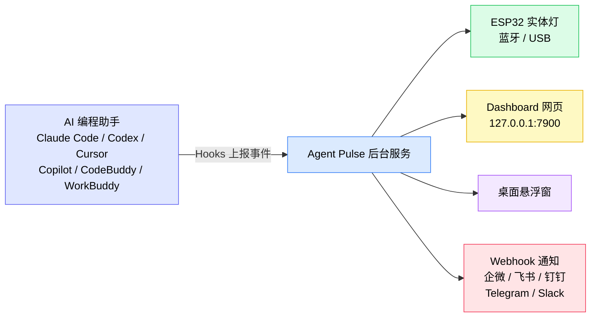
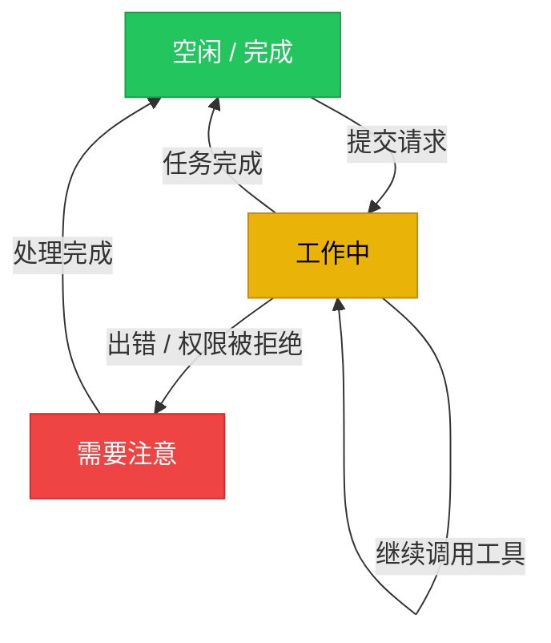
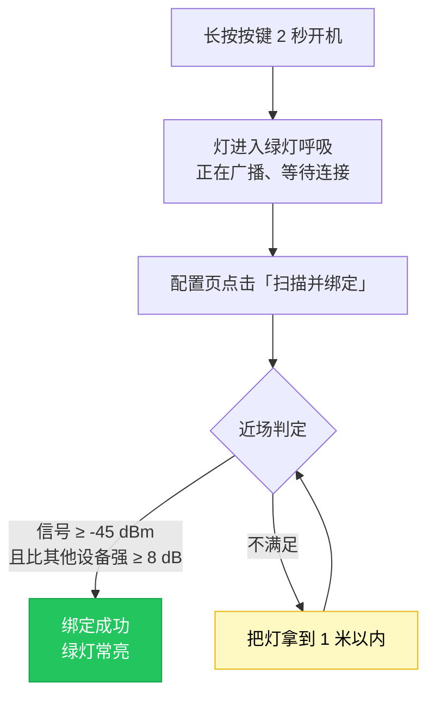
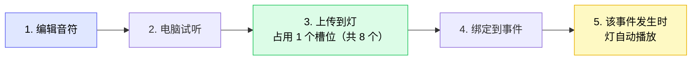
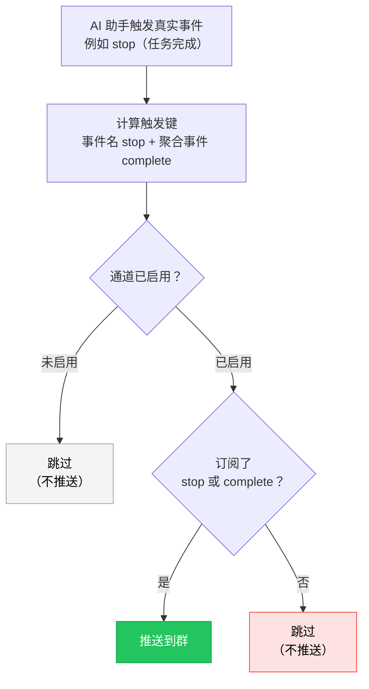

**English** | [한국어](./README.ko.md) | [日本語](./README.ja.md) | [简体中文](./README.zh-CN.md) | [繁體中文](./README.zh-TW.md) | [Español](./README.es.md) | [Français](./README.fr.md) | [Deutsch](./README.de.md)

# Agent Pulse 使用教程

**Agent Pulse** 是一盏会跟着你的 AI 编程助手状态变化的桌面氛围灯。你不用盯着终端等结果——抬头看一眼灯的颜色，就知道任务是「正在跑」「跑完了」还是「出错了」。

- **当前软件版本**：0.4.6
- **内置硬件灯固件版本**：`0.1.24+25`
- **版本更新记录**：详见 [CHANGELOG.md](CHANGELOG.md)

**支持的 AI 编程助手**：Claude Code · Codex · WorkBuddy · CodeBuddy · Cursor · Copilot

### 它是怎么工作的？



一句话概括：**AI 助手通过 Hooks 把状态告诉 Agent Pulse，Agent Pulse 再把状态分发到灯、网页、悬浮窗和聊天群。**

> ⚠️ 图中的 **Hooks 是最关键的一环**。没有安装 Hooks，Agent Pulse 收不到任何事件，后面所有输出都不会有反应。

---

## 目录

- [1. 快速上手（5 分钟）](#1-快速上手5-分钟)
- [2. 状态颜色怎么看](#2-状态颜色怎么看)
- [3. 安装与更新](#3-安装与更新)
- [4. 连接你的灯](#4-连接你的灯)
- [5. 硬件灯使用](#5-硬件灯使用)
- [6. 桌面端界面](#6-桌面端界面)
- [7. 音乐](#7-音乐)
- [8. Webhook 通知](#8-webhook-通知)
- [9. 多助手与多设备](#9-多助手与多设备)
- [10. 数据与隐私](#10-数据与隐私)
- [11. 常见问题](#11-常见问题)
- [12. 注意事项](#12-注意事项)

---

## 1. 快速上手（5 分钟）

第一次使用，按顺序做完这 4 步就能看到灯随任务变颜色。

### 步骤 1：安装软件（按照自己系统选择安装）

| 系统 | 下载 | 安装方式 |
| --- | --- | --- |
| Windows 10 1809+ / 11 | **[点此下载 `AgentPulseSetup-0.4.6.exe`](https://github.com/lzty634158-oss/agent-pulse-release/releases/latest)** | 双击安装，装好后开机自启 |
| macOS（Apple Silicon / Intel） | **[点此下载 `AgentPulse-0.4.6.pkg`](https://github.com/lzty634158-oss/agent-pulse-release/releases/latest)** | 双击按提示安装 |
| Ubuntu（仅采集器） | **[点此下载 Collector](https://gitee.com/lzty634158/agent-pulse-linux-collector-release)** | 见 [Ubuntu Collector](#34-ubuntu-collector可选) |

> **国内用户下载慢？** 用 Gitee 镜像（内容与 GitHub 完全一致）：
> - Windows / macOS 安装包：<https://gitee.com/lzty634158/agent-pulse-release/releases>
> - macOS 另有独立发布仓库：<https://gitee.com/lzty634158/agent-pulse-macos-release>

安装完成后，Agent Pulse 会在后台常驻，托盘/菜单栏出现图标。

### 步骤 2：安装 Hooks

#### 注意: 正常安装会自动安装，如果出现无法工作需要重新安装。

Hooks 是 Agent Pulse 与你的 AI 助手之间的「信使」。**没有安装 Hooks，灯就不会有任何反应。**

1. 浏览器打开配置页：<http://127.0.0.1:4321/?lang=zh>
2. 找到你正在用的 AI 助手卡片（如 Claude Code / Cursor）
3. 点击卡片上的 **「安装 Hooks」** 按钮
4. 安装成功后卡片会显示「已安装」


> **Codex 用户注意**：安装 Hooks 后，Codex 会把它列为「未受信任的项目」。你需要在 Codex 中把该项目标记为受信任，Hooks 才会真正生效。

> **小提示**：安装软件时，只会为**已经存在配置文件**的 AI 助手自动安装 Hooks。如果你后来又装了新的 AI 助手，回到配置页手动点一次安装即可。

### 步骤 3：开灯并连接

| 连接方式 | 适用场景 | 做法 |
| --- | --- | --- |
| **蓝牙**（推荐） | 灯放在桌面上，不想插线 | 长按灯上按键 2 秒开机 → 灯进入绿灯呼吸（等待连接）→ 在配置页点「扫描并绑定」→ **灯离电脑 1 米内**完成绑定 **【说明：近场通讯根据信号强度大于-45db会自动连接灯并完成绑定，其他无法搜索到可以选择系统配对菜单完成配对连接】**|
| **USB** | 想边用边充电，或蓝牙干扰大 | 用数据线连接灯与电脑 → 在配置页选择对应串口，**USB 连接优先级高于蓝牙，连上USB蓝牙会自动断开，断开USB蓝牙自动恢复广播连接** |

### 步骤 4：验证是否成功

新开一个会话，向你的 AI 助手提一个请求（比如「帮我写一个函数」），观察灯：

- [ ] 提交请求后，灯变成**黄色**（工作中）
- [ ] 任务完成后，灯变成**绿色**（空闲/完成）
- [ ] 打开 Dashboard <http://127.0.0.1:7900> 能看到实时事件流

如果灯没反应，直接跳到 [常见问题 - 灯不亮或颜色不对](#灯不亮或颜色不对)。

---

## 2. 状态颜色怎么看

Agent Pulse 把 AI 助手的状态归纳为三种**语义状态**，分别对应一种颜色：

| 颜色 | 语义 | 典型场景 |
| --- | --- | --- |
| 绿色 | 空闲 / 完成 | 任务跑完、会话结束、等待你的下一个指令 |
| 黄色 | 工作中 | 正在思考、正在调用工具、正在写代码 |
| 红色 | 需要注意 | 出错了、工具调用失败、权限被拒绝 |

**状态流转图：**



### 语义状态 vs 事件配色（0.4.5 起的重要变化）

从 0.4.5 版本起，Agent Pulse 采用**语义状态优先**的设计：

- Agent Pulse 先判断 AI 助手「当前处于什么状态」（空闲/工作/出错），再由这个状态决定灯的颜色；
- 你**也可以**为单个事件单独指定颜色和模式（见 [6.2 配置页](#62-配置页)），你的设置优先级最高。

**举例**：默认情况下 `stop`（任务完成）会亮绿灯；但如果你把 `stop` 手动设成「红色 + 闪烁」，那么任务完成时就亮红灯闪烁——以你的设置为准。

### 灯的模式

除了颜色，你还可以设置灯的**显示模式**：

| 模式 | 效果 | 适合 |
| --- | --- | --- |
| `solid` 常亮 | 稳定亮着 | 大多数场景 |
| `blink` 闪烁 | 周期性亮灭 | 需要引起注意（如出错） |
| `breathe` 呼吸 | 亮度渐变起伏 | 等待中、待机 |
| 交替模式 | 红黄 / 黄绿 / 红绿 交替 | 区分复合状态 |

---

## 3. 安装与更新

### 3.1 Windows 安装包

**[点此下载 `AgentPulseSetup-0.4.6.exe`](https://github.com/lzty634158-oss/agent-pulse-release/releases/latest)**，双击运行，按提示完成安装。

> 国内用户可改用 Gitee：<https://gitee.com/lzty634158/agent-pulse-release/releases>

- 默认安装位置：`C:\Users\<你的用户名>\AppData\Local\Programs\AgentPulse\`
- 默认开机自启（安装后自动启动后台服务）
- 开始菜单里可以找到 Agent Pulse

> 若安装时杀毒软件拦截，请允许运行（安装包未签名时会触发提示）。

### 3.2 macOS 安装包

**[点此下载 `AgentPulse-0.4.6.pkg`](https://github.com/lzty634158-oss/agent-pulse-release/releases/latest)**，双击，按安装向导提示完成。或者通过AI提示词来安装，建议用AI提示词安装，出错了直接发给AI解决。

> 国内用户可改用 Gitee（Windows / macOS 都有）：<https://gitee.com/lzty634158/agent-pulse-release/releases>
> macOS 另有独立发布仓库：<https://gitee.com/lzty634158/agent-pulse-macos-release>

macOS 详细安装说明见 [macos-install/RELEASE_INSTALL.md](macos-install/RELEASE_INSTALL.md)。

- **架构选择**：Apple Silicon（M 系列）选 `arm64`，Intel 选 `x86_64`；不确定就选通用包
- **签名与公证**：安装包经过 Developer ID 签名并经过 Apple 公证，正常不会被 Gatekeeper 拦截
- **首次启动**：可能弹出「允许网络连接」「允许蓝牙」等权限请求，请点「允许」

### 3.3 程序更新

Agent Pulse 会自动检查更新：

1. 优先从 **Gitee** 检查（国内速度快）
2. Gitee 不可用时自动回退到 **GitHub**

更新流程会自动下载并升级，**你的配置、音乐、设备绑定都会保留**。

**手动更新**：下载新版安装包，直接双击覆盖安装即可，同样不会丢失数据。

### 3.4 Ubuntu Collector（可选）

如果你希望 Ubuntu 服务器上的 AI 助手状态也能推送到 Dashboard，可以部署采集器。

先下载运行包：<https://gitee.com/lzty634158/agent-pulse-linux-collector-release>

```bash
# 在 Ubuntu 机器上执行（需要 sudo）
sudo bash deploy/ubuntu/collector/install.sh
```

详细配置见 `deploy/ubuntu/collector/README.md`。

> 这是**可选功能**。如果你只在 Windows / macOS 本机使用，可以完全跳过。

---

## 4. 连接你的灯

### 4.1 蓝牙连接（推荐）

**首次绑定流程：**

1. 长按灯上按键 2 秒开机
2. 灯进入**绿灯呼吸**状态，表示正在等待连接
3. 打开配置页 <http://127.0.0.1:4321/?lang=zh>
4. 点击「扫描并绑定」
5. 把灯**拿到距离电脑 1 米以内**，等待绑定完成

**为什么要求靠近？** 为了避免连到隔壁同事的灯，绑定时做了「近场」判定：

- 每台设备采样 3 次，取到的信号强度（RSSI）需 **≥ -45 dBm**
- 并且最靠近的那一台，要比其他候选设备信号强 **≥ 8 dB**

绑定成功后会记住这台灯，之后每次开机自动回连，不用重复绑定。

**绑定流程：**



**界面上的蓝牙状态图标**（Dashboard 与悬浮窗会显示）：

| 图标 | 含义 |
| --- | --- |
|  | 蓝牙已连接 |
|  | 正在连接 |
|  | 正在扫描设备 |
|  | 蓝牙已断开 |
|  | 蓝牙异常 |

### 4.2 USB 串口连接

用**数据线**（不是纯充电线）连接灯与电脑。

- Windows 设备管理器中应出现 **`ESP32-C3 USB JTAG/serial debug unit`**
- 在配置页的串口列表中选择对应端口即可

> **USB 优先级高于蓝牙**：插着线时走 USB，拔掉线自动切回蓝牙。

### 4.3 多盏灯

如果你有多盏 Agent Pulse 灯，可以指定「哪盏灯显示哪个项目的状态」：

| 路由方式 | 说明 |
| --- | --- |
| **跟随最新** | 所有灯都显示最近活跃的那个任务状态 |
| **指定项目** | 把某个项目固定分配给某一盏灯 |
| **指定助手** | 把某个 AI 助手的状态固定分配给某一盏灯 |

在 Dashboard 的「设备管理」页面配置多灯与路由规则。

---

## 5. 硬件灯使用

### 5.1 按键操作

| 操作 | 时长 | 效果 |
| --- | --- | --- |
| **长按** | ≥ 2 秒 | 开机 / 关机 |
| **短按** | 按一下就松 | 显示当前电量（灯效提示）；未连接时还会重新开启蓝牙广播 |

### 5.2 灯效反馈速查表

灯的每一次「动作」都在告诉你当前发生了什么：

| 灯效 | 含义 |
| --- | --- |
| 🟢 **绿灯呼吸** | 蓝牙已开启，正在广播、等待连接 |
| 🟢 **绿灯常亮** | 蓝牙已连接（上位机连上了） |
| 🟢 **回到绿灯呼吸** | 蓝牙已断开，设备重新开始广播等待连接 |
| 🔴→🟢→🟡→熄灭（循环 3 次） | **识别闪烁**：响应上位机的「识别设备」命令，快速红→绿→黄→灭循环 3 次（每步 200ms）后恢复原状态，方便你在一堆灯里找到它 |
| 🔴→🟢→🟡（每步 1 秒） | **连接动画**：连接成功时的反馈，红→绿→黄各亮 1 秒后恢复原状态 |
| 🔴 **红灯闪烁** | 蓝牙广播超时（60 秒无人连接）后停止广播 |

> ⚠️ **关于蓝灯的重要说明**：当前 HW v2 / ESP32-C3-next 实体设备**只有红、黄、绿三颗独立 LED，没有蓝色 LED**，因此**不会亮蓝灯或紫灯**。
> Dashboard 与悬浮窗里的**蓝色蓝牙图标只表示电脑端正在扫描或连接蓝牙**，是电脑端界面的状态显示，**不代表设备会亮蓝灯**。请不要把界面上的蓝色图标与灯的实际颜色对应起来。

### 5.3 电量与声音

**电量提示**（短按按键查看）：

短按按键后，灯会用**亮起的 LED 数量**表示电量档位，持续约 2 秒后恢复原状态：

| 电压 | 灯效（亮起的 LED） | 说明 |
| --- | --- | --- |
| ≥ 4.00V | 🔴🟢🟡 红+绿+黄 **三灯全亮** | 电量充足 |
| 3.70V ~ 4.00V | 🔴🟡 红+黄 **两灯亮** | 电量中等 |
| < 3.70V | 🔴 **仅红灯亮** | 电量偏低，建议充电 |

> 因为没有蓝色 LED，电量显示是用「亮几颗灯」来表达档位（3 颗=满、2 颗=中、1 颗=低），而不是用不同颜色。

**自动保护**：电量低于 3.20V 且持续 60 秒，灯会自动关机，避免电池过放损坏。

**声音开关**：在配置页「亮度与声音」中设置。**默认关闭**，需要提示音请手动开启。

### 5.4 固件更新

当硬件灯固件有新版本时，可以在配置页更新。

**更新前请务必确认（不满足会导致更新失败）：**

1. **硬件标识必须是 `agentpulse-esp32c3-next`** —— 其他硬件不支持
2. **只上传 `.ino.bin` 文件** —— 不要上传 `.bin` / `.elf` / `.map` / `bootloader` / `partitions` 等文件
3. **设备必须显示为 `ESP32-C3 USB JTAG/serial debug unit`**
4. **保持供电与连接稳定** —— 更新过程中不要拔线、不要断电

**更新过程中的灯效：**

| 灯效 | 阶段 |
| --- | --- |
| 黄灯常亮 | 正在接收并校验新固件（整个升级过程都保持黄灯常亮） |
| 灯熄灭 | 正在重启（升级成功或失败后都会重启） |

> **更新失败怎么办？** 不用慌，设备采用双分区设计，失败会自动回滚到旧固件并恢复原灯效，重启后即可恢复使用。

---

## 6. 桌面端界面

Agent Pulse 提供两个网页界面：

| 界面 | 地址 | 用途 |
| --- | --- | --- |
| **Dashboard** | <http://127.0.0.1:7900> | 查看实时状态与事件流、管理设备 |
| **配置页** | <http://127.0.0.1:4321/?lang=zh> | 所有设置都在这里 |

### 6.1 Dashboard

打开 <http://127.0.0.1:7900> 可以看到：

<!-- 截图位：把 dashboard.png 放入 docs/screenshots/ 后，取消下面这行注释

-->

- **实时事件面板**：AI 助手的每一个事件（提交提示、调用工具、任务完成……）按时间顺序滚动显示
- **当前状态**：当前是什么颜色、什么模式、来自哪个项目/助手
- **状态栏格式**：`灯效[模式] + 颜色 + 项目名 + 助手名 + 持续时间`，例如：
  ```
  常亮 绿色  my-project  claude-code  已持续 00:02:15
  ```
- **设备管理**：多盏灯的状态查看与路由配置

### 6.2 配置页

打开 <http://127.0.0.1:4321/?lang=zh>，这里是所有设置的入口。


<!-- 截图位：把「事件与灯光方案」区块截图存为 config-events-section.png 后，取消下面这行注释

-->

#### 通知与卡住判定

| 设置项 | 默认值 | 说明 |
| --- | --- | --- |
| 桌面通知 | 关闭 | 状态变化时是否弹系统通知 |
| 任务完成时通知 | 开启 | 任务完成（绿灯）时通知 |
| 出错时通知 | 开启 | 出错（红灯）时通知 |
| 可能卡住时通知 | 开启 | 黄灯持续超过设定时间时通知 |
| 卡住判定时间 | 5 分钟 | 黄灯持续多久算「可能卡住」 |

#### 事件与灯光方案

这是最常用的部分——你可以**为每一个事件单独设置灯的颜色、模式，以及是否播放音乐**。

**支持的事件（不同 AI 助手略有差异）：**

| 事件 | 含义 |
| --- | --- |
| `session-start` | 会话开始 |
| `session-end` | 会话结束 |
| `user-prompt-submit` | 用户提交提示 |
| `pre-tool-use` | 工具调用前 |
| `post-tool-use` | 工具调用后 |
| `post-tool-use-failure` | 工具调用失败 |
| `permission-request` | 请求权限 |
| `permission-denied` | 权限被拒绝 |
| `notification` | 通知 |
| `stop` | 任务完成 |
| `stop-failure` | 任务失败 |
| `error-occurred` | 发生错误 |
| `elicitation` | 请求补充信息 |

**各 AI 助手支持的事件范围：**

| AI 助手 | 支持的事件 |
| --- | --- |
| **Claude Code** | 会话开始、提交提示、工具调用前/后、请求权限、权限被拒绝、通知、任务完成、任务失败 |
| **Codex** | 会话开始、提交提示、工具调用前/后、请求权限、通知、任务完成 |
| **WorkBuddy** | 会话开始、提交提示、工具调用前/后、通知、任务完成 |
| **CodeBuddy** | 会话开始、提交提示、工具调用前/后、工具调用失败、请求权限、通知、任务失败、任务完成、会话结束 |
| **Cursor** | 会话开始、提交提示、工具调用前/后、工具调用失败、请求权限、通知、任务失败、任务完成 |
| **Copilot** | 会话开始、提交提示、工具调用后、任务完成、发生错误、会话结束 |

> 配置页只会显示**你当前这个助手真正会触发**的事件，避免你配置了永远不会发生的事件。

**按助手分别配置**：切换到对应助手的标签页，就能为它单独设置事件配色；「默认」标签页的设置作为全局兜底，适用于所有助手。

#### 亮度与声音

| 设置项 | 默认值 | 说明 |
| --- | --- | --- |
| 绿灯亮度 | 30% | 可分别设置三色亮度 |
| 黄灯亮度 | 30% | |
| 红灯亮度 | 30% | |
| 闪烁周期 | 1000 ms | 闪烁模式下一个完整周期的时间 |
| 呼吸周期 | 2000 ms | 呼吸模式下一次呼吸的时间 |
| 启用声音 | 关闭 | 是否播放提示音 |

#### Hooks 管理

每个 AI 助手卡片上都有 **「安装 Hooks」** 按钮，安装后卡片显示「已安装」。换了 AI 助手或重装了助手，点一下重新安装即可。

### 6.3 悬浮窗

开启后，桌面上会出现一个半透明的小窗口，实时显示当前状态颜色与项目名，不用打开浏览器也能看到。


---

## 7. 音乐

Agent Pulse 可以在特定事件发生时播放提示音，支持**内置音效**和**自定义音乐**两种。

### 7.1 内置音效

灯出厂内置 5 个音效，可直接使用，不占用存储空间：

| 编号 | 名称 |
| --- | --- |
| 1 | 上升提示 |
| 2 | 双击提示 |
| 3 | 完成提示 |
| 4 | 下降警告 |
| 5 | 回声提示 |

### 7.2 自定义音乐编辑器

在配置页的音乐区块，你可以自己编曲。

<!-- 截图位：把 music-editor.png 放入 docs/screenshots/ 后，取消下面这行注释

-->

**音符参数限制：**

| 参数 | 范围 | 说明 |
| --- | --- | --- |
| 频率 | 0 ~ 4000 Hz | **0 表示休止符（停顿，不发声）** |
| 时长 | 20 ~ 2000 ms | 单个音符持续多久 |
| 间隔 `gapMs` | 0 ~ 500 ms（默认 10 ms） | 音符之间的静音间隔 |

**整首曲子的限制：**

- 最多 **64 个音符**
- 总时长不超过 **30 秒**
- 名称最多 **40 个字符**

> **`gapMs`（间隔）是什么？** 它就是音符之间的「停顿」。比如你想让两个音符听起来是分开的，就给前一个音符设置一个间隔。固件用「频率为 0 的无声音符」来实现这个停顿。

### 7.3 上传到灯

**整体流程：**



自定义音乐需要上传到灯里才能播放：

1. 在配置页音乐区块编辑好曲子
2. 点击 **「上传到设备」**
3. 等待上传完成

**存储规则：**

| 项目 | 说明 |
| --- | --- |
| 槽位数量 | **8 个**（编号 128 ~ 255） |
| 单个槽位容量 | **512 字节** |
| 分配方式 | 自动分配空闲槽位；槽位满了需先删除不用的曲子 |
| 重新上传 | 已上传过的曲子会**复用原槽位**，不会乱跳 |

> **槽位满了怎么办？** 上传时会提示「8 个自定义音乐槽位已占满」。在配置页删除不再使用的曲子即可腾出空间。

### 7.4 绑定到事件

编辑好并上传音乐后，把它绑定到某个事件：

1. 进入「事件与灯光方案」
2. 找到目标事件（如 `session-end` 会话结束）
3. 在「音乐」下拉框中选择你的曲子
4. 选择「单次播放」或「重复播放」
5. 点击保存

此后，每当该事件发生，灯就会播放这首曲子。

### 7.5 试听、删除与读取

| 操作 | 做法 |
| --- | --- |
| **试听** | 在音乐编辑器中点「试听」，会在电脑上预览（不经过灯） |
| **删除** | 在音乐列表中点「删除」，会同时从电脑和灯的槽位中移除 |
| **从灯读取** | 灯里已有的音乐可以在配置页列出；注意**固件只存原始音符数据，不存曲子名称** |

### 7.6 音乐常见问题

| 现象 | 原因与解决 |
| --- | --- |
| 完全没声音 | 检查配置页「启用声音」是否打开（**默认是关闭的**） |
| 音符连在一起、听不出间隔 | 给音符设置 `gapMs` 间隔（默认仅 10 ms，可能太短） |
| 上传失败提示槽位已满 | 删除不用的曲子腾出槽位 |
| 把灯换到别的电脑后曲子没名字 | 曲子名称只存在电脑上；灯的固件只存音符数据，这是正常现象 |

---

## 8. Webhook 通知

除了让灯变色，Agent Pulse 还可以把事件**推送到你的聊天群**（企业微信、飞书、钉钉、Telegram、Slack 等）。

### 8.1 支持哪些平台

| 平台 | 说明 |
| --- | --- |
| **企业微信** | 群机器人 Webhook |
| **飞书** | 自定义机器人（支持签名校验） |
| **钉钉** | 自定义机器人（支持加签） |
| **Telegram** | Bot API |
| **Slack** | Incoming Webhook |
| **自定义** | 任意接收 JSON 的 HTTPS 地址 |

### 8.2 添加通知通道

<!-- 截图位：把 webhook-channels.png 放入 docs/screenshots/ 后，取消下面这行注释

（当前 config-full.png 已包含 Webhook 区块全貌，单独截图可后续补上更聚焦的版本）
-->

1. 打开配置页 → **Webhook 通知** 区块
2. 点击「添加通道」
3. 填写：
   - **名称**：给自己看的备注，如「项目群」
   - **平台**：选择上表中的一个
   - **Webhook URL**：从对应平台的「群机器人」设置里获取
   - **密钥**（飞书/钉钉需要）：机器人安全设置里的签名密钥
   - **启用**：**务必勾选**，不勾选不会推送
4. 勾选你要接收的**事件**
5. 点击保存

> **URL 必须是 HTTPS**，否则会被拒绝保存。

### 8.3 事件订阅（最重要的一步）

每个通道可以单独勾选要接收哪些事件。事件分两类：

**聚合事件（推荐）** —— 覆盖一类场景，更省心：

| 聚合事件 | 触发时机 |
| --- | --- |
| `complete` | 任务完成 **或** 会话结束（绿灯） |
| `error` | 发生错误（红灯） |
| `stuck` | 黄灯持续超过「卡住判定时间」 |

**原始事件** —— 精确匹配单个事件，如 `stop`、`session-end`、`error-occurred` 等（见 [事件表](#事件与灯光方案)）。

> **建议**：想要「任务完成和会话结束都通知」，请勾选 **`complete`**，它会同时覆盖 `stop` 和 `session-end`。
> 如果只勾了原始的 `session-end`，那么「任务完成（`stop`）」是**不会**推送的。

**事件是怎么匹配上的？**（理解这张图，就能自己排查"为什么没推送"）：



> 注意区分两个按钮：**「测试」**会跳过上图的匹配判断直接发送（所以永远能发）；
> **「模拟推送」**才走完整匹配流程，能告诉你到底卡在哪一步。详见 [8.4](#84-测试与模拟推送)。

### 8.4 测试与「模拟推送」

配置页提供两个排错工具：

| 按钮 | 作用 | 什么时候用 |
| --- | --- | --- |
| **测试** | 直接向该通道发一条测试消息，**不检查事件订阅** | 验证 URL 和密钥是否正确 |
| **模拟推送** | 走**与真实事件完全相同的匹配逻辑**，并回报「哪个通道匹配、哪个被跳过、原因是什么」 | 验证事件订阅是否配对了 |

**推荐排错流程：**

1. 先点「测试」→ 群里收到消息，说明 URL 和通道本身没问题
2. 再点「模拟推送」→ 看反馈文字：
   - 显示「匹配 1/1，已推送至「项目群」」→ 配置正确，群里会收到
   - 显示「跳过「项目群」(未订阅 stop/complete)」→ 说明**事件没勾对**，回去勾选对应事件再保存

### 8.5 Webhook 常见问题

| 现象 | 原因与解决 |
| --- | --- |
| **测试能发，但真实事件不推** | 几乎总是这两个原因之一：<br>① 通道的「启用」没勾选（新建通道请务必勾上）<br>② 事件订阅没勾对（见 [8.3](#83-事件订阅最重要的一步)）。用「模拟推送」可立刻定位 |
| **保存后刷新，界面变回英文** | 已修复（0.4.6）。若用旧版本，请在地址栏加 `?lang=zh` 访问配置页 |
| **模拟推送提示「模拟失败」** | 说明请求没到达新版后台。请**重启 Agent Pulse**（完全退出托盘图标再启动），确保运行的是 0.4.6 |
| **测试/删除/模拟按钮点了没反应** | 请升级到 0.4.6，旧版本存在界面脚本问题 |
| **提示 URL 不合法** | Webhook 地址必须是 `https://` 开头 |
| **飞书/钉钉收不到** | 检查密钥是否填写正确；飞书和钉钉的签名算法不同，请确认选对了平台类型 |

---

## 9. 多助手与多设备

### 9.1 支持的 AI 助手

Agent Pulse 支持 6 种 AI 编程助手，**可以同时安装多个**，互不干扰：

| 助手 | 配置页标签 |
| --- | --- |
| Claude Code | `claude` |
| Codex | `codex` |
| WorkBuddy | `workbuddy` |
| CodeBuddy | `codebuddy` |
| Cursor | `cursor` |
| Copilot | `copilot` |

### 9.2 每个助手独立配置

切换到对应助手的标签页，就能为它单独设置：

- 每个事件的灯色与模式
- 每个事件播放的音乐
- 卡住判定等参数

「默认」标签页的设置作为全局兜底：某个助手没有单独配置时，就沿用「默认」的设置。

### 9.3 多盏灯

见 [4.3 多盏灯](#43-多盏灯)。在 Dashboard 的「设备管理」中配置路由规则。

---

## 10. 数据与隐私

### 本地目录

Agent Pulse 的数据**全部保存在你自己的电脑上**，不会上传到任何服务器。

| 系统 | 数据目录 |
| --- | --- |
| Windows | `%LOCALAPPDATA%\AgentPulse\` |
| macOS | `~/Library/Application Support/AgentPulse/` |

**目录内容：**

| 文件/文件夹 | 说明 |
| --- | --- |
| `config.json` | 你的所有配置（事件、亮度、Webhook 通道等） |
| `music/` | 你编辑的自定义音乐源文件 |
| `devices.json` | 已绑定的灯设备信息 |

### 重装 / 卸载会保留数据吗？

**0.4.5 起，重装或卸载都会保留用户数据。**

- **保留**：`config.json`、`music/`、`devices.json` 等你的个人数据
- **移除**：程序文件与后台服务

也就是说，更新软件或重装后，你之前配置的所有事件、音乐、Webhook 通道、设备绑定**都还在**，不需要重新配置。

> 如果你希望**彻底清除所有数据**，需要手动删除上面的数据目录。

---

## 11. 常见问题

### Dashboard 打不开

1. 确认 Agent Pulse 正在运行（看托盘/菜单栏图标）
2. 完全退出 Agent Pulse 后重新启动
3. 确认浏览器访问的是 <http://127.0.0.1:7900>
4. 若 7900 端口被其他程序占用，重启电脑后重试

### 灯不亮或颜色不对

按顺序排查：

1. **Hooks 装了吗？** → 打开配置页 <http://127.0.0.1:4321/?lang=zh>，确认对应助手卡片显示「已安装」。**这是最常见的原因。**
2. **灯连上了吗？** → 看灯效：绿灯呼吸 = 等待连接；绿灯常亮 = 已连接
3. **事件配色改过吗？** → 如果你手动设过某个事件的颜色，会以你的设置为准（见 [语义状态 vs 事件配色](#语义状态-vs-事件配色045-起的重要变化)）
4. **亮度是不是 0？** → 检查配置页的亮度设置
5. **Codex 用户** → 确认已在 Codex 中把项目标记为「受信任」

### 音乐不响

1. 检查配置页「启用声音」是否打开（**默认关闭**）
2. 检查该事件是否绑定了音乐（音乐的编号不能是 0）
3. 自定义音乐是否已「上传到设备」
4. 点「试听」确认曲子本身没问题

### Webhook 不推送

见 [8.5 Webhook 常见问题](#85-webhook-常见问题)。

### 蓝牙连不上

1. 把灯**拿到距离电脑 1 米以内**再绑定（近场判定要求信号 ≥ -45 dBm 且比其它设备强 ≥ 8 dB）
2. 短按灯上按键，会重新开启蓝牙广播（绿灯呼吸）
3. 在电脑的蓝牙设置里删除旧的 Agent Pulse 配对，重新绑定
4. 若周围蓝牙设备多、干扰大，改用 **USB 连接**（优先级更高、更稳定）

### USB 找不到设备

1. 确认用的是**数据线**，不是只能充电的线
2. Windows 设备管理器中应出现 **`ESP32-C3 USB JTAG/serial debug unit`**
3. 若显示「未知设备」，可能需要安装驱动
4. 换一个 USB 口试试（部分前置面板供电不足）

### 通知太频繁

1. 调大「卡住判定时间」（默认 5 分钟）
2. 关闭不需要的通知项（如关闭「可能卡住时通知」）
3. 在 Webhook 通道里只勾选你真正关心的事件

---

## 12. 注意事项

- **固件更新务必谨慎**：只上传 `.ino.bin` 文件，硬件标识必须是 `agentpulse-esp32c3-next`；更新过程中**不要拔线、不要断电**。详见 [5.4 固件更新](#54-固件更新)。
- **低电量保护**：电量低于 3.20V 持续 60 秒会自动关机，这是为了保护电池，不是故障。
- **OTA 升级要求电量充足**：电量低于 3.60V 时会拒绝固件升级，请先充电。
- **Hooks 必须安装**：没有 Hooks，Agent Pulse 收不到任何事件，灯不会有任何反应。
- **Webhook 需 HTTPS**：出于安全考虑，只接受 `https://` 开头的 Webhook 地址。
- **自定义音乐槽位有限**：灯的自定义音乐槽位只有 8 个，请定期清理不用的曲子。

---

## 更多资源

### 下载地址汇总

| 用途 | 链接 |
| --- | --- |
| **Windows / macOS 安装包**（GitHub） | <https://github.com/lzty634158-oss/agent-pulse-release/releases/latest> |
| **Windows / macOS 安装包**（Gitee 国内镜像） | <https://gitee.com/lzty634158/agent-pulse-release/releases> |
| **macOS 独立发布仓库** | <https://gitee.com/lzty634158/agent-pulse-macos-release> |
| **Ubuntu Collector** | <https://gitee.com/lzty634158/agent-pulse-linux-collector-release> |

### 文档

- **版本更新记录**：[CHANGELOG.md](CHANGELOG.md)
- **固件升级说明**：[firmware/README.md](firmware/README.md)
- **macOS 安装说明**：[macos-install/RELEASE_INSTALL.md](macos-install/RELEASE_INSTALL.md)
- **蓝牙桥接工具**：[ble-bridge/](ble-bridge/)
- **Ubuntu 部署说明**：[deploy/ubuntu/README.md](deploy/ubuntu/README.md)
