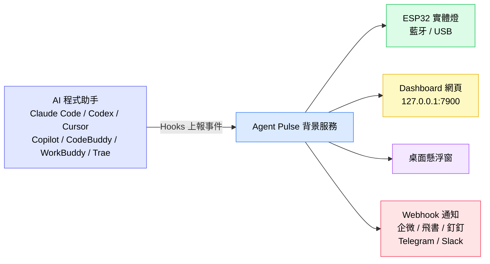
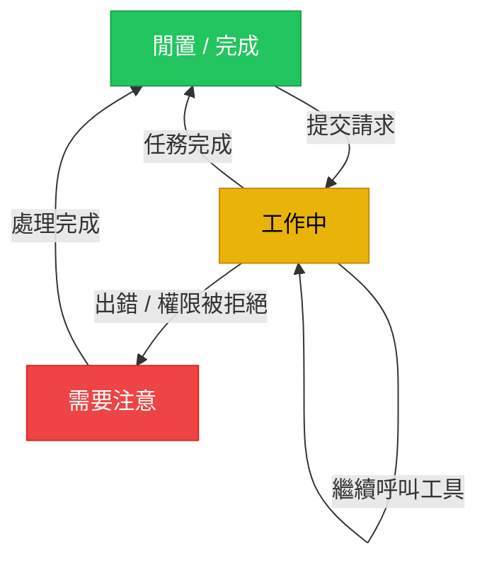
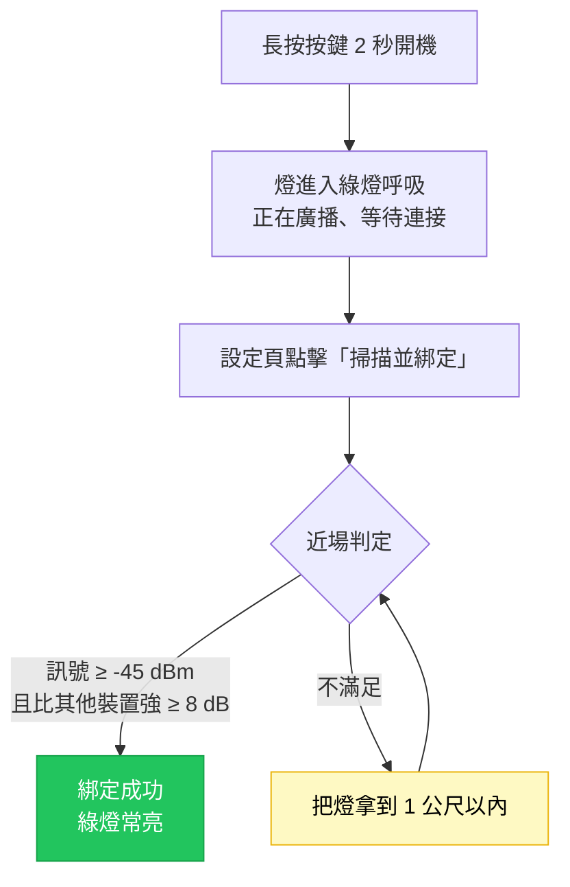
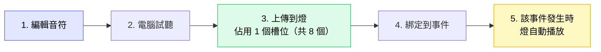
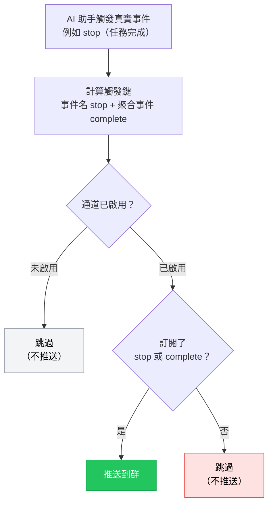

[English](README.md) | [한국어](./README.ko.md) | [日本語](./README.ja.md) | [简体中文](./README.zh-CN.md) | [繁體中文](./README.zh-TW.md) | [Español](./README.es.md) | [Français](./README.fr.md) | [Deutsch](./README.de.md)

# Agent Pulse 使用教學

**Agent Pulse** 是一盞會跟著你的 AI 程式助手狀態變化的桌面氛圍燈。你不用盯著終端機等結果——抬頭看一眼燈的顏色，就知道任務是「正在跑」「跑完了」還是「出錯了」。

- **目前軟體版本**：0.4.7
- **內建硬體燈韌體版本**：`0.1.24+25`
- **版本更新記錄**：詳見 [CHANGELOG.md](CHANGELOG.md)

**支援的 AI 程式助手**：Claude Code · Codex · WorkBuddy · CodeBuddy · Cursor · Copilot · Trae

### 它是怎麼運作的？



一句話概括：**AI 助手透過 Hooks 把狀態告訴 Agent Pulse，Agent Pulse 再把狀態分發到燈、網頁、懸浮窗和聊天群。**

> ⚠️ 圖中的 **Hooks 是最關鍵的一環**。沒有安裝 Hooks，Agent Pulse 收不到任何事件，後面所有輸出都不會有反應。

---

## 目錄

- [1. 快速上手（5 分鐘）](#1-快速上手5-分鐘)
- [2. 狀態顏色怎麼看](#2-狀態顏色怎麼看)
- [3. 安裝與更新](#3-安裝與更新)
- [4. 連接你的燈](#4-連接你的燈)
- [5. 硬體燈使用](#5-硬體燈使用)
- [6. 桌面端介面](#6-桌面端介面)
- [7. 音樂](#7-音樂)
- [8. Webhook 通知](#8-webhook-通知)
- [9. 多助手與多裝置](#9-多助手與多裝置)
- [10. 資料與隱私](#10-資料與隱私)
- [11. 常見問題](#11-常見問題)
- [12. 注意事項](#12-注意事項)

---

## 1. 快速上手（5 分鐘）

第一次使用，依序做完這 4 步就能看到燈隨任務變顏色。

### 步驟 1：安裝軟體（依照自己系統選擇安裝）

| 系統 | 下載 | 安裝方式 |
| --- | --- | --- |
| Windows 10 1809+ / 11 | **[點此下載 `AgentPulseSetup-0.4.7.exe`](https://github.com/lzty634158-oss/agent-pulse-release/releases/latest)** | 雙擊安裝，裝好後開機自啟 |
| macOS（Apple Silicon / Intel） | **[點此下載 `AgentPulse-0.4.7.pkg`](https://github.com/lzty634158-oss/agent-pulse-release/releases/latest)** | 雙擊依提示安裝 |
| Ubuntu（僅採集器） | **[點此下載 Collector](https://gitee.com/lzty634158/agent-pulse-linux-collector-release)** | 見 [Ubuntu Collector](#34-ubuntu-collector可選) |

> **國內用戶下載慢？** 用 Gitee 鏡像（內容與 GitHub 完全一致）：
> - Windows / macOS 安裝包：<https://gitee.com/lzty634158/agent-pulse-release/releases>
> - macOS 另有獨立發布倉庫：<https://gitee.com/lzty634158/agent-pulse-macos-release>

安裝完成後，Agent Pulse 會在背景常駐，托盤 / 選單列出現圖示。

### 步驟 2：安裝 Hooks

#### 注意: 正常安裝會自動安裝，如果出現無法工作需要重新安裝。

Hooks 是 Agent Pulse 與你的 AI 助手之間的「信使」。**沒有安裝 Hooks，燈就不會有任何反應。**

1. 瀏覽器開啟設定頁：<http://127.0.0.1:4321/?lang=zh-TW>
2. 找到你正在用的 AI 助手卡片（如 Claude Code / Cursor / Trae）
3. 點擊卡片上的 **「安裝 Hooks」** 按鈕
4. 安裝成功後卡片會顯示「已安裝」


> **Codex 用戶注意**：安裝 Hooks 後，Codex 會把它列為「未受信任的專案」。你需要在 Codex 中設定找到『鉤子』配置項，把該專案標記為受信任，Hooks 才會真正生效。

> **Claude Code 用戶注意**：安裝 Hooks 後，如果你在使用 CCSwitch 切換模型，CCSwitch 會把我們的 Hook 配置給覆蓋掉，這個時候需要你在我們設定頁重新點擊安裝即可。

> **小提示**：安裝軟體時，只會為**已經存在配置檔**的 AI 助手自動安裝 Hooks。如果你後來又裝了新的 AI 助手，回到設定頁手動點一次安裝即可。

### 步驟 3：開燈並連接

| 連接方式 | 適用場景 | 做法 |
| --- | --- | --- |
| **藍牙**（推薦） | 燈放在桌面上，不想插線 | 長按燈上按鍵 2 秒開機 → 燈進入綠燈呼吸（等待連接）→ 在設定頁點「掃描並綁定」→ **燈離電腦 1 公尺內**完成綁定 **【說明：近場通訊根據訊號強度大於 -45db 會自動連接燈並完成綁定，其他無法搜尋到可以選擇系統配對選單完成配對連接】**|
| **USB** | 想邊用邊充電，或藍牙干擾大 | 用資料線連接燈與電腦 → 在設定頁選擇對應串列埠，**USB 連接優先級高於藍牙，連上 USB 藍牙會自動斷開，斷開 USB 藍牙自動恢復廣播連接** |

### 步驟 4：驗證是否成功

新開一個會話，向你的 AI 助手提一個請求（比如「幫我寫一個函式」），觀察燈：

- [ ] 提交請求後，燈變成**黃色**（工作中）
- [ ] 任務完成後，燈變成**綠色**（閒置 / 完成）
- [ ] 打開 Dashboard <http://127.0.0.1:7900> 能看到即時事件流

如果燈沒反應，直接跳到 [常見問題 - 燈不亮或顏色不對](#燈不亮或顏色不對)。

---

## 2. 狀態顏色怎麼看

Agent Pulse 把 AI 助手的狀態歸納為三種**語意狀態**，分別對應一種顏色：

| 顏色 | 語意 | 典型場景 |
| --- | --- | --- |
| 綠色 | 閒置 / 完成 | 任務跑完、會話結束、等待你的下一個指令 |
| 黃色 | 工作中 | 正在思考、正在呼叫工具、正在寫程式碼 |
| 紅色 | 需要注意 | 出錯了、工具呼叫失敗、權限被拒絕 |

**狀態流轉圖：**



### 語意狀態 vs 事件配色（0.4.5 起的重要變化）

從 0.4.5 版本起，Agent Pulse 採用**語意狀態優先**的設計：

- Agent Pulse 先判斷 AI 助手「目前處於什麼狀態」（閒置 / 工作 / 出錯），再由這個狀態決定燈的顏色；
- 你**也可以**為單一事件單獨指定顏色和模式（見 [6.2 設定頁](#62-設定頁)），你的設定優先級最高。

**舉例**：預設情況下 `stop`（任務完成）會亮綠燈；但如果你把 `stop` 手動設成「紅色 + 閃爍」，那麼任務完成時就亮紅燈閃爍——以你的設定為準。

### 燈的模式

除了顏色，你還可以設定燈的**顯示模式**：

| 模式 | 效果 | 適合 |
| --- | --- | --- |
| `solid` 常亮 | 穩定亮著 | 大多數場景 |
| `blink` 閃爍 | 週期性亮滅 | 需要引起注意（如出錯） |
| `breathe` 呼吸 | 亮度漸變起伏 | 等待中、待機 |
| 交替模式 | 紅黃 / 黃綠 / 紅綠 交替 | 區分複合狀態 |

---

## 3. 安裝與更新

### 3.1 Windows 安裝包

**[點此下載 `AgentPulseSetup-0.4.7.exe`](https://github.com/lzty634158-oss/agent-pulse-release/releases/latest)**，雙擊執行，依提示完成安裝。

> 國內用戶可改用 Gitee：<https://gitee.com/lzty634158/agent-pulse-release/releases>

- 預設安裝位置：`C:\Users\<你的使用者名稱>\AppData\Local\Programs\AgentPulse\`
- 預設開機自啟（安裝後自動啟動背景服務）
- 開始選單裡可以找到 Agent Pulse

> 若安裝時防毒軟體攔截，請允許執行（安裝包未簽名時會觸發提示）。

### 3.2 macOS 安裝包

**[點此下載 `AgentPulse-0.4.7.pkg`](https://github.com/lzty634158-oss/agent-pulse-release/releases/latest)**，雙擊，依安裝精靈提示完成。或者透過 AI 提示詞來安裝，建議用 AI 提示詞安裝，出錯了直接發給 AI 解決。

> 國內用戶可改用 Gitee（Windows / macOS 都有）：<https://gitee.com/lzty634158/agent-pulse-release/releases>
> macOS 另有獨立發布倉庫：<https://gitee.com/lzty634158/agent-pulse-macos-release>

macOS 詳細安裝說明見 [macos-install/RELEASE_INSTALL.md](macos-install/RELEASE_INSTALL.md)。

- **架構選擇**：Apple Silicon（M 系列）選 `arm64`，Intel 選 `x86_64`；不確定就選通用包
- **簽名與公證**：安裝包經過 Developer ID 簽名並經過 Apple 公證，正常不會被 Gatekeeper 攔截
- **首次啟動**：可能彈出「允許網路連線」「允許藍牙」等權限請求，請點「允許」

### 3.3 程式更新

Agent Pulse 會自動檢查更新：

1. 優先從 **Gitee** 檢查（國內速度快）
2. Gitee 不可用時自動回退到 **GitHub**

更新流程會自動下載並升級，**你的配置、音樂、裝置綁定都會保留**。

**手動更新**：下載新版安裝包，直接雙擊覆蓋安裝即可，同樣不會遺失資料。

### 3.4 Ubuntu Collector（可選）

如果你希望 Ubuntu 伺服器上的 AI 助手狀態也能推送到 Dashboard，可以部署採集器。

先下載執行包：<https://gitee.com/lzty634158/agent-pulse-linux-collector-release>

```bash
# 在 Ubuntu 機器上執行（需要 sudo）
sudo bash deploy/ubuntu/collector/install.sh
```

詳細配置見 `deploy/ubuntu/collector/README.md`。

> 這是**可選功能**。如果你只在 Windows / macOS 本機使用，可以完全跳過。

---

## 4. 連接你的燈

### 4.1 藍牙連接（推薦）

**首次綁定流程：**

1. 長按燈上按鍵 2 秒開機
2. 燈進入**綠燈呼吸**狀態，表示正在等待連接
3. 開啟設定頁 <http://127.0.0.1:4321/?lang=zh-TW>
4. 點擊「掃描並綁定」
5. 把燈**拿到距離電腦 1 公尺以內**，等待綁定完成

**為什麼要求靠近？** 為了避免連到隔壁同事的燈，綁定時做了「近場」判定：

- 每台裝置取樣 3 次，取到的訊號強度（RSSI）需 **≥ -45 dBm**
- 並且最靠近的那一台，要比其他候選裝置訊號強 **≥ 8 dB**

綁定成功後會記住這盞燈，之後每次開機自動回連，不用重複綁定。

**綁定流程：**



**介面上的藍牙狀態圖示**（Dashboard 與懸浮窗會顯示）：

| 圖示 | 含義 |
| --- | --- |
|  | 藍牙已連接 |
|  | 正在連接 |
|  | 正在掃描裝置 |
|  | 藍牙已斷開 |
|  | 藍牙異常 |

### 4.2 USB 串列連接

用**資料線**（不是純充電線）連接燈與電腦。

- Windows 裝置管理員中應出現 **`ESP32-C3 USB JTAG/serial debug unit`**
- 在設定頁的串列埠列表中選擇對應埠即可

> **USB 優先級高於藍牙**：插著線時走 USB，拔掉線自動切回藍牙。

### 4.3 多盞燈

如果你有多盞 Agent Pulse 燈，可以指定「哪盞燈顯示哪個專案的狀態」：

| 路由方式 | 說明 |
| --- | --- |
| **跟隨最新** | 所有燈都顯示最近活躍的那個任務狀態 |
| **指定專案** | 把某個專案固定分配給某一盞燈 |
| **指定助手** | 把某個 AI 助手的狀態固定分配給某一盞燈 |

在 Dashboard 的「裝置管理」頁面配置多燈與路由規則。

---

## 5. 硬體燈使用

### 5.1 按鍵操作

| 操作 | 時長 | 效果 |
| --- | --- | --- |
| **長按** | ≥ 2 秒 | 開機 / 關機 |
| **短按** | 按一下就鬆 | 顯示目前電量（燈效提示）；未連接時還會重新開啟藍牙廣播 |

### 5.2 燈效回饋速查表

燈的每一次「動作」都在告訴你目前發生了什麼：

| 燈效 | 含義 |
| --- | --- |
| 🟢 **綠燈呼吸** | 藍牙已開啟，正在廣播、等待連接 |
| 🟢 **綠燈常亮** | 藍牙已連接（上位機連上了） |
| 🟢 **回到綠燈呼吸** | 藍牙已斷開，裝置重新開始廣播等待連接 |
| 🔴→🟢→🟡→熄滅（循環 3 次） | **識別閃爍**：回應上位機的「識別裝置」命令，快速紅→綠→黃→滅循環 3 次（每步 200ms）後恢復原狀態，方便你在一堆燈裡找到它 |
| 🔴→🟢→🟡（每步 1 秒） | **連接動畫**：連接成功時的回饋，紅→綠→黃各亮 1 秒後恢復原狀態 |
| 🔴 **紅燈閃爍** | 藍牙廣播逾時（60 秒無人連接）後停止廣播 |

> ⚠️ **關於藍燈的重要說明**：目前 HW v2 / ESP32-C3-next 實體裝置**只有紅、黃、綠三顆獨立 LED，沒有藍色 LED**，因此**不會亮藍燈或紫燈**。
> Dashboard 與懸浮窗裡的**藍色藍牙圖示只表示電腦端正在掃描或連接藍牙**，是電腦端介面的狀態顯示，**不代表裝置會亮藍燈**。請不要把介面上的藍色圖示與燈的實際顏色對應起來。

### 5.3 電量與聲音

**電量提示**（短按按鍵查看）：

短按按鍵後，燈會用**亮起的 LED 數量**表示電量檔位，持續約 2 秒後恢復原狀態：

| 電壓 | 燈效（亮起的 LED） | 說明 |
| --- | --- | --- |
| ≥ 4.00V | 🔴🟢🟡 紅+綠+黃 **三燈全亮** | 電量充足 |
| 3.70V ~ 4.00V | 🔴🟡 紅+黃 **兩燈亮** | 電量中等 |
| < 3.70V | 🔴 **僅紅燈亮** | 電量偏低，建議充電 |

> 因為沒有藍色 LED，電量顯示是用「亮幾顆燈」來表達檔位（3 顆=滿、2 顆=中、1 顆=低），而不是用不同顏色。

**自動保護**：電量低於 3.20V 且持續 60 秒，燈會自動關機，避免電池過放損壞。

**聲音開關**：在設定頁「亮度與聲音」中設定。**預設關閉**，需要提示音請手動開啟。

### 5.4 韌體更新

當硬體燈韌體有新版本時，可以在設定頁更新。

**更新前請務必確認（不滿足會導致更新失敗）：**

1. **硬體標識必須是 `agentpulse-esp32c3-next`** —— 其他硬體不支援
2. **只上傳 `.ino.bin` 檔案** —— 不要上傳 `.bin` / `.elf` / `.map` / `bootloader` / `partitions` 等檔案
3. **裝置必須顯示為 `ESP32-C3 USB JTAG/serial debug unit`**
4. **保持供電與連接穩定** —— 更新過程中不要拔線、不要斷電

**更新過程中的燈效：**

| 燈效 | 階段 |
| --- | --- |
| 黃燈常亮 | 正在接收並校驗新韌體（整個升級過程都保持黃燈常亮） |
| 燈熄滅 | 正在重啟（升級成功或失敗後都會重啟） |

> **更新失敗怎麼辦？** 不用慌，裝置採用雙分區設計，失敗會自動回滾到舊韌體並恢復原燈效，重啟後即可恢復使用。

---

## 6. 桌面端介面

Agent Pulse 提供兩個網頁介面：

| 介面 | 位址 | 用途 |
| --- | --- | --- |
| **Dashboard** | <http://127.0.0.1:7900> | 查看即時狀態與事件流、管理裝置 |
| **設定頁** | <http://127.0.0.1:4321/?lang=zh-TW> | 所有設定都在這裡 |

### 6.1 Dashboard

打開 <http://127.0.0.1:7900> 可以看到：

<!-- 截圖位：把 dashboard.png 放入 docs/screenshots/ 後，取消下面這行註釋

-->

- **即時事件面板**：AI 助手的每一個事件（提交提示、呼叫工具、任務完成……）依時間順序滾動顯示
- **目前狀態**：目前是什麼顏色、什麼模式、來自哪個專案 / 助手
- **狀態欄格式**：`燈效[模式] + 顏色 + 專案名 + 助手名 + 持續時間`，例如：
  ```
  常亮 綠色  my-project  claude-code  已持續 00:02:15
  ```
- **裝置管理**：多盞燈的狀態查看與路由配置

### 6.2 設定頁

打開 <http://127.0.0.1:4321/?lang=zh-TW>，這裡是所有設定的入口。


<!-- 截圖位：把「事件與燈光方案」區塊截圖存為 config-events-section.png 後，取消下面這行註釋

-->

#### 通知與卡住判定

| 設定項 | 預設值 | 說明 |
| --- | --- | --- |
| 桌面通知 | 關閉 | 狀態變化時是否彈系統通知 |
| 任務完成時通知 | 開啟 | 任務完成（綠燈）時通知 |
| 出錯時通知 | 開啟 | 出錯（紅燈）時通知 |
| 可能卡住時通知 | 開啟 | 黃燈持續超過設定時間時通知 |
| 卡住判定時間 | 5 分鐘 | 黃燈持續多久算「可能卡住」 |

#### 事件與燈光方案

這是最常用的部分——你可以**為每一個事件單獨設定燈的顏色、模式，以及是否播放音樂**。

**支援的事件（不同 AI 助手略有差異）：**

| 事件 | 含義 |
| --- | --- |
| `session-start` | 會話開始 |
| `session-end` | 會話結束 |
| `user-prompt-submit` | 使用者提交提示 |
| `pre-tool-use` | 工具呼叫前 |
| `post-tool-use` | 工具呼叫後 |
| `post-tool-use-failure` | 工具呼叫失敗 |
| `permission-request` | 請求權限 |
| `permission-denied` | 權限被拒絕 |
| `notification` | 通知 |
| `stop` | 任務完成 |
| `stop-failure` | 任務失敗 |
| `error-occurred` | 發生錯誤 |
| `elicitation` | 請求補充資訊 |

**各 AI 助手支援的事件範圍：**

| AI 助手 | 支援的事件 |
| --- | --- |
| **Claude Code** | 會話開始、提交提示、工具呼叫前/後、請求權限、權限被拒絕、通知、任務完成、任務失敗 |
| **Codex** | 會話開始、提交提示、工具呼叫前/後、請求權限、通知、任務完成 |
| **WorkBuddy** | 會話開始、提交提示、工具呼叫前/後、通知、任務完成 |
| **CodeBuddy** | 會話開始、提交提示、工具呼叫前/後、工具呼叫失敗、請求權限、通知、任務失敗、任務完成、會話結束 |
| **Cursor** | 會話開始、提交提示、工具呼叫前/後、工具呼叫失敗、請求權限、通知、任務失敗、任務完成 |
| **Copilot** | 會話開始、提交提示、工具呼叫後、任務完成、發生錯誤、會話結束 |
| **Trae** | 會話開始、提交提示、工具呼叫前/後、請求權限、通知、任務完成 |

> 設定頁只會顯示**你目前這個助手真正會觸發**的事件，避免你配置了永遠不會發生的事件。

**權限閘門（安全提醒）**：Trae / WorkBuddy / CodeBuddy 這三個助手沒有原生的權限彈窗。在設定頁切到對應助手標籤，把「請求權限（permission-request）」事件行的顏色設為非「關閉」即開啟安全閘門（預設即為紅色 + 閃爍），此時**每一次工具呼叫都會請使用者確認並點亮紅燈**，與具體執行什麼命令無關，無需維護危險命令規則；設為「關閉」即停用閘門。

**按助手分別配置**：切換到對應助手的標籤頁，就能為它單獨設定事件配色；「預設」標籤頁的設定作為全域兜底，適用於所有助手。

#### 亮度與聲音

| 設定項 | 預設值 | 說明 |
| --- | --- | --- |
| 綠燈亮度 | 30% | 可分別設定三色亮度 |
| 黃燈亮度 | 30% | |
| 紅燈亮度 | 30% | |
| 閃爍週期 | 1000 ms | 閃爍模式下個完整週期的時間 |
| 呼吸週期 | 2000 ms | 呼吸模式下一次呼吸的時間 |
| 啟用聲音 | 關閉 | 是否播放提示音 |

#### Hooks 管理

每個 AI 助手卡片上都有 **「安裝 Hooks」** 按鈕，安裝後卡片顯示「已安裝」。换了 AI 助手或重裝了助手，點一下重新安裝即可。

### 6.3 懸浮窗

開啟後，桌面上會出現一個半透明的小視窗，即時顯示目前狀態顏色與專案名，不用打開瀏覽器也能看到。


---

## 7. 音樂

Agent Pulse 可以在特定事件發生時播放提示音，支援**內建音效**和**自訂音樂**兩種。

### 7.1 內建音效

燈出廠內建 5 個音效，可直接使用，不佔用儲存空間：

| 編號 | 名稱 |
| --- | --- |
| 1 | 上升提示 |
| 2 | 雙擊提示 |
| 3 | 完成提示 |
| 4 | 下降警告 |
| 5 | 回聲提示 |

### 7.2 自訂音樂編輯器

在設定頁的音樂區塊，你可以自己編曲。

<!-- 截圖位：把 music-editor.png 放入 docs/screenshots/ 後，取消下面這行註釋

-->

**音符參數限制：**

| 參數 | 範圍 | 說明 |
| --- | --- | --- |
| 頻率 | 0 ~ 4000 Hz | **0 表示休止符（停頓，不發聲）** |
| 時長 | 20 ~ 2000 ms | 單個音符持續多久 |
| 間隔 `gapMs` | 0 ~ 500 ms（預設 10 ms） | 音符之間的靜音間隔 |

**整首曲子的限制：**

- 最多 **64 個音符**
- 總時長不超過 **30 秒**
- 名稱最多 **40 個字元**

> **`gapMs`（間隔）是什麼？** 它就是音符之間的「停頓」。比如你想讓兩個音符聽起來是分開的，就給前一個音符設定一個間隔。韌體用「頻率為 0 的無聲音符」來實現這個停頓。

### 7.3 上傳到燈

**整體流程：**



自訂音樂需要上傳到燈裡才能播放：

1. 在設定頁音樂區塊編輯好曲子
2. 點擊 **「上傳到裝置」**
3. 等待上傳完成

**儲存規則：**

| 項目 | 說明 |
| --- | --- |
| 槽位數量 | **8 個**（編號 128 ~ 255） |
| 單個槽位容量 | **512 位元組** |
| 分配方式 | 自動分配空閒槽位；槽位滿了需先刪除不用的曲子 |
| 重新上傳 | 已上傳過的曲子會**複用原槽位**，不會亂跳 |

> **槽位滿了怎麼辦？** 上傳時會提示「8 個自訂音樂槽位已佔滿」。在設定頁刪除不再使用的曲子即可騰出空間。

### 7.4 綁定到事件

編輯好並上傳音樂後，把它綁定到某個事件：

1. 進入「事件與燈光方案」
2. 找到目標事件（如 `session-end` 會話結束）
3. 在「音樂」下拉框中選擇你的曲子
4. 選擇「單次播放」或「重複播放」
5. 點擊儲存

此後，每當該事件發生，燈就會播放這首曲子。

### 7.5 試聽、刪除與讀取

| 操作 | 做法 |
| --- | --- |
| **試聽** | 在音樂編輯器中點「試聽」，會在電腦上預覽（不經過燈） |
| **刪除** | 在音樂列表中點「刪除」，會同時從電腦和燈的槽位中移除 |
| **從燈讀取** | 燈裡已有的音樂可以在設定頁列出；注意**韌體只存原始音符資料，不存曲子名稱** |

### 7.6 音樂常見問題

| 現象 | 原因與解決 |
| --- | --- |
| 完全沒聲音 | 檢查設定頁「啟用聲音」是否打開（**預設是關閉的**） |
| 音符連在一起、聽不出間隔 | 給音符設定 `gapMs` 間隔（預設僅 10 ms，可能太短） |
| 上傳失敗提示槽位已滿 | 刪除不用的曲子騰出槽位 |
| 把燈換到別的電腦後曲子沒名字 | 曲子名稱只存在電腦上；燈的韌體只存音符資料，這是正常現象 |

---

## 8. Webhook 通知

除了讓燈變色，Agent Pulse 還可以把事件**推送到你的聊天群**（企業微信、飛書、釘釘、Telegram、Slack 等）。

### 8.1 支援哪些平台

| 平台 | 說明 |
| --- | --- |
| **企業微信** | 群機器人 Webhook |
| **飛書** | 自訂機器人（支援簽名校驗） |
| **釘釘** | 自訂機器人（支援加簽） |
| **Telegram** | Bot API |
| **Slack** | Incoming Webhook |
| **自訂** | 任意接收 JSON 的 HTTPS 位址 |

### 8.2 添加通知通道

<!-- 截圖位：把 webhook-channels.png 放入 docs/screenshots/ 後，取消下面這行註釋

（目前 config-full.png 已包含 Webhook 區塊全貌，單獨截圖可後續補上更聚焦的版本）
-->

1. 開啟設定頁 → **Webhook 通知** 區塊
2. 點擊「添加通道」
3. 填寫：
   - **名稱**：給自己看的備註，如「專案群」
   - **平台**：選擇上表中的一個
   - **Webhook URL**：從對應平台的「群機器人」設定裡獲取
   - **密鑰**（飛書 / 釘釘需要）：機器人安全設定裡的簽名密鑰
   - **啟用**：**務必勾選**，不勾選不會推送
4. 勾選你要接收的**事件**
5. 點擊儲存

> **URL 必須是 HTTPS**，否則會被拒絕儲存。

### 8.3 事件訂閱（最重要的一步）

每個通道可以單獨勾選要接收哪些事件。事件分兩類：

**聚合事件（推薦）** —— 涵蓋一類場景，更省心：

| 聚合事件 | 觸發時機 |
| --- | --- |
| `complete` | 任務完成 **或** 會話結束（綠燈） |
| `error` | 發生錯誤（紅燈） |
| `stuck` | 黃燈持續超過「卡住判定時間」 |

**原始事件** —— 精確匹配單一事件，如 `stop`、`session-end`、`error-occurred` 等（見 [事件表](#事件與燈光方案)）。

> **建議**：想要「任務完成和會話結束都通知」，請勾選 **`complete`**，它會同時涵蓋 `stop` 和 `session-end`。
> 如果只勾了原始的 `session-end`，那麼「任務完成（`stop`）」是**不會**推送的。

**事件是怎麼匹配上的？**（理解這張圖，就能自己排查"為什麼沒推送"）：



> 注意區分兩個按鈕：**「測試」**會跳過上圖的匹配判斷直接發送（所以永遠能發）；
> **「模擬推送」**才走完整匹配流程，能告訴你到底卡在哪一步。詳見 [8.4](#84-測試與模擬推送)。

### 8.4 測試與「模擬推送」

設定頁提供兩個排錯工具：

| 按鈕 | 作用 | 什麼時候用 |
| --- | --- | --- |
| **測試** | 直接向該通道發一條測試訊息，**不檢查事件訂閱** | 驗證 URL 和密鑰是否正確 |
| **模擬推送** | 走**與真實事件完全相同的匹配邏輯**，並回報「哪個通道匹配、哪個被跳過、原因是什麼」 | 驗證事件訂閱是否配對了 |

**推薦排錯流程：**

1. 先點「測試」→ 群裡收到訊息，說明 URL 和通道本身沒問題
2. 再點「模擬推送」→ 看回饋文字：
   - 顯示「匹配 1/1，已推送至「專案群」」→ 配置正確，群裡會收到
   - 顯示「跳過「專案群」（未訂閱 stop/complete）」→ 說明**事件沒勾對**，回去勾選對應事件再儲存

### 8.5 Webhook 常見問題

| 現象 | 原因與解決 |
| --- | --- |
| **測試能發，但真實事件不推** | 幾乎總是這兩個原因之一：<br>① 通道的「啟用」沒勾選（新建通道請務必勾上）<br>② 事件訂閱沒勾對（見 [8.3](#83-事件訂閱最重要的一步)）。用「模擬推送」可立刻定位 |
| **儲存後重新整理，介面變回英文** | 已修復（0.4.6）。若用舊版本，請在網址列加 `?lang=zh-TW` 訪問設定頁 |
| **模擬推送提示「模擬失敗」** | 說明請求沒到達新版背景服務。請**重啟 Agent Pulse**（完全退出托盤圖示再啟動），確保執行的是 0.4.7 |
| **測試/刪除/模擬按鈕點了沒反應** | 請升級到 0.4.7，舊版本存在介面腳本問題 |
| **提示 URL 不合法** | Webhook 位址必須是 `https://` 開頭 |
| **飛書/釘釘收不到** | 檢查密鑰是否填寫正確；飛書和釘釘的簽名演算法不同，請確認選對了平台類型 |

---

## 9. 多助手與多裝置

### 9.1 支援的 AI 助手

Agent Pulse 支援 6 種 AI 程式助手，**可以同時安裝多個**，互不干擾：

| 助手 | 設定頁標籤 |
| --- | --- |
| Claude Code | `claude` |
| Codex | `codex` |
| WorkBuddy | `workbuddy` |
| CodeBuddy | `codebuddy` |
| Cursor | `cursor` |
| Copilot | `copilot` |
| Trae | `trae` |

### 9.2 每個助手獨立配置

切換到對應助手的標籤頁，就能為它單獨設定：

- 每個事件的燈色與模式
- 每個事件播放的音樂
- 卡住判定等參數

「預設」標籤頁的設定作為全域兜底：某個助手沒有單獨配置時，就沿用「預設」的設定。

### 9.3 多盞燈

見 [4.3 多盞燈](#43-多盞燈)。在 Dashboard 的「裝置管理」中配置路由規則。

---

## 10. 資料與隱私

### 本地目錄

Agent Pulse 的資料**全部保存在你自己的電腦上**，不會上傳到任何伺服器。

| 系統 | 資料目錄 |
| --- | --- |
| Windows | `%LOCALAPPDATA%\AgentPulse\` |
| macOS | `~/Library/Application Support/AgentPulse/` |

**目錄內容：**

| 檔案 / 資料夾 | 說明 |
| --- | --- |
| `config.json` | 你的所有配置（事件、亮度、Webhook 通道等） |
| `music/` | 你編輯的自訂音樂源檔 |
| `devices.json` | 已綁定的燈裝置資訊 |

### 重裝 / 解除安裝會保留資料嗎？

**0.4.5 起，重裝或解除安裝都會保留使用者資料。**

- **保留**：`config.json`、`music/`、`devices.json` 等你的個人資料
- **移除**：程式檔案與背景服務

也就是說，更新軟體或重裝後，你之前配置的所有事件、音樂、Webhook 通道、裝置綁定**都還在**，不需要重新配置。

> 如果你希望**徹底清除所有資料**，需要手動刪除上面的資料目錄。

---

## 11. 常見問題

### Dashboard 打不開

1. 確認 Agent Pulse 正在執行（看托盤 / 選單列圖示）
2. 完全退出 Agent Pulse 後重新啟動
3. 確認瀏覽器訪問的是 <http://127.0.0.1:7900>
4. 若 7900 埠被其他程式佔用，重啟電腦後重試

### 燈不亮或顏色不對

依序排查：

1. **Hooks 裝了嗎？** → 開啟設定頁 <http://127.0.0.1:4321/?lang=zh-TW>，確認對應助手卡片顯示「已安裝」。**這是最常見的原因。**
2. **燈連上了嗎？** → 看燈效：綠燈呼吸 = 等待連接；綠燈常亮 = 已連接
3. **事件配色改過嗎？** → 如果你手動設過某個事件的顏色，會以你的設定為準（見 [語意狀態 vs 事件配色](#語意狀態-vs-事件配色045-起的重要變化)）
4. **亮度是不是 0？** → 檢查設定頁的亮度設定
5. **Codex 用戶** → 確認已在 Codex 中把專案標記為「受信任」

### 音樂不響

1. 檢查設定頁「啟用聲音」是否打開（**預設關閉**）
2. 檢查該事件是否綁定了音樂（音樂的編號不能是 0）
3. 自訂音樂是否已「上傳到裝置」
4. 點「試聽」確認曲子本身沒問題

### Webhook 不推送

見 [8.5 Webhook 常見問題](#85-webhook-常見問題)。

### 藍牙連不上

1. 把燈**拿到距離電腦 1 公尺以內**再綁定（近場判定要求訊號 ≥ -45 dBm 且比其他裝置強 ≥ 8 dB）
2. 短按燈上按鍵，會重新開啟藍牙廣播（綠燈呼吸）
3. 在電腦的藍牙設定裡刪除舊的 Agent Pulse 配對，重新綁定
4. 若周圍藍牙裝置多、干擾大，改用 **USB 連接**（優先級更高、更穩定）

### USB 找不到裝置

1. 確認用的是**資料線**，不是只能充電的線
2. Windows 裝置管理員中應出現 **`ESP32-C3 USB JTAG/serial debug unit`**
3. 若顯示「未知裝置」，可能需要安裝驅動
4. 換一個 USB 孔試試（部分前置面板供電不足）

### 通知太頻繁

1. 調大「卡住判定時間」（預設 5 分鐘）
2. 關閉不需要的通知項（如關閉「可能卡住時通知」）
3. 在 Webhook 通道裡只勾選你真正關心的事件

---

## 12. 注意事項

- **韌體更新務必謹慎**：只上傳 `.ino.bin` 檔案，硬體標識必須是 `agentpulse-esp32c3-next`；更新過程中**不要拔線、不要斷電**。詳見 [5.4 韌體更新](#54-韌體更新)。
- **低電量保護**：電量低於 3.20V 持續 60 秒會自動關機，這是為了保護電池，不是故障。
- **OTA 升級要求電量充足**：電量低於 3.60V 時會拒絕韌體升級，請先充電。
- **Hooks 必須安裝**：沒有 Hooks，Agent Pulse 收不到任何事件，燈不會有任何反應。
- **Webhook 需 HTTPS**：出於安全考量，只接受 `https://` 開頭的 Webhook 位址。
- **自訂音樂槽位有限**：燈的自訂音樂槽位只有 8 個，請定期清理不用的曲子。

---

## 更多資源

### 下載位址彙總

| 用途 | 連結 |
| --- | --- |
| **Windows / macOS 安裝包**（GitHub） | <https://github.com/lzty634158-oss/agent-pulse-release/releases/latest> |
| **Windows / macOS 安裝包**（Gitee 國內鏡像） | <https://gitee.com/lzty634158/agent-pulse-release/releases> |
| **macOS 獨立發布倉庫** | <https://gitee.com/lzty634158/agent-pulse-macos-release> |
| **Ubuntu Collector** | <https://gitee.com/lzty634158/agent-pulse-linux-collector-release> |

### 文件

- **版本更新記錄**：[CHANGELOG.md](CHANGELOG.md)
- **韌體升級說明**：[firmware/README.md](firmware/README.md)
- **macOS 安裝說明**：[macos-install/RELEASE_INSTALL.md](macos-install/RELEASE_INSTALL.md)
- **藍牙橋接工具**：[ble-bridge/](ble-bridge/)
- **Ubuntu 部署說明**：[deploy/ubuntu/README.md](deploy/ubuntu/README.md)
